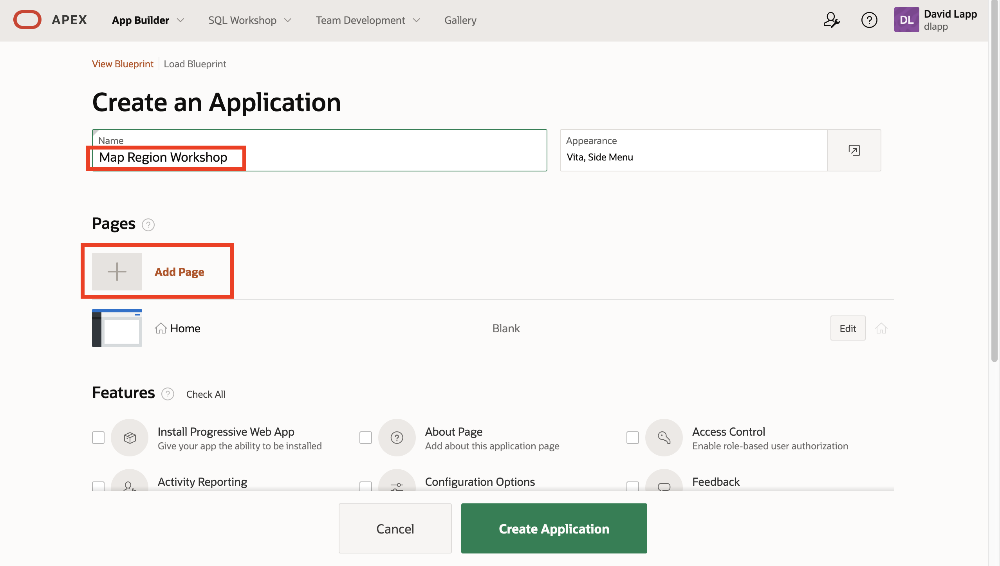
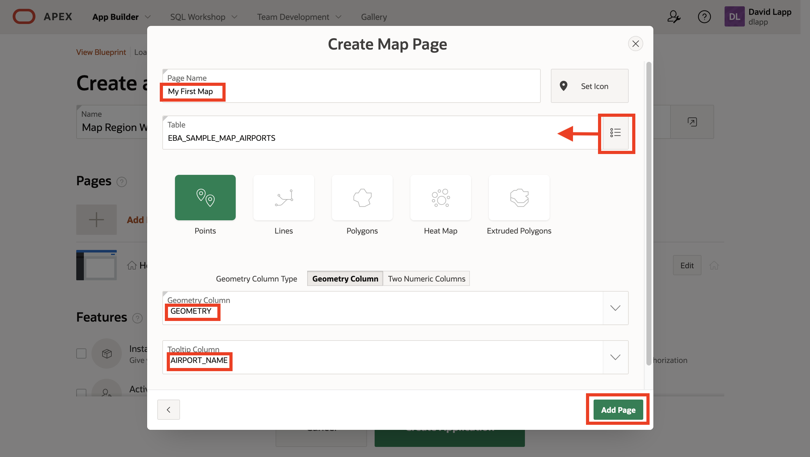
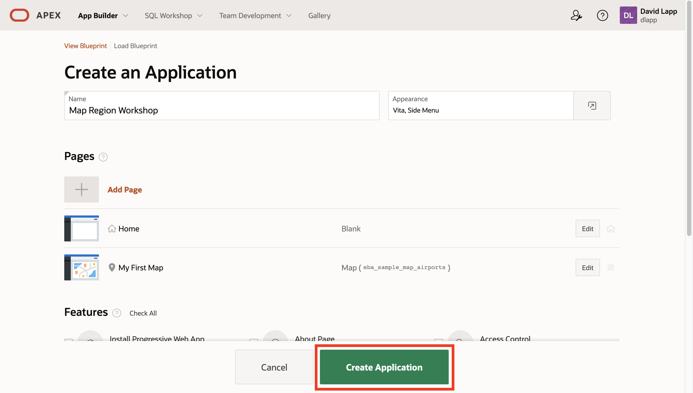
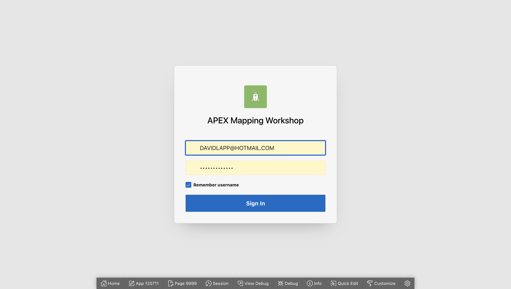
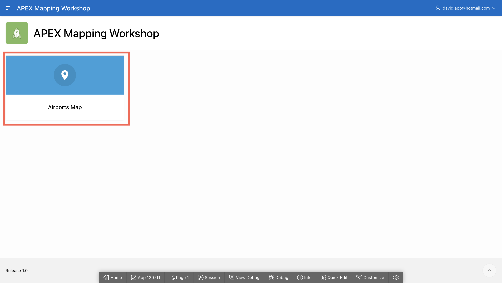
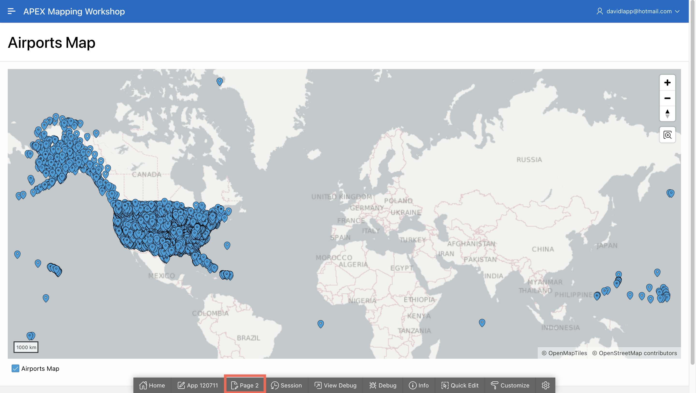
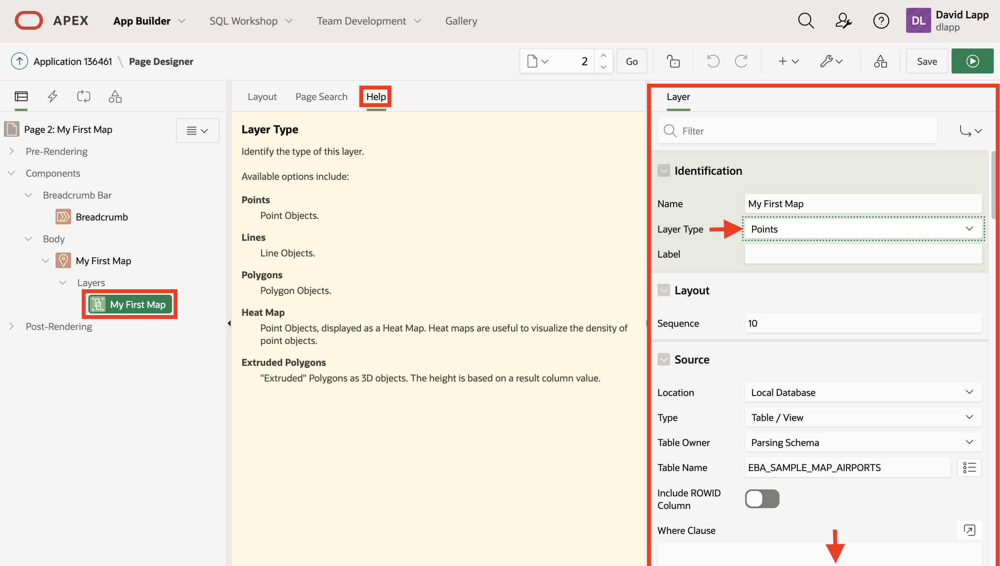
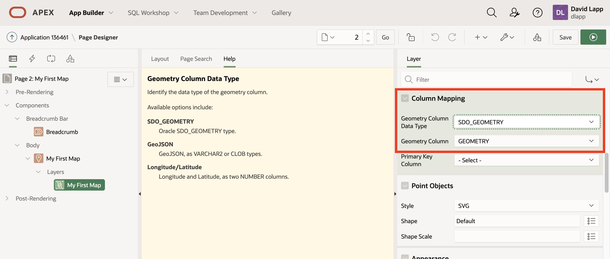

# Create your first map

## Introduction

doc details link...

Estimated Lab Time: 30 minutes

### Objectives

* Understand the basics of Map Regions

### Prerequisites

* ....

## Task 1: Create a new app with a map page using the wizard

Create.... 

1. Navigate to **App Builder** and click **Create**.

2. Select **New Application**.

3. Enter a name for your application and click **Add Page**.

1. Select **Map** as the page type.  **Note this is the same wizard as using  Create Page in an existing application.**

5. Enter the Page Name **Airports Map**. (With this wizard, the Page Name will also be used as the name of the Map Region created in the page.)  Click the icon to the right of the table input to select the EBA_SAMPLE_AIRPORTS table. For geometry column, select GEOMETRY, and finally select a column to use a tooltip when mousing over an item in the map.

6. Observe your new page is now listed under **Pages**. Click **Create Application**.

7. You are navigated to the page where you manage your new application. Click **Run Application**.

8. Sign in to your application.

 
9. The default layout we selected for our appliciation provides a home page with links to other pages. From the home page, navigate to teh page you just created.

10. Observe the page includes an interactive map showing airport locations with tooltips as you configured.

## Task 2: Inspect the map page

First map under the covers...

1. In the Developer Toolbar at the bottom of the page, click on the **Edit Page** button.

2. In the Page tree on the left, under **Body** click **Airports Map**. This is the title of the Map Region created by the Create Page wizard. It is, by default, the same as the Page title and can be changed as desired. In the Region details panel on the right, observe that this Region has a type of **Map**.  

3. Map Regions include Layers which are the data-driven points, lines, and polygons displayed on top of a background map. When stepping through the Create Page wizard you selected a Map using the table EBA_SAMPLE_MAP_AIRPORTS. So the wizard has created one layer containing those airport locations. By default the Layer has the same name as the Page, i.e. **Airports Map**. This can be changed as desired. 
   
   To inspect this Layer, in the Page tree on the left panel, under Layers click on **Airports Map**. Configuration details are displayed in the **Layer** panel on the right. For information about configuration items, click on the **Help** tab in the middle panel. When you then click on configuration items, help info is displayed for that item. For example click in the **Layer Type** menu to see help on its options. 

4. Scroll down in the Layer panel to see the other configuration options, including Column Mapping where the geometry data type is set. Here you are using Oracle's native spatial data type, SDO_GEOMETRY, and the column name is GEOMETRY.  

Congratulations on creating your first maps. There is a lot of capability beyond the basics you have just explored. .....expand....  

You may now [proceed to the next lab](#next).

## Learn More
* 

## Acknowledgements
* **Author** - David Lapp, Database Product Management, Oracle
* **Last Updated By/Date**  - David Lapp, Database Product Management, xxx 2021

