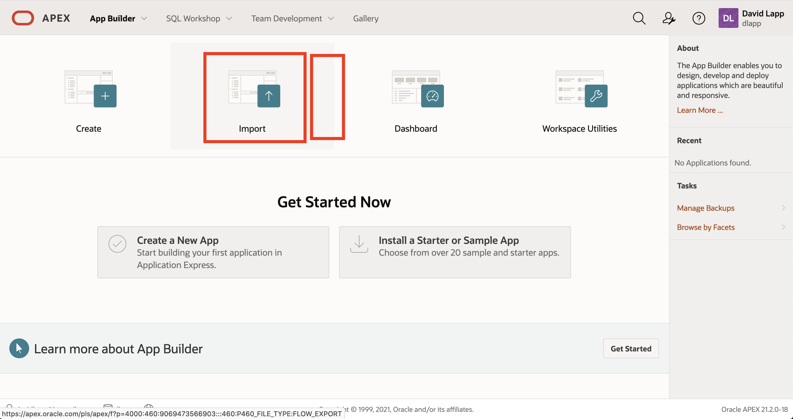
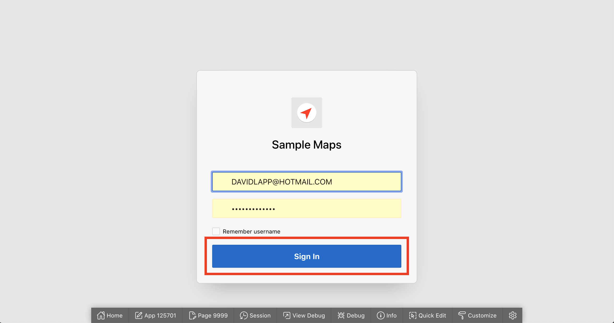
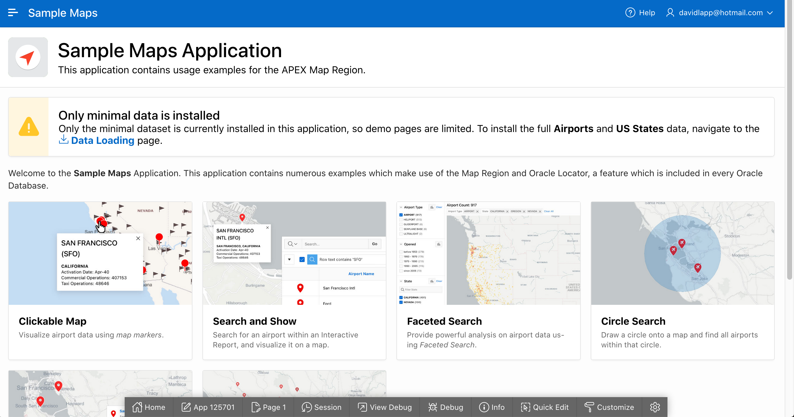
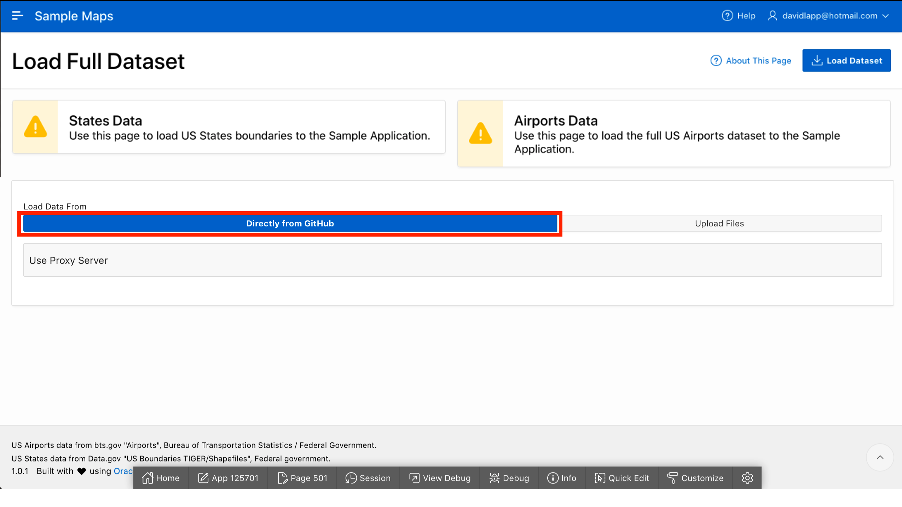

# Install the Sample Maps application

## Introduction

Oracle APEX provides access to a portfolio of sample applications that highlight specific areas of functionality. Among these is the Sample Maps application which showcases the mapping capabilities in Oracle APEX. A wide variety of examples are provided to serve as functional examples and starting points for further custumization. In this lab you will install and configure the Sample Maps appication. 

Estimated Lab Time: xx minutes

### Objectives

* Install the Sample Maps application
* Load supporting data

### Prerequisites

* APEX 21.2+

## Task 1: Install the application

1. Begin by clicking on **App Builder**.

2. Click **Install a Starter or Sample App**

Note: If your Workspace has existing application(s) then click **Create** and then **Starter App**.

3. Click **Samples** to open a new browser tab with a listing of available sample apps.

4. Scroll down to **Sample Maps** and click **Download App**

You will be prompted to same the application bundle to a local folder. 

5. Return to your App Builder browser tab and click **Import**

6. Drag and drop or browse to the Sample Maps application zip file that you downloaded previously.  Leave the File Type selection as Database Application, and then click **Next**.

7. File import is confirmed. Click **Next** again

8. Leave the default menu selections and click **Install Application**.

This will take you to the Install Application wizard.

9. Leave the default menu selections and click **Next**. 

10.  Click **Next** to validate system compatibility. 

11.  With compatibility confirmed, click **Install** to initiate the installation of supporting database objects and the APEX application. 

12.  Once installation is complete, click **Run Application**. 

13.  Sign in to the Sample Maps application using your APEX workspace username and password.

## Task 2: Load Data

1. You are now in the Sample Maps application which provides numerous examples of maps and spatial operations in APEX. On initial launch a warning message is displayed regarding data loading. Click on the **Data Loading** link within that message. You will navigate to a page where you complete loading of demo data.

2. The Data Loading page shows the loading status of the States and Airports datasets used by the Sample Maps applocation and the rest of this workshop. Upon installation of the Sample Maps application, these datasets are only partially loaded. To complete the sample data loading, you may either load directly from files stored in github, or you may first download the files and load from your local system. In this case, you will load directly from github. 
   
   Click on the link to load **Directly from GitHub** and then click **Load Dataset** at the top right.

If you have any issues accessing github, then you may also click the option upload files which provides alternate instructions.

3.  When data loading is complete you will see a notification at the top right, and the warning message is gone. The Sample Maps application is now ready to use.  

## Task 3: Explore the Sample Maps application

1. .....

## Task 4: Explore the demo data

1. .....

You may now [proceed to the next lab](#next).

## Learn More
* 

## Acknowledgements
* **Author** - David Lapp, Database Product Management, Oracle
* **Last Updated By/Date**  - David Lapp, Database Product Management, xxx 2021

