# Location-Based Analysis Using Spatial

## Introduction

### Objectives

-    Learn how to use location-based queries with Spatial

### Prerequisites

This lab assumes you have completed the following labs:
* Lab: Login to Oracle Cloud
* Lab: Generate SSH Key
* Lab: Environment Setup
* Lab: Install Sample Schemas for Spatial

### Scenario

MyCompany has several major warehouses. It needs to locate its customers who are near a given warehouse, to inform them of new advertising promotions. To locate its customers and perform location-based analysis, MyCompany must store location data for both its customers and warehouses.

This tutorial uses CUSTOMERS and WAREHOUSES tables. WAREHOUSES are created from scratch. CUSTOMERS are copied from the OE schema that you installed in the previous lab.

Each table stores location using Oracle's native spatial data type, ```SDO_GEOMETRY```. A location can be stored as a point in an ```SDO_GEOMETRY``` column of a table. The customer's location is associated with longitude and latitude values on the Earth's surface - for example, -63.13631, 52.485426.

## **Step 1:** Prepare the Lab Environment

1. Work as **oracle** user, connect to the PDB **orclpdb** with **system** user.

   ```
   <copy>
   sqlplus system/Ora_DB4U@orclpdb
   </copy>
   ```

   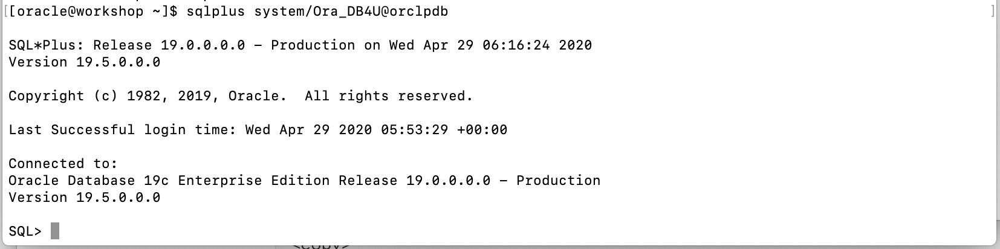 

2. Create a lab user and grant to sufficient priviledge.

   ```
   <copy>
   create user spatialdemo identified by spatialdemo;
   grant connect, resource to spatialdemo;
   grant select on oe.customers to spatialdemo;
   alter user spatialdemo quota unlimited on users;
   </copy>
   ```

   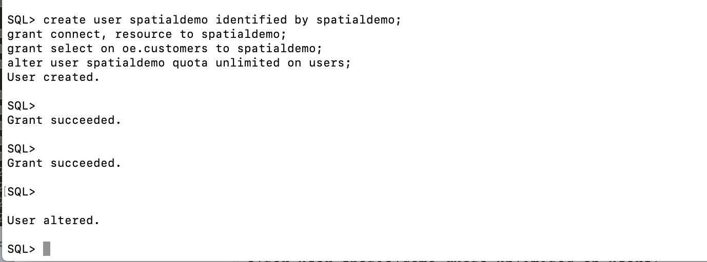 

3. Connect with the lab user: 

   ```
   <copy>
   connect spatialdemo/spatialdemo@orclpdb
   </copy>
   ```

  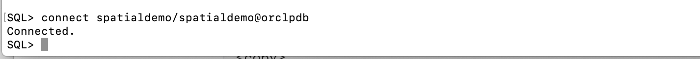 

4. Create the **CUSTOMERS** and **WAREHOUSES** tables. Notice that each table has a column of type SDO_GEOMETRY to store location.

   ```
   <copy>
   CREATE TABLE CUSTOMERS  
   (
     CUSTOMER_ID NUMBER(6, 0),
     CUST_FIRST_NAME VARCHAR2(20 CHAR), 
     CUST_LAST_NAME VARCHAR2(20 CHAR),
     GENDER VARCHAR2(1 CHAR),
     CUST_GEO_LOCATION SDO_GEOMETRY,
     ACCOUNT_MGR_ID NUMBER(6, 0) 
   );
   
   CREATE TABLE WAREHOUSES 
   ( 
     WAREHOUSE_ID	NUMBER(3,0),
     WAREHOUSE_NAME	VARCHAR2(35 CHAR),
     LOCATION_ID	NUMBER(4,0),
     WH_GEO_LOCATION	SDO_GEOMETRY 
   );
   </copy>
   ```

  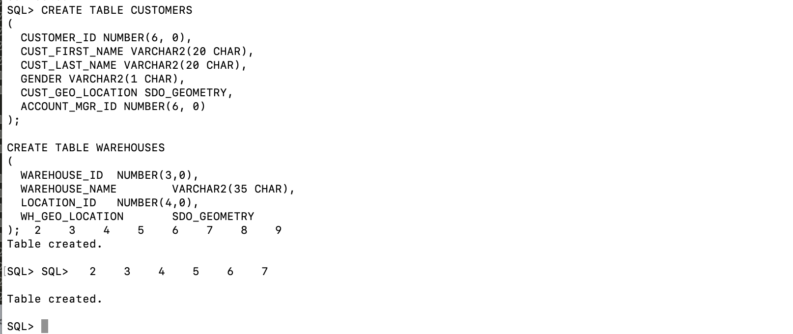 

5. Next we add Spatial metadata for the CUSTOMERS and WAREHOUSES tables to the ```USER_SDO_GEOM_METADATA``` view. Each ```SDO_GEOMETRY``` column is registered with a row in ```USER_SDO_GEOM_METADATA```. This is normally a simple INSERT statement, and a GUI in SQL Developer. We can use a procedure that gets the actual database username:

   ```
   <copy>
   EXECUTE SDO_UTIL.INSERT_SDO_GEOM_METADATA (sys_context('userenv','current_user'), -
    'CUSTOMERS', 'CUST_GEO_LOCATION', -
     SDO_DIM_ARRAY(SDO_DIM_ELEMENT('X',-180, 180, 0.05), -
                   SDO_DIM_ELEMENT('Y', -90, 90, 0.05)),-
     4326);
     
   EXECUTE SDO_UTIL.INSERT_SDO_GEOM_METADATA (sys_context('userenv','current_user'), -
    'WAREHOUSES', 'WH_GEO_LOCATION', -
     SDO_DIM_ARRAY(SDO_DIM_ELEMENT('X',-180, 180, 0.05), -
                   SDO_DIM_ELEMENT('Y', -90, 90, 0.05)),-
     4326);
     </copy>
   ```

   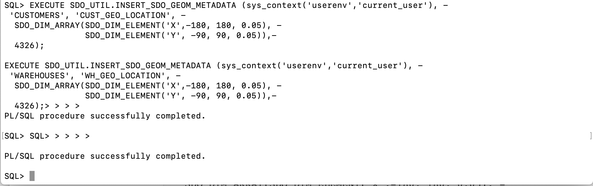 

   Here is a description of the items that were entered:
   
   - TABLE_NAME: Name of the table which contains the spatial data.
   - COLUMN_NAME: Name of the ```SDO_GEOMETRY``` column which stores the spatial data
   - ```MDSYS.SDO_DIM_ARRAY```: Constructor which holds the ```MDSYS.SDO_DIM_ELEMENT``` object, which in turn stores the extents of the spatial data in each dimension (-180.0, 180.0), and a tolerance value (0.05). The tolerance is a round-off error value used by Oracle Spatial, and is in meters for longitude and latitude data. In this example, the tolerance is 5 mm.
   - 4326: Spatial reference system id (SRID): a foreign key to an Oracle dictionary table ```MDSYS.CS_SRS``` that contains all the supported coordinate systems. It is important to associate your customer's location to a coordinate system. In this example, 4326 corresponds to "Longitude / Latitude (WGS 84)."


## **Step 2:** Load Data and Create Spatial Index

1. First we load CUSTOMERS by copying from the table OE.CUSTOMERS. Note that we are using two spatial functions in this step: 

    - We use ```sdo_cs.transform()``` to convert to our desired coordinate system SRID of 4326
    - We use ```sdo_geom.validate_geometry()``` to insert only valid geometries.

    ```
    <copy>
    INSERT INTO CUSTOMERS 
    SELECT CUSTOMER_ID, CUST_FIRST_NAME, CUST_LAST_NAME , GENDER, sdo_cs.transform(CUST_GEO_LOCATION,4326), ACCOUNT_MGR_ID
    FROM oe.customers
    WHERE sdo_geom.validate_geometry(CUST_GEO_LOCATION,0.05)='TRUE';
    commit;
    </copy>
    ```

    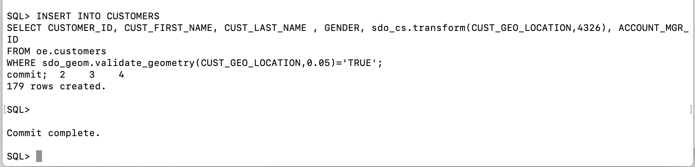 

2. Next WAREHOUSES manually load warehouses using the ```SDO_GEOMETRY``` constructor.

    ```
    <copy>
    INSERT INTO WAREHOUSES values (1,'Southlake, TX',1400, SDO_GEOMETRY(2001, 4326, MDSYS.SDO_POINT_TYPE(-103.00195, 36.500374, NULL), NULL, NULL));
    INSERT INTO WAREHOUSES values (2,'San Francisco, CA',1500, SDO_GEOMETRY(2001, 4326, MDSYS.SDO_POINT_TYPE(-124.21014, 41.998016, NULL), NULL, NULL));
    INSERT INTO WAREHOUSES values (3,'Sussex, NJ',1600, SDO_GEOMETRY(2001, 4326, MDSYS.SDO_POINT_TYPE(-74.695305, 41.35733, NULL), NULL, NULL));
    INSERT INTO WAREHOUSES values (4,'Seattle, WA',1700, SDO_GEOMETRY(2001, 4326, MDSYS.SDO_POINT_TYPE(-123.61526, 46.257458, NULL), NULL, NULL));
    COMMIT;
    </copy>
    ```

    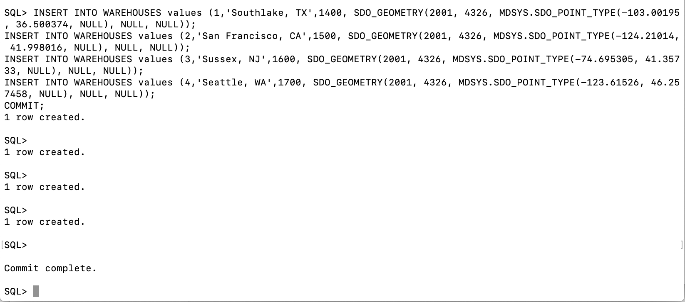 

    The elements of the constructor are:
    
    - 2001: ```SDO_GTYPE``` attribute and it is set to 2001 when storing a two-dimensional single point such as a customer's location.
    - 4326: This is the spatial reference system ID (SRID): a foreign key to an Oracle dictionary table (MDSYS.CS_SRS) that contains all the supported coordinate systems. It is important to associate your customer's location to a coordinate system. In this example, 4326 corresponds to "Longitude / Latitude (WGS 84)."
    - ```MDSYS.SDO_POINT_TYPE```: This is where you store your longitude and latitude values within the ```SDO_GEOMETRY``` constructor. Note that you can store a third value also, but for these tutorials, all the customer data is two-dimensional.
    - NULL, NULL: The last two null values are for storing linestrings, polygons, and geometry collections. For more information on all the fields of the ```SDO_GEOMETRY``` object, please refer to the Oracle Spatial Developer's Guide. For this tutorial with point data, these last two fields should be set to NULL.
    
3. You are now ready to create spatial indexes for CUSTOMERS and WAREHOUSES:

    ```
    <copy>
    CREATE INDEX customers_sidx ON customers(CUST_GEO_LOCATION) indextype is mdsys.spatial_index;
               
    CREATE INDEX warehouses_sidx ON warehouses(WH_GEO_LOCATION) indextype is mdsys.spatial_index;
    </copy>
    ```
    
    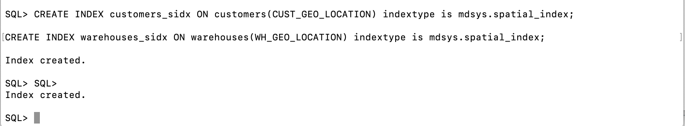 

## **Step 3:** Perform location-based queries
1. Find the five customers closest to the warehouse whose warehouse ID is 3. 

    ````
    <copy>
    SELECT  
       c.customer_id, 
       c.cust_last_name,
       c.GENDER
    FROM warehouses w, 
       customers c
    WHERE w.warehouse_id = 3
    AND sdo_nn (c.cust_geo_location, w.wh_geo_location, 'sdo_num_res=5') = 'TRUE';
    </copy>
    ````
    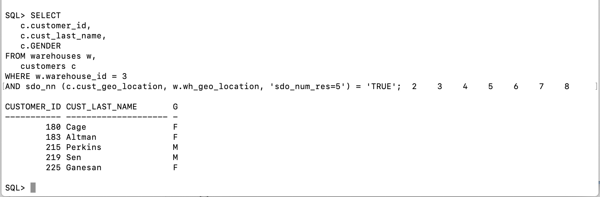 

    **Notes on Query 1**:
    
    - The ```SDO_NN``` operator returns the ```SDO_NUM_RES``` value of the customers from the CUSTOMERS table who are closest to warehouse 3. The first argument to ```SDO_NN(c.cust_geo_location in the example above)``` is the column to search. The second argument to ```SDO_NN(w.wh_geo_location in the example above)``` is the location you want to find the neighbors nearest to. No assumptions should be made about the order of the returned results. For example, the first row returned is not guaranteed to be the customer closest to warehouse 3. If two or more customers are an equal distance from the warehouse, then either of the customers may be returned on subsequent calls to ```SDO_NN```.
    - When using the ```SDO_NUM_RES``` parameter, no other constraints are used in the WHERE clause. ```SDO_NUM_RES``` takes only proximity into account. For example, if you added a criterion to the WHERE clause because you wanted the five closest female customers, and four of the five closest customers are male, the query above would return one row. This behavior is specific to the ```SDO_NUM_RES``` parameter, and its results may not be what you are looking for. You will learn how to find the five closest female customers in the discussion of query 3.
  
2. Find the five customers closest to warehouse 3 and put the results in order of distance. 

    ````
    <copy>
    SELECT 
       c.customer_id, 
       c.cust_last_name,
       c.GENDER,
       round( sdo_nn_distance (1), 2) distance_in_miles
    FROM warehouses w, 
       customers c
    WHERE w.warehouse_id = 3
    AND sdo_nn 
    (c.cust_geo_location, w.wh_geo_location, 'sdo_num_res=5  unit=mile', 1) = 'TRUE'
    ORDER BY distance_in_miles;
    </copy>
    ````
    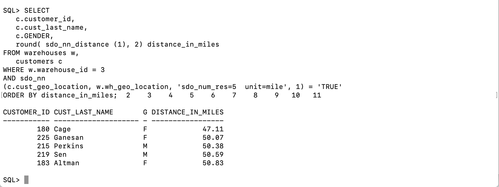  

    **Notes on Query 2**:
    
    - The ```SDO_NN_DISTANCE``` operator is an ancillary operator to the ```SDO_NN``` operator; it can only be used within the ```SDO_NN``` operator. The argument for this operator is a number that matches the number specified as the last argument of SDO_NN; in this example it is 1. There is no hidden meaning to this argument, it is simply a tag. If ```SDO_NN_DISTANCE()``` is specified, you can order the results by distance and guarantee that the first row returned is the closest. If the data you are querying is stored as longitude and latitude, the default unit for ```SDO_NN_DISTANCE``` is meters.
    - The ```SDO_NN``` operator also has a UNIT parameter that determines the unit of measure returned by ```SDO_NN_DISTANCE```.
    - The ORDER BY DISTANCE clause ensures that the distances are returned in order, with the shortest distance first.
    
3. Find the five female customers closest to warehouse 3, put the results in order of distance, and give the distance in miles. 

    ````
    <copy>
    SELECT 
       c.customer_id, 
       c.cust_last_name,
       c.GENDER,
       round( sdo_nn_distance(1), 2) distance_in_miles
    FROM warehouses w, 
       customers c
    WHERE w.warehouse_id = 3
    AND sdo_nn (c.cust_geo_location, w.wh_geo_location, 
       'sdo_batch_size =5 unit=mile', 1) = 'TRUE'
    AND c.GENDER = 'F'
    AND rownum < 6
    ORDER BY distance_in_miles;
    </copy>
    ````

    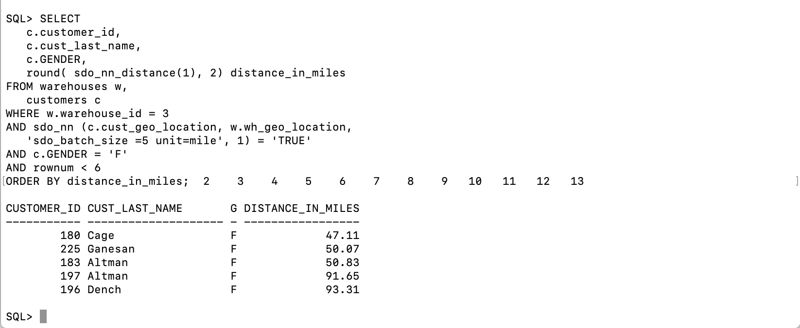 

    **Notes on Query 3**:
    
    - ```SDO_BATCH_SIZE``` is a tunable parameter that may affect your query's performance. ```SDO_NN``` internally calculates that number of distances at a time. The initial batch of rows returned may not satisfy the constraints in the WHERE clause, so the number of rows specified by ```SDO_BATCH_SIZE``` is continuously returned until all the constraints in the WHERE clause are satisfied. You should choose a ```SDO_BATCH_SIZE``` that initially returns the number of rows likely to satisfy the constraints in your WHERE clause.
    - The UNIT parameter used within the ```SDO_NN``` operator specifies the unit of measure of the ```SDO_NN_DISTANCE``` parameter. The default unit is the unit of measure associated with the data. For longitude and latitude data, the default is meters.
    - c.gender = 'F' and rownum < 6 are the additional constraints in the WHERE clause. The rownum < 6 clause is necessary to limit the number of results returned to fewer than 6.
    - The ```ORDER BY DISTANCE_IN_MILES``` clause ensures that the distances are returned in order, with the shortest distance first and the distances measured in miles.
    
       

4. Find all the customers within 100 miles of warehouse 3.

    ```
    <copy>
    SELECT 
       c.customer_id,
       c.cust_last_name,
       c.GENDER
    FROM warehouses w, 
       customers c
    WHERE w.warehouse_id = 3
    AND sdo_within_distance (c.cust_geo_location,
       w.wh_geo_location,
       'distance = 100 unit=MILE') = 'TRUE';
    </copy>
    ```

    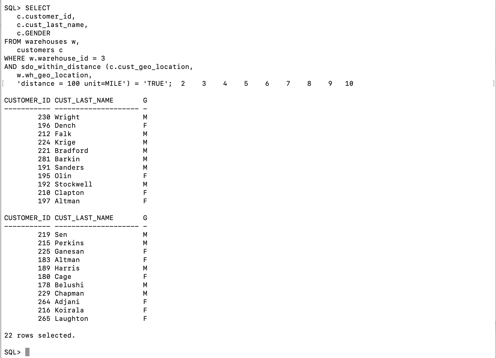 

    **Notes on Query 4**:
    
    - The ```SDO_WITHIN_DISTANCE``` operator returns the customers from the customers table that are within 100 miles of warehouse 3. The first argument to ```SDO_WITHIN_DISTANCE (c.cust_geo_location in the example above)``` is the column to search. The second argument to ```SDO_WITHIN_DISTANCE (w.wh_geo_location in the example above)``` is the location you want to determine the distances from. No assumptions should be made about the order of the returned results. For example, the first row returned is not guaranteed to be the customer closest to warehouse 3.
    - The DISTANCE parameter used within the ```SDO_WITHIN_DISTANCE``` operator specifies the distance value; in this example it is 100.
    - The UNIT parameter used within the ```SDO_WITHIN_DISTANCE``` operator specifies the unit of measure of the DISTANCE parameter. The default unit is the unit of measure associated with the data. For longitude and latitude data, the default is meters; in this example, it is miles.
    
5. Find all the customers within 100 miles of warehouse 3, put the results in order of distance, and give the distance in miles. 

    ````
    <copy>
    SELECT
       c.customer_id,
       c.cust_last_name,
       c.GENDER,
       round( 
        sdo_geom.sdo_distance (c.cust_geo_location, 
        w.wh_geo_location, 
        .005, 'unit=MILE'), 2) distance_in_miles 
    FROM warehouses w, 
       customers c
    WHERE w.warehouse_id = 3
    AND sdo_within_distance (c.cust_geo_location,
       w.wh_geo_location,
       'distance = 100 unit=MILE') = 'TRUE'
    ORDER BY distance_in_miles;
    </copy>
    ````

    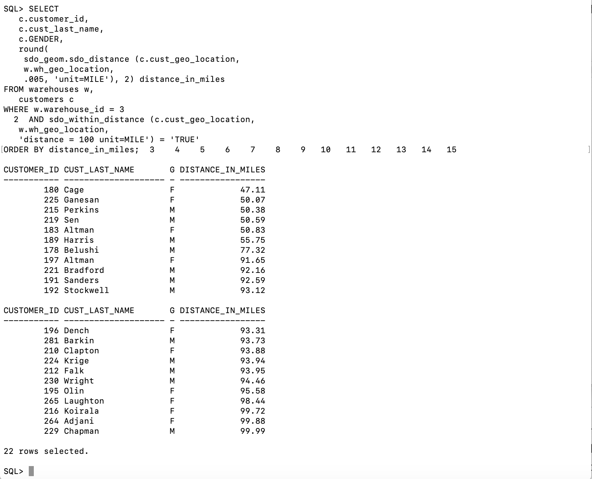 

    **Notes on Query 5**:
    
    - The ```SDO_GEOM.SDO_DISTANCE``` function computes the exact distance between the customer's location and warehouse 3. The first argument to ```SDO_GEOM.SDO_DISTANCE (c.cust_geo_location in the example above)``` contains the customer's location whose distance from warehouse 3 is to be computed. The second argument to ```SDO_WITHIN_DISTANCE (w.wh_geo_location in the example above)``` is the location of warehouse 3, whose distance from the customer's location is to be computed.
    - The third argument to ```SDO_GEOM.SDO_DISTANCE (0.005)``` is the tolerance value. The tolerance is a round-off error value used by Oracle Spatial. The tolerance is in meters for longitude and latitude data. In this example, the tolerance is 5 mm.
    - The UNIT parameter used within the ```SDO_GEOM.SDO_DISTANCE``` parameter specifies the unit of measure of the distance computed by the ```SDO_GEOM```.```SDO_DISTANCE``` function. The default unit is the unit of measure associated with the data. For longitude and latitude data, the default is meters. In this example it is miles.
    - The ```ORDER BY DISTANCE_IN_MILES``` clause ensures that the distances are returned in order, with the shortest distance first and the distances measured in miles.
    
    


## Conclusion

In this tutorial, you learned how to:

- Create tables with a geometry columns
- Insert spatial metadata
- Create Spatial Index
- Load data with geometries
- Perform location-based queries

For more information, please see the Spatial Developer's Guide at [https://docs.oracle.com/en/database/oracle/oracle-database/19/spatl/index.html](https://docs.oracle.com/en/database/oracle/oracle-database/19/spatl/index.html)

## Acknowledgements

- **Author** - Minqiao Wang, DB Product Management, April 2020
- **Last Updated By/Date** - 

## See an issue?
Please submit feedback using this [form](https://apexapps.oracle.com/pls/apex/f?p=133:1:::::P1_FEEDBACK:1). Please include the *workshop name*, *lab* and *step* in your request.  If you don't see the workshop name listed, please enter it manually. If you would like for us to follow up with you, enter your email in the *Feedback Comments* section.    Please include the workshop name and lab in your request.  