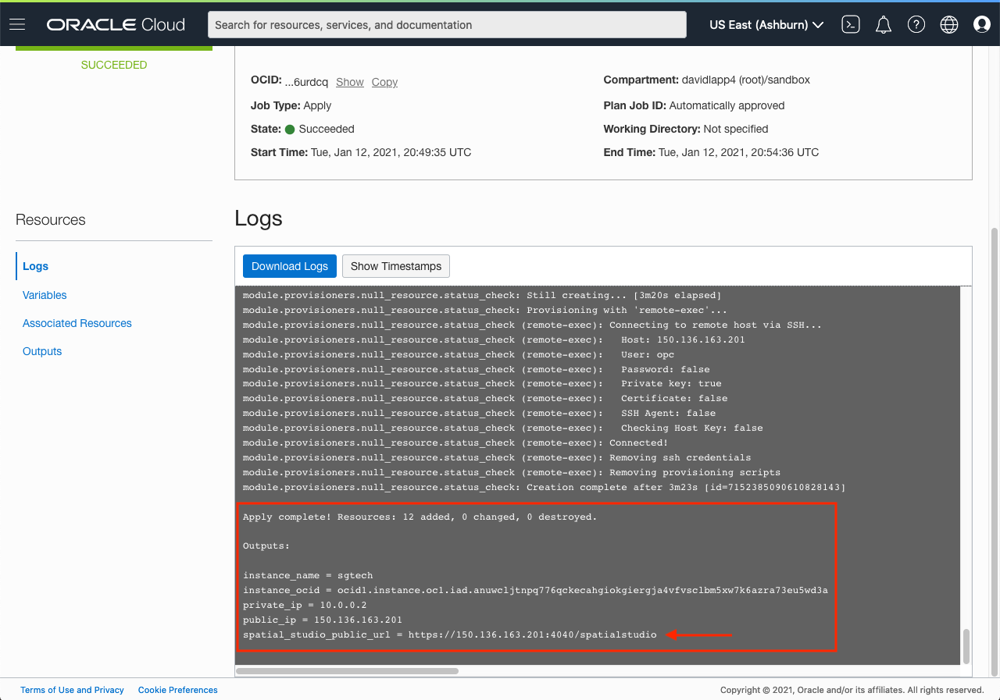
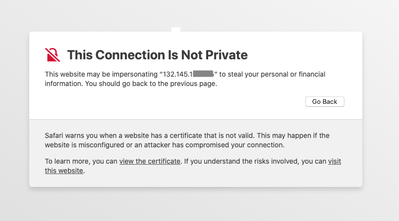
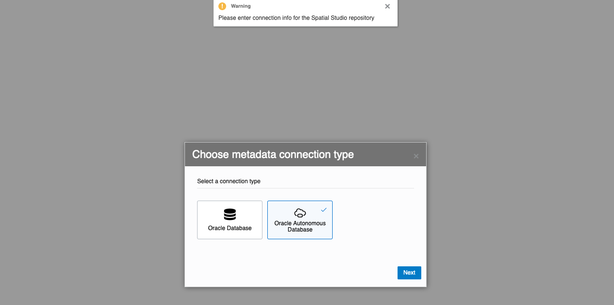
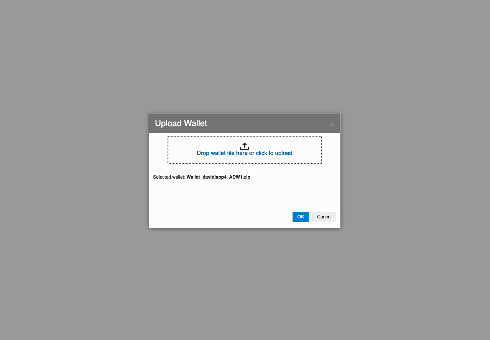

# Install Spatial Studio

## Introduction

This lab walks though the process of provisioning Oracle Spatial Studio (Spatial Studio) using the Oracle Cloud Marketplace.  The Oracle Cloud Marketplace provides apps and services provided by Oracle and 3rd parties. Details are available [here](https://docs.oracle.com/en/cloud/marketplace/marketplace-cloud/index.html).

Estimated Lab Time: 20 minutes

### Objectives

In this lab, you will:
* Learn how to install Spatial Studio from the Oracle Cloud Marketplace
* Learn how to set Spatial Studio repository schema on initial launch 

### Prerequisites

* An Oracle Free Tier, Always Free, Paid or LiveLabs Cloud Account
* Repository schema created (Lab 3).

<!-- *This is the "fold" - below items are collapsed by default* -->

## **STEP 1**: Select Spatial Studio from Marketplace

1. Log into your Oracle Cloud, click the main hamburger menu, and select  Marketplace > Applications

    

2. Search for Spatial Studio and then click on the Oracle Spatial Studio app

   

3. Review the Usage Instructions, then accept the terms and conditions and  click Launch Stack

   


## **STEP 2:** Create Stack Wizard

1. Optionally enter a custom name and description for the deployment stack. Then select the Compartment to use for the deployment and click Next

  

2. Select Availability Domain and Shape for the Compute Instance.   

  *  Details on compute shapes are [here](https://docs.oracle.com/en-us/iaas/Content/Compute/References/computeshapes.htm)
  *  Check for quota availability of your desired Shape in Availabilty Domains
    *  This is particularly important when using an Always Free shape.
    *  In the OCI Console, navigate to Governance > Limits, Quotas, and Usage
    *  For Service select Compute and for Scope select an Availability Domain. Confirm availability of your desired Shape. Change the Availability Domain selection if necessary to identify available quota.

  

  Make selections.

  

  Then scroll down.

3. Optionally change the HTTPS port and Spatial Studio admin user name from the defaults. For Spatial Studio Admin authentication, you have the option to use OCI Vault Secrets or a password. The image below shows an example using a password. For production deployments you are encouraged to use OCI Vault Secrets. Scroll down to the the section on Configuring Networking.
   
   Note: By default the Spatial Studio admin user name is **studio\_admin**. This is an Spatial Studio application user and is distinct from the database user name (studio\_repo) created in Lab 3 for the repository schema.
  

  

4. For networking, you have the option to automatically create a new VCN or an existing one. Select the Compartment for creating a new VCN or searching for existing VCNs. 
   
   The image below shows an example using Create New VCN. To use an existing VCN it must be in the same Availability Domain as selected above in Step 2. If you do not have other existing VCNs then the remaining defaults can be left as is. If you do have other existing VCNs then update the CIDR values to avoid conflict. 

  

  Scroll down to the SSH Keys section.

1. Loading a SSH public key enables access to Spatial Studio's file system for administrative purposes. The dialog has links to general SSH connection documentation. Submit your SSH public key by browsing to the key file or copy-pasting the key string. If you load you SSH public key from a file, the key file name will be displayed as shown in the image below. Click Next.

  

6. Review the summary of your entries. If corrections are needed then click Back. Otherwise click Create to start the deployment process. You will be redirected to a Job Details page for the deployment.  

   

## **STEP 3:** Monitor Deployment Progress

1. The Logs section at the bottom of the Job Details page will show progress. It will initially display a spinner while setting up for deployment. 

  

   After a couple minutes you will see log information.

  

2. Scroll down to the bottom of the logs section. When complete you will see Apply Complete! followed by instance details. The last item listed is the Spatial Studio public URL. Copy this URL and paste into a browser.

  

## **STEP 4:** First-Time Login

1. Opening the Spatial Studio public URL for the first time will display a browser warning related to privacy and security. The specific warning depends on your platform and browser. 

  

  This is not a Spatial Studio issue; it is generic to  access of web sites that do not have a signed HTTPS certificate. Loading and configuring a signed certificate removes this warning. However the process of loading certificates in Jetty is beyond the scope of this workshop. 

  Click the link to contine to the website.

2. Enter the Spatial Studio admin user name (default is studio_admin) and the password you entered in the Step 2 (Create Stack wizard, item 3). Then click Sign In.

  

3. On the first login to a Spatial Studio instance, you are prompted for connection information for the database schema to use as the Spatial Studio's metadata repository. This is the database schema used for all of Spatial Studio's metadata and can also be used by Spatial Studio admin users for storing other data. You will use the schema created in Lab 3 so select Oracle Autonomous Database and click Next.

    

4. Browse to (or or drag-and-drop) the Wallet file saved in Lab 3. After loading, the wallet file name will be listed as Selected Wallet. Click OK.

    

5. Enter the user name and password defined in Lab 2 and the service. Medium service level is appropriate for this workshop. Click OK.

    

6. Wait for a few moments while Spatial Studio makes its initial connection to the schema and creates several metadata tables. When finished, Spatial Studio will open with Getting Started information.

    


Oracle Spatial Studio is now provisioned.  

The following Lab provides steps to tear down Spatial Studio when no longer needed.


## **STEP 5**: Uninstall Spatial Studio

 If you would like to fully remove Spatial Studio proceed with the following.

1. Navigate to Resources > Stack

    

2. Choose the Compartment and Name used in STEP 2. In the example shown below, a compartment named sandbox and Stack named Oracle Spatial Studio was used.

    

3. Select Terraform Actions > Destroy

    

  You will be prompted to confirm. This will remove the Compute and Network artifacts created by the Marketplace deployment.

4. After removing the Spatial Studio app, your repository schema remains in place. 
   To remove the repository schema, connect to the database as **admin** as done in Lab 3 and run the following. 

      ```
      <copy>DROP USER studio_repo CASCADE;</copy>
      ```


## Learn More
* [Spatial Studio product page](https://oracle.com/goto/spatialstudio)

## Acknowledgements
* **Author** - David Lapp, Database Product Management
* **Last Updated By/Date** - David Lapp, Database Product Management, January 2021

## Need Help?
Please submit feedback or ask for help using our [LiveLabs Support Forum](https://community.oracle.com/tech/developers/categories/livelabsdiscussions). Please click the **Log In** button and login using your Oracle Account. Click the **Ask A Question** button to the left to start a *New Discussion* or *Ask a Question*.  Please include your workshop name and lab name.  You can also include screenshots and attach files.  Engage directly with the author of the workshop.

If you do not have an Oracle Account, click [here](https://profile.oracle.com/myprofile/account/create-account.jspx) to create one.
