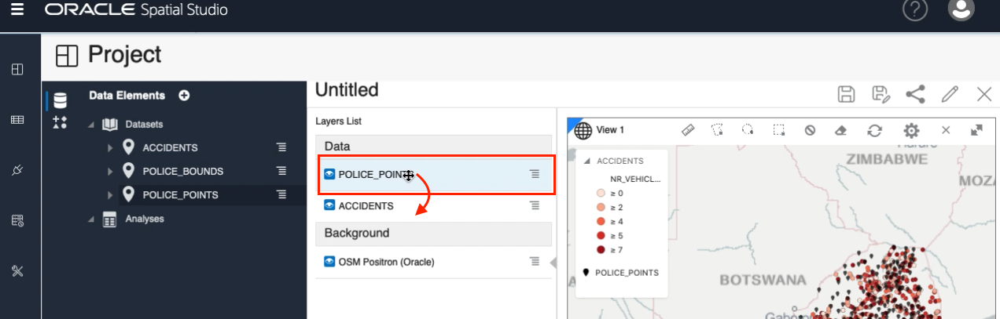
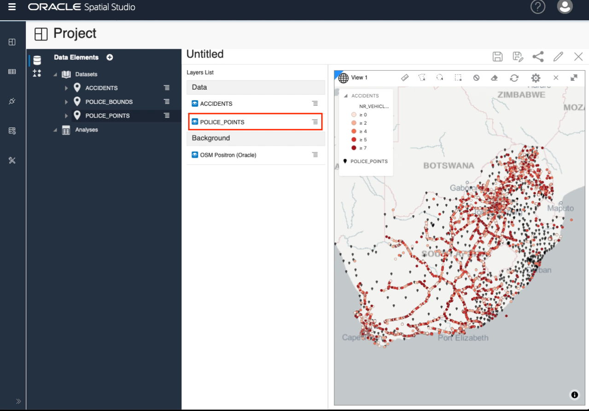

# Load Data

## Introduction

This lab walks you through the steps to create a prioject in Spatial Studio. 

descr ...

Estimated Lab Time: xx minutes

### About ...

### Objectives

In this lab, you will:
* Load ..., ..., ... data from common formats
* Prepare data for mapping and spatial analysis

### Prerequisites

As described in the workshop introduction, ......

## **STEP 1:** Create New project

We begin by creating a new empty Project and adding Datasets. We then create a basic map with some data-driven styling.

1. From the left-panel menu, navigate to the Projects page and click Create Project.

2. Click the "+" icon to Add a Dataset.

3. Select Accidents and click OK.

4. Drag and drop Accidents onto the map.

5. Observe the map pan and zoom to the area of the data. In the Layers List panel, click the hamburger icon for Accidents and select Settings.

6. From here we control the layer display and interactivity settings. For example, select Based on data from the Color pull-down menu.
 

7. In the data driven styling dialog, select NR_VEHICLES (i.e., number of vehicles involved) as the column to use for controlling color. Accept the defaults (or experiment with other colors) and rthen click the Back link at the top of the styling panel.
 

8. To complete the stying of the ACCIDENTS layer, assign a grey "Stroke" (i.e., outline)  with width = 0.5, and increase the Opacity of both the Basic circle marker and the Stroke. 
 

9. Spatial Studio allows you to select from pre-defined and custom background maps. To change the background map, click on the hamburger icon for the background and select Settings.
 

10. Select the various background maps to become familaiar with their differences. Then select OSM Positron and click the Back link at the top of the background map selection panel.
 

11. Next we add our police Datasets to the Project.  Click the + icon at the top of the Data Elements panel, select Add Dataset, and use shift-enter to select both police Datasets and click OK.
 

 12. As you did previously with ACCIDENTS, drag and drop the POLICE\_POINTS Dataset from the Data Elements panel onto the map to create a new layer. Click the POLICE\_POINT layer's hamburger menu and select Settings. In the Render Style pull-down menu select Symbol. Click in the text box for Image and select marker-11. Set Opacity 80% and Size to 0.6. Then click the Back button at the top of the Layers panel.
 

 13. We would like the POLICE\_OINTS later to be displayed underneath the ACCIDENTS layer. However the most recently added layer (POLICE\_POINTS) is at the top of the layers list (i.e., on top of the ACCIDENTS layer in the map). To move it under the ACCIDENTS layer, click and hold POLICE\_POINTS in the Layers list, drag below ACCIDENTS, and release.
 
 Observe the POLICE\_POINTS layer now underneath the ACCIDENTS layer.
  

## Learn More
* [Spatial Studio product portal] (https://oracle.com/goto/spatialstudio)
* 

## Acknowledgements
* **Author** - David Lapp, Database Product Management, Oracle
* **Last Updated By/Date** 

## Need Help?
Please submit feedback or ask for help using our [LiveLabs Support Forum](https://community.oracle.com/tech/developers/categories/oracle-spatial). Please click the **Log In** button and login using your Oracle Account. Click the **Ask A Question** button to the left to start a *New Discussion* or *Ask a Question*.  Please include your workshop name and lab name.  You can also include screenshots and attach files.  Engage directly with the author of the workshop.

If you do not have an Oracle Account, click [here](https://profile.oracle.com/myprofile/account/create-account.jspx) to create one.
