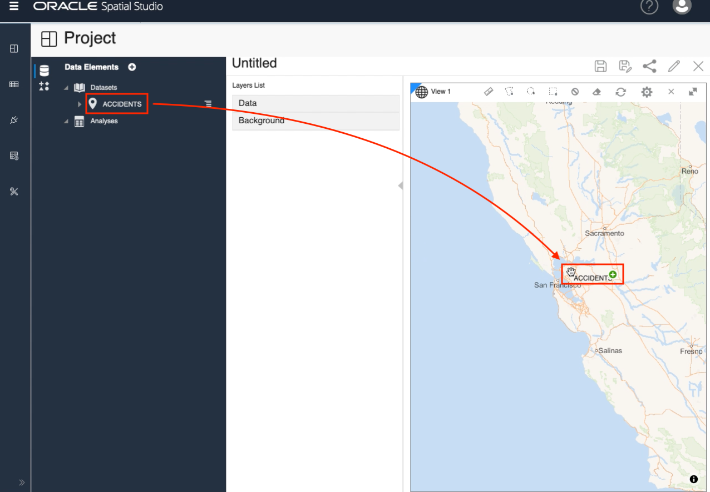
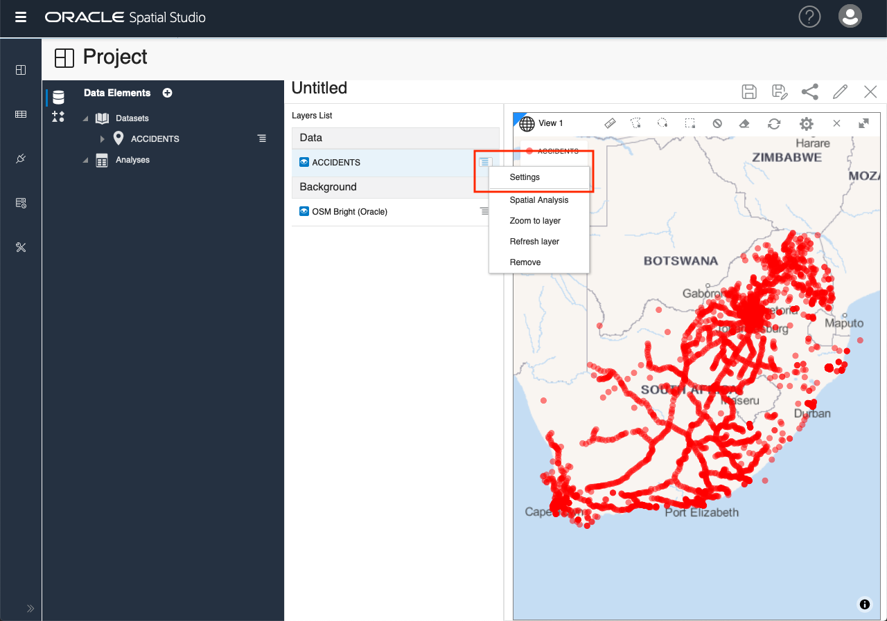
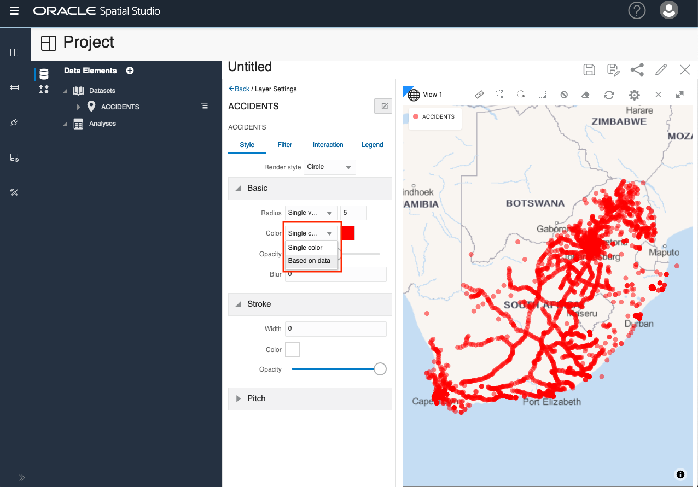
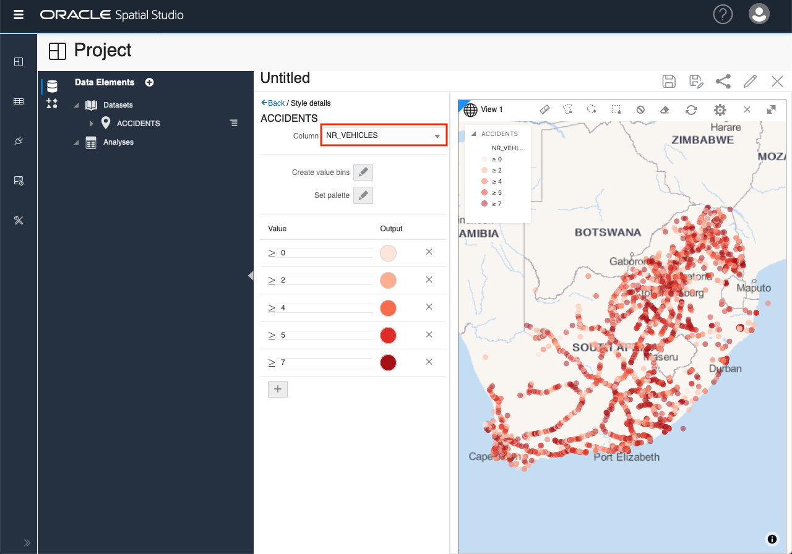
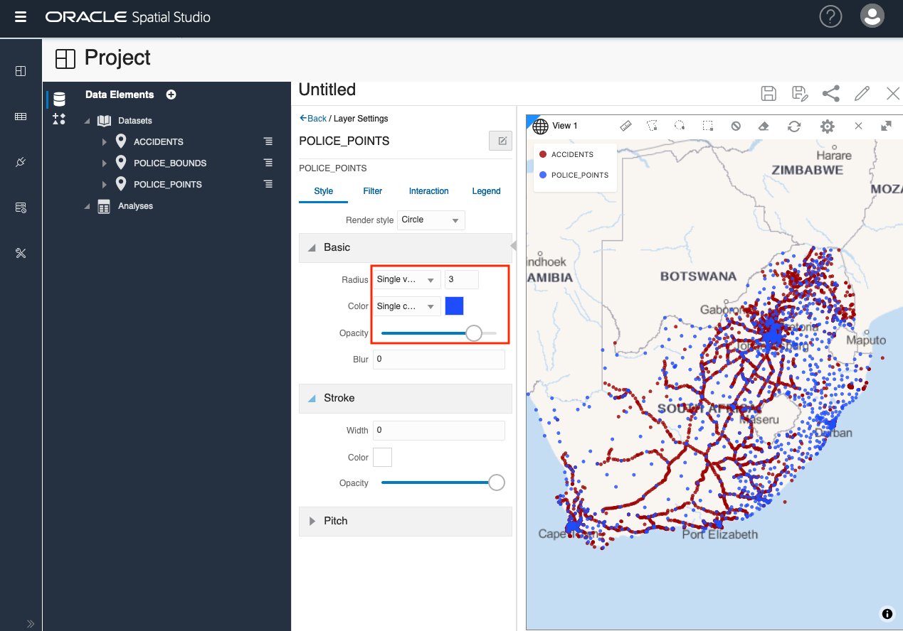
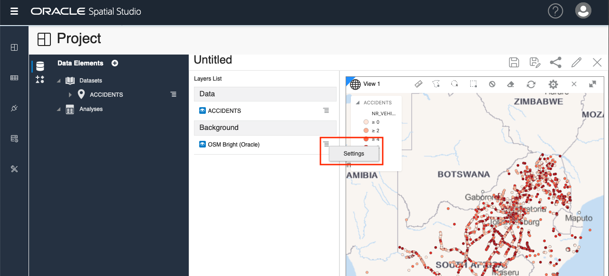
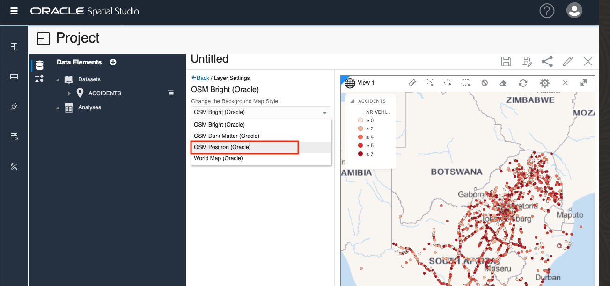
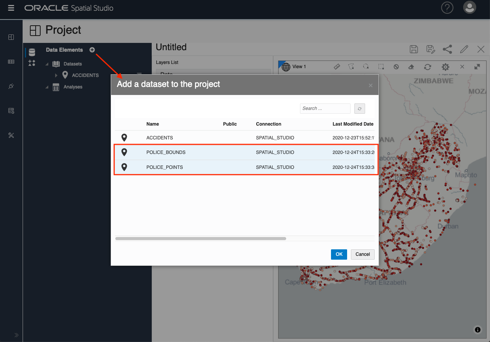
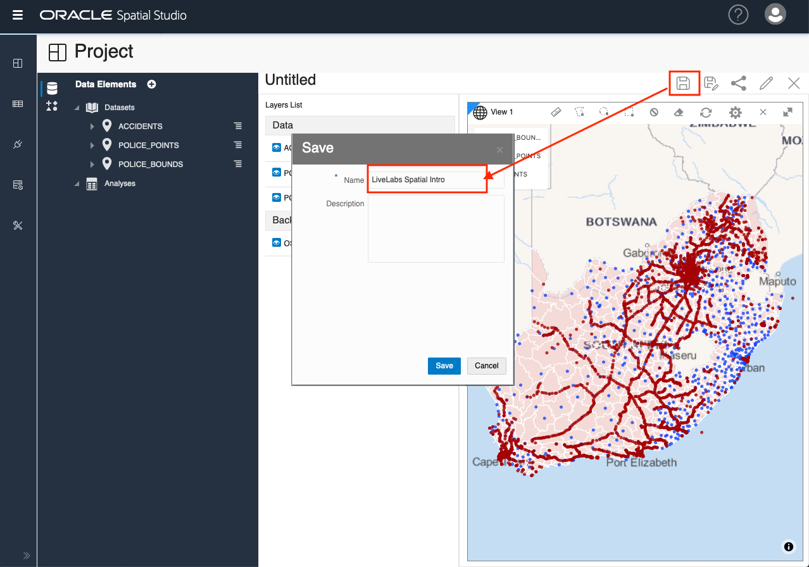

# Load Data

## Introduction

This lab walks you through the steps to create a prioject in Spatial Studio. 

descr ...

Estimated Lab Time: xx minutes

### About ...

### Objectives

In this lab, you will:
* Load ..., ..., ... data from common formats
* Prepare data for mapping and spatial analysis

### Prerequisites

As described in the workshop introduction, ......

## **STEP 1:** Create Project and Add Dataset

We begin by creating a new empty Project and ...

1. From the left-panel menu, navigate to the Projects page and click Create Project.

2. Click the "+" icon to Add a Dataset.

3. Select Accidents and click OK.

## **STEP 2:** Create Map layer

1. Drag and drop the ACCIDENTS Dataset onto the map. This creates a map Layer.

2. Observe the map pan and zoom to the area of the data. In the Layers List panel, click the hamburger icon for Accidents and select Settings.

3. From here we control the layer display and interactivity settings. We will experiment with these cpabilities in a later section. For the moment, just update the layer's Radius (size), Color, and Opacity and then click the Back link.
 

## **STEP 3:** Add Addional Datasets

1. Next we add our 2 police Datasets to the Project.  Click the + icon at the top of the Data Elements panel, select Add Dataset, and use shift-enter to select both police Datasets and click OK.
 

2. As you did previously with ACCIDENTS, drag and drop the POLICE\_POINTS Dataset from the Data Elements panel onto the, click the POLICE\_POINT layer's hamburger menu and select Settings. Update Radius, Color, Opacity. Then click the Back button at the top of the Layers panel.
 

3. As Layers are added to the map, they are rendered on top of the existing Layers. Therefore POLICE\_POINTS are currently on top of ACCIDENTS. To reorder  the layers such that POLICE\_POINTS are underneath ACCIDENTS, move the mouse over POLICE\_POINTS in the Larer's list, click and hold (you'll see the cursor change to cross-hair), and drag under ACCIDENTS. 
 
 
4. Drag and drop the POLICE\_BOUNDS Dataset onto the map. As you did with POLICE\_POINTS, re-order the layers so that POLICE\_BOUNDS are at the bottom (i.e., rendered beneath the other layers). We now have our 3 datasets added as map layers in our project.
   

## **STEP 4:** Save Project 
    
1. Individual layers may be turned off/on by clicking the blue eyeball icon next to the layer name. Click the Save button at the top right to save the Project and supply a name, for example "LiveLabs Spatial Intro".
 

2. Navigate to the projects page from the left navigation bar and observe our Project now listed.
 

Please proceed to the next Lab.

## Learn More
* [Spatial Studio product portal] (https://oracle.com/goto/spatialstudio)
* 

## Acknowledgements
* **Author** - David Lapp, Database Product Management, Oracle
* **Last Updated By/Date** 

## Need Help?
Please submit feedback or ask for help using our [LiveLabs Support Forum](https://community.oracle.com/tech/developers/categories/oracle-spatial). Please click the **Log In** button and login using your Oracle Account. Click the **Ask A Question** button to the left to start a *New Discussion* or *Ask a Question*.  Please include your workshop name and lab name.  You can also include screenshots and attach files.  Engage directly with the author of the workshop.

If you do not have an Oracle Account, click [here](https://profile.oracle.com/myprofile/account/create-account.jspx) to create one.
