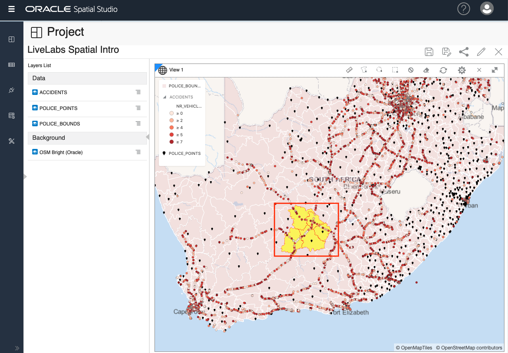
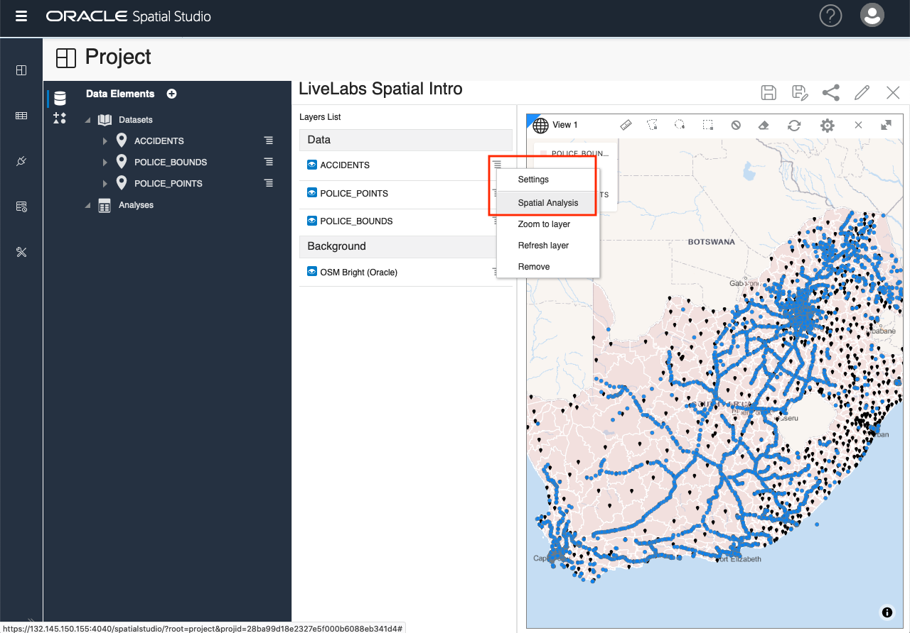
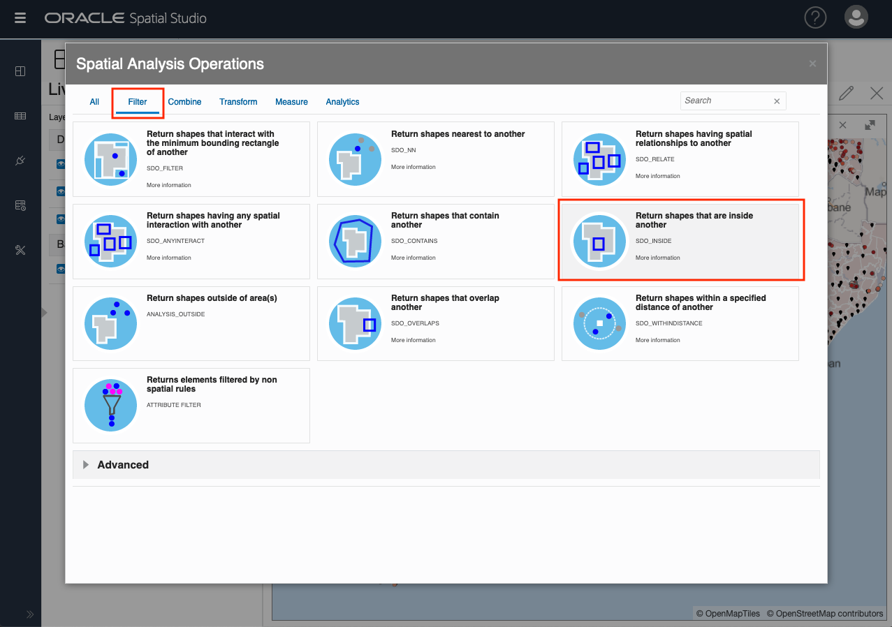

# Perform Spatial Analyses

## Introduction

Spatial Studio provides access to the spatial analysis features of Oracle Database without the need to write code. Simple user interfaces are provided for spatial analyses and all of the underlying database syntax is handled automatically behind the scenes. Spatial analysis operations in Spatial Studio are organized into categories:

**Filter**  -  "Which items in a dataset are inside of a region?"

**Combine** - "Join 2 datasets based on a spatial relationship" 

**Transform** - "Generate a dataset of points in the middle of each region"

**Measure** - "What is the area of each region in my dataset?"

**Analytics** - "How many items are inside of each region?" 

In this lab you will explore several of these spatial analyses.

Estimated Lab Time: xx minutes

### Objectives

* Understand the categories of spatial analyses in Spatial Studio
* Learn how to perform spatial analyses and visualize results

### Prerequisites

* Successfully complete Labs 1-3

<!-- *This is the "fold" - below items are collapsed by default*  -->

## **STEP 1**: Apply Spatial Filter 

In this step you filter for accidents inside selected police regions, and then style those accidents by police region.

1. You will begin by selecting some regions in the POLICE\_BOUNDS layer to serve as the filter. So as described in Lab 3 Step 6, make sure that **Allow selection** is turned on for the POLICE\_BOUNDS layer.
   
2. Click inside a POLICE\_BOUNDS region to select, and then shift-click (PC) or command-click (Mac) in several other adjacent regions to add to the selection. We will use this set of selected regions to spatially filter accidents. To make selection easier, you can use your mouse wheel to zoom in and out. 

     

3. Click the hamburger menu for the ACCIDENTS layer and select **Spatial Analysis**

     

   This opens the Spatial Analysis dialog.

4. Click the **Filter** tab and then click the tile for **Return shapes that are inside another**

     
   
 
You may now [proceed to the next lab](#next).

## Acknowledgements
* **Author** - David Lapp, Database Product Management
* **Last Updated By/Date** - David Lapp, Database Product Management, February 2021

## Need Help?
Please submit feedback or ask for help using our [LiveLabs Support Forum](https://community.oracle.com/tech/developers/categories/livelabsdiscussions). Please click the **Log In** button and login using your Oracle Account. Click the **Ask A Question** button to the left to start a *New Discussion* or *Ask a Question*.  Please include your workshop name and lab name.  You can also include screenshots and attach files.  Engage directly with the author of the workshop.

If you do not have an Oracle Account, click [here](https://profile.oracle.com/myprofile/account/create-account.jspx) to create one.
