<!-- Using this Markdown file:
set the type to livelab, freetier or alwaysfree in the manifest.json file for this lab
for example:
{
  "title": "Lab 1: Provision an ATP instance",
  "filename": "../../../common/adb-provision-atp.md",
  "type":"alwaysfree"
},
for provisioning an ATP instance on an AlwaysFree account
-->
# Provisioning an Autonomous Database

## Introduction

This lab walks you through the steps to get started using Oracle Autonomous Transaction Processing [ATP] on Oracle Cloud. You will provision a new Autonomous Database instance and connect to the database using Oracle SQL Developer Web.

Estimated time: 5 minutes

### Objectives

-   Learn how to provision a new Autonomous Transaction Processing Database

### Prerequisites
- The following lab requires an [Oracle Cloud account](https://myservices.us.oraclecloud.com/mycloud/signup?language=en). You may use your own cloud account, a cloud account that you obtained through a trial, a Free Tier account, a LiveLabs account or a training account whose details were given to you by an Oracle instructor.
- This lab assumes you have completed the **Prerequisites** lab seen in the Contents menu on the right.  In this lab, you will provision an ADB database instance using the cloud console.

## **STEP 1**: Provision an Autonomous Transaction Processing instance

1. From within your Oracle Cloud environment, you will create an instance of the Autonomous Transaction Processing database service.

    From the Cloud Dashboard, select the navigation menu icon in the upper left-hand corner and then select **Autonomous Transaction Processing**.

    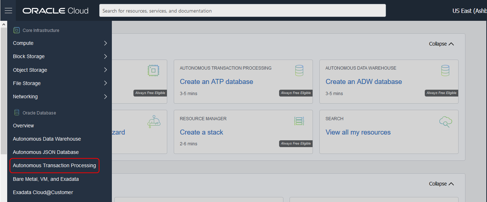

2. Click **Create Autonomous Database**.

    

3. <if type=["freetier","alwaysfree"]>Your compartment may be selected for you. You can use your root compartment, or choose another.</if><if type="livelabs">Make sure your compartment is set to the compartment created for you. It should start with your user id.</if>

    <if type=["freetier","alwaysfree"]>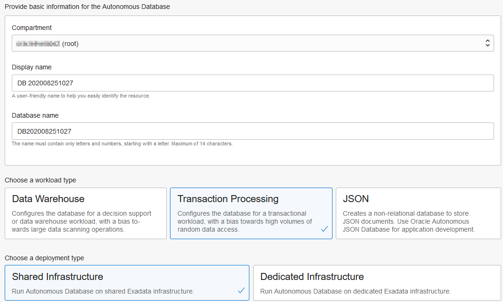</if>
    <if type="livelabs">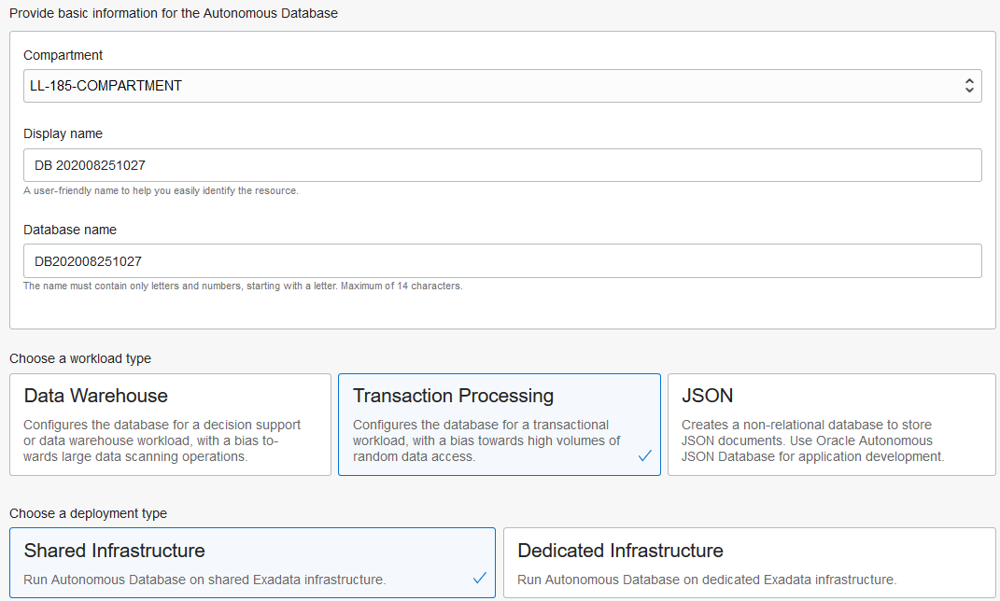</if>

<if type=["freetier","alwaysfree"]>
4. Select the Always Free option.
    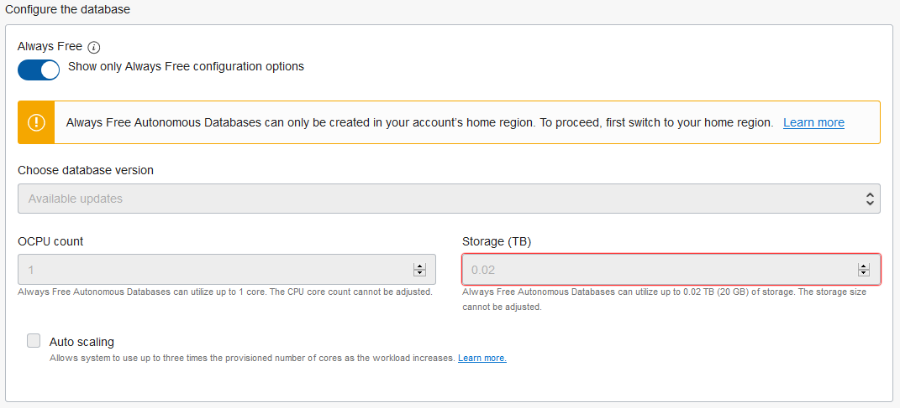
</if>
<if type="livelabs">
4. Leave the Always Free option unselected, and leave the default selection for Auto scaling.
  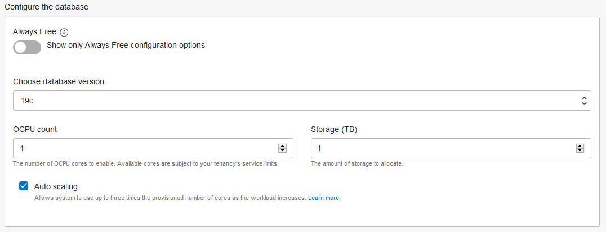
</if>

5. Select a password you can remember for ADMIN, and make sure that **License Included** is selected.
    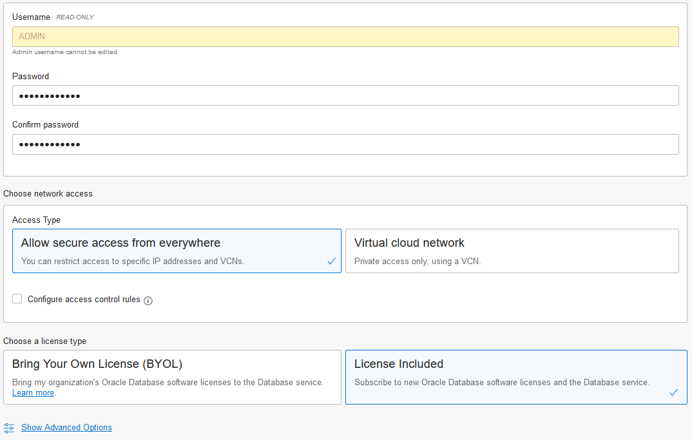

6. Click **Create Autonomous Database**.

  <if type=["freetier","alwaysfree"]>*Note: if Always Free resources are not available, you can try another region, or if you are using a Free Trial, deselect Always Free and try again.*</if>

8. Continue when the status changes from:

    

    to:

    

## **STEP 2**: Connect with SQL Developer Web

Although you can connect to your autonomous database using local PC desktop tools like Oracle SQL Developer, you can conveniently access the browser-based SQL Developer Web directly from your ADW or ATP console.

1. In your database's details page, click the **Tools** tab.

    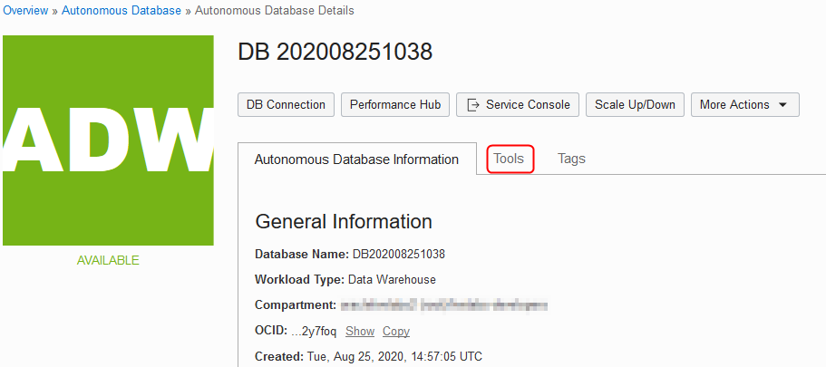

3.  The Tools page provides you access to SQL Developer Web, Oracle Application Express, Oracle ML User Administration, etc. In the SQL Developer Web box, click **Open SQL Developer Web**.

    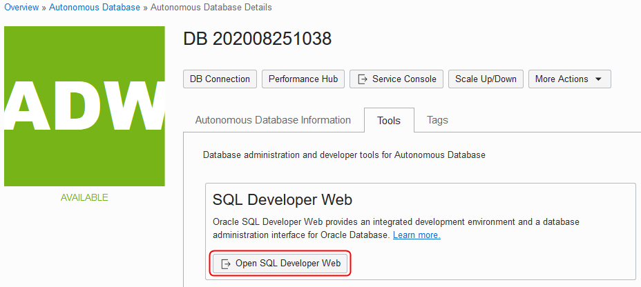

4.  A sign-in page opens for the SQL Developer Web. For this lab, simply use your database instance's default administrator account, **Username - ADMIN**, and with the admin **Password** you specified when creating the database. Click **Sign in**.

    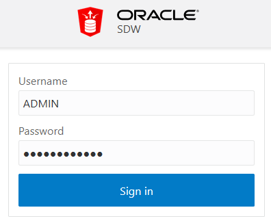

5.  SQL Developer Web opens on a worksheet tab. The first time you open the SQL Developer Web, a series of pop-up informational boxes introduce you to the main features.

    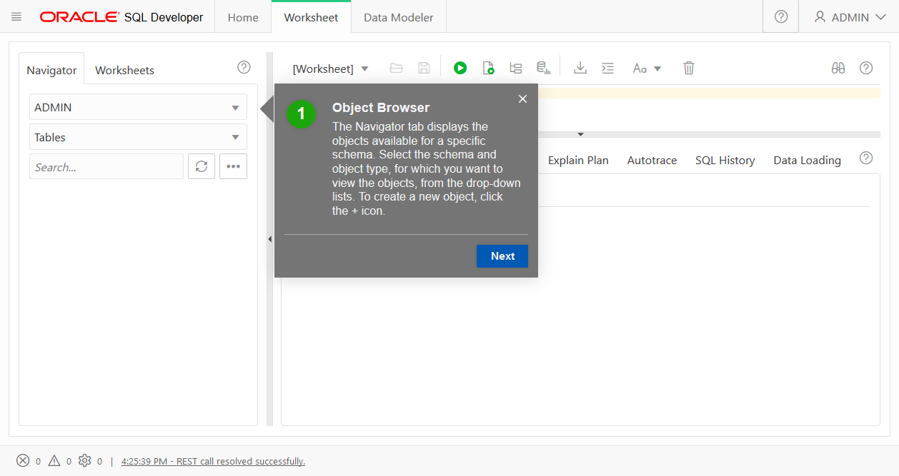

6. To execute a query, click the **Run Script** icon.

    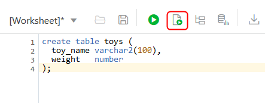

Please *proceed to the next lab*.

## Want to Learn More?

Click [here](https://docs.oracle.com/en/cloud/paas/autonomous-data-warehouse-cloud/user/autonomous-workflow.html#GUID-5780368D-6D40-475C-8DEB-DBA14BA675C3) for documentation on the typical workflow for using Autonomous Data Warehouse.

## **Acknowledgements**

- **Author** - Tom McGinn, Database Product Manager
- **Last Updated By/Date** - Tom McGinn, August 2020

## See an issue?
Please submit feedback using this [form](https://apexapps.oracle.com/pls/apex/f?p=133:1:::::P1_FEEDBACK:1). Please include the *workshop name*, *lab* and *step* in your request.  If you don't see the workshop name listed, please enter it manually. If you would like us to follow up with you, enter your email in the *Feedback Comments* section.
