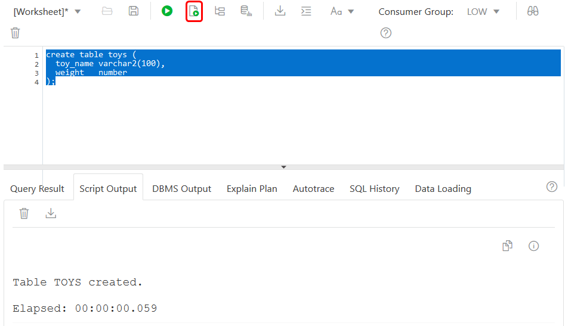
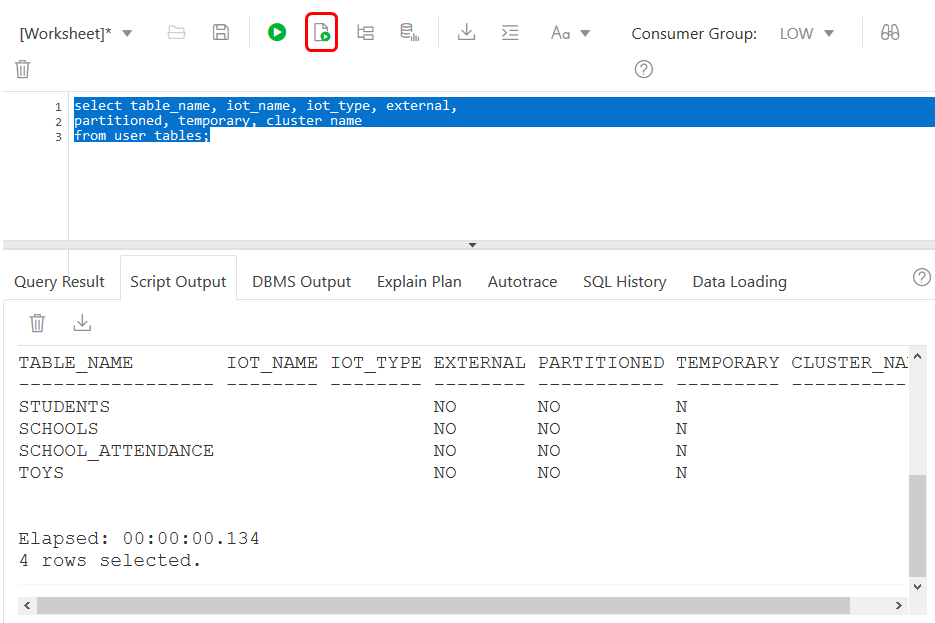

# Creating Tables: Databases for Developers

## Introduction

In this brief lab, you will create a variety of tables types using an Oracle Database.

Take a quick look at what this lab covers in this video:

[](youtube:x2NNIo6riUI)

### Objectives

* Create new tables
* Drop tables

## **STEP 1**: Creating a table

To create a table, you need to define three things:

* Its name
* Its columns
* The data types of these columns

The basic syntax to create a table is:

```
create table <table_name> (
  <column1_name> <data_type>,
  <column2_name> <data_type>,
  <column3_name> <data_type>,
  ...
)
```
1. Using SQL Developer Web, create a table to store the names and weights of toys:

    ```
    <copy>create table toys (
      toy_name varchar2(100),
      weight   number
    );</copy>
    ```

    

2. Viewing Table Information

    The data dictionary stores information about your database. You can query this to see which tables it contains. There are three key views with this information:

    - user_tables - all tables owned by the current database user
    - all_tables - all tables your database user has access to
    - dba_tables - all tables in the database. Only available if you have DBA privileges

    The following query will show you the toys table you created in the previous step:

    ```
    <copy>select table_name, iot_name, iot_type, external,
    partitioned, temporary, cluster_name
    from user_tables;</copy>
    ```

    The other columns display details of the properties of each table.

    

3. **Try It!**

    Complete the following statement to create a table to store the following details about bricks:

    - Colour
    - Shape

    Use the data type varchar2(10) for both columns.

    ```
    <copy>create table bricks (
    /*TODO*/
    );

    select table_name
    from   user_tables
    where  table_name = 'BRICKS';</copy>
    ```

## **STEP 2:** Table Organization

1. Create table in Oracle Database has an organization clause. This defines how it physically stores rows in the table.

    The options for this are:

    - Heap
    - Index
    - External

    By default, tables are heap-organized. This means the database is free to store rows wherever there is space. You can add the "organization heap" clause if you want to be explicit:

    ```
    <copy>create table toys_heap (
      toy_name varchar2(100)
    ) organization heap;

    select table_name, iot_name, iot_type, external,
           partitioned, temporary, cluster_name
    from   user_tables
    where  table_name = 'TOYS_HEAP';</copy>
    ```

2. Index-Organized Tables

    Unlike a heap table, an index-organized table (IOT) imposes order on the rows within it. It physically stores rows sorted by its primary key. To create an IOT, you need to:

    - Specify a primary key for the table
    - Add the organization index clause at the end

    For example:

    ```
    <copy>create table toys_iot (
      toy_id   integer primary key,
      toy_name varchar2(100)
    ) organization index;</copy>
    ```

    You can find IOT in the data dictionary by looking at the column IOT_TYPE. This will return IOT if the table is index-organized:

    ```
    <copy>select table_name, iot_type
    from   user_tables
    where  table_name = 'TOYS_IOT';</copy>
    ```

3. **Try It!**

    Complete the following statement to create the index-organized table `bricks_iot`:

    ```
    <copy>create table bricks_iot (
      bricks_id integer primary key
    ) /*TODO*/;

    select table_name, iot_type
    from   user_tables
    where  table_name = 'BRICKS_IOT';</copy>
    ```

    The query afterwards should return the following row:

    ```
    TABLE_NAME   IOT_TYPE
    ----------   --------
    BRICKS_IOT   IOT
    ```

## **STEP 3**: Other Table Types

1. Temporary Tables

    Temporary tables store session specific data. Only the session that adds the rows can see them. This can be handy to store working data.

    There are two types of temporary table in Oracle Database: global and private.

    **Global Temporary Tables**

    To create a global temporary table add the clause "global temporary" between create and table. For example:

    ```
    <copy>create global temporary table toys_gtt (
    toy_name varchar2(100)
    );</copy>
    ```

    The definition of the temporary table is permanent. All users of the database can access it. But only your session can view rows you insert.

    **Private Temporary Tables**

    Starting in Oracle Database 18c, you can create private temporary tables. These tables are only visible in your session. Other sessions can't see the table!

    To create one use "private temporary" between create and table. You must also prefix the table name with `ora$ptt_`:

    ```
    <copy>create private temporary table ora$ptt_toys (
      toy_name varchar2(100)
    );</copy>
    ```

    For both temporary table types, by default the rows disappear when you end your transaction. You can change this to when your session ends with the "on commit" clause.

    But either way, no one else can view the rows. Ensure you copy data you need to permanent tables before your session ends!
    Viewing Temporary Table Details

    The column temporary in the `*_tables` views tell you which tables are temporary:

    ```
    <copy>select table_name, temporary
    from   user_tables
    where  table_name in ( 'TOYS_GTT', 'ORA$PTT_TOYS' );</copy>
    ```

    Note that you can only see a row for the global temporary table. The database doesn't write private temporary tables to the data dictionary!

2. Partitioning Tables

    Partitioning logically splits up a table into smaller tables according to the partition column(s). So rows with the same partition key are stored in the same physical location.

    There are three types of partitioning available:

      - Range
      - List
      - Hash

    To create a partitioned table, you need to:

      - Choose a partition method
      - State the partition columns
      - Define the initial partitions

    The following statements create one table for each partitioning type:

    ```
    <copy>create table toys_range (
      toy_name varchar2(100)
    ) partition by range ( toy_name ) (
      partition p0 values less than ('b'),
      partition p1 values less than ('c')
    );

    create table toys_list (
      toy_name varchar2(100)
    ) partition by list ( toy_name ) (
      partition p0 values ('Sir Stripypants'),
      partition p1 values ('Miss Snuggles')
    );

    create table toys_hash (
      toy_name varchar2(100)
    ) partition by hash ( toy_name ) partitions 4;</copy>
    ```

    By default a partitioned table is heap-organized. But you can combine partitioning with some other properties. For example, you can have a partitioned IOT:

    ```
    <copy>create table toys_part_iot (
      toy_id   integer primary key,
      toy_name varchar2(100)
    ) organization index
      partition by hash ( toy_id ) partitions 4;</copy>
    ```

    The database sets the partitioned column of `*_tables` to YES if the table is partitioned. You can view details about the partitions in the `*_tab_partitions` tables:

    ```
    <copy>select table_name, partitioned
    from   user_tables
    where  table_name in ( 'TOYS_HASH', 'TOYS_LIST', 'TOYS_RANGE', 'TOYS_PART_IOT' );

    select table_name, partition_name
    from   user_tab_partitions;</copy>
    ```

    Note that partitioning is a separately licensable option of Oracle Database. Ensure you have this option before using it!

3. **Try it!**

    Complete the following statement to create a hash-partitioned table. This should be partitioned on `brick_id` and have 8 partitions:

    ```
    <copy>create table bricks_hash (
      brick_id integer
    ) partition by /*TODO*/;

    select table_name, partitioned
    from   user_tables
    where  table_name = 'BRICKS_HASH';</copy>
    ```

    The query should return the following row:

    ```
    TABLE_NAME    PARTITIONED   
    -----------   -----------
    BRICKS_HASH   YES  
    ```

## **STEP 4**: Table Clusters and Dropping Tables

1. Table Clusters

    A table cluster can store rows from many tables in the same physical location. To do this, first you must create the cluster:

    ```
    <copy>create cluster toy_cluster (
      toy_name varchar2(100)
    );</copy>
    ```

    Then place your tables in it using the cluster clause of create table:

    ```
    <copy>create table toys_cluster_tab (
      toy_name varchar2(100)
    ) cluster toy_cluster ( toy_name );

    create table toy_owners_cluster_tab (
      owner    varchar2(20),
      toy_name varchar2(100)
    ) cluster toy_cluster ( toy_name );</copy>
    ```

    Rows that have the same value for toy\_name in toys\_clus\_tab and toy\_owners\_clus\_tab will be in the same place. This can make it faster to get a row for a given toy\_name from both tables.

    You can view details of clusters by querying the `*_clusters` views. If a table is in a cluster, cluster\_name of `*_tables` tells you which cluster it is in:

    ```
    <copy>select cluster_name from user_clusters;

    select table_name, cluster_name
    from   user_tables
    where  table_name in ( 'TOYS_CLUSTER_TAB', 'TOY_OWNERS_CLUSTER_TAB' );</copy>
    ```

    Note: Clustering tables is an advanced topic. They have some restrictions. So make sure you read up on these before you use them!

2. Dropping Tables

    You can remove existing tables with the drop table command. Just add the name of the table you want to destroy:

    ```
    <copy>select table_name
    from   user_tables
    where  table_name = 'TOYS_HEAP';

    drop table toys_heap;

    select table_name
    from   user_tables
    where  table_name = 'TOYS_HEAP';</copy>
    ```

    Once you've dropped a table you can't access it. So take care with this command!

3. **Try It!**

    Complete the following statement to drop the toys table:

    ```
    <copy>drop table /*TODO*/ ;

    select table_name
    from   user_tables
    where  table_name = 'TOYS';</copy>
    ```

    The query afterwards should return no rows.

## Learn More
* [How to Create, Alter, and Drop Tables in SQL](https://blogs.oracle.com/sql/how-to-create-alter-and-drop-tables-in-sql)
* [Create Table Syntax (Oracle Database documentation)](http://www.oracle.com/pls/topic/lookup?ctx=dblatest&id=SQLRF01402)
* [Tables and Table Clusters Database Concepts Guide](http://www.oracle.com/pls/topic/lookup?ctx=dblatest&id=GUID-096986C4-9AD7-401D-BA6D-EF6CD4B494FE)

## Acknowledgements
* **Author** - Chris Saxon, Senior Developer Advocate, Database Tools
* **Adapted for Cloud by** -  Tom McGinn, Database Product Manager
* **Last Updated By/Date** - Tom McGinn, August 2020

## See an issue?
Please submit feedback using this [form](https://apexapps.oracle.com/pls/apex/f?p=133:1:::::P1_FEEDBACK:1). Please include the *workshop name*, *lab* and *step* in your request.  If you don't see the workshop name listed, please enter it manually. If you would like for us to follow up with you, enter your email in the *Feedback Comments* section.
