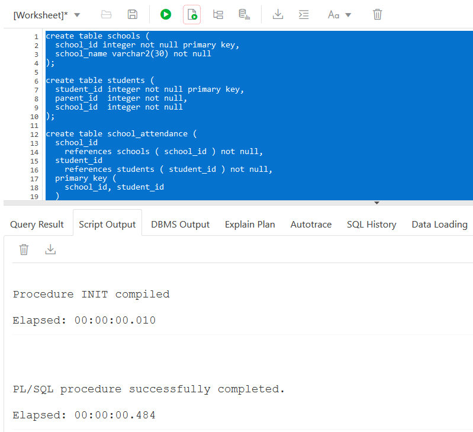

# How to Find Slow SQL: Databases for Developers

## Introduction

In this brief lab, you will get an overview of the profiling tools SQL trace and the PL/SQL hierarchical profiler.

The tutorials in this series so far have focused on tuning a single SQL statement. But often you need to do analysis to find what the slowest SQL is!

To do this, you should profile the code that is running when "the database is slow". This captures SQL execution details for the session that runs the statements the customer is complaining about.

This lab introduces the tools in Oracle Database to help you profile SQL and PL/SQL execution.

Take a quick look at what this lab covers in this video:

[](youtube:BgErjxCizlQ)

### Objectives

* one
* two

## **STEP 1**: Prerequisite: Create tables and load data

Copy, paste and execute this SQL in your SQL Developer window:

```
<copy>create table schools (
  school_id integer not null primary key,
  school_name varchar2(30) not null
);

create table students (
  student_id integer not null primary key,
  parent_id  integer not null,
  school_id  integer not null
);

create table school_attendance (
  school_id  
    references schools ( school_id ) not null,
  student_id
    references students ( student_id ) not null,
  primary key (
    school_id, student_id
  )
);

create or replace procedure init as
  num_students constant pls_integer := 5000;
begin
  delete school_attendance;
  delete schools;
  delete students;

  insert into students
    with rws as (
      select level student_id,
             mod ( level, ( num_students / 2 ) ) + 1 parent_id,
             mod ( level, 5 ) + 1 school_id
      from   dual
      connect by level <= num_students
    )
      select * from rws;

  insert into schools values ( 1, 'Java Junior' );
  insert into schools values ( 2, 'Haskell High' );
  insert into schools values ( 3, 'SQL School' );
  insert into schools values ( 4, 'C College' );
  insert into schools values ( 5, 'Ada Academy' );

  commit;

end init;
/

exec init();</copy>
```



## **STEP 2:** Tracing

1. Create Procedures to Trace

    Create this procedure to add student attendance entries for schools:

    ```
    <copy>create or replace procedure drop_off_students (
      school integer
    ) as
      att_count pls_integer;
    begin
      for studs in (
        select student_id
        from   students
        where  school_id = school
      ) loop
        select count (*) into att_count
        from   school_attendance
        where  student_id = studs.student_id
        and    school_id = school;
        if att_count = 0 then
          insert into school_attendance ( student_id, school_id )
            values ( studs.student_id, school );
        end if;
      end loop;
    end drop_off_students;
    /

    create or replace procedure start_school as
    begin
      for s in (
        select school_id from schools
      ) loop
        drop_off_students ( s.school_id );
      end loop;
    end start_school;
    /</copy>
    ```
2. Tracing SQL Execution

    To capture SQL execution details for all statements in a session, you can run a SQL trace. Do this with `DBMS_monitor.session_trace_enable`:

    ```
    <copy>exec sys.dbms_monitor.session_trace_enable ( waits => true, binds => true );

    exec start_school ();

    exec sys.dbms_monitor.session_trace_disable ();</copy>
    ```

    This creates a trace file on the database server. You can also use this to capture execution details for other sessions.

3. Accessing SQL Trace Files

    Once you've traced a session, you need to get the log file. This is on the database server. But it's rare you'll have access to this!

    To overcome this, you can query a trace file using `V$DIAG_TRACE_FILE_CONTENTS`. This enables you to read the file using SQL. Export the table to a local file using spool or similar so you can analyze the trace:

    ```
    <copy>set serveroutput off
    set pagesize 0
    set echo off
    set feedback off
    set trimspool on
    set heading off
    set tab off

    spool c:\temp\trace-file.trc
    select payload
    from   v$diag_trace_file_contents
    where  trace_filename = (
        select substr (
               value,
               instr ( value, '/', -1 ) + 1
             ) filename
      from   v$diag_info
      where  name = 'Default Trace File'
    )
    order  by line_number;
    spool off</copy>
    ```

4. Formatting SQL Trace Files

    A raw trace file is hard to read. To get it in a better format, the command line tool TKPROF parses the file.

    The basic syntax for TKPROF is:

    `tkprof trace_file_name.trc output_filename.txt`

    You run TKPROF from the operating system command line, it's NOT a SQL statement!

    In the file you'll see each SQL command, its run time stats and execution plan. For example, the formatted trace file captured by the process in Tracing SQL Execution will include these statements:

    ```
    SQL ID: akvmgkngc3u8t Plan Hash: 1674119367

    SELECT COUNT (*)
    FROM
     SCHOOL_ATTENDANCE WHERE STUDENT_ID = :B2 AND SCHOOL_ID = :B1


    call     count       cpu    elapsed       disk      query    current        rows
    ------- ------  -------- ---------- ---------- ---------- ----------  ----------
    Parse        1      0.00       0.00          0          0          0           0
    Execute  10000      1.84       2.23          0          0          1           0
    Fetch    10000      0.13       0.13          0      19559          0       10000
    ------- ------  -------- ---------- ---------- ---------- ----------  ----------
    total    20001      1.97       2.37          0      19559          1       10000

    Misses in library cache during parse: 1
    Misses in library cache during execute: 2
    Optimizer mode: ALL_ROWS
    Parsing user id: 107     (recursive depth: 1)
    Number of plan statistics captured: 1

    Rows (1st) Rows (avg) Rows (max)  Row Source Operation
    ---------- ---------- ----------  ---------------------------------------------------
             1          1          1  SORT AGGREGATE (cr=0 pr=0 pw=0 time=11 us starts=1)
             0          0          0   INDEX UNIQUE SCAN SYS_C0013583 (cr=0 pr=0 pw=0 time=3 us starts=1 cost=1 size=26 card=1)(object id 82226)

    ********************************************************************************

    SQL ID: 3zdbqjbhkhbjn Plan Hash: 0

    INSERT INTO SCHOOL_ATTENDANCE ( STUDENT_ID, SCHOOL_ID )
    VALUES
     ( :B2 , :B1 )


    call     count       cpu    elapsed       disk      query    current        rows
    ------- ------  -------- ---------- ---------- ---------- ----------  ----------
    Parse        1      0.00       0.00          0          0          0           0
    Execute  10000      3.79       4.07          0        422      61525       10000
    Fetch        0      0.00       0.00          0          0          0           0
    ------- ------  -------- ---------- ---------- ---------- ----------  ----------
    total    10001      3.79       4.07          0        422      61525       10000

    Misses in library cache during parse: 1
    Misses in library cache during execute: 1
    Optimizer mode: ALL_ROWS
    Parsing user id: 107     (recursive depth: 1)
    Number of plan statistics captured: 1

    Rows (1st) Rows (avg) Rows (max)  Row Source Operation
    ---------- ---------- ----------  ---------------------------------------------------
             0          0          0  LOAD TABLE CONVENTIONAL  SCHOOL_ATTENDANCE (cr=5 pr=0 pw=0 time=759 us starts=1)
    ```

    This shows you that:

      - Both the SELECT and INSERT were executed 10,000 times (count execute)
      - The SELECT ran for 2.37 seconds (total elapsed)
      - The INSERT ran for 4.07 seconds (total elapsed)
      - Both statements processed an average of one row per execution or fetch (10,000 in the rows column / 10,000 in fetch or execute)

    You can also see the execution plan for the statements. The query did an INDEX UNIQUE SCAN. The stats reported are for one execution.

      - **cr** = consistent reads
      - **pr** = physical reads
      - **pw** = physical writes
      - **time** = duration in microseconds (cumulative)
      - **starts** = number of times this step was executed

    Given this analysis, what would you suggest to make this process faster?

    TKPROF is included in the client tools for Oracle Database. You can also open a trace file in Oracle SQL Developer to get it in a readable format.

## **STEP 3**: Profiling

1. Profiling PL/SQL Code

    SQL is just part of each process. There will also be some non-SQL code to call the statement, process its results, etc. In some cases the application code may take longer than the SQL!

    So when performance tuning, it's important you profile all the code. Exactly how you do this depends on the programming language you're using. For PL/SQL code, you can use the hierarchical profiler.

    This uses DBMS_HProf to capture execution details. Do this by calling:

      - `dbms_hprof.start_profiling` to start the profile
      - the PL/SQL procedure you want to profile
      - `dbms_hprof.stop_profiling` to end the run

    This snippet outlines how to do this:

    ```
    <copy>truncate table school_attendance;

    exec dbms_hprof.create_tables ( true );
    declare
      run pls_integer;
    begin

      run := dbms_hprof.start_profiling ();

      start_school ();

      dbms_hprof.stop_profiling;
      dbms_output.put_line ( run );
    end;
    /</copy>
    ```

2. Saving PL/SQL Profile Details

    To analyze the profile and persist it to database tables, run:

    ```
    <copy>declare
      analysis_id pls_integer;
    begin
      analysis_id := dbms_hprof.analyze ( 1, run_comment => 'Test run' );
    end;
    /</copy>
    ```

    This stores the execution breakdown in these tables:

    ```
    <copy>select * from dbmshp_function_info;
    select * from dbmshp_parent_child_info;</copy>
    ```

    To view the hierarchy, you need to use a hierarchical query! This view saves this query and adds formatting to make the results easier to understand:

    ```
    <copy>create or replace view execution_stats as
    with execution_stats as (
      select fi.runid,
             fi.symbolid,
             pci.parentsymid,
             rtrim(fi.module || '.' || nullif(fi.function,fi.module), '.') as unit,
             nvl(pci.subtree_elapsed_time, fi.subtree_elapsed_time) as subtree_elapsed_time,
             nvl(pci.function_elapsed_time, fi.function_elapsed_time) as function_elapsed_time,
             fi.line#,
             nvl(pci.calls, fi.calls) as calls,
             namespace,
             sql_id,
             sql_text
      from   dbmshp_function_info fi
      left join dbmshp_parent_child_info pci
      on     fi.runid = pci.runid
      and    fi.symbolid = pci.childsymid
      where  fi.module != 'DBMS_HPROF'
    ), execution_tree as (
      select runid,
             rpad(' ', (level-1)*2, ' ') || unit as unit,
             line#,
             subtree_elapsed_time,
             function_elapsed_time,
             calls,
             namespace,
             sql_id,
             sql_text
      from   execution_stats
      start with parentsymid is null
      connect by parentsymid = prior symbolid
      and runid = prior runid
    )
      select * from execution_tree;</copy>
    ```

3. Viewing PL/SQL Profiles

    Querying this view returns the execution details:

    ```
    <copy>select * from execution_stats;</copy>
    ```

    The key columns to review are:

      - **SUBTREE\_ELAPSED\_TIME** - total time for this procedure, including the child procedures it calls
      - **FUNCTION\_ELAPSED\_TIME** - the duration of this procedure, excluding its children
      - **CALLS** - how many times this procedure executed

    If the code is a SQL statement, the profiler will populate the SQL_ID and SQL_TEXT columns. You can also use the NAMESPACE to filter either SQL or PL/SQL execution stats.

    To find the parts that run the longest, sort by the FUNCTION\_ELAPSED\_TIME descending:

    ```
    <copy>select unit, function_elapsed_time, calls, sql_text
    from   execution_stats
    order  by function_elapsed_time desc;</copy>
    ```

    Once you've found the slowest parts of the program, you can find ways to make it faster. In this example, the INSERT and SELECT COUNT(*) take the longest, accounting for 90% of the program's runtime. These statements are executed thousands of times each, a sign that you can make gains by reducing the number of calls to these statements.

4. Try It Challenge!

    Using what you've learned in this course and the results of the PL/SQL profile captured above, change the tables and `start_school` procedure to make it faster:

    ```
    <copy>create or replace procedure drop_off_students (
      school integer
    ) as
      att_count pls_integer;
    begin
      for studs in (
        select student_id
        from   students
        where  school_id = school
      ) loop
        select count (*) into att_count
        from   school_attendance
        where  student_id = studs.student_id
        and    school_id = school;
        if att_count = 0 then
          insert into school_attendance ( student_id, school_id )
            values ( studs.student_id, school );
        end if;
      end loop;
    end drop_off_students;
    /

    create or replace procedure start_school as
    begin
      for s in (
        select school_id from schools
      ) loop
        drop_off_students ( s.school_id );
      end loop;
    end start_school;
    /</copy>
    ```

    Once you've made your changes, profile `start_school` again to see what difference they make:

    ```
    <copy>alter session set statistics_level = all;

    declare
      run pls_integer;
      analysis_id pls_integer;
    begin
      dbms_hprof.create_tables ( true );
      execute immediate
        'truncate table school_attendance';

      run := dbms_hprof.start_profiling ();

      start_school ();

      dbms_hprof.stop_profiling;
      dbms_output.put_line ( run );

      analysis_id := dbms_hprof.analyze ( run, run_comment => 'Test run' );
    end;
    /

    select unit, function_elapsed_time, calls, sql_text
    from   execution_stats
    order  by function_elapsed_time desc;</copy>
    ```

    You may hit space limits (ORA-01536: space quota exceeded) when running this. If you do, run the profiler a second time. This should resolve the issue.

    How fast can you get this procedure to execute?


## Learn More
* [How to Create an Execution Plan: TKPROF](https://blogs.oracle.com/sql/how-to-create-an-execution-plan#tkprof)
* [PL/SQL Hierarchical Profiler in Oracle Database 11g Release 1)](https://oracle-base.com/articles/11g/plsql-hierarchical-profiler-11gr1)

## Acknowledgements
* **Author** - Chris Saxon, Senior Developer Advocate, Database Tools
* **Adapted for Cloud by** -  Tom McGinn, Database Product Manager
* **Last Updated By/Date** - Tom McGinn, August 2020

## See an issue?
Please submit feedback using this [form](https://apexapps.oracle.com/pls/apex/f?p=133:1:::::P1_FEEDBACK:1). Please include the *workshop name*, *lab* and *step* in your request.  If you don't see the workshop name listed, please enter it manually. If you would like us to follow up with you, enter your email in the *Feedback Comments* section.
