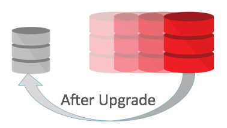
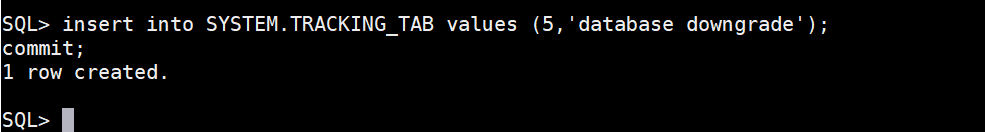
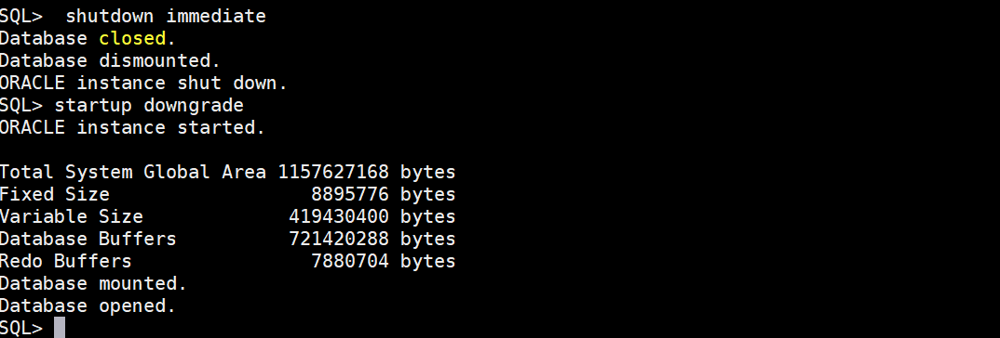
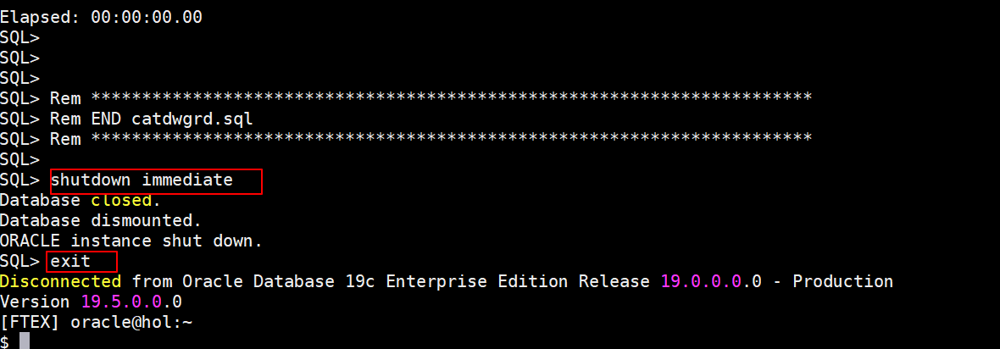
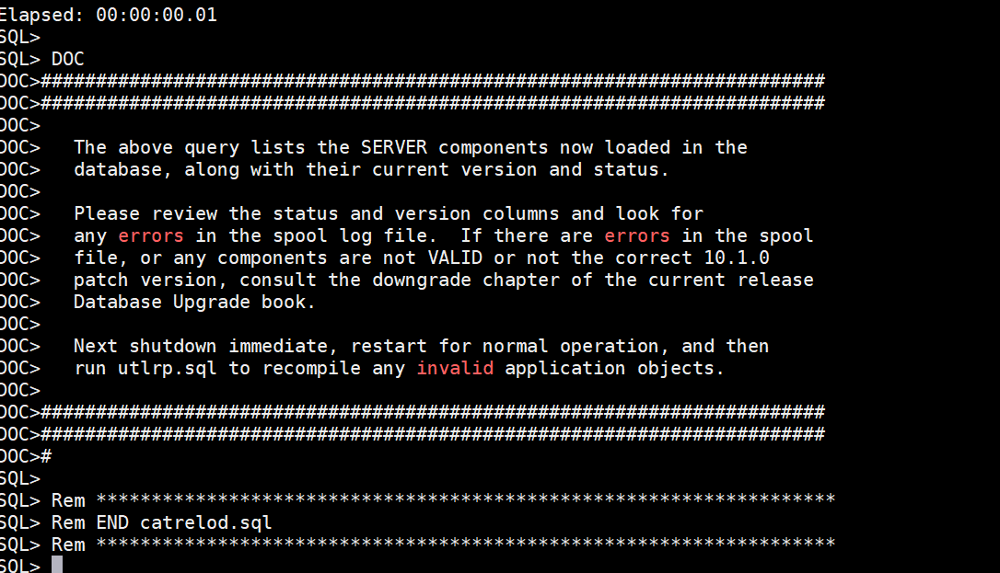
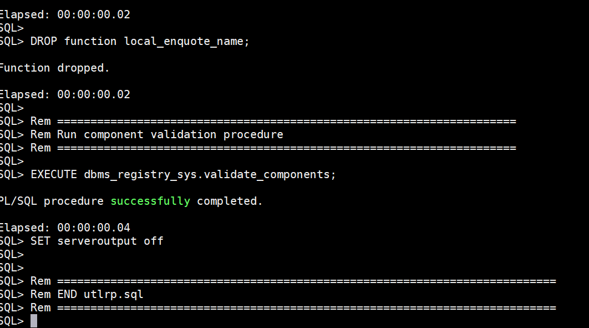

# Fallback Strategies

## Introduction

In this lab, you will use two techniques to protect your database, but this time for issues happening after the upgrade. You can call this “Downgrade“.

*Estimated Lab Time*: 30 minutes



### About Fallback Strategies

You will have to protect your environment for issues during, and after the upgrade. You will also have to consider and maintain the Service Level Agreements about fallback requirements in seconds, minutes, hours or days. In addition to the above, it is very important to be aware that some of the fallback strategies will not allow you to change COMPATIBLE. This means, you will need extra downtime to change COMPATIBLE later as it requires a restart of the database(s).

The minimum COMPATIBLE setting in Oracle Database 19c is “11.0.0“. Keep COMPATIBLE at 3 digits. The default COMPATIBLE setting in Oracle Database 19c is “19.0.0".

We will not cover RMAN Online Backups as we assume that everybody is doing RMAN backups anyways. And we will not cover Oracle GoldenGate as this would go beyond the lab possibilities. We may cover this at a later stage.

### Objectives
In this lab, you will:
* Downgrade with a Full Database Export and Import
* Downgrade with the downgrade scripts

### Prerequisites
This lab assumes you have:
- A Free Tier, Paid or LiveLabs Oracle Cloud account
- SSH Private Key to access the host via SSH
- You have completed:
    - Lab: Generate SSH Keys (*Free-tier* and *Paid Tenants* only)
    - Lab: Prepare Setup (*Free-tier* and *Paid Tenants* only)
    - Lab: Environment Setup
		- Lab: Initialize Environment

## **STEP 1**: Downgrade with a Full Database Export and Import

1. For this part you will start the export from the 19c database after upgrading.

    Run the full database export:
    ````
    <copy>
    . ftex19
    sqlplus / as sysdba
    </copy>
    ````
    
    ````
    <copy>
    insert into SYSTEM.TRACKING_TAB values (4,'full export downgrade');
    commit;
    select * from TRACKING_TAB;
    exit
    </copy>
    ````
    

    ````
    <copy>
    expdp system/oracle DIRECTORY=EXP18 DUMPFILE=down.dmp LOGFILE=down.log VERSION=12.2 FULL=Y REUSE_DUMPFILES=Y EXCLUDE=STATISTICS LOGTIME=ALL
    </copy>
    ````
 
    

       

2. The important point is that the VERSION parameter tells Data Pump to create an export in the format ,a “VERSION” of the database that it will understand.
    In this case you will downgrade into a 12.2 Pluggable Database. You need to create the PDB first.
    
    ````
    <copy>
    . cdb1
    sqlplus / as sysdba
    </copy>
    ````


    ````
    <copy>
    startup
    create pluggable database PDB3 admin user adm identified by adm file_name_convert=('pdbseed','pdb3');
    </copy>
    ````


    ````
    <copy>
    alter pluggable database PDB3 open;
    create directory IMP19 as '/home/oracle/IMP';
    grant read, write on directory IMP19 to public;
    exit
    </copy>
    ````


    ````
    <copy>
    impdp system/oracle@PDB3 DIRECTORY=IMP19 DUMPFILE=down.dmp LOGFILE=impdown.log LOGTIME=ALL
    </copy>
    ````


    This was a quick exercise.It would definitely take longer as your database contains more data and objects.LOB data types can be crucial.

## **STEP 2**: Downgrade with the downgrade scripts

1. **HOL 19c - Fallback - Issues After Upgrade**. In this final exercise you will use a powerful technique- the database downgrade with downgrade scripts.
    
    Set a marker in the database

    ````
    <copy>
    . ftex19
    sqlplus / as sysdba
    </copy>
    ````


    ````
    <copy>
    insert into SYSTEM.TRACKING_TAB values (5,'database downgrade');
    commit;
    </copy>
    ````


2. Run the downgrade script.

    ````
    <copy>
    shutdown immediate
    startup downgrade
    set echo on termout on serveroutput on timing on
    spool /home/oracle/logs/downgrade.log
    </copy>
    ````


    ````
    <copy>
    @?/rdbms/admin/catdwgrd.sql
    shutdown immediate
    exit
    </copy>
    ````


3. Switch to the source environment and start he bootstrap reload script.
    
    ````
    <copy>
    . ftex
    sqlplus / as sysdba
    </copy>
    ````


    ````
    <copy>
    startup upgrade
    set echo on termout on timing on
    spool /home/oracle/logs/relod.log
    </copy>
    ````


    ````
    <copy>
    @?/rdbms/admin/catrelod.sql
    shutdown immediate
    </copy>
    ````


4. Final steps and checks.

    ````
    <copy>
    startup
    @?/rdbms/admin/utlrp.sql
    </copy>
    ````

    ````
    <copy>
    select * from TRACKING_TAB;
    select count(*) from DBA_OBJECTS where STATUS=’INVALID’;
    select COMP_ID, STATUS from DBA_REGISTRY order by COMP_ID;
    </copy>
    ````


    The downgrade should have removed the XDB component as well. Did it?


You may now [proceed to the next lab](#next).

## Acknowledgements
* **Author** - Mike Dietrich, Database Product Management
* **Contributors** -  Roy Swonger, Sanjay Rupprel, Cristian Speranta
* **Last Updated By/Date** - Kay Malcolm, February 2021
