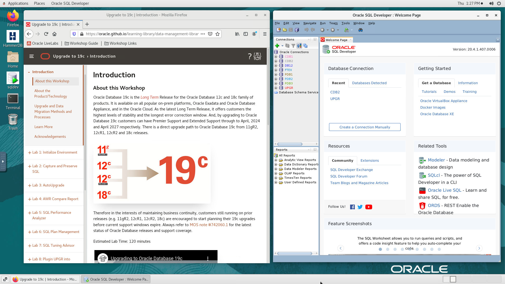

# Initialize Environment

## Introduction

In this lab we will review and startup all components required to successfully run this workshop.

*Estimated Lab Time:* 10 Minutes.

### Objectives
- Initialize the workshop environment.

### Prerequisites
This lab assumes you have:
- A Free Tier, Paid or LiveLabs Oracle Cloud account
- SSH Private Key to access the host via SSH
- You have completed:
    - Lab: Generate SSH Keys (*Free-tier* and *Paid Tenants* only)
    - Lab: Prepare Setup (*Free-tier* and *Paid Tenants* only)
    - Lab: Environment Setup

## **STEP 1:** Validate That Required Processes are Up and Running.
1. Now with access to your remote desktop session, proceed as indicated below to validate your environment before you start executing the subsequent labs. The following Processes should be up and running:

    - Database Listener
    - Database Server
    - Oracle SQL Developer

2. Confirm successful login. Please note that it takes about 5 minutes after instance provisioning for all processes to fully start.

    The host is preconfigured to automatically start a database listener and 4 databases upon startup.
    

3. On the connection panel on the left, click the *+* sign next to each of the following databases to confirm that you can connect.
    - UPGR
    - FTEX
    - DB12
    - CDB2

    

4. Launch the Terminal as "Oracle" User.
    
    If successful, the page above is displayed and as a result your environment is now ready.  

    You may now [proceed to the next lab](#next).

5. If you are still unable to access SQL developer as per the instruction given above then open a terminal session and proceed as indicated below to validate the services.

    - Database and Listener
    ```
    <copy>
    systemctl status oracle-databps -ef|grep LISTENER|grep -v grep
    ps -ef|grep ora_|grep pmon|grep -v grep
    systemctl status oracle-database
    </copy>
    ```
    
    
    

    <!--  -->

    <!-- - WLS Admin Server, Veridata Server, and Veridata Agent
    ```
    <copy>
    systemctl status oracle-veridata
    </copy>
    ```

     -->

6. If you see questionable output(s), failure or down component(s), restart the corresponding service(s) accordingly

    - Database and Listener
    ```
    <copy>
    systemctl restart oracle-database
    </copy>
    ```

    <!-- - WLS Admin Server, Veridata Server, and Veridata Agent
    ```
    <copy>
    systemctl restart oracle-veridata
    </copy>
    ``` -->

You may now [proceed to the next lab](#next).

## Appendix 1: Managing Startup Services

1. Database Service (Database and Listener).

    ```
    Start: <copy>systemctl start oracle-database</copy>
    ```
    ```
    Stop: <copy>systemctl stop oracle-database</copy>
    ```
    ```
    Status: <copy>systemctl status oracle-database</copy>
    ```
    ```
    Restart: <copy>systemctl restart oracle-database</copy>
    ```
<!-- 2. Veridata Service (WLS Admin Server, Veridata Server, and Veridata Agent)

    ```
    Start: <copy>systemctl start oracle-veridata</copy>
    ```
    ```
    Stop: <copy>systemctl stop oracle-veridata</copy>
    ```
    ```
    Status: <copy>systemctl status oracle-veridata</copy>
    ```
    ```
    Restart: <copy>systemctl restart oracle-veridata</copy>
    ``` -->

## Acknowledgements
* **Author** - Mike Dietrich, Database Product Management
* **Contributors** -  Roy Swonger, Kay Malcolm, Rene Fontcha
* **Last Updated By/Date** - Ashish Kumar, LiveLabs Platform , NA Technology, July 2021
