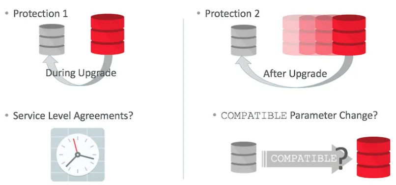

# Fallback Strategies

## Introduction

In this lab you will use two techniques to protect your database, but this time for issues happening after the upgrade. You can call this also “Downgrade“.

Estimated Lab Time: n minutes

### About Fallback Strategies

You will have to protect your environment for issues during, but also after the upgrade. And of course you’ll have to consider and maintain the Service Level Agreements about fallback requirements in seconds, minutes, hours or days. In addition it is very important to be aware that some of the fallback strategies won’t allow to change COMPATIBLE. This means, you will need extra downtime to change COMPATIBLE afterwards as it requires a restart of the database(s).

The minimum COMPATIBLE setting in Oracle Database 19c is “11.0.0“. Keep COMPATIBLE at 3 digits. The default COMPATIBLE setting in Oracle Database 19c is “19.0.0".

We won’t cover RMAN Online Backups as we assume that everybody is doing RMAN backups anyways. And we won’t cover Oracle GoldenGate as this would go beyond the lab possibilities. We may add this in a later stage.

### Objectives
In this lab, you will:
* Objective 1
* Objective 2
* Objective 3

### Prerequisites
This lab assumes you have:
- A Free Tier, Paid or LiveLabs Oracle Cloud account
- SSH Private Key to access the host via SSH
- You have completed:
    - Lab: Generate SSH Keys (*Free-tier* and *Paid Tenants* only)
    - Lab: Prepare Setup (*Free-tier* and *Paid Tenants* only)
    - Lab: Environment Setup
		- Lab: Initialize Environment

## **STEP 1**: Downgrade with a Full Database Export and Import

For this part you’ll just start the export from the 19c database after upgrading.

    Run the full database export:
    .

    . ftex19
    sqlplus / as sysdba

    insert into SYSTEM.TRACKING_TAB values (4,'full export downgrade');
    commit;
    select * from TRACKING_TAB;
    exit

    expdp system/oracle DIRECTORY=EXP18 DUMPFILE=down.dmp LOGFILE=down.log VERSION=12.2 FULL=Y REUSE_DUMPFILES=Y EXCLUDE=STATISTICS LOGTIME=ALL

    The important part is that the VERSION parameter tells Data Pump to create an export in the format a database of “VERSION” will understand.
    In this case you will downgrade into a 12.2 Pluggable Database. You need to create the PDB first.
    .

    . cdb1
    sqlplus / as sysdba

    startup
    create pluggable database PDB3 admin user adm identified by adm file_name_convert=('pdbseed','pdb3');
    alter pluggable database PDB3 open;
    create directory IMP18 as '/home/oracle/IMP';
    grant read, write on directory IMP18 to public;
    exit

    impdp system/oracle@PDB3 DIRECTORY=IMP18 DUMPFILE=down.dmp LOGFILE=impdown.log LOGTIME=ALL

This was a quick exercise. Of course it would take longer the more data and objects your database contains. Especially LOB data types can be crucial.

## **STEP 2**: Downgrade with the downgrade scripts

HOL 19c - Fallback - Issues After Upgrade

In this final exercise you’ll use a powerful technique, the database downgrade with downgrade scripts.

    Set a marker in the database
    .

    . ftex19
    sqlplus / as sysdba

    insert into SYSTEM.TRACKING_TAB values (5,'database downgrade');
    commit;
    Run the downgrade script
    .

    shutdown immediate
    startup downgrade
    set echo on termout on serveroutput on timing on
    spool /home/oracle/logs/downgrade.log
    @?/rdbms/admin/catdwgrd.sql
    shutdown immediate
    exit
    Switch to the source environment and start he bootstrap reload script
    .

    . ftex
    sqlplus / as sysdba

    startup upgrade
    set echo on termout on timing on
    spool /home/oracle/logs/relod.log
    @?/rdbms/admin/catrelod.sql
    shutdown immediate
    Final steps and checks
    .

    startup
    @?/rdbms/admin/utlrp.sql
    select * from TRACKING_TAB;
    select count(*) from DBA_OBJECTS where STATUS=’INVALID’;
    select COMP_ID, STATUS from DBA_REGISTRY order by COMP_ID;

    The downgrade should have removed the XDB component as well. Did it?

You can watch an entire database downgrade in this short video as well:

You may now [proceed to the next lab](#next).

## Learn More

*(optional - include links to docs, white papers, blogs, etc)*

* [URL text 1](http://docs.oracle.com)
* [URL text 2](http://docs.oracle.com)

## Acknowledgements
* **Author** - <Name, Title, Group>
* **Contributors** -  <Name, Group> -- optional
* **Last Updated By/Date** - <Name, Group, Month Year>
* **Workshop (or Lab) Expiry Date** - <Month Year> -- optional, use this when you are using a Pre-Authorized Request (PAR) URL to an object in Oracle Object Store.

## Need Help?
Please submit feedback or ask for help using our [LiveLabs Support Forum](https://community.oracle.com/tech/developers/categories/database-19c). Please click the **Log In** button and login using your Oracle Account. Click the **Ask A Question** button to the left to start a *New Discussion* or *Ask a Question*.  Please include your workshop name and lab name.  You can also include screenshots and attach files.  Engage directly with the author of the workshop.

If you do not have an Oracle Account, click [here](https://profile.oracle.com/myprofile/account/create-account.jspx) to create one.
