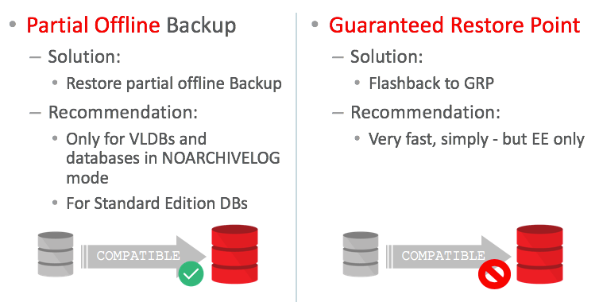
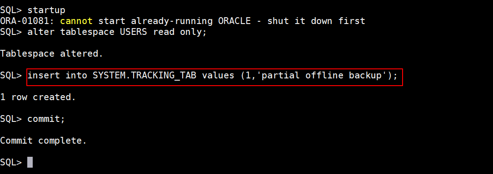
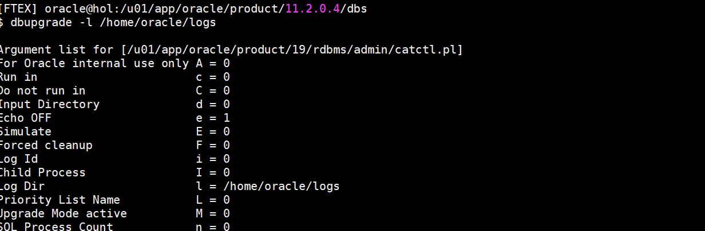
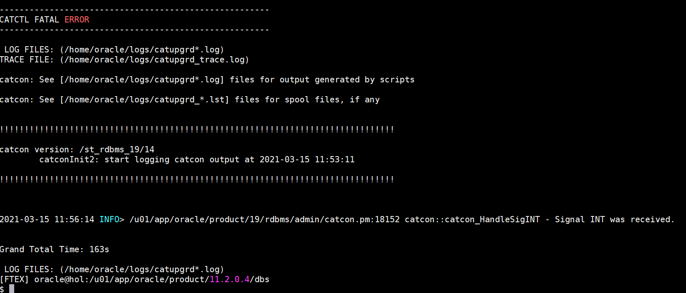
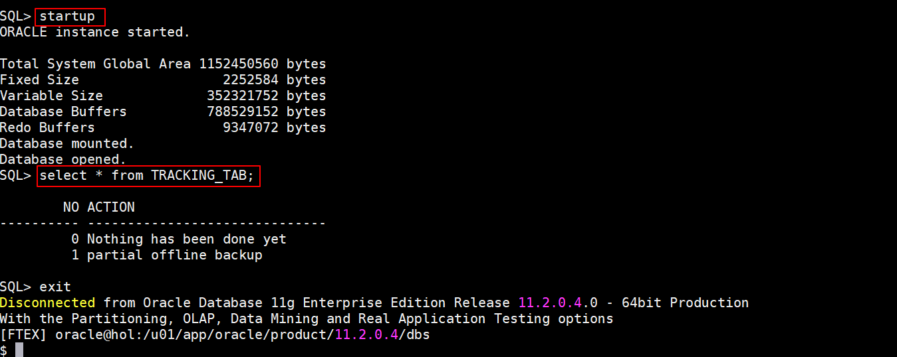
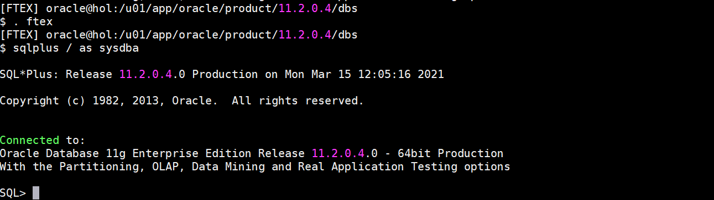
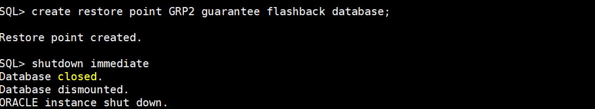
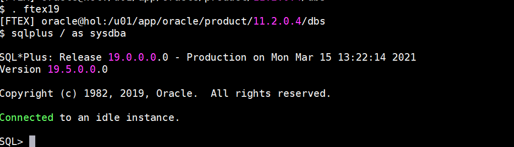
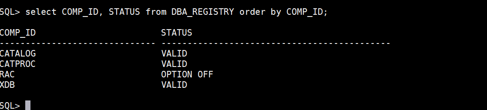
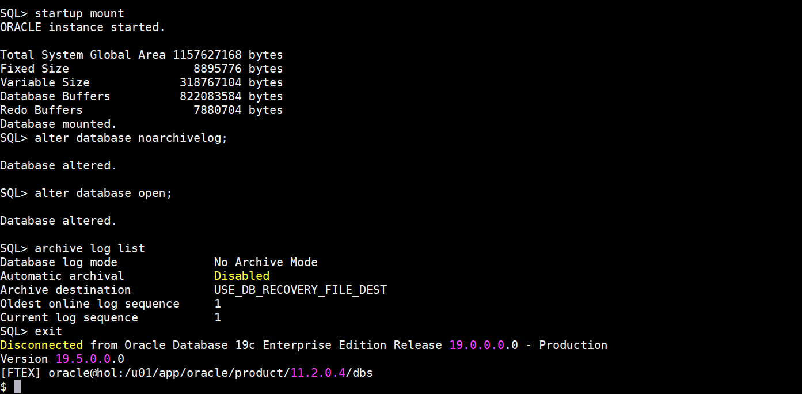

# Fallback Strategies

## Introduction

Protection for issues during upgradeHOL 19c - Fallback - Issues During the Upgrade

In this lab, you will use two techniques to protect your database for issues happening during the upgrade. Or simply, if you would like to test multiple times.
You will evaluate two options: Partial Offline Backups and Guaranteed Restore Points.



*Estimated Lab Time*: 40 minutes

### About Fallback Strategies

1. Partial Offline Backup
A partial offline backup is used for protection against failures during the upgrade or for testing purposes to avoid the restoration of an entire database environment. You can change the COMPATIBLE parameter if you want with this technique.It is not required to do it in the lab,as you will use two techniques in parallel.
    - Very large databases where restoring just a small piece of the database is faster than an entire restore.
    - Databases who are – on purpose – in NOARCHIVELOG mode, hence you are unable to do an online backup and restore.
    - Standard Edition databases where you cannot use Guaranteed Restore Points.
    
    For a Partial Offline Backup as fallback strategy, you’ll have to put all your user and data tablespaces into read-only mode, then create an offline backup of the “heart” of your database.

2. Flashback to a Guaranteed Restore Point
 By far the best and most simple technique to protect your databases are Guaranteed Restore Points. But it can only used when the following requirements are all met:
    - Database must be in ARCHIVELOG mode
    - Enterprise Edition database (or XE or PE)
    - Don not change COMPATIBLE
    This is the overview on how to fallback with a guaranteed restore point GRP1 which allows you to flashback your database – many times.


### Objectives
In this lab, you will perform:
* Partial Offline Backup
* Flashback to a Guaranteed Restore Point

### Prerequisites
This lab assumes you have:
- A Free Tier, Paid or LiveLabs Oracle Cloud account
- SSH Private Key to access the host via SSH
- You have completed:
    - Lab: Generate SSH Keys (*Free-tier* and *Paid Tenants* only)
    - Lab: Prepare Setup (*Free-tier* and *Paid Tenants* only)
    - Lab: Environment Setup
		- Lab: Initialize Environment

## **STEP 1**: Partial Offline Backup

1. At first, set the USERS tablespace read-only and then SHUTDOWN the database.

    Run the full database export:
    ````
    <copy>
    . ftex
    sqlplus / as sysdba
    </copy>
    ````
    

    ````
    <copy>
    startup
    alter tablespace USERS read only;
    insert into SYSTEM.TRACKING_TAB values (1,'partial offline backup');
    commit;
    </copy>
    ````
    
    

    ````
    <copy>
    shutdown immediate
    exit
    </copy>
    ````
    

2. Then copy the “heart of the database” to a backup location and Execute the “backupFTEX.sh” script.
    
    ````
    <copy>
    mkdir -p /home/oracle/FTEX/bck
    sh /home/oracle/scripts/backupFTEX.sh
    </copy>
    ````
    
    

3. Startup the database in 19c and upgrade it.

    ````
    <copy>
    cd $ORACLE_HOME/dbs
    . ftex19
    cp spfileFTEX.ora $ORACLE_HOME/dbs
    cp orapwFTEX $ORACLE_HOME/dbs
    sqlplus / as sysdba
    </copy>
    ````
    
    ````
    <copy>
    startup upgrade
    exit
    </copy>
    ````
    
    ````
    <copy>
    dbupgrade -l /home/oracle/logs
    </copy>
    ````
    
    

4. After 2-3 minutes, CTRL-C the upgrade and try the fallback.
    
    The upgrade failed.

5. Now, try out the RESUME of the upgrade driver.
    
    ````
    <copy>
    dbupgrade -R -l /home/oracle/logs
    </copy>
    ````
    
    The upgrade should start from where it had been stopped.

6. Let the upgrade fail a second time. Press CTRL+C.
    

7. Then SHUTDOWN the database and RESTORE it.
    
    Check the content of the TRACKING_TAB:
    ````
    <copy>
    sqlplus / as sysdba
    shutdown immediate
    exit
    </copy>
    ````
    

    ````
    <copy>
    . /home/oracle/scripts/restoreFTEX.sh
    . ftex
    sqlplus / as sysdba
    </copy>
    ````
    
    ````
    <copy>
    startup
    select * from TRACKING_TAB;
    exit
    </copy>
    ````
    
    Now you completed the first exercise.


## **STEP 2**: Flashback to a Guaranteed Restore Point

1. Turn on ARCHIVELOG mode.

    ````
    <copy>
    . ftex
    sqlplus / as sysdba
    </copy>
    ````
    

    ````
    <copy>
    shutdown immediate;
    startup mount
    alter database archivelog;
    alter database open;
    archive log list    
    </copy>
    ````
    

2. Set a Guaranteed Restore Point.

    ````
    <copy>
    insert into SYSTEM.TRACKING_TAB values (2,'guaranteed restore point');
    commit;
    create restore point GRP1 guarantee flashback database;
    </copy>
    ````
    
    ````
    <copy>
    shutdown immediate
    exit    
    </copy>
    ````
    

3. Switch to the 19c environment and upgrade the FTEX database.
    
    ````
    <copy>
    . ftex19
    sqlplus / as sysdba
    </copy>
    ````
    

    ````
    <copy>
    startup upgrade
    exit
    </copy>
    ````
    
    ````
    <copy>
    dbupgrade -l /home/oracle/logs -n 2
    </copy>
    ````
    
    

    This will now take 15-30 minutes depending on your hardware equipment.
    <!-- If you don’t want to wait so long, you can CTRL-C the upgrade at any point, and FLASHBACK to the restore point without taking the second one. -->

    ````
    <copy>
    sqlplus / as sysdba
    </copy>
    ````
    
    ````
    <copy>
    @?/rdbms/admin/utlrp.sql
    @/u01/app/oracle/cfgtoollogs/FTEX/preupgrade/postupgrade_fixups.sql
    insert into SYSTEM.TRACKING_TAB values (3,'upgrade completed');
    commit;
    select * from TRACKING_TAB;
    </copy>
    ````
    

4. Set a new GRP and then flashback to the GRP to before-upgrade. The FLASHBACK DATABASE happens in the new environment, the OPEN of the database (in this case READ ONLY – alternative would be OPEN RESETLOGS) in the source environment.
    
    ````
    <copy>
    create restore point GRP2 guarantee flashback database;
    shutdown immediate
    startup mount
    flashback database to restore point GRP1;
    shutdown immediate
    exit
    </copy>
    ````
    
    
    ````
    <copy>
    . ftex
    sqlplus / as sysdba
    </copy>
    ````
    

    ````
    <copy>
    startup open read only;
    select * from TRACKING_TAB;
    </copy>
    ````
    

    Do you recognize that the database has been flashed back to “before upgrade” in less than a minute? You could open it RESETLOGS and repeat the upgrade.

5. FLASHBACK DATABASE works in all directions, backwards and forward (although forward may take a bit longer now).
    
    ````
    <copy>
    shutdown immediate
    exit
    </copy>
    ````
    

    ````
    <copy>
    . ftex19
    sqlplus / as sysdba 
    </copy>
    ````
    
    ````
    <copy>
    startup mount
    flashback database to restore point GRP2;
    alter database open resetlogs;
    select * from TRACKING_TAB;
    </copy>
    ````
    
    Even though you opened the database with OPEN RESETLOGS you can repeat the FLASHBACK DATABASE operations as often as you’d like.

6. Also, take note of the components which exist now in the database.

    ````
    <copy>
    select COMP_ID, STATUS from DBA_REGISTRY order by COMP_ID;
    </copy>
    ````
    

7. Clean up and drop the restore points. Or else at some point you will run out of archive space. In addition you will turn off ARCHIVELOG mode now as we would not need it for the next exercises.

    ````
    <copy>
    drop restore point GRP1;
    drop restore point GRP2;
    shutdown immediate
    </copy>
    ````
    
    ````
    <copy>
    startup mount
    alter database noarchivelog;
    alter database open;
    archive log list
    exit
    </copy>
    ````
 
    

    You have successfully completed the second part of the Fallback Strategies lab.
    
    You may now [proceed to the next lab](#next).

## Acknowledgements
* **Author** - Mike Dietrich, Database Product Management
* **Contributors** -  Roy Swonger, Sanjay Rupprel, Cristian Speranta
* **Last Updated By/Date** - Kay Malcolm, February 2021
