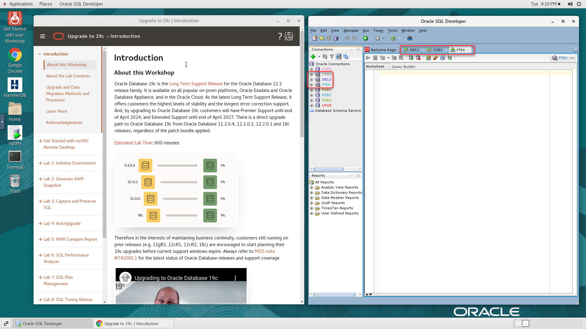
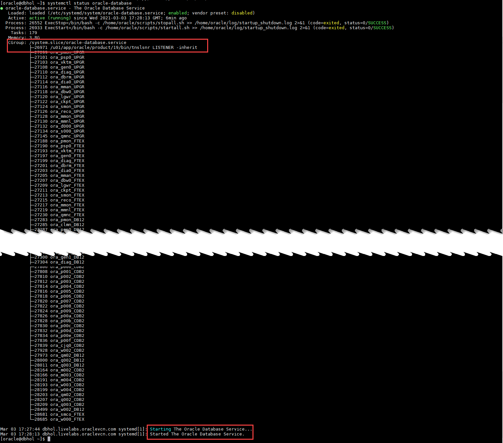

# Initialize Environment

## Introduction

In this lab we will review and startup all components required to successfully run this workshop.

*Estimated Lab Time:* 10 Minutes.

### Objectives
- Initialize the workshop environment.

### Prerequisites
This lab assumes you have:
- A Free Tier, Paid or LiveLabs Oracle Cloud account
- SSH Private Key to access the host via SSH
- You have completed:
    - Lab: Generate SSH Keys (*Free-tier* and *Paid Tenants* only)
    - Lab: Prepare Setup (*Free-tier* and *Paid Tenants* only)
    - Lab: Environment Setup

## **STEP 1:** Validate That Required Processes are Up and Running.

*Note:* All screenshots for SSH terminal type tasks featured throughout this workshop were captured using the *MobaXterm* SSH Client as described in this step. As a result when executing such tasks from within the graphical remote desktop session you can skip steps requiring you to login as user *oracle* using *sudo su - oracle*, the reason being that the remote desktop session is under user *oracle*.

1. Now with access to your remote desktop session, proceed as indicated below to validate your environment before you start executing the subsequent labs. The following Processes should be up and running:

    - Database Listener
        - LISTENER
    - Database Server Instances
        - FTEX
        - DB12
        - CDB2

    You may test database connectivity clicking on the *+* sign next to each of the 3 Databases as shown below in the *SQL Developer Oracle Connections* panel.

    

2. Validate that expected processes are up. Please note that it may take up to 5 minutes after instance provisioning for all processes to fully start.

    ```
    <copy>
    ps -ef|grep LISTENER|grep -v grep
    ps -ef|grep ora_|grep pmon|grep -v grep
    systemctl status oracle-database
    </copy>
    ```

    
    
    

    If all expected processes are shown in your output as seen above, then your environment is ready.  

3. If you see questionable output(s), failure or down component(s), restart the service accordingly

    ```
    <copy>
    sudo systemctl restart oracle-database
    </copy>
    ```

You may now [proceed to the next lab](#next).

## Appendix 1: Managing Startup Services

1. Database service (All databases and Standard Listener).

    - Start

    ```
    <copy>
    sudo systemctl start oracle-database
    </copy>
    ```
    - Stop

    ```
    <copy>
    sudo systemctl stop oracle-database
    </copy>
    ```

    - Status

    ```
    <copy>
    systemctl status oracle-database
    </copy>
    ```

    - Restart

    ```
    <copy>
    sudo systemctl restart oracle-database
    </copy>
    ```
## Appendix 2: External Terminal Access (using SSH Key Based Authentication)

While you will only need the browser to perform all tasks included in this workshop, you can optionally use your preferred SSH client to connect to the instance should you prefer to run SSH Terminal tasks from a local client (e.g. Putty, MobaXterm, MacOS Terminal, etc.) or need to perform any troubleshooting task such as restarting processes, rebooting the instance, or just look around.

1. Refer to *Lab Environment Setup* for detailed instructions relevant to your SSH client type (e.g. Putty on Windows or Native such as terminal on Mac OS):

    - From the web session where you completed your provisioning request, do:
        - For **Reserve Workshop on LiveLabs** - Navigate to "*My Reservations* >> *Launch Workshop* >> *Workshop Instructions* >> *Lab: Environment Setup*"
        - For **Launch Free Trial Workshop** and **Run on Your Tenancy** - Click on the corresponding provisioning option and open *Lab: Environment Setup*
    - Authentication OS User - “*opc*”
    - Authentication method - *SSH RSA Key*
    - OS User – “*oracle*”.

2. First login as “*opc*” using your SSH Private Key

3. Then sudo to “*oracle*”. E.g.

    ```
    <copy>sudo su - oracle</copy>
    ```

## Acknowledgements
* **Author** - Rene Fontcha, LiveLabs Platform Lead, NA Technology
* **Contributors** - Mike Dietrich, Database Product Management
* **Last Updated By/Date** - Rene Fontcha, LiveLabs Platform Lead, NA Technology, July 2021
