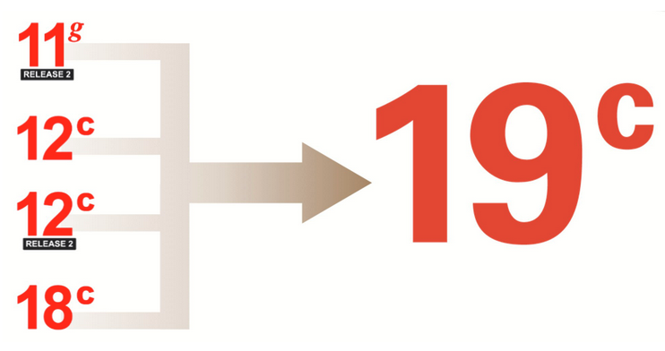

# Introduction

## About this Workshop

Oracle Database 19c is the *Long Term* Release for the Oracle Database 12c and 18c family of products. It is available on all popular on-prem platforms, Oracle Exadata and Oracle Database Appliance, and in the Oracle Cloud. As the latest Long Term Release, it offers customers the highest levels of stability and the longest error correction window. And, by upgrading to Oracle Database 19c customers can have Premier Support and Extended Support through to April, 2024 and April 2027 respectively.  There is a direct upgrade path to Oracle Database 19c from 11gR2, 12cR1, 12cR2 and 18c releases.

Therefore in the interests of maintaining business continuity,  customers still running on prior releases (e.g. 11gR2, 12cR1, 12cR2, 18c) are encouraged to start planning their 19c upgrades before current support windows expire. Always refer to [MOS note #742060.1](https://support.oracle.com/epmos/faces/DocumentDisplay?id=742060.1&displayIndex=1) for the latest status of Oracle Database releases and support coverage.

Estimated Lab Time: 120 minutes

  

### Objectives

In this workshop, you will:
* Setup your Upgrade Compute Instance in the Cloud
* Load the database
* Capture and Preserve SQL
* Perform Auto Upgrade tasks
* Run an AWR Diff Report
* Analyze SQL
* Tune and manage SQL Plans
* Perform upgrades using the plugin method

### Prerequisites
* An Oracle Cloud Account - Please view this workshop's LiveLabs landing page to see which environments are supported

*Note: If you have a **Free Trial** account, when your Free Trial expires your account will be converted to an **Always Free** account. You will not be able to conduct Free Tier workshops unless the Always Free environment is available. **[Click here for the Free Tier FAQ page.](https://www.oracle.com/cloud/free/faq.html)***

## About the Product/Technology

This workshop is preloaded with 3 different Oracle Homes and 5 databases.

The 3 different databases 

- Oracle 11.2.0.4 – /u01/app/oracle/product/11.2.0.4
- Oracle 12.2.0.1 – /u01/app/oracle/product/12.2.0.1
- Oracle 19.5.0 – /u01/app/oracle/product/19

The workshop also contains 5 different databases for running the various upgrade scenarios in each lab.

- UPGR – 11.2.0.4 database (non-CDB)
- FTEX – 11.2.0.4 database (non-CDB)
- DB12 – 12.2.0.1 database (non-CDB)
- CDB1 – 12.2.0.1 database (CDB)
- CDB2 – 19.5.0 database (CDB)

## Upgrade and Data Migration Methods and Processes

### Database Upgrade Assistant (DBUA)

- Provides a graphical user interface that guides you through the upgrade of a database. DBUA can be launched during installation with the Oracle Universal Installer, or you can launch DBUA as a standalone tool at any time in the future.

### Manual upgrade using the Parallel Upgrade Utility, and other command-line utilities

- Enables upgrades to be performed using shell scripts.

### Migrating data using Oracle Data Pump

- Provides export and import utilities. Oracle Data Pump can perform a full or partial export from your database, followed by a full, or partial import into the new release of Oracle Database. Export/Import in Oracle Data Pump can copy a subset of the data, leaving the database unchanged.

### CREATE TABLE AS SQL statement

- Migrates data from a database into a new Oracle Database release. By using this method, you can copy a subset of the data, leaving the database unchanged.

### Upgrading CDBs and PDBs using a priority list to group and upgrade PDBs according to their priority.

- Run the Parallel Upgrade Utility (dbupgrade, or catctl.pl) using the -L option to run the upgrade using a priority list, and to call that list as the upgrade runs.  Synchronizing a standby database, upgrading, and using Oracle GoldenGate to synchronize the upgraded database (a zero downtime option)

### Using Fleet Patching and Provisioning (FPP) to upgrade databases.

- In a Fleet Patching and Provisioning (FPP) upgrade (formerly known as Rapid Home Provisioning), you will complete a new Oracle Database installation. After testing the database, and modifying it in accordance with the standard operating environment (SOE) that you want to use for your databases, you create an FPP gold image. A DBA will deploy instances of that gold image to servers that have earlier release databases that you will want to upgrade. After deployment of these gold images, a DBA can run a single rhpctl command to move files, perform configuration changes, and perform other steps required to use the new binaries. Refer to Oracle Clusterware Administration and Deployment Guide for more information about Rapid Home Provisioning.

You may now [proceed to the next lab](#next).

## Learn More

* [Database Upgrade Guide Documentation - 19c](https://docs.oracle.com/en/database/oracle/oracle-database/19/upgrd/intro-to-upgrading-oracle-database.html#GUID-FA024F34-A61A-4C4B-AA60-C123A9191A16)
* [Database Upgrade Blog](https://blogs.oracle.com/database/19c-upgrades)
* [Oracle Databases Release and Support Coverage](https://support.oracle.com/epmos/faces/DocumentDisplay?id=742060.1&displayIndex=1)

## Acknowledgements
* **Author** - Mike Dietrich, Database Product Management
* **Contributors** -  Roy Swonger, Sanjay Rupprel, Cristian Speranta
* **Last Updated By/Date** - Kay Malcolm, February 2021

