# Run Analytics - Create Dashboards

## Introduction

In this lab, you will use a DVA file to run analytics in Oracle Analytics Cloud.

## Objectives

As a system administrator or application developer:

- Create connection to ADW  
- Upload DVA files and refresh connection + data
- View analytics

## Required Artifacts

- Autonomous Data Warehouse (ADW) and Oracle Analytics Cloud (OAC) instances.
- Access to the files needed to recreate this demo. 
    - [AttritionPrediction.csv](https://objectstorage.us-ashburn-1.oraclecloud.com/p/fp-wLXQ7mf0Q5Dtae0hH9o1VABJujAfRI2UOVs4dzsU/n/oradbclouducm/b/bucket-20200907-1650/o/AttritionPrediction.csv)
    - [HumanResources.dva](https://objectstorage.us-ashburn-1.oraclecloud.com/p/0VqpqURMs3ARIovzyCfR369sv5qqvVxMkmGbag8-wWA/n/oradbclouducm/b/bucket-20200907-1650/o/HumanResource.dva)

Note: Please download the files above before continuing.

### STEP 1: Installing HR Schema on Autonomous Database

- Use SQL Developer to connect to your already provisioned database with the ADMIN user. The steps to do so can be found [here](https://docs.oracle.com/en/cloud/paas/autonomous-data-warehouse-cloud/user/connect-sql-dev182.html#GUID-14217939-3E8F-4782-BFF2-021199A908FD).

- Run the following code to create the HR user.

    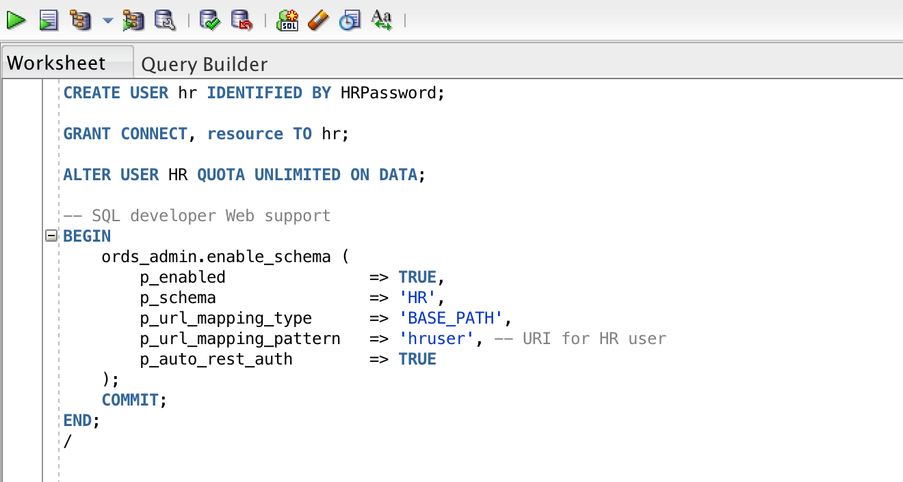

- Now go ahead and log in as the HR user, then run the following [scripts](https://github.com/oracle/db-sample-schemas/tree/master/human_resources) to create the HR schema. Run the hr_main.sql script.

- A pair of optional scripts, hr_dn_c.sql and hr_dn_d.sql, is provided as a schema extension. To prepare schema HR for use with the directory capabilities of Oracle Internet Directory, run the hr_dn_c.sql script. If you want to return to the initial setup of schema HR, use script hr_dn_d.sql to undo the effects of script hr_dn_c.sql.
For a complete listing of the scripts and their functions, refer to [this](https://docs.oracle.com/database/121/COMSC/scripts.htm#COMSC00020).

**Note:** You can use script hr_popul.sql to populate the tables and hr_drop.sql to drop schema HR.

- The following tables will have been installed: EMPLOYEES, LOCATIONS, JOBS, COUNTRIES, DEPARTMENTS, REGIONS, JOB_HISTORY

- On sql developer, click on any of the tables, and click on *Model*, you should see the table relationships.

    
    
### STEP 2: Setting up the Human Resource Analytics Project in OAC

- Login to your analytics cloud instance. This can be done from the page of the instance.

    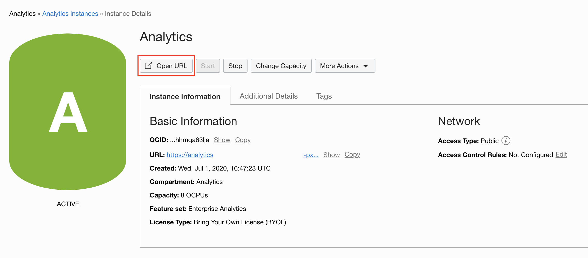

- On the far right hamburger menu, select **Import Project/Flow**

    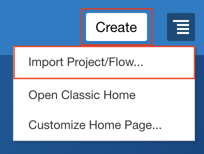
    

-  Import the Human Resources.dva file into OAC. The password is **Admin123**. Read more [here](https://docs.oracle.com/en/middleware/bi/analytics-desktop/bidvd/import-application-or-project.html).

    
    

- Go to **Data** -> **Connections** and you should see a connection named 'adw_hr'. 

    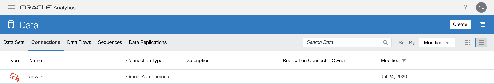

- Click on the ellipses menu on the extreme right of the connection’s name and select inspect.

- Click on the **Select** button in front of Client Credentials and select the wallet to your ADW instance. Let the username be **ADMIN** and provide the database password. Click **Save**.

    

- We will now refresh our data sets to utilize our connection. Move to the hamburger menu and select **Data**-> **Data Sets**, you will see all our tables appear below. Go ahead and reload the data.

    

- Now, proceed to the hamburger menu and select **Catalog** and open your project. The visualizations should load, but click **Refresh Data** if needed to refresh the visuals.

    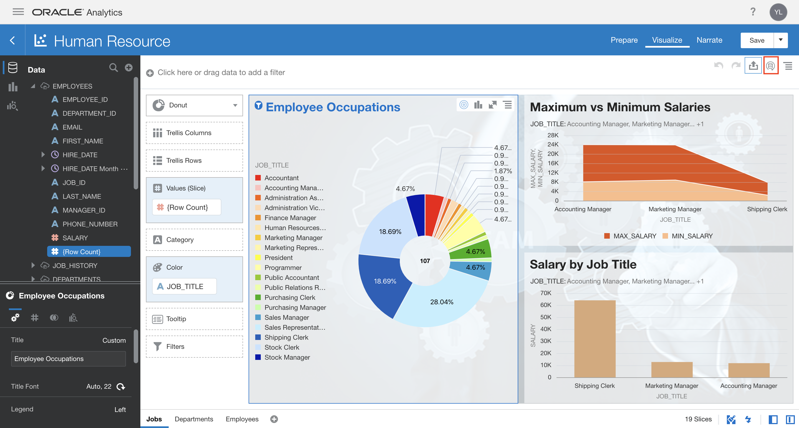

### STEP 3: Uploading a file to the Datawarehouse using OAC

- Return to the home page. Click on the **Create** button and then select **Data Flow**.

    

- Select the **Create Data Set**, choose the **Click to Browse** option and select the AttritionPrediction.csv file. 

    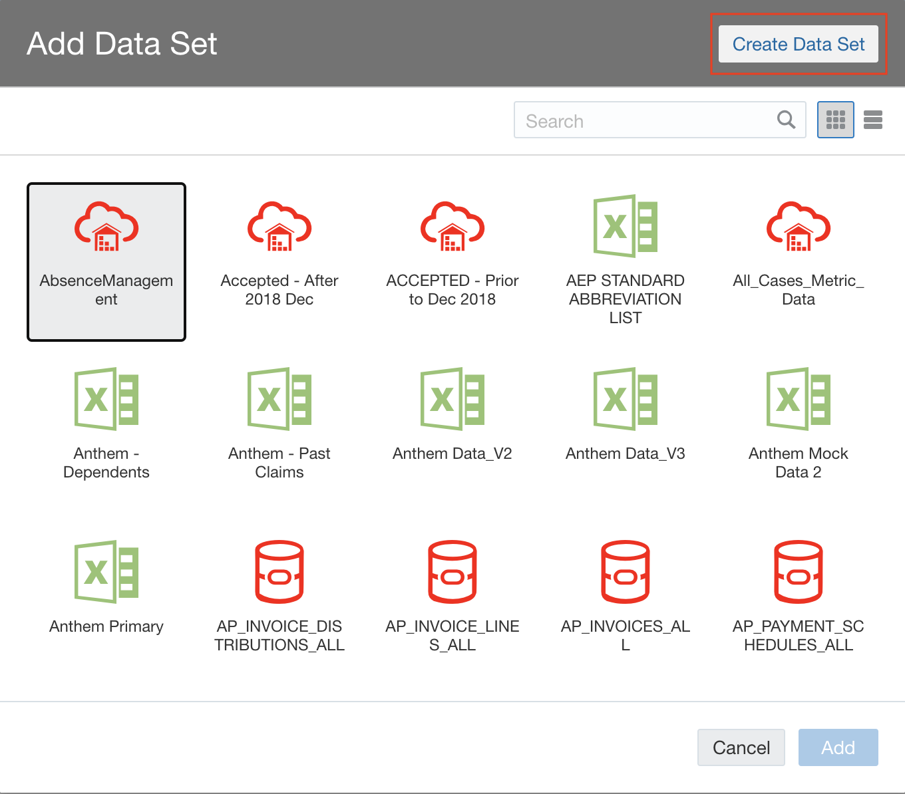
    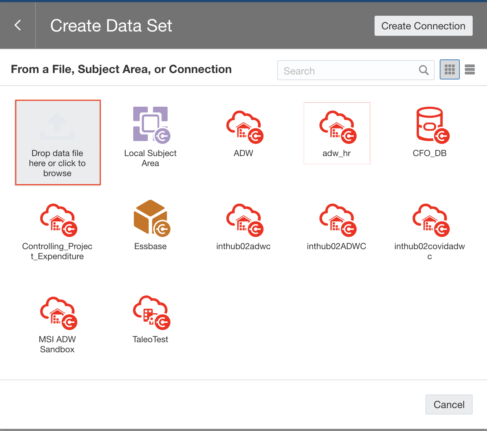

**Note:** You may drag and drop the file instead.

- Once the file is uploaded, select **Add**.
    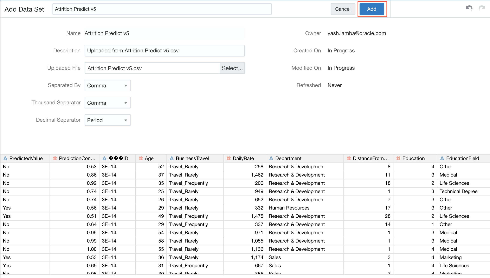

- Next, drag the **Save Data Set** option from the **Data Flow Steps** on the left to the panel at the top right next to the Attrition Prediction data set. Provide a name for the Data Set. In the **Save Data To** drop down, select **Database Connection**. 

    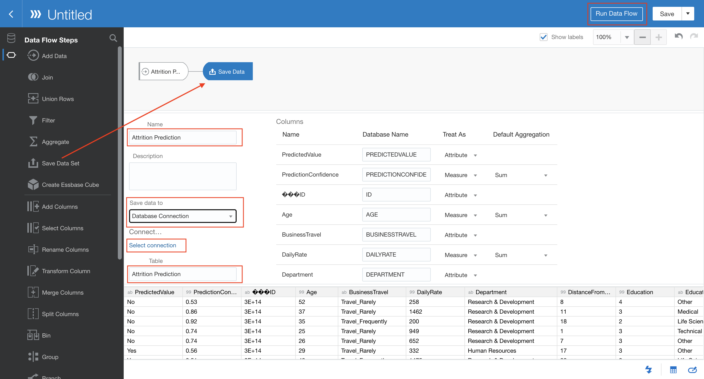

- Click on **select connection** and choose the adw_hr connection. Thereafter, also give a name that would be used for the table in the database.

    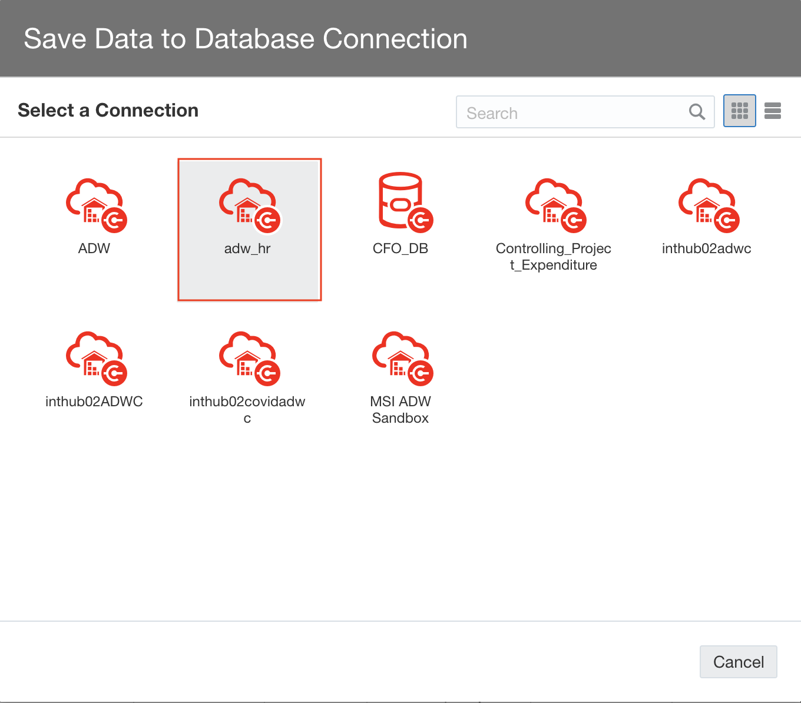

- Hit the **Run Data Flow** button. You will be prompted to save the data flow. Give it a name and click on **Save & Run**.

    
The data flow should run and upon successful execution you should be able to see the two data sets under the **Data** menu item.

    

### STEP 4: Using Attrition Data set in the Human Resource project

- Open the Human Resource project. From the data panel, click on the 'plus' sign and select **Add Data Set**.

    

- Select the **AttritionPrediction** data set that is stored in the database.    
    
    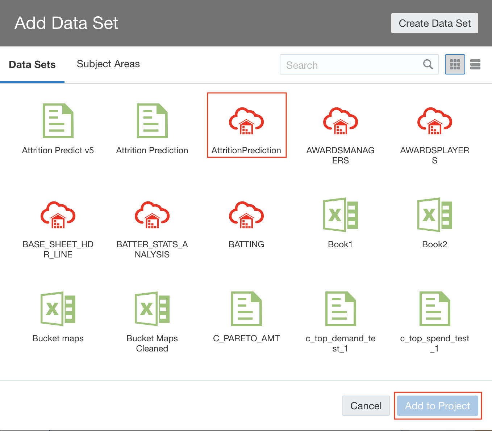

- Click on the '+' sign next to the canvas names at the bottom of the screen to add a new canvas. 

    

- Right click on the name of the new canvas and choose **Rename**. Give the canvas a meaning full name.

    

- Now drag the **Employee Count** data item under Attrtion Prediction to this canvas to get you first visualisation. 

    

We will now leave it upto your imagination to analyse the data sets that have been provided to you.
