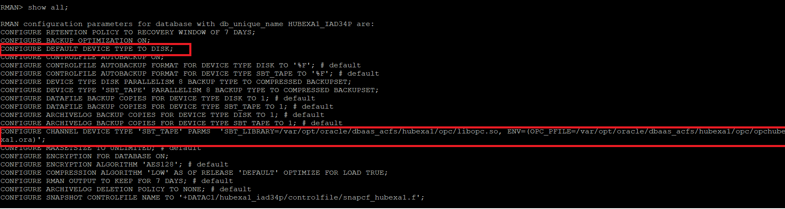

## Introduction
This Appendix covers some general help for Windows users and other occasional issues you may encounter while working with your Exadata Cloud Service.

## Objectives

- Instructions for windows users and other items

## Topics

###  **Generating ssh key pairs using Puttygen**

SSH keys are required to access a running OCI instance securely. You can use an existing SSH-2 RSA key pair or create a new one. Below are instructions for generating your individual key pair for Linux, Mac, Windows, and Windows 10.  Windows 10 is the first Windows version to natively support ssh and terminal access.   Insructions for creating SSH keys can also be found on the OCI documentation page.
<https://docs.cloud.oracle.com/iaas/Content/GSG/Tasks/creatingkeys.htm>

**For Linux/Mac :**
```
<copy>ssh-keygen -t rsa -N "" -c "<Your comments>" -b 2048 -f </path/to/file/file_name></copy>
```


**Windows versions older than Windows 10**

A third party SSH client needs to be installed for Windows versions prior to Windows 10 in order to generate SSH keys. You can use Git Bash, Putty, or a tool of your choice. This tutorial will use Putty as an example. Git Bash or any third party shell program instructions will likely be the same as the Linux instructions above.

**Note: *If you don’t already have it, download the Putty application and install it on your Windows machine. [<span class="underline">Download Putty</span>](https://www.chiark.greenend.org.uk/~sgtatham/putty/latest.html).  Puttygen is a utility that comes with the Putty package and is used to generate SSH keys.** 

**For Oracle employees, Putty is also available from the MyDesktop application.**


If you clicked on the link above you will be at the main putty donwload page.


From the **Package Files** section select the 32 or 64 bit version depending of which version of Windows you are running. The download windows will pop up as shown above. Save the file on your local Windows system. Most likely to your *Downloads** directory unless you select a different location.

Doubleclick on the downladed file (for example **putty-64bit-0.73-installer.msi**). This will launch the Putty installer.


Click **Next** and leave the Destination Folder unchanged unless you have a good reason to select a different destination. Click **Next**


On the next screen don't change any settings, and click **Install**


- After installing Putty, from the Windows start menu, run the PuTTYgen utility


- Click the Generate button and follow the instructions for generating random information.


- After the key information has been generated, enter an optional **passphrase** and press the **Save private key** button to save the key to your system.

**Note:** *A passphrase is not required but recommended for stronger security.*


- The private key should have the .ppk extension. Name it whatever you want and store it in a folder that’s easily accessible.


**NOTE:**  *We will not use the ‘Save public key’ option in PuttyGen, as the keyfile is not compatible with Linux openSSH. Instead, we will copy and paste the key information into a text file.*

- Left click on the Public key information and choose ‘Select All’ to select everything in the key field. Then left click again and copy the selected information to the clipboard.


- Save your public key to a text file with Notepad. Open a plain text editor and paste the key information. Name and save the file with a .pub extension.


- Close the Puttygen application

**Generating ssh keys using powershell on Windows 10**

- Windows 10 users, **open Powershell terminal window** Either select the application from the Windows Start menu or type 'cmd' or 'powershell' from the Windows search menu.  


- From your home directory (should be the default C:\Users\<Your Name>) type the `ssh-keygen` command.  Press **Enter** when asked for the filename, and press **Enter** twice for *no passphrase*.

    `PS C:\Users\myhome> ssh-keygen`


Typing *ssh-keygen* by itself creates a key named id_rsa under the default .ssh directory.  If you want to name your key, store it in another directory, or add other security options, the ssh-keygen command takes a number of useful switches.  

**ssh-keygen command switch guide:**

    -t – algorithm
    -N – “passphrase” Not required but best practice for better security
    -b – Number of bits – 2048 is standard
    -C – Key name identifier
    -f - \<path/root\_name\> - location and root name for files


- The key pair you generated is now stored in the default .ssh directory.  Use the `ls -l .ssh` command to verify.


###  **Creating an ssh tunnel from your Windows system to your OCI dev client**

**Windows 10 Users**

Open powershell and run the following command replace values for ssh key file and instnace IP address as applicable to your deployment

```
<copy>ssh -L 5901:localhost:5901 –i <path/to/private/key/id_rsa opc@<IP_address_of_dev_client></copy>
```

**Older versions of Windows can use Putty to create an ssh tunnel as follows**

Start with creating an ssh session in Putty as usual, 

1. Specify public IP address of host. Provide a name and save your session


2. Go to ssh --> Auth from the Category menu on the left. Provide your private .ppk key


 One final step before you hit Open. In ssh -->Tunnel, provide port forwarding information as shown below

 

3. Hit 'Open' and provide user name when prompted. 

Note that you may establish an ssh connection to your remote host without port forwarding, in which case your VNC session may fail. Please check your port forwarding parameters and retry.

###  **Connecting to your OCI Developer client linux desktop using VNC**

To connect to your instance, you can SSH directly from your machine and use command line to interact, or you can use a VNC viewer  access the image through a full graphical interface. This later method is highly recomended as you will have full graphical access to your cloud developer image vs. command line access through SSH.
However some initial setup may need to be done with SSH commands before full GUI access to the image is possible. 

**Usage Instructions Getting Connected with SSH**

When launching the instance, you will need to provide an SSH key that you previously created. Once the instance launches, you can connect to it using SSH. When attempting a connection from your Windows system to the cloud developer image, make sure that you are in the directory that contains your **id_rsa** file generated in the step above or your connection will not work.

On your Windows machine launch a **Command Prompt** window

- Use the following information to connect to the instance when issuing the commang below:

User: opc

IP Address: public IP address of the instance

id_rsa: path to the SSH-2 RSA private key file

For example:
```
<copy>cd .ssh

ssh –i id_rsa opc@IP Address</copy>
```


Once connected to the cloud developer image you will see the remote prompt **[opc@devclient ~]$**


**Usage Instructions Accessing via VNC  Graphical User Interface (GUI)**

To access a GUI via VNC, do the following:

- Install a VNC viewer on your local computer. A common VNC Viewer can be downloaded from https://www.realvnc.com/en/connect/download/viewer/


From the website select, select Windows and **Download VNC Viewer**. That will save a file to your downloads directory as in the previous step. Doublick on the file and it will launch the installer.


Follow the installation steps in the installer to install VNC Viewer.

In order to use VNC viewer, you must still establish an initial connection to the image through SSH to enable the remove VNC service to start and configure security in your newly created cloud developer image. This is a one time process on the image.

- Use SSH to connect to the compute instance running the Oracle Cloud Developer Image, as described above in **Usage Instructions Getting Connected with SSH** (connect to the opc user)

- Once connected and at the remote image prompt, configure a VNC password by typing **vncpasswd**

- When prompted, enter a new password and verify it
- Optionally, enter a view only password
- After the vncpasswd utility exits, start the VNC server by typing **vncserver**

This will start a VNC server with display number 1 for the opc user, and the VNC server will start automatically if your instance is rebooted.

Now to connect to the image from your local Windows computer you need to execute the following command after every restart of your local Windows comuter to re-establish a connection to the remote image. On your local computer, 

-  connect to your instance and create an ssh tunnel for port 5901 (for display number 1): by running the following in a **Command Prompt** window:

    **cd .ssh** - make sure you are in the .ssh directory on your local machine

    **ssh -L 5901:localhost:5901 –i id_rsa opc@IP Address** - specify your images IP address

If the connection request times out, try again


- Start a VNC viewer on your local machine by selecting **VNC Viewer** from the **Start** menu, or typing **VNC Viewer** in the search bar.
- Establish a VNC connection to: **localhost:1**


If you get a warning message about the communication not being encrypted click continue


- Enter the VNC password you set earlier, when you ran the **vncpasswd** command in the cloud developer image, in the password dialog and you will be connected!


###  **Finding private IP address of your Autonomous Exadata infrastructure (AEI)**


**Step 1: Locate the SCAN hostname of your AEI**

Go to your Autonomous Database Console and open the details page of any ADB instance you have already provisioned on this AEI. Click the DB Connection button


On the Database Connection popup, pick any TNS Connection String entry and expand it as shown below. Your exadata hostname is embedded in this TNS entry. Click 'copy' and paste the entire TNS string onto a notepad. You may then pick out the hostname when you need it in the steps below


**Step 2: Deploy and ssh into your developer client VM**

- Next, deploy any linux VM in the same VCN hosting your Autonomous Exadata Infrastructure (AEI)

- You may follow steps [in this lab guide](./ConfigureDevClient.md) to provision the Oracle Developer Client VM from the OCI marketplace. 

- Note that the VM can be in a public or private subnet as long as you can ssh into it and **its in the same VCN as your AEI.**

- If your company has deployed FastConnect and setup VPN into the OCI network, you may ssh into your client machine using its private IP or a hostname registered in your corporate DNS. Check with your network administrator responsible for the OCI network.

Here, we assume that you have deployed a VM in a public subnet and can ssh into it using its public IP.

````
<copy>ssh -i <private-key-file> opc@<Public-IP-of-machine></copy>

````

**Step 3: Query your VCN's DNS service to locate IP address of AEI Cluster**

Once you are ssh'd into a client VM, simply run nslookup on the scan-host name your picked out from step 1 above.

````
<copy>nslookup host-xxxx-scan.exasubnet.ocivcn.oraclevcn.com</copy>
````

```
Server:		169.XXX.169.254
Address:	169.XXX.169.254#53

Non-authoritative answer:
Name:	host-xxxx-scan.exasubnet.ocivcn.oraclevcn.com
Address: 10.0.11.36
Name:	host-xxxx-scan.exasubnet.ocivcn.oraclevcn.com
Address: 10.0.11.34
Name:	host-xxxx-scan.exasubnet.ocivcn.oraclevcn.com
Address: 10.0.11.35
```


You now have the 3 SCAN IP's of your AEI cluster. Once your network admin adds the SCAN hostname and the 3 IPs to your corporate DNS Server, you may then be able to access your database instances via hostname using the downloaded wallet.

### Backup and Recover using RMAN

**Backup using RMAN**

Default RMAN parameters after auto/bkup\_api backup setup will look as follow.



You can initiate disk backup manually using RMAN with default settings as default device type configured to Disk as shown below.


**Recover using RMAN**

If you backed up your Exadata database using bkup\_api, you can manually restore that database backup by using the Oracle Recovery Manager (RMAN) utility. 


### Provisioning an Database Cloud Service Instance

In this section you will be provisioning a database on Oracle Cloud Infrastructure using the Cloud Console.

### **Steps**

#### **STEP 1: Sign in to Oracle Cloud Infrastructure console**

- Go to cloud.oracle.com, click Sign In to sign in with your Oracle Cloud account.


- Enter your Cloud Account Name and click My Services.


- Enter your Oracle Cloud username and password, and click Sign In.


- Once you are logged in, you are taken to the cloud services dashboard where you can see all the services available to you.

- Click "Bare Metal, VM and Exadata" in the left side menu.


#### **STEP 2: Create a Compartment**

- In the Cloud Infrastructure Console, click on the hamburger menu on the top left of the screen. From the pull-out menu, under Identity, click Compartments.


-  Click on **Create Compartment** button to start the compartment creation process


Enter the following in create Compartment window

- **Name**: Enter a friendly name to idenitfy your compartment (To complete this workshop let us name compartment as **Demo**)
- **Description**: Enter a description for the compartment
- Click on Create Compartment link 

Managing Tags and Tag Namespaces: When you have many resources (for example, instances, VCNs, load balancers, and block volumes) across multiple compartments in your tenancy, it can become difficult to track resources used for specific purposes, or to aggregate them, report on them, or take bulk actions on them. Tagging allows you to define keys and values and associate them with resources. You can then use the tags to help you organize and list resources based on your business needs. For more information please click [here](https://docs.cloud.oracle.com/iaas/Content/Identity/Concepts/taggingoverview.htm).


- You can verify the compartment created on Compartments page


#### **STEP 3: Create a Database Cloud Service Instance**

-  Click on the hamburger menu icon on the top left of the screen


-  Click on **Bare Metal,VM and Exadata** from the menu


- Select **Reston Compartment** 


-  Click on **Launch DB System** button to start the instance creation process


-  This will bring up Launch DB System screen where you specify the configurations of the instance


#### Note: Oracle Cloud Infrastructure allows logical isolation of users within a tenant through Compartments. This allows multiple users and business units to share a tenant account while being isolated from each other.

If you have chosen the compartment you do not have privileges on, you will not be able to see or provision instance in it.

More information about Compartments and Policies is provided in the OCI Identity and Access Management documentation [here](https://docs.cloud.oracle.com/iaas/Content/Identity/Tasks/managingcompartments.htm?tocpath=Services%7CIAM%7C_____13).

-  Verify Reston compartment is selected


-  Specify a name for the instance


- Select Availability Domain from the dropdown.


- Select the Shape Type as "VIRTUAL MACHINE".


-  You can choose an available instance shape, For this lab, we are going to select "VM.Standard2.1" as the option.


- Select the Database Software Edition from the dropdown.


- Select available storage size from the dropdown menu.


- License Type: You will see 2 options under licensing options. 

#### My organization already owns Oracle database software licenses: Oracle allows you to bring your unused on-prem licenses to the cloud and your instances are billed at a discounted rate. This is the default option so ensure you have the right license type for this subscription.


#### Subscribe to new database software licenses and the database cloud service: Your cloud service instance should include database license. This is an all-inclusive cost and you do not need to bring any additional licenses to cloud.


- Click on browse and select the ssh you would like to use for the database.


- Select the VCN in which you would like to create the database instance from the dropdown list.


- Select the subnet from the dropdown list in the selected VCN.


- Give a Hostname Prefix for the database.


- Also, make sure to verify the VCN and Subnet Compartment.


- Give a name for the database and select the database version from the available list in the dropdown.


- Enter the PDB name for the database.


-  Specify the password for the instance and confirm it.

#### For this lab, we will be using the following as password

```
WElCome12_34#
```


- Select the type of workload for the database, which is either OLAP or OLTP. For this workshop we are going to use OLTP.


- Tagging is a metadata system that allows you to organize and track resources within your tenancy. Tags are composed of keys and values that can be attached to resources. 

More information about Tags and Tag Namespaces is provided in the OCI Identity and Access Management documentation [here](https://docs.cloud.oracle.com/iaas/Content/Identity/Concepts/taggingoverview.htm).


For this workshop we will not be creating any TAG NAMESPACE. 

- Make sure you have everything filled all required details

-  Click on **Launch DB System** to start provisioning the instance


- Once you click on Launch DB System it would take 60-90 minutes for the instance to be provisioned.

-  Once it finishes provisioning, you can click on the instance name to see details of it


You now have created your Oracle Database Cloud service instance.

