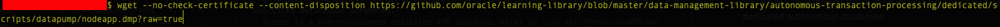
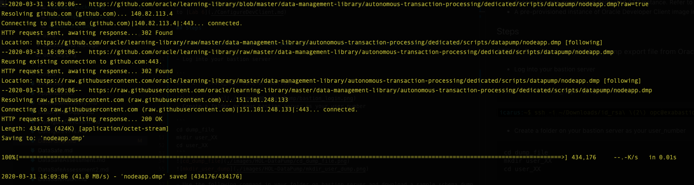
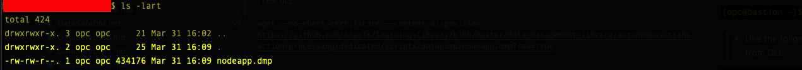
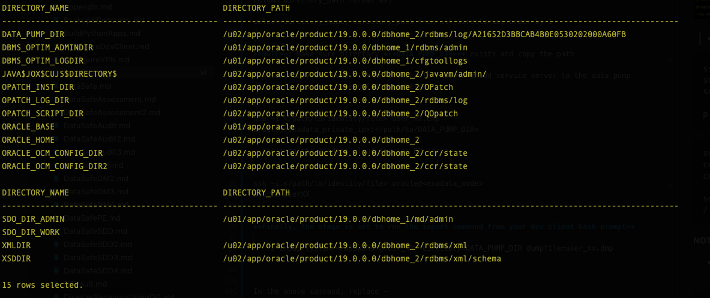
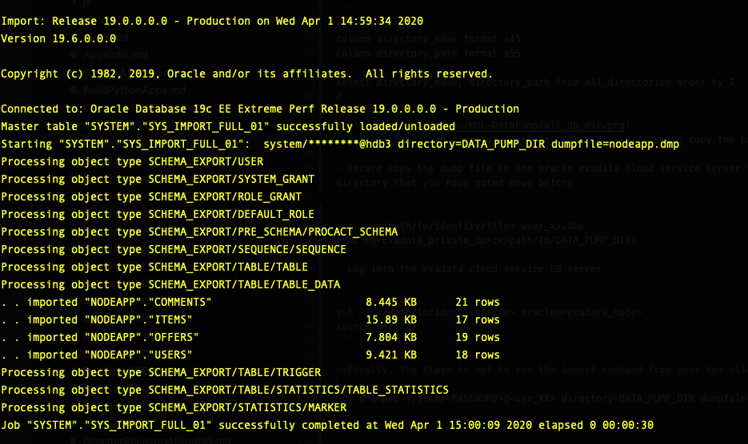

## Introduction

Oracle Data Pump offers very fast bulk data and metadata movement between user managed Oracle databases and Exadata Cloud Service Databases.

Data Pump Import lets you import data from Data Pump files. You can save your data to either the database server or File Storage Server and use Oracle Data Pump to load data to an Exadata Cloud Service Database.

This lab walks you through the steps to migrate a sample application schema using Data Pump Import into your Exadata Cloud Service Database.

### See an issue?
Please submit feedback using this [form](https://apexapps.oracle.com/pls/apex/f?p=133:1:::::P1_FEEDBACK:1). Please include the *workshop name*, *lab* and *step* in your request.  If you don't see the workshop name listed, please enter it manually. If you would like us to follow up with you, enter your email in the *Feedback Comments* section.

## Objectives

As a database admin or user,

1. Download a sample datapump export dump file from the Oracle Learning Library github repository.
2. Securely copy the dump file to the exadata machine and then to the required directory and run import data pump


## Required Artifacts
- An Oracle Cloud Infrastructure account with privileges to create object storage buckets and Exadata cloud service databases.
- Access to a pre-provisioned Exadata cloud service database. Refer to [Lab 3](?lab=lab-3-provision-databases-on-exadata-cloud)
- A pre-provisioned instance of Oracle Developer Client image in an application subnet. Refer to [Lab 4](?lab=lab-4-configure-development-system-for-use)
- Access to an exadata instance to copy the dump file into

## Steps

### **Step 1:** Download a sample data pump export file from Oracle Learning Library github repository

- Log into your bastion server

```
<copy>
ssh -i /path/to/private/key private_key opc@public_IP_address
</copy>
```


- Create a folder on your bastion server as your user_number 


```
<copy>
mkdir user_XX
</copy>
```

```
<copy>
cd user_XX
</copy>
```


- Use the following command in your folder on bastion server and download a sample schema dump from OLL

```
<copy>
wget -O user_XX.dmp https://objectstorage.us-ashburn-1.oraclecloud.com/p/LdwVJ20TfCaQGHwH_fhi8xPRLZldM-QasPN2pjquak8/n/orasenatdpltintegration02/b/ExaCSScripts/o/data_pump_nodeapp.dmp
</copy>
```





### **Step 2:** Setup environment to import data to Exadata Cloud Service Database 
- Log into your database from your bastion server and execute following command

```
<copy>
ssh -i /path/to/identity/file oracle@exadata_node
</copy>
```

```
<copy>
source userXX.env
</copy>
```

```
<copy>
sqlplus system/system_password@usr_xx
</copy>
```

```
<copy>
set lines 500
column directory_name format a45
column directory_path format a95

select directory_name, directory_path from all_directories order by 1
/
exit
</copy>
```


**NOTE**: Make sure directory ***DATA_PUMP_DIR*** exists and copy the path

- Exit to your **bastion server**

- Securely copy the dump file to the oracle exadata cloud service server to the data pump directory that you have noted down before

```
<copy>
scp -i /path/to/identity/file /path/to/user_xx.dmp oracle@Exadata_private_ip:/path/to/DATA_PUMP_DIR
</copy>
```

### **Step 3:** Perform Data Import
- Log into the exadata cloud service DB server 

```
<copy>
ssh -i /path/to/identity/file oracle@exadata_node
</copy>
```

```
<copy>
source userXX
</copy>
```

***NOTE:*** Log in to the Node of Exadata and make a TNS entry on your tnsnames.ora file such that your import data pump process only uses this particular node as we are placing the dump file on only one node and not on a shared file system.

```
<copy>
cd $ORACLE_HOME/network/admin/user_xx/
</copy>
```

```
<copy>
vi tnsnames.ora
</copy>
```
- Since we have not attached the file system to the exadata, and to maintain consistency in the node usage, we will copy the PDB tns entry and edit the **Host** to the private IP of node1 of the exadata cloud service

```
usrxx_1 =
  (DESCRIPTION =
    (ADDRESS = (PROTOCOL = TCP)(HOST = PRIVATE_IP_ADDRESS_OF_EXA_NODE_1)(PORT = 1521))
    (CONNECT_DATA =
      (SERVER = DEDICATED)
      (SERVICE_NAME = usrxx..<subnet>.<vcn>.exavcn.oraclevcn.com)
      (FAILOVER_MODE =
        (TYPE = select)
        (METHOD = basic)
      )
    )
  )
```


- Finally, the stage is set to run the import command from your dev client bash prompt

```
<copy>
impdp SYSTEM/password@usr_XX_1 DIRECTORY=DATA_PUMP_DIR DUMPFILE=user_XX.dmp CLUSTER=NO; 
</copy>
```

- In the above command, replace
  * __password__ - Admin password for your database system user
  * __usr_XX_1__ - The pluggable database that you created 
  * __DIRECTORY__ - leave as shown above
  * __user_xx.dmp__ -  The dump file that was securely copied to the directory location



**For more information on Oracle Data Pump, please refer to the [documentation](https://docs.oracle.com/en/database/oracle/oracle-database/19/sutil/oracle-data-pump.html#GUID-501A9908-BCC5-434C-8853-9A6096766B5A)**

All Done! Your application schema was successfully imported. 

You may now connect to your exadata cloud service database using a SQL client and validate import.

Congratulations! You have successfully completed migration of an Oracle database to the Exadata Cloud Service Database using Data Pump.
