# Assess Database Configurations with Oracle Data Safe

## Introduction
Using Oracle Data Safe you can assess the security of a database by using the Security Assessment feature and fix issues.

### See an issue?
Please submit feedback using this [form](https://apexapps.oracle.com/pls/apex/f?p=133:1:::::P1_FEEDBACK:1). Please include the *workshop name*, *lab* and *step* in your request.  If you don't see the workshop name listed, please enter it manually. If you would like us to follow up with you, enter your email in the *Feedback Comments* section.

Watch the video below for an overview on how to assess Database Configurations with Oracle Data Safe

<div style="max-width:768px"><div style="position:relative;padding-bottom:56.25%"><iframe id="kaltura_player" src="https://cdnapisec.kaltura.com/p/2171811/sp/217181100/embedIframeJs/uiconf_id/35965902/partner_id/2171811?iframeembed=true&playerId=kaltura_player&entry_id=1_37ja7d6d&flashvars[streamerType]=auto&amp;flashvars[localizationCode]=en&amp;flashvars[leadWithHTML5]=true&amp;flashvars[sideBarContainer.plugin]=true&amp;flashvars[sideBarContainer.position]=left&amp;flashvars[sideBarContainer.clickToClose]=true&amp;flashvars[chapters.plugin]=true&amp;flashvars[chapters.layout]=vertical&amp;flashvars[chapters.thumbnailRotator]=false&amp;flashvars[streamSelector.plugin]=true&amp;flashvars[EmbedPlayer.SpinnerTarget]=videoHolder&amp;flashvars[dualScreen.plugin]=true&amp;flashvars[hotspots.plugin]=1&amp;flashvars[Kaltura.addCrossoriginToIframe]=true&amp;&wid=1_1zb7pdz7" width="768" height="432" allowfullscreen webkitallowfullscreen mozAllowFullScreen allow="autoplay *; fullscreen *; encrypted-media *" sandbox="allow-forms allow-same-origin allow-scripts allow-top-navigation allow-pointer-lock allow-popups allow-modals allow-orientation-lock allow-popups-to-escape-sandbox allow-presentation allow-top-navigation-by-user-activation" frameborder="0" title="Kaltura Player" style="position:absolute;top:0;left:0;width:100%;height:100%"></iframe></div></div>

## Objectives
In this lab, you learn how to do the following:
- Assess the security of a database by using the Security Assessment feature in Oracle Data Safe
- Fix some of the security issues based on the assessment findings

## Challenge
Suppose that you are notified by the “Audit and Compliance” department that due to the General Data Protection Regulation (GDPR) compliance efforts, you need to quickly report on the current security posture of your database. Your current understanding is unknown. You currently have auditing enabled and are aware of the following database users:

- `PU_PETE` (Power User)
- `APP_USER`
- `DBA_DEBRA` (Company DBA)
- `DBA_HARVEY` (Company Junior DBA)
- `EVIL_RICH`
- `SECURE_STEVE`

## Steps

### **Step 1:** Connect to your ExaCS database as the SYS user with SQL Developer

Please visit [Lab 4: Configuring a development system for use with your EXACS database](?lab=lab-4-configure-development-system-for-use) for instructions to securely configure ExaCS to connect using Oracle SQL Developer, SQLXL and SQL*Plus.

### **Step 2:** In the Oracle Data Safe Console, generate a Comprehensive Assessment report
- Return to the Oracle Data Safe Console.
- Click the **Home** tab and then **Security Assessment**.

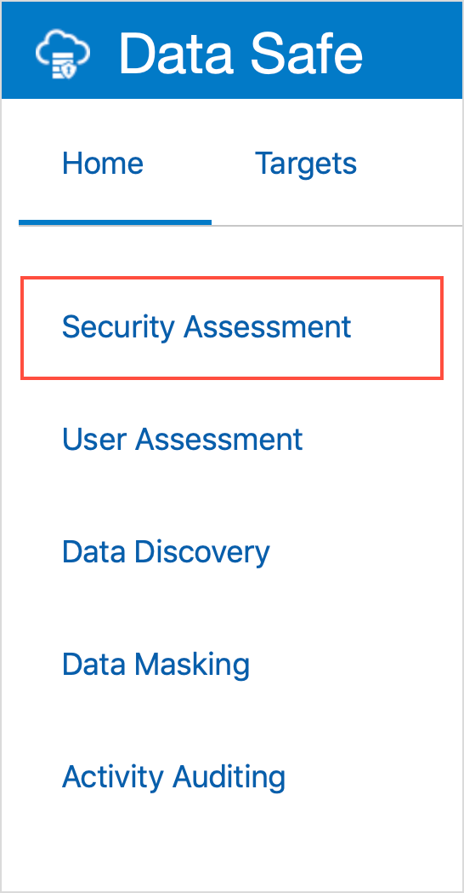
- On the **Security Assessment** page, select the check box for your target database, and click **Assess**.

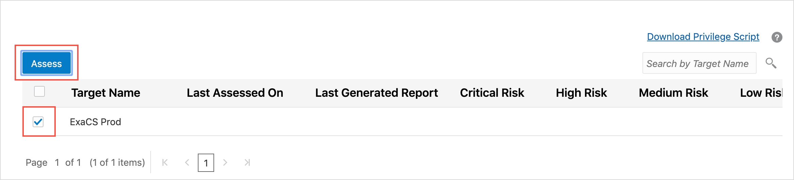

- Wait a moment for the report to generate.
- When the report is generated, review the high risk, medium risk, and low risk values.
- In the **Last Generated Report** column, click **View Report**.


- The **Comprehensive Assessment** report is displayed on the **Reports** tab.
- In the upper right corner, view the target name, when the database was assessed, and the database version.


- View the values for the different risk levels. These values give you an idea of how secure your database is.

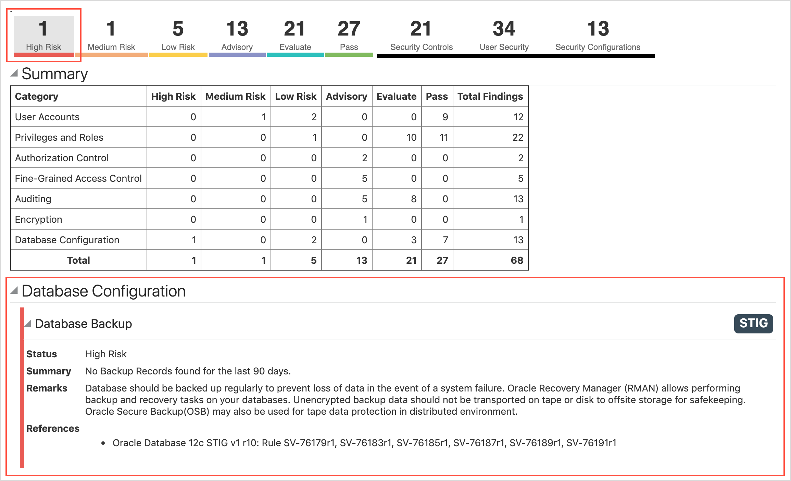

- View the values for security controls, user security, and security configurations. These totals show you the number of findings for each high-level category.
- Browse the report by scrolling down and expanding and collapsing categories.
Each category lists related findings about your database and how you can make changes to improve its security.
11. View the **Summary** table.
This table compares the number of findings for each category and counts the number of findings per risk level. It helps you to identify the areas that need attention on your database.

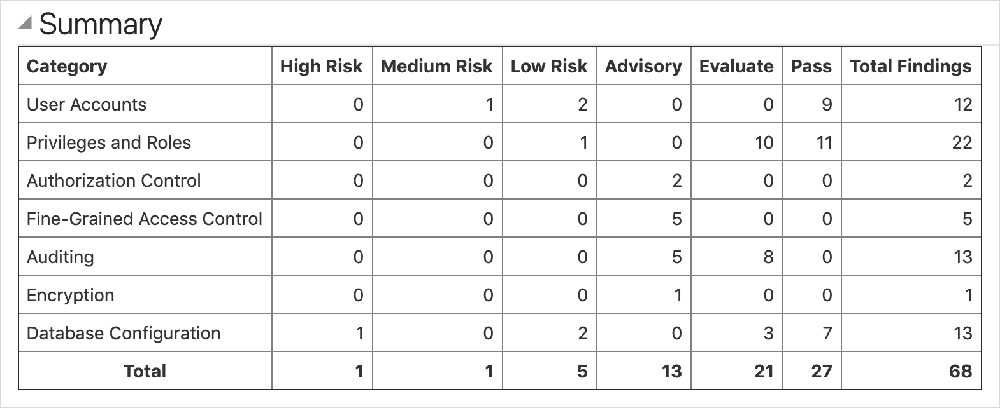

### **Step 3:** Review the Medium Risk, Low Risk, and Advisory findings
- At the top of the report, click **Medium Risk** to filter the report to show only the medium risk findings.
- Deselect all other risk levels.
- Scroll through the report to view the medium risk findings.
- At the top of the report, click **Low Risk** to filter the report to show only the low risk findings.
- Deselect all other risk levels.
- Review the low risk findings.
- At the top of the report, click **Advisory** to filter the report to show only the advisory findings.
- Deselect all other risk levels.
- Review the advisory findings.

### **Step 4:** Review the Evaluate findings and fix some of them, if possible

- At the top of the report, click **Evaluate** to filter the report to show only the Evaluate findings.

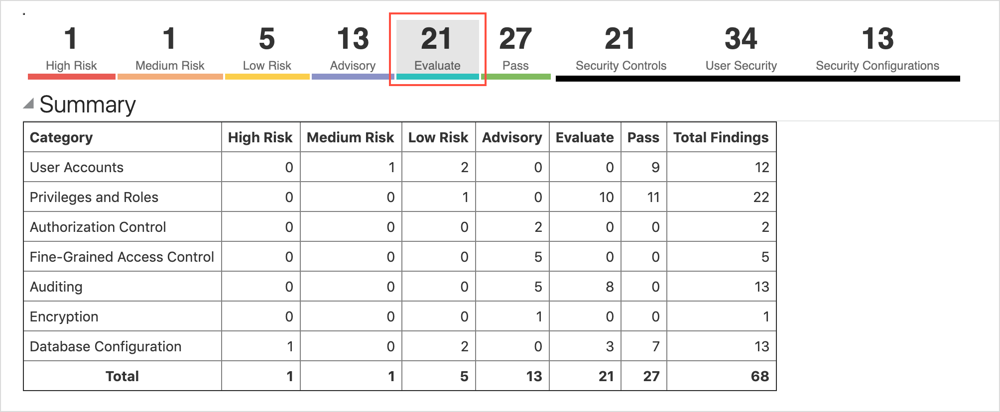
- Deselect all other risk levels.
- Scroll through the report to view the findings.
- Focus on **System Privilege Grants** under Privileges and Roles:
  - System privileges `(ALTER USER, CREATE USER, DROP USER)` can be used to create and modify other user accounts, including the ability to change passwords. This ability can be abused to gain access to another user's account, which may have greater privileges. The Privilege Analysis feature may be helpful to determine whether or not a user or role has used account management privileges.
  - Security Assessment found 59 grants of system privilege grants on your target database.

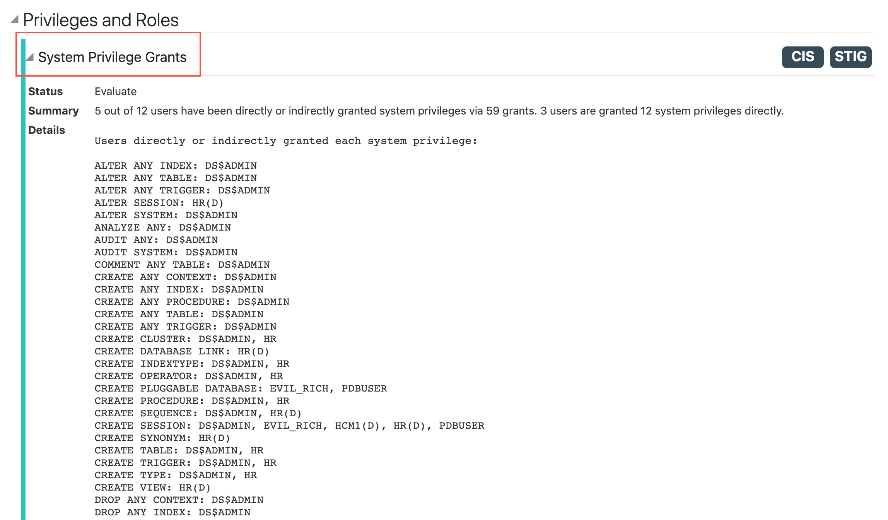

  - Fix: In SQL Developer, run the following query on your database to find out who has the `PDB_DBA` role. Sort the results by `GRANTED_ROLE` to make it easy to identify the users with the role. Then, revoke the `PDB_DBA` role from the `EVIL_RICH` user account.

```
<copy>select * from dba_role_privs;</copy>
```

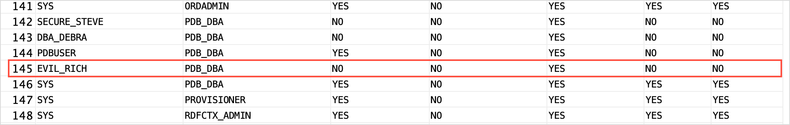

```
<copy>revoke pdb_dba from EVIL_RICH;</copy>
```

- Focus on **Audit Records**:
  - Auditing is an essential component for securing any system. The audit trail lets you monitor the activities of highly privileged users. Even though auditing cannot prevent attacks that exploit gaps in other security policies, it does act as a critical last line of defense by detecting malicious activity. Enable unified auditing policies on the database and ensure that audit records exist. This is a STIG, GDPR, and CIS recommended policy.

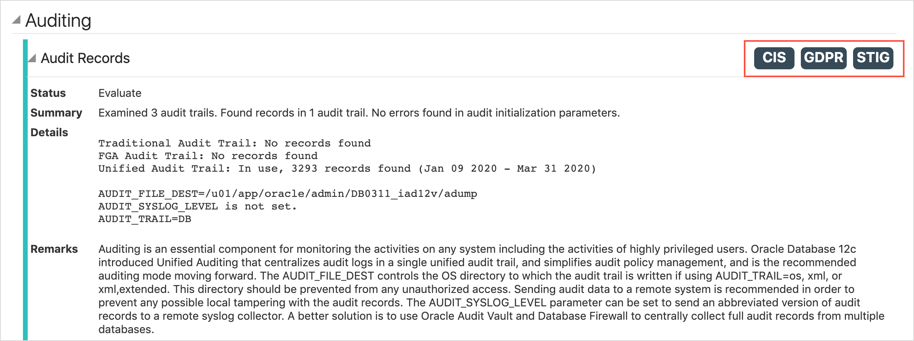

- Review the Details section in this finding and answer these questions: How many audit trails exist in your database and how many of those trails contain audit records? The report states that Security Assessment examined two audit trails and found records in one audit trail. There's only one audit trail because Autonomous Transaction Processing databases are in pure unified audit mode.
- Fix: You do not need to do anything on your database because your database already has unified auditing policies enabled.
- Focus on **Unified Audit**:


- Unified Auditing is the recommended audit method and is available in Oracle Database 12.1 and later releases. Not using Unified Auditing or disabling unified auditing policies is a risk. Verify that unified audit policies are enabled on the database. Audit all sensitive operations, including privileged user activities. Also audit access to application data that bypasses the application.
- How many unified audit policies are on your target database and how many of them are enabled?

### **Step 5:** Review the Pass findings

- At the top of the report, click **Advisory** to filter the report to show only the Advisory findings.

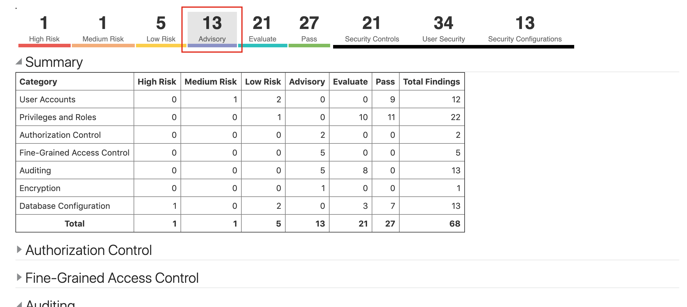

- Deselect all other risk levels.
- Scroll through the report to review the findings. For example, the following findings have a **Pass status**.

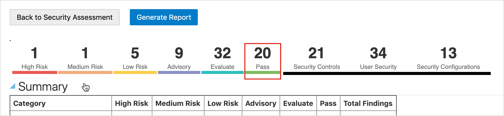

  - User Accounts in `SYSTEM` or `SYSAUX` Tablespace Case-Sensitive Passwords


  - Users with Default Passwords


  - Password Verifiers
  - User Parameters
  - Users with Unlimited Password Lifetime
  - System Privileges Granted to `PUBLIC`

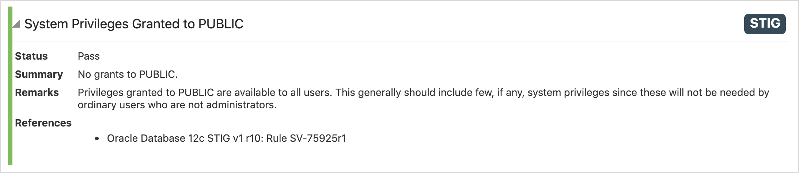

  - Roles Granted to Public


  - Column Privileges Granted to `PUBLIC DBA` Role


  - ....and more

### **Step 6:** Rerun Security Assessment and compare the results to the first assessment

- In the Oracle Data Safe Console, click the **Home** tab, and then click **Security Assessment**.
- On the **Security Assessment** page, select the check box for your target database, and then click **Assess**.
- In the **Last Generated Report** column, click the **View Report** link. The **Comprehensive Assessment** report is displayed.
- View the totals for the risk levels.
If you fixed any of the previous risks, then the totals will be lower than in the first assessment.
- Check the **Account Management Privileges** entry in the Evaluate category. Notice that `EVIL_RICH` is no longer listed.
- To compare the results with the first assessment, do the following:
 - Click the **Reports** tab.
 - Click **Security Assessment**.
 - Click **Comprehensive Assessments**.
 - Click the previous assessment report to open it.

> **Note:**
Currently, there's no compare functionality in the product so to compare assessment results, you need to view both reports and manually compare

### All Done!
