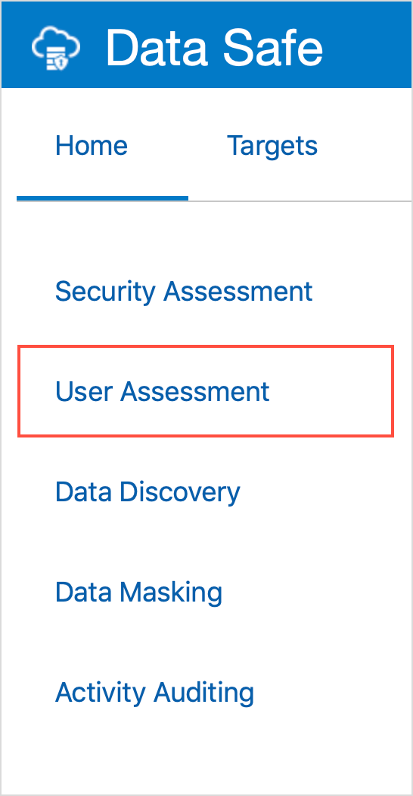
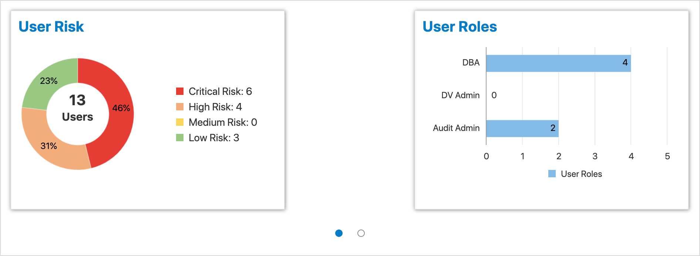
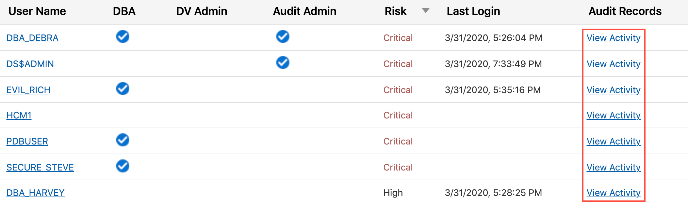
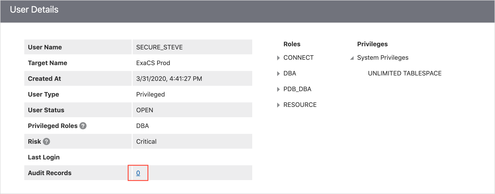

# Assess Users with Oracle Data Safe

## Introduction
Using Oracle Data Safe, assess user security in your target database by using the User Assessment feature and fix issues.

To log issues and view the Lab Guide source, go to the [github oracle](https://github.com/oracle/learning-library/issues/new) repository.

## Objectives
In this lab, you learn how to:
- Assess user security in your target database by using the User Assessment feature in Oracle Data Safe.
- Fix some issues pertaining to user security.

## Challenge
Suppose that recent data breaches in your industry occurred due to stolen credentials of high-privileged users. You are notified by “Audit and Compliance” to quickly report high risk users on your target database and show their recent activity. You want to know who the users are and what entitlements they have.

## Steps

### Step 1: Sign in to the Oracle Data Safe Console for your region

- From the navigation menu, click **Data Safe**


- You are taken to the **Registered Databases** Page.
- Click on **Service Console**


- You are taken to the Data Safe login page. Sign into Data Safe using your credentials.


### Step 2: In SQL Developer connect to SYS user
Please visit [Lab 4: Configuring a development system for use with your EXACS database](?lab=lab-4-configure-development-system-for-use) for instructions to securely configure ExaCS to connect using Oracle SQL Developer, SQLXL and SQL*Plus.

### Step 3: Run User Assessment on your target database
- In the Oracle Data Safe Console, click the **Home** tab, and then click **User Assessment**. The User Assessment page is displayed.



- Select the check box for your target database, and click **Assess**.


- Wait for the report to generate.
- When the report is generated, view the totals in the **Critical Risk**, **High Risk**, **Medium Risk**, and **Low Risk** columns.
- In the Last Generated Report column, click **View Report**. The User Assessment report is displayed.


### Step 4: Analyze the information in the User Assessment report
- View the **User Risk** chart. This chart compares the number of critical, high, medium, and low risk users.
- View the **User Roles** chart. This chart compares the number of users with the DBA, DV Admin, and Audit Admin roles.


- Click the second small circle below the charts to view the third and fourth charts.
- View the **Last Password Change** chart. This chart shows you the number of users who have changed their passwords in the last 30 days, the last 30-90 days, and 90 days ago or more.
- View the **Last Login** chart. This chart shows you the number of users that logged in in the last 24 hours, in the last week, within the current month, within the current year, and a year ago or more.


### Step 5: Search the results for Critical and High risk users
- Click the **+** sign to view the list of columns that you can display in the table. Add and remove columns as you wish, and then close the list.


- In the **Audit Records** column, click **View Activity** for the following users to view the audit records that they generated. Filters are automatically applied to **Operation Time** and **User Name**. Click Back to **User Assessment report** to return to the **User Assessment** report.



- `SECURE_STEVE`: Notice that `SECURE_STEVE` has not generated any audit records. This use may be a rogue user.



- `DBA_DEBRA`: Notice that `DBA_DEBRA` has several login failures. Some other user may be trying to log in with this account.
- `DBA_DEBRA`: Notice that `DBA_DEBRA` has the Audit Admin role, but has not generated any audit records.
- View more detail about `DBA_DEBRA`:
  - In the table, click `DBA_DEBRA`. The **User Details** dialog box is displayed.
  - On the right, expand the roles to view the privileges.
  - On the left, click the question mark next to **Risk**. Here you can review the factors that designate a user as Critical, High, Medium, or Low risk.
  - Click outside the dialog box to close it.
  - Close the User Details dialog box.

### Step 6: In SQL Developer, make changes to the user accounts

- In SQL Developer, run the following code to drop `SECURE_STEVE`:

```
<copy>drop user SECURE_STEVE cascade;</copy>
```
- Run the following code to revoke the `AUDIT_ADMIN` role from `DBA_DEBRA`:

```
<copy>revoke audit_admin from DBA_DEBRA</copy>
```
### Step 7: Rerun User Assessment on your target database
- Return to Oracle Data Safe.
- Click the **Home** tab, and then click **User Assessment**.
- Select the check box for your target database, and then click **Assess**.
- Click **View Report**.
- Look for changes in the **User Assessment** report. Notice that `DBA_DEBRA` no longer has the `AUDIT_ADMIN` role.
