# Analyze Audit Data with Reports and Alerts in Oracle Data Safe

## Introduction
Using Data Safe, access, interpret, and manipulate reports in Oracle Data Safe so that you can improve the overall security of your databases.

To **log issues**, click [here](https://github.com/oracle/learning-library/issues/new) to go to the github oracle repository issue submission form.

## Objectives

In the lab, you learn how to do the following:
- Access, interpret, and manipulate reports in Oracle Data Safe so that you can improve the overall security of your databases.

## Requirements

To complete this lab, you need to have the following:
- Login credentials for your tenancy in Oracle Cloud Infrastructure
- An Oracle Data Safe service enabled in a region of your tenancy
- A registered target database in Oracle Data Safe with sample audit data
- An audit policy created on your target database, alerts configured, and an audit trail started. If not, see [Auditing Lab 1 - Provision Audit and Alert Policies and Configure an Audit Trail in Oracle Data Safe](?lab=lab-12-5-provision-audit-alert-policies).

## Challenge

Follow these general steps:
1. Sign in to the Oracle Data Safe Console for your region.
2. View the report that shows you all audited activities. Try to determine which statements are expected and which might be related to a breach. How many privilege changes have occurred? (Hint: **All Activity** report)
3. Find out who is causing alerts in your target database and what they are doing? Which alerts can you close and why? (Hint: **All Alerts** report).
4. Find out how many client hosts have connected to your target database in the last month (Hint: **Audit Summary** report).
5. Create a report named Failed Logins in PDF format for your auditors. Only show failed logins in the report (Hint: **Login Activity** report).
6. Create a report to see which client programs are using the HCM1 database account and understand the activities being performed (Hint: **All Activity** report).
7. Explore which user entitlements were changed (Hint: **User/Entitlement Changes** report).
8. Explore which audit policies were changed (Hint: **Audit Policy Changes** report).
9. View the report that shows you who viewed the EMPLOYEES table (Hint: **Data Access** report).
10. View the report that shows you who modified key tables, such as the EMPLOYEES table (Hint: **Data Modification** report).
11. View the report that shows you which schema objects were modified by the ADMIN user (Hint: **Database Schema** Changes report).

**Note:**
The totals and data in your reports will most likely be different than the reports shown here.

## Steps

### Step 1: Explore the All Activity report to view and analyze audit data

- In the Oracle Data Safe Console, click the **Reports** tab.
- On the left, click **Activity Auditing**.
  - You can open reports by clicking them in the left pane or by clicking their links in the content pane.
  - The content pane lists all of the reports available to you.
- Click the audit report named **All Activity**. This report shows all of your audit records.

- Notice that the report is automatically filtered to show one week's worth of audit data.

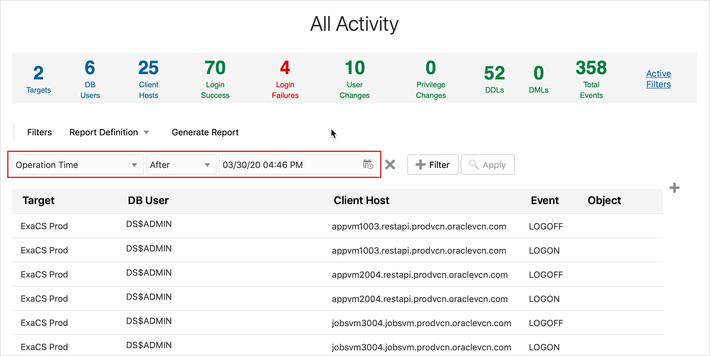

- To change the columns that are displayed in the report, do the following:
  - Click the plus sign to the right of the column headings.
  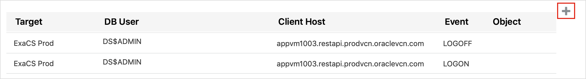
  - In the **Select Columns** dialog box, select and deselect columns.
  - Click Apply.
- In the report, identify the following activities. Try to determine which statements are expected and which might be related to a breach. Create filters to help you find the information. Click on the **+ Filter** button to add these filters.
  - Logins made by the HCM1 user. To do this, create two filters: 1) **Event = LOGON**, and 2) **DB User = HCM1**.
  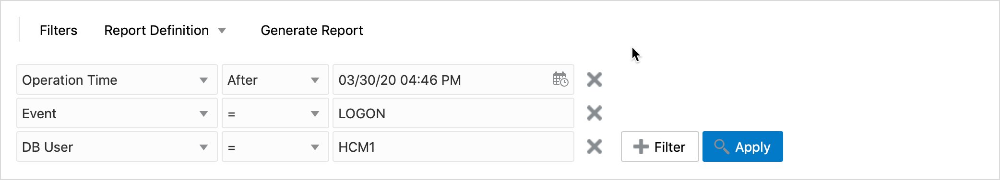
- Let's take a look at a few of the other items:
    - **DDL statements**. To do this, at the top of the report, click **DDLs**.
  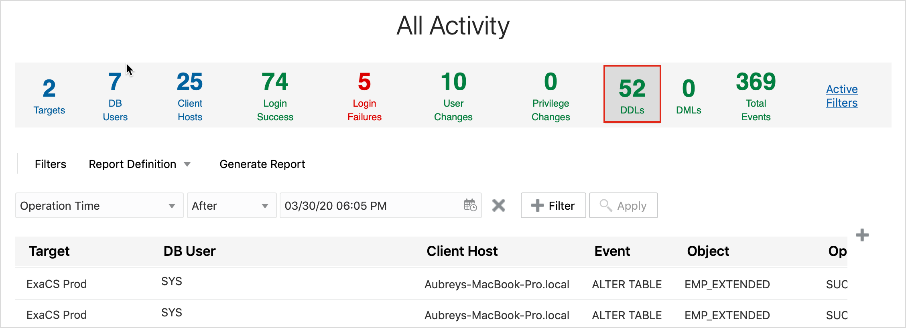
    - **DML statements**. To do this, at the top of the report, click **DMLs**.
    - **User entitlement changes**. To do this, at the top of the report, click **Privilege Changes**.
    - **User changes**. To do this, at the top of the report, click **User Changes**.
- At the top of the report, view totals for targets, DB users, client hosts, login successes, login failures, user changes, privilege changes, DDLs, and DMLs. How many privilege changes do you see?

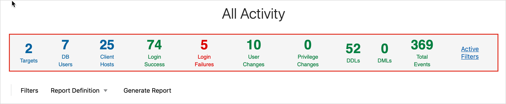

### Step 2: Explore the All Alerts report
Find out who is causing alerts in your target database and what they are doing. The alerts are generated based on the alert conditions configured and audit data retrieved from the audit trail.
- Click the **Alerts** tab.
- The **All Alerts** report is displayed by default.

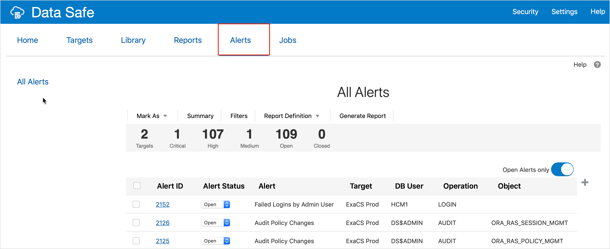

- The **DB User** column identifies who is doing the action.
- The **Operation** column identifies the action.
- The **Alert Severity** column indicates how serious the action is.

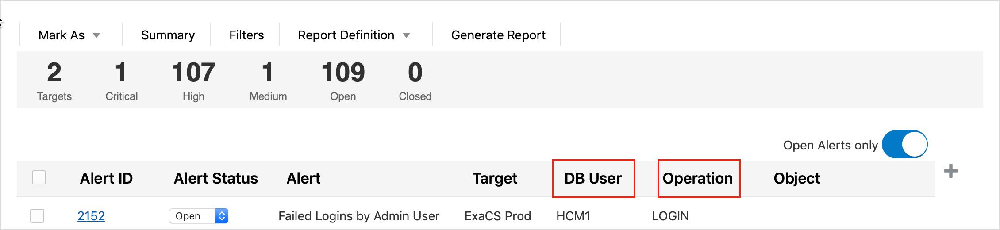

- You can manage alerts by changing their statuses to **Open** or **Closed**.

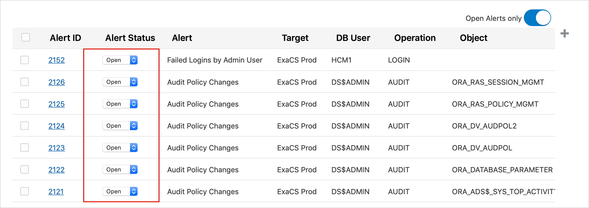

- Click an alert ID to view its details.
The **Alert Details** dialog box is displayed.

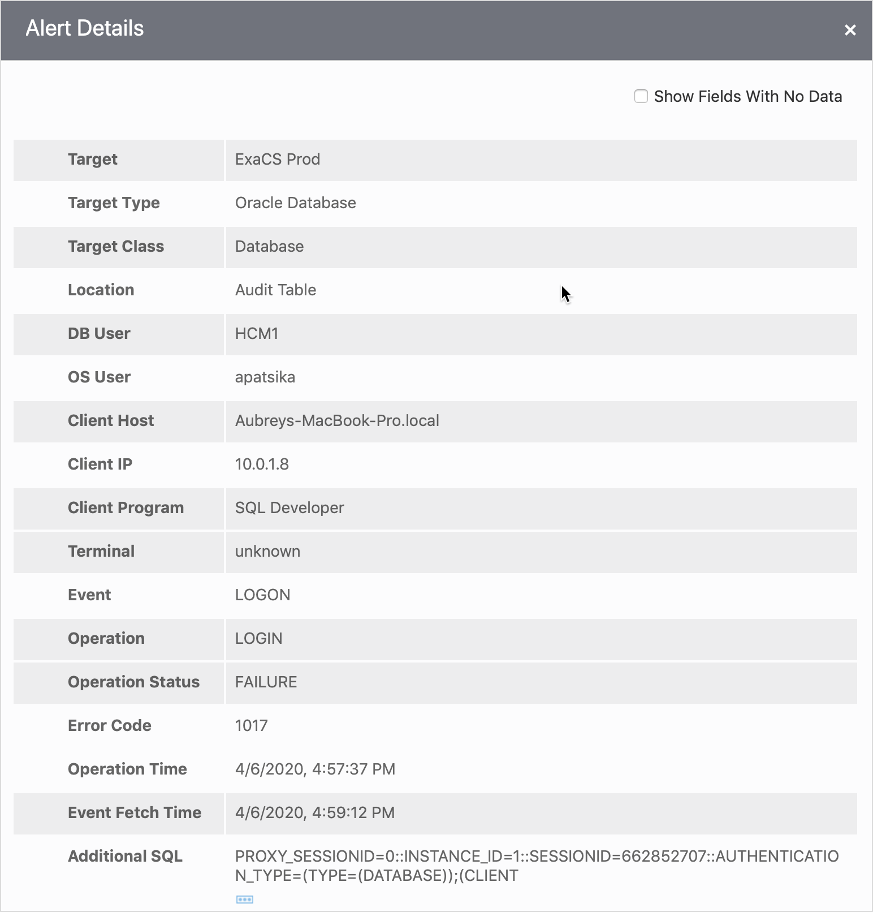

- If you want to view all the fields, click **Show Fields With No Data**.

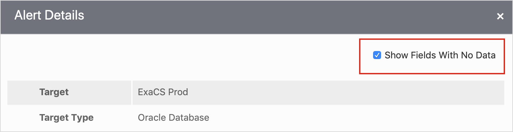

- Expand **Additional SQL**.
All the fields on this screen are retrieved from the target database audit trail.

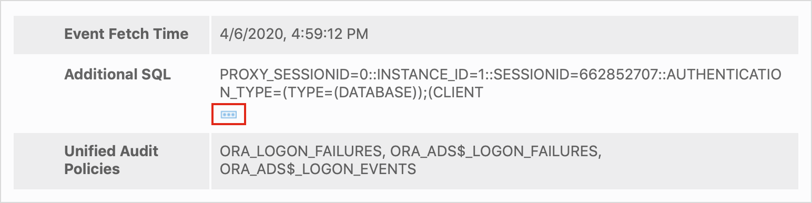

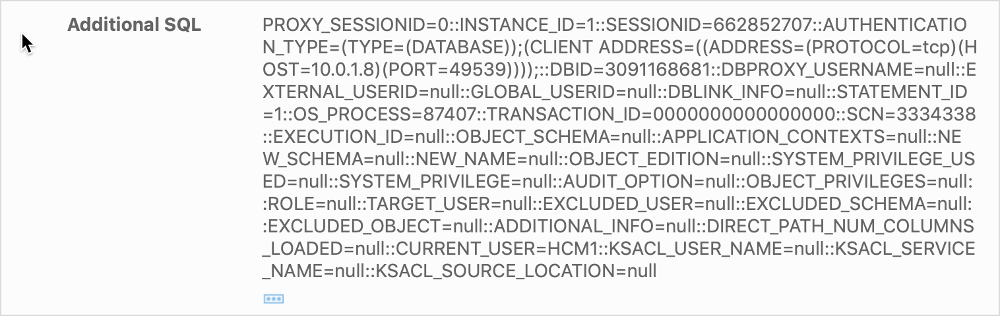

- Close the dialog box.
- At the top of the report, click **Summary** to view totals for target databases, critical alerts, high risk alerts, medium risk alerts, and open alerts. At a glance, you can better understand whether the security of your database is in jeopardy and how you should prioritize your work.
- You can set filters on the report to show specific alert records. For example, you may want to focus on the critical alerts first.
- Click **Active Filters**.
- Filter by **Alert Severity = CRITICAL** or **Alert Severity = HIGH**, depending on whether there are CRITICAL alerts or not.

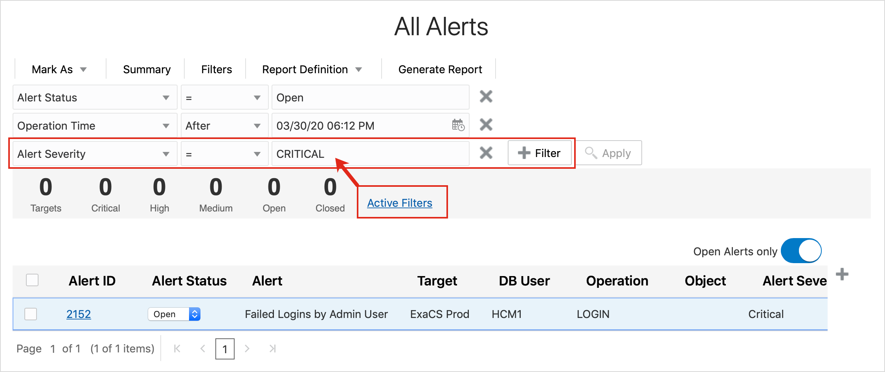

- Click the first alert ID to view its detail, and then close the dialog box.
- Set the status of the first alert to **Closed**. This is an action you can take after you review an alert and decide that the issue is resolved.
- To view open alerts only, move the slider at the top of the report to the right. The report, by default, is filtered this way.

### Step 3: Explore the Audit Summary report
Find out how many client hosts have connected to your target database in the last month.
- Click the **Reports tab**.
- In the left pane, click **Summary Reports**.

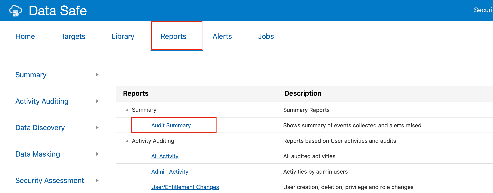

- This is a graphical report that shows you a summary of events collected and alerts raised. You can gain an understanding of the activity trends for one or more of your target databases.

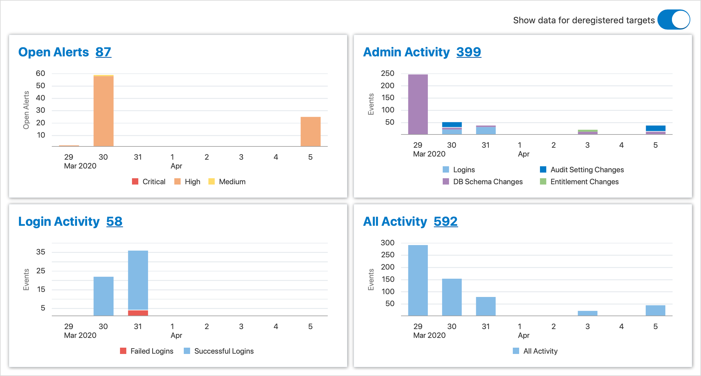

- To filter the time period for the report, at the top, select **Last 1 Month**, and then click **Apply**.

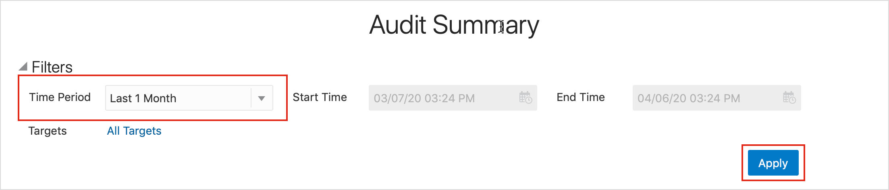

- To filter the target database for the report, do the following:
  - Click **All Targets**. The **Select Targets** dialog box is displayed.
  - Deselect the check box for **All Targets**.
  - Click the field and select your database.
  - Click **Done**.

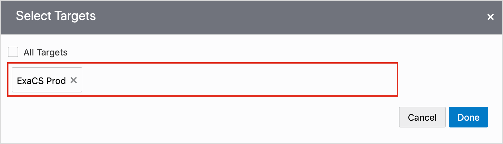

- View the summary totals to learn how many target databases are represented in the charts, how many users have been audited, and how many client hosts have connected to your target databases.
How many client hosts have connected to your database?
- Take a close look at the graphs.
  - The **Open Alerts** graph compares the number of critical, high, and medium open alerts over time.
  - The **Admin Activity** graph compares the number of logins, database schema changes, audit setting changes, and entitlement changes over time.
  - The **Login Activity** chart compares the number of failed and successful logins over time.
  - The **All Activity** chart compares the total number of events over time.

### Step 4: Create a failed logins report in PDF format

- Click the **Reports** tab.
- In the left pane, click **Activity Auditing**, and then click **Login Activity**.

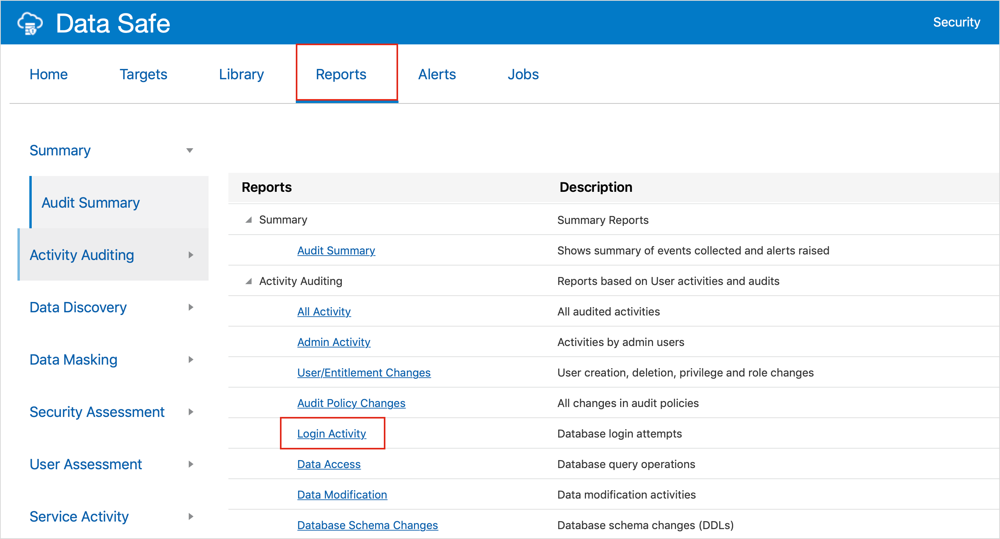

- Set a filter by selecting **Operation Status= FAILURE**.
- Click **Apply**.

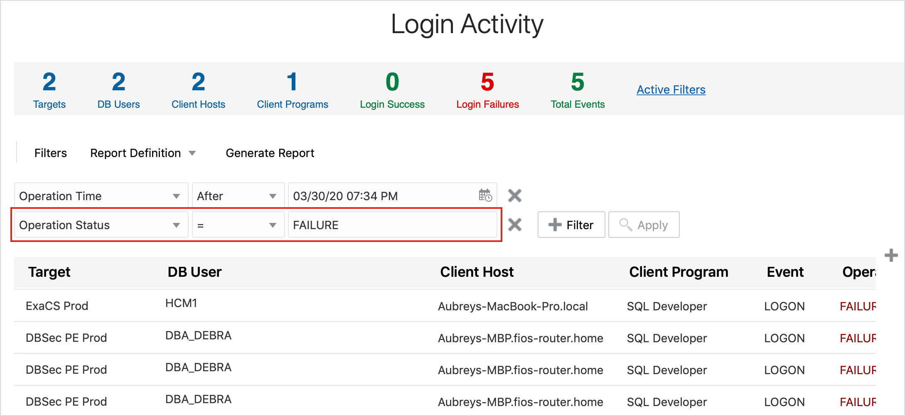

- Save the report:
  - From the **Report Definition** menu, select **Save As New**.
  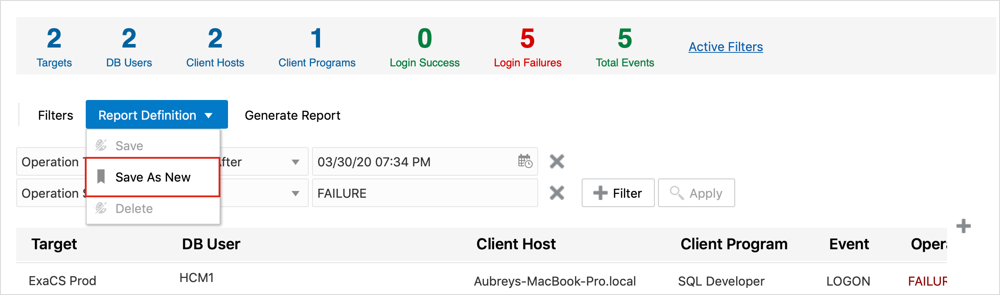
  - In the **Save As** dialog box, enter the report name **<user name> Failed Logins**, for example, and **Failed Logins Report** as a description.
  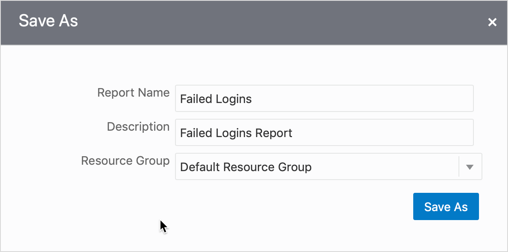
  - Enter an optional description.
  - Select your resource group.
  - Click **Save As**.
  - A confirmation message states "Successfully created the report.".

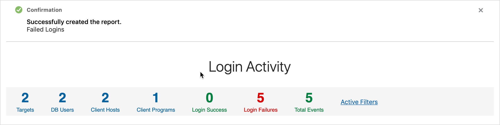

- Click the **Reports** tab.
At the top of the report list, under **Custom Reports**, click the name of your failed logins report.
(If your custom report is not listed, please refresh the browser window.)

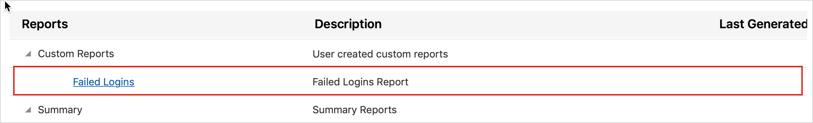

- Click **Generate Report**.

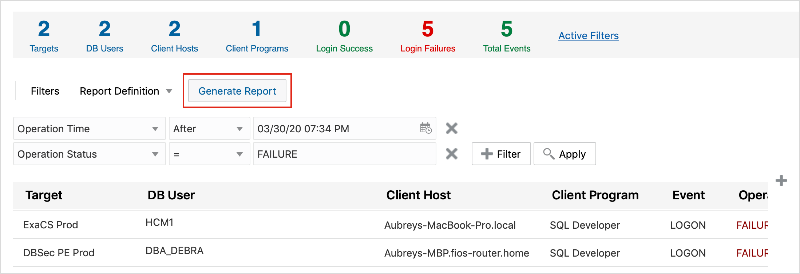

- The Generate Report dialog box is displayed.
  - Leave **PDF** selected.
  - Select your resource group.
  - Click **Generate Report**.
  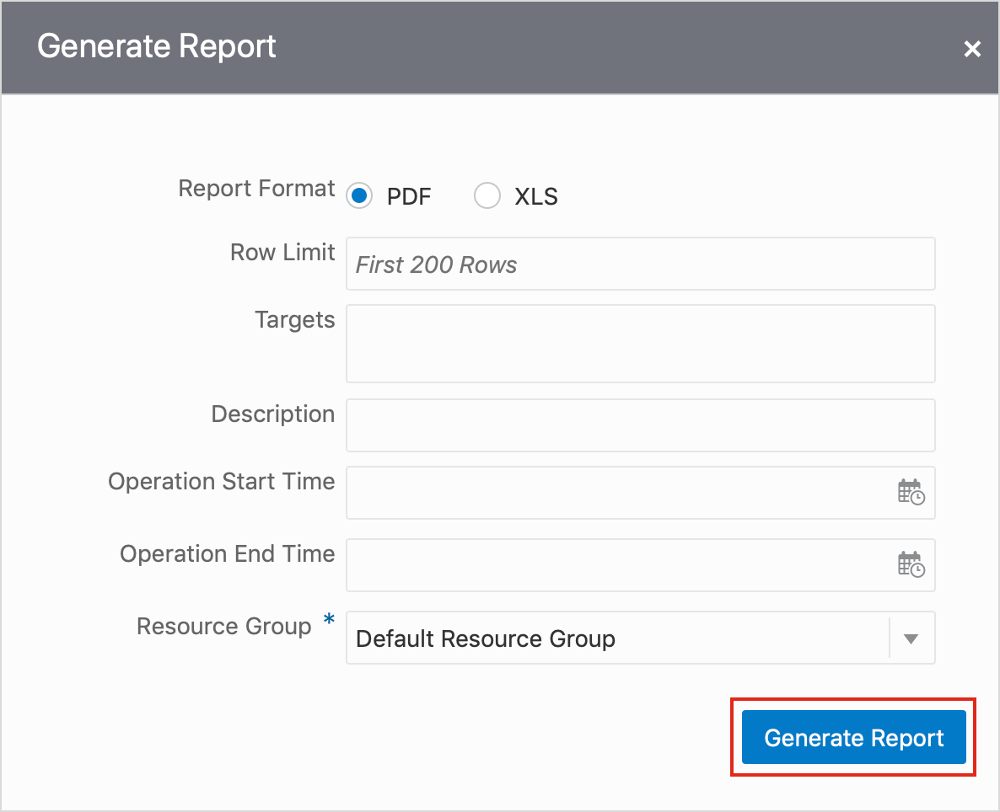
- Wait for the report to generate.
A confirmation message states that the report is generated successfully.

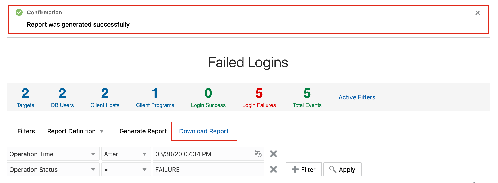

- Click **Download Report**. The report is downloaded to your browser.
- Click the **Failed Logins.pdf** file to open and view it.

- When you are finished, close the browser tab for the report.

### Step 5: Create a report to see which client programs are using the HCM1 database account and understand the activities being performed

- Click the **Reports** tab.
- Under **Activity Auditing** in the content pane, click the **All Activity** report.

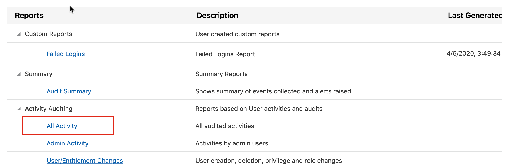

- Click the plus sign and add the **Client Program** column to the report.

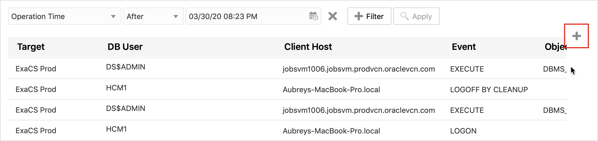

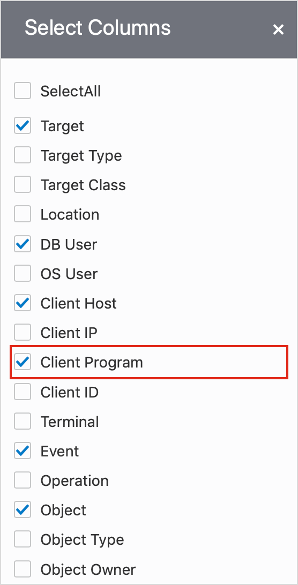

- Remove any existing filters by click the **X** button next to a filter.

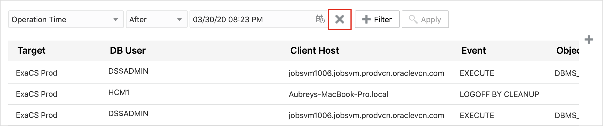

- If filters are not displayed, click **Filters**.
- Click the **+ Filter** button to create a filter.
- Configure the filter to be **DB User = HCM1**, and click **Apply**.

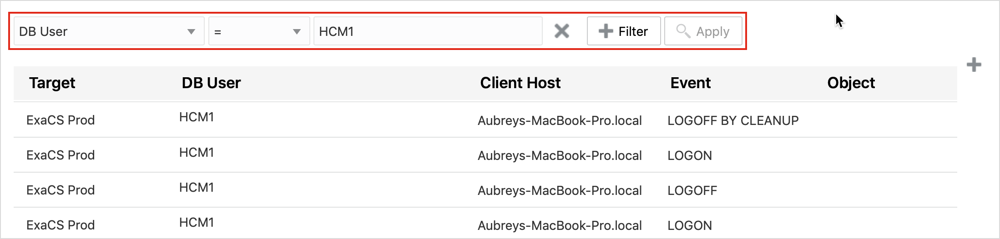

- Click on any failure to view the actions taken.
- From the **Report Definition** menu, select **Save As New**. The **Save As** dialog box is displayed.

- Enter the report name **<user name> HCM1 Account Usage**.
- Select your resource group.
- Click **Save As**. The report is saved.
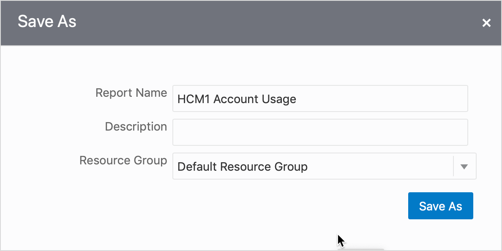
- Click the **Reports** tab.
- Under **Custom Reports** at the top of the list, notice that your report is listed. (If your new report is not listed, please refresh the browser window).
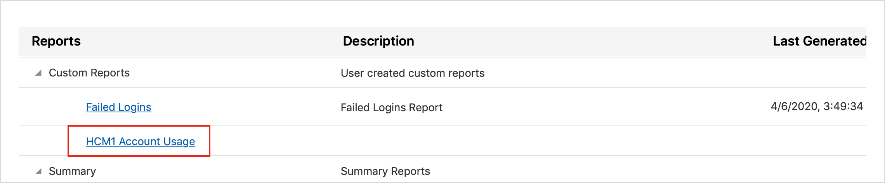
- Click the **<user name> HCM1 Account Usage** report to view it.

### Step 6: Explore which users entitlements were changed

- Click the **Reports** tab.
- In the left pane, click **Activity Auditing**, and then click **User/Entitlement Changes**.
- Set a filter by selecting **DB USER Not In SYS, ADMIN**.
- Click **Apply**.

- Examine the report.
- Notice that the `EVIL_RICH` user created and dropped the `ATILLA` user.

### Step 7: Explore the Data Access report
View this report to find out who viewed the EMPLOYEES table.
- Click the **Reports** tab.
- In the left pane under **Activity Auditing**, click **Data Access**.
- Set a filter by selecting **OBJECT = EMPLOYEES**.

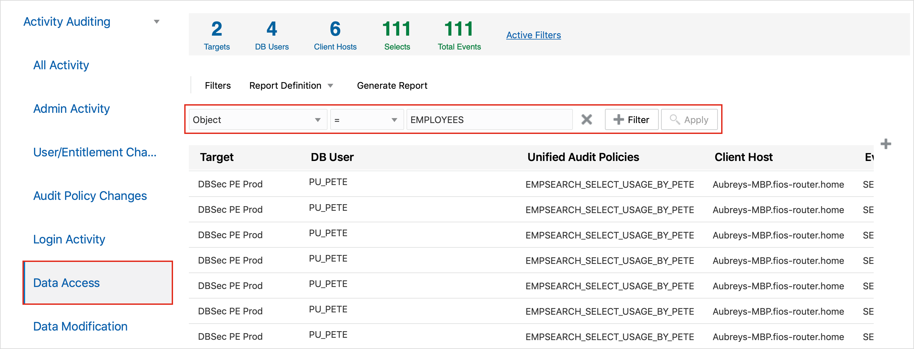

- Who saw this data?
- Click a row to see the SQL executed.

### Step 8: Explore the Data Modification report
View this report to find out who modified key tables, such as the `EMPLOYEES` table. The `EMPLOYEES` table contains sensitive information.
- Click the **Reports** tab.
- In the left pane under **Activity Auditing**, click **Data Modification**.
- Set a filter by selecting **OBJECT = EMPLOYEES**.
- Click **Apply**.
- Examine the report.
- Notice that `ATILLA` tried to change some data and failed.
- Click any row and view the SQL text to note the type of change made.
- Notice that in some cases, `ATILLA` tried to update the `SALARY` data, but failed.

### Step 9: Explore the Database Schema Changes report
View this report to identify which schema objects were modified by the ADMIN user.
- Click the **Reports** tab.
- In the left pane under **Activity Auditing**, click **Database Schema Changes**.
- Set a filter by selecting **DB User = SYS**.
- Click **Apply**.
- Examine the report to view the changes made by the **SYS** user.
- Click a row to view the details.

### All Done!
