# Discover and Mask Sensitive Data by Using Default Masking Formats in Oracle Data Safe

## Introduction
Using Data Safe, view sensitive data in your Exadata Cloud Service (ExaCS) database and discover sensitive data by using Data Discovery. Also, mask sensitive data by using the default masking formats in Data Masking and validate.

To **log issues**, click [here](https://github.com/oracle/learning-library/issues/new) to go to the github oracle repository issue submission form.

Watch the video below for an overview on how to discover and mask sensitive data by using default masking formats in Oracle Data Safe

<div style="max-width:768px"><div style="position:relative;padding-bottom:56.25%"><iframe id="kaltura_player" src="https://cdnapisec.kaltura.com/p/2171811/sp/217181100/embedIframeJs/uiconf_id/35965902/partner_id/2171811?iframeembed=true&playerId=kaltura_player&entry_id=1_r3xno1g8&flashvars[streamerType]=auto&amp;flashvars[localizationCode]=en&amp;flashvars[leadWithHTML5]=true&amp;flashvars[sideBarContainer.plugin]=true&amp;flashvars[sideBarContainer.position]=left&amp;flashvars[sideBarContainer.clickToClose]=true&amp;flashvars[chapters.plugin]=true&amp;flashvars[chapters.layout]=vertical&amp;flashvars[chapters.thumbnailRotator]=false&amp;flashvars[streamSelector.plugin]=true&amp;flashvars[EmbedPlayer.SpinnerTarget]=videoHolder&amp;flashvars[dualScreen.plugin]=true&amp;flashvars[hotspots.plugin]=1&amp;flashvars[Kaltura.addCrossoriginToIframe]=true&amp;&wid=1_8umiyo4o" width="768" height="432" allowfullscreen webkitallowfullscreen mozAllowFullScreen allow="autoplay *; fullscreen *; encrypted-media *" sandbox="allow-forms allow-same-origin allow-scripts allow-top-navigation allow-pointer-lock allow-popups allow-modals allow-orientation-lock allow-popups-to-escape-sandbox allow-presentation allow-top-navigation-by-user-activation" frameborder="0" title="Kaltura Player" style="position:absolute;top:0;left:0;width:100%;height:100%"></iframe></div></div>

## Objectives

In this lab, you learn how to do the following:
- View sensitive data in your Exadata Cloud Service (ExaCS) database
- Discover sensitive data by using Data Discovery
- Mask sensitive data by using the default masking formats in Data Masking
- Validate the masked data in your ExaCS database

## Challenge

Follow these general steps:
1. Connect to your ExaCS database with SQL Developer.
2. Use SQL Developer to query sensitive data in the HCM1.EMPLOYEES table in your ExaCS database.
3. Sign in to the Oracle Data Safe Console for your region.
4. In Oracle Data Safe, launch the Data Masking wizard and discover sensitive data in the `HCM1` schema. Retrieve sample data and search for all sensitive types. Name your sensitive data model **<username> SDM2**. Examine the sensitive data model, and then review the Data Discovery report.
5. Continue in the Data Masking wizard to define a masking policy for your sensitive data model. Name it **<username> Mask1_HCM1**. Use all of the default masking formats automatically configured by Oracle Data Safe. Schedule the data masking job to run immediately. After the job runs, view and analyze the Data Masking report. Generate a PDF of the report and download it.
6. Return to SQL Developer Web and query the `HCM1.EMPLOYEES` table in your ExaCS database. Verify that the sensitive data is now masked.

## Steps

### Step 1: Connect to your ExaCS database with SQL Developer

Please visit [Lab 4: Configuring a development system for use with your EXACS database](?lab=lab-4-configure-development-system-for-use) for instructions to securely configure ExaCS to connect using Oracle SQL Developer, SQLXL and SQL*Plus.

### Step 2: View sensitive data in your ExaCS database

- In the SQL Developer worksheet, run the following command to connect to your PDB:
```
<copy>ALTER SESSION SET CONTAINER= <PDBNAME></copy>
```

- Run the following query to select the `EMPLOYEES` table:

```
<copy>SELECT * FROM HCM1.EMPLOYEES</copy>
```

- Review the query results. Data such as `employee_id`, `first_name`, `last_name`, `email`, `phone_number`, `hire_date`, `job_id`, `salary`, and `manager_id` are considered sensitive data and should be masked if shared for non-production use, such as development and analytics.
- Keep this tab open so that you can return to it later in part 4 when you view the masked
data.

### Step 3: Sign in to the Oracle Data Safe Console for your region

- From the navigation menu, click **Data Safe**

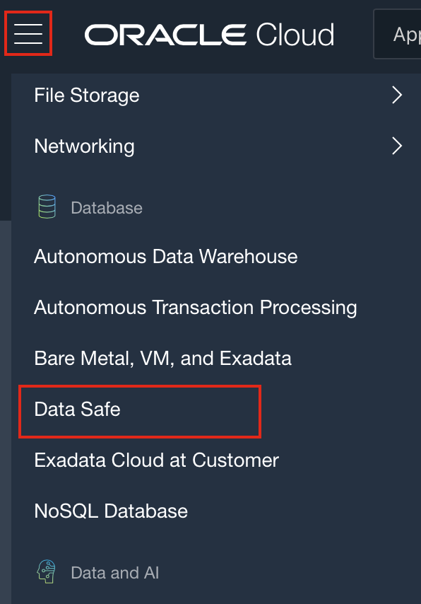

- You are taken to the **Registered Databases** Page.
- Click on **Service Console**


- You are taken to the Data Safe login page. Sign into Data Safe using your credentials.

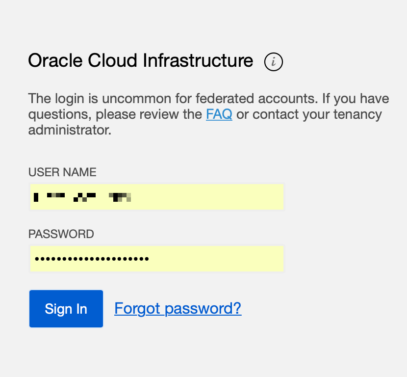

### Step 4: Discover sensitive data by using Data Discovery

- Access the **Data Discovery** wizard by clicking the **Data Discovery** tab.

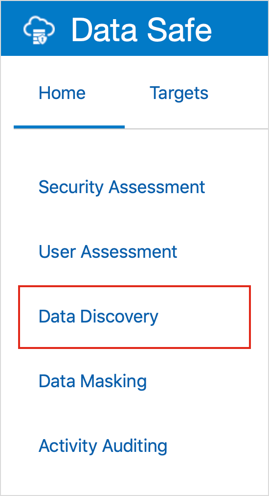

- The **Select Target for Sensitive Data Discovery** page is displayed.

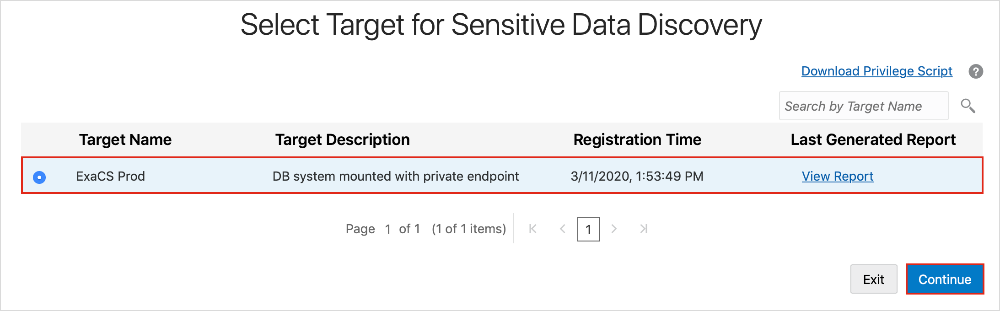

- Select your target database, and then click **Continue**.
- The Select **Sensitive Data Model** page is displayed.
- Leave **Create** selected, enter **<username> SDM2** for the name, enable **Show and save
sample data**, select your resource group, and then click **Continue**.

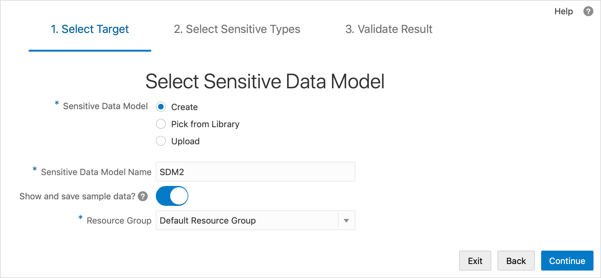

- The **Select Schemas for Sensitive Data Discovery** page is displayed.
- Scroll down and select the `HCM1` schema, and then click **Continue**.

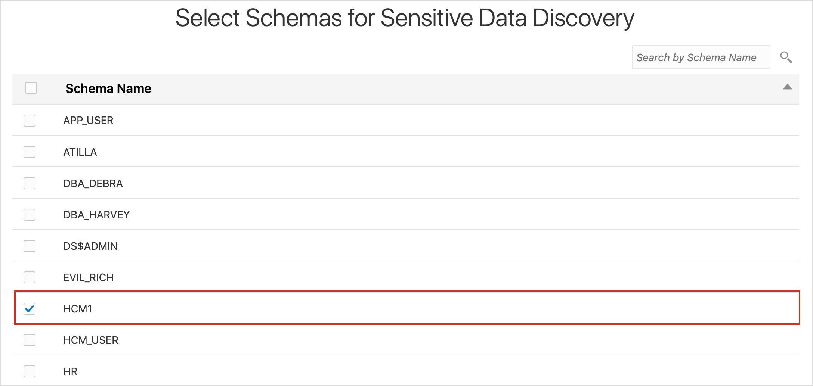

- The **Select Sensitive Types for Sensitive Data Discovery** page is displayed.
- **Expand all** of the categories by moving the slider to the right, and then scroll down the page and review the sensitive types.
- Notice that you can select individual sensitive types, sensitive categories, and all sensitive
types.

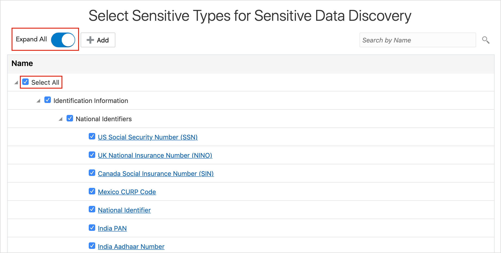

- At the top of the page, select the **Select All** check box, and then click **Continue** to start
the data discovery job.
- When the job is completed, ensure that the **Detail** column states `Data discovery job finished successfully`, and then click **Continue**.

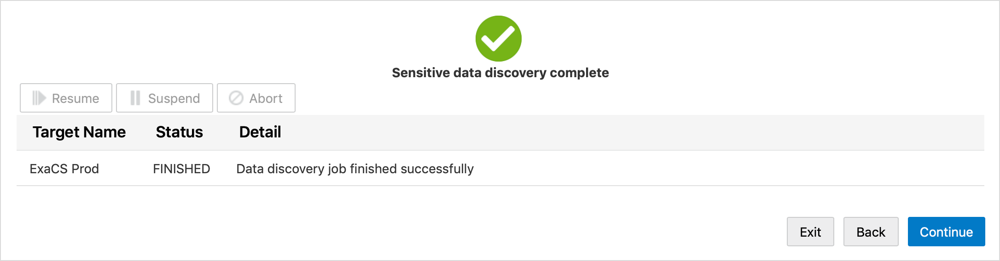

- The **Sensitive Data Discovery Result** page is displayed.
- Examine the sensitive data model created by the Data Discovery wizard.
- To view all of the sensitive columns, move the **Expand All** slider to the right. Oracle Data Safe automatically saves your sensitive data model to the Oracle Data Safe Library.

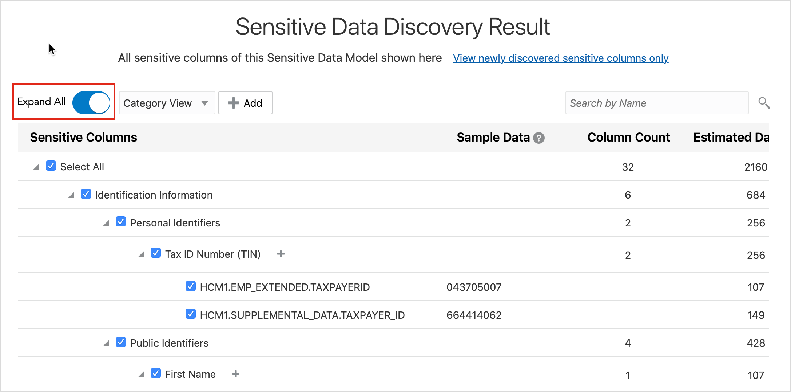

- From the drop-down list, select **Schema View** to sort the sensitive columns by table.

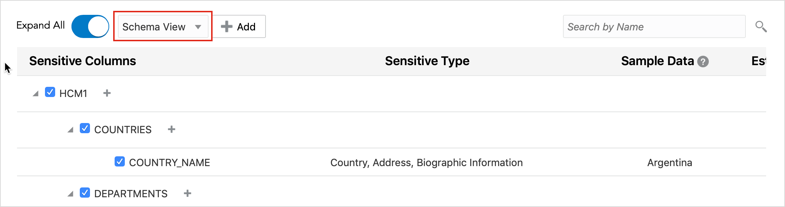

- Scroll down the page to view the sensitive columns. You can view sample data (if it's available for a sensitive column), column counts, and estimated data counts. In particular, take a look at the sensitive columns that Data Discovery found in the `EMPLOYEES` table. Columns that do not have a check mark are called referential relationships. They are included because they have a relationship to another sensitive column and that relationship is defined in the database's data dictionary.
- Also view the sample data provided to get an idea of what the sensitive data looks like.

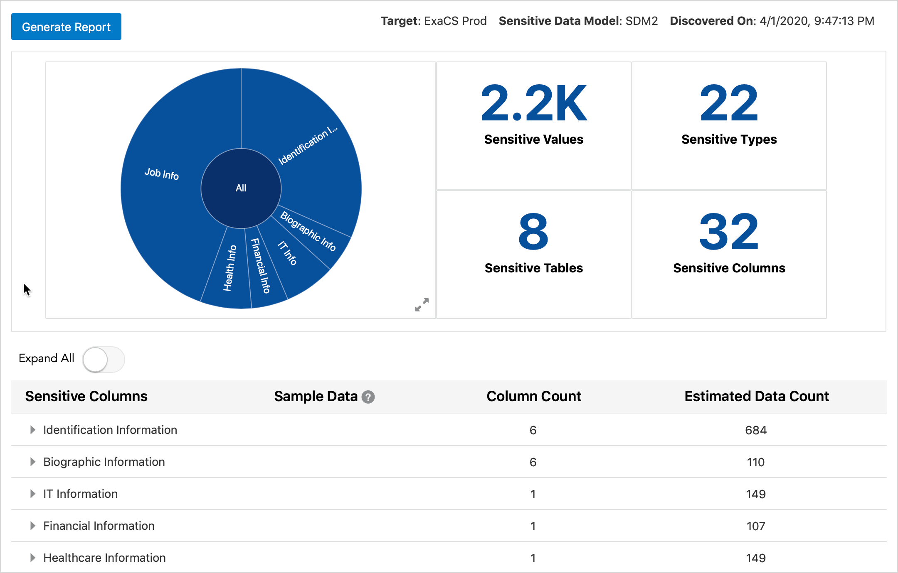

- Scroll to the bottom of the page, and then click **Report** to view the Data Discovery report. The chart compares sensitive categories. You can view totals of sensitive values, sensitive types, sensitive tables, and sensitive columns. The table displays individual sensitive column names, sample data for the sensitive columns, column counts based on sensitive categories, and estimated data counts.
15. Click the chart's **Expand** button.
16. Position your mouse over **Identification Info** to view statistics.
17. With your mouse still over **Identification Info**, click the **Expand** button to drill down.
18. Notice that the **Identification Info** category is divided into two smaller categories (**Personal IDs and Public IDs**).
19. To drill-up, position your mouse over an expanded sensitive category, and then click the **Collapse** button.
20. Click the **Close** button (**X**) to close the expanded chart. Continue to work in the wizard.

### Step 5: Mask sensitive data by using Data Masking

- Click **Continue to mask the data**.

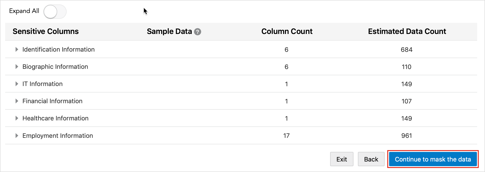

- On the **Select Target for Data Masking** page, your target database is selected. Click **Continue**. The **Masking Policy** page is displayed.

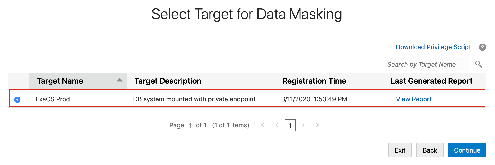

- In the field below **Masking Policy**, enter **Mask1_HCM1** for the masking policy name.
- Move the **Expand All** slider to the right to view all of the sensitive columns.


- Scroll down the page to view the default masking format selected for each sensitive column.
- For the `HCM1.LOCATIONS.STREET_ADDRESS` column, click the arrow to the right of the masking format to view other masking formats.

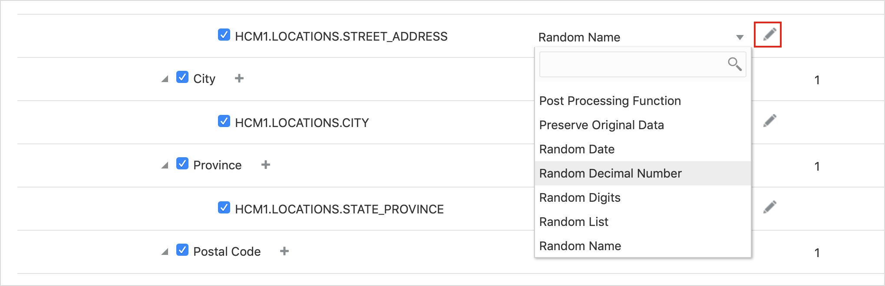

- Next to the arrow, click the **Edit Format** button (pencil icon). The **Edit Format** dialog box is displayed.
- View the description, examples, and default configuration for the masking format. This is where you can modify a masking format.
- Click **Cancel**.
- At the bottom of the page, click **Confirm Policy**, and then wait a moment while Data Masking creates the masking policy. The **Schedule the Masking Job** page is displayed.

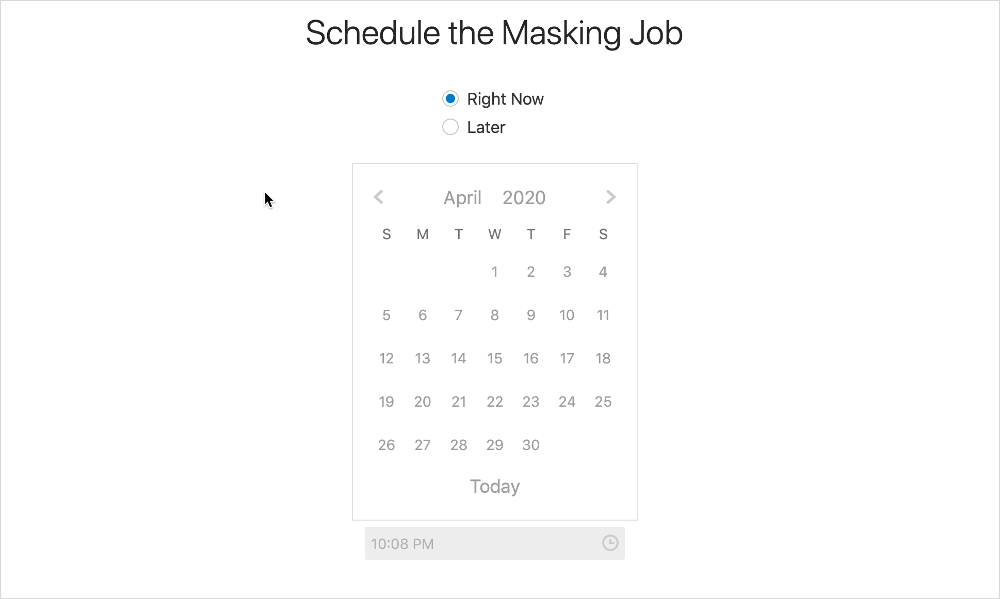

- Leave **Right Now** selected, and then click **Review**. The **Review and Submit** page is displayed.
- Review the information, and then click **Submit** to start the data masking job.

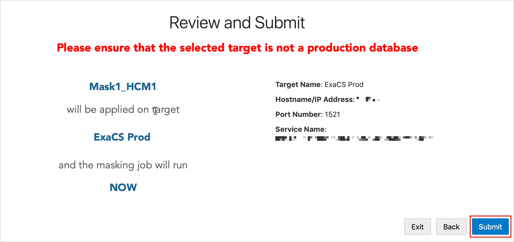

- Wait for the data masking job to finish. It takes a couple of minutes. You can follow the status of the job on the **Masking Jobs** page.

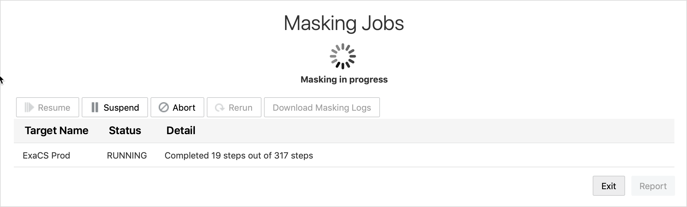

- When the job is finished, click **Report**.

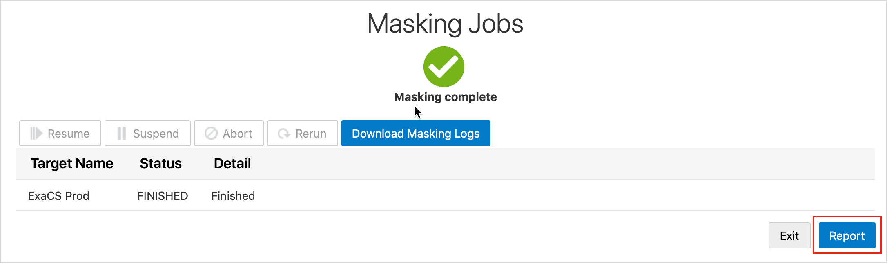

- Examine the **Data Masking** report. At the top of the report, you can view the number of values, sensitive types, tables, and columns that were masked. The table shows you column counts for the sensitive categories and types. For each
sensitive column, you can view the masking format used and the number of rows masked.

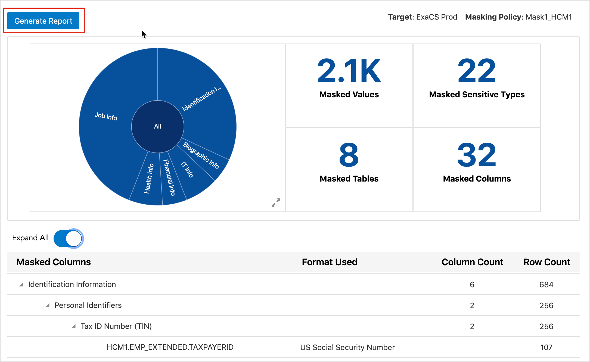

- Click **Generate Report**.
- In the **Generate Report** dialog box, leave **PDF** selected, enter **<username> Mask1_HCM1** for the description, ensure your resource group is selected, and then click **Generate Report**.

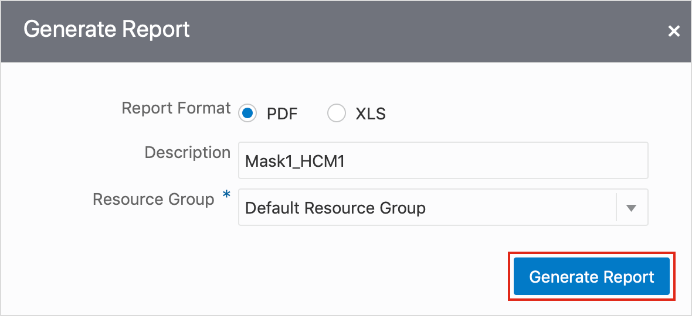

- Wait for the report to generate. When it's generated, click **Download Report**.

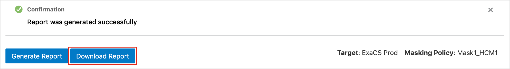

- Access the browser's downloads and open the report in Adobe Acrobat. Review the report, and then close it.


### Step 6: Verify the masked data in your ExaCS database

1. Return to SQL Developer. You should still have your query results from Part 2 in this lab.
2. Take a moment to review the data.
3. On the toolbar, click the **Run Statement** button (green circle with a white arrow) to execute the query.
4. If a dialog box is displayed stating that your session has expired, click **OK**, sign in again, and then click the **Run Statement** button.
5. Review the masked data. You can resize the panel to view more data, and you can scroll down and to the right.

### All Done!
