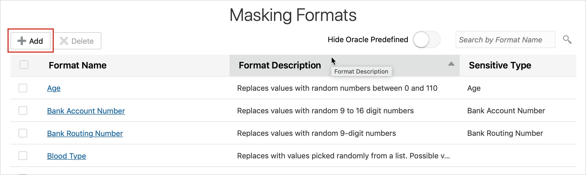
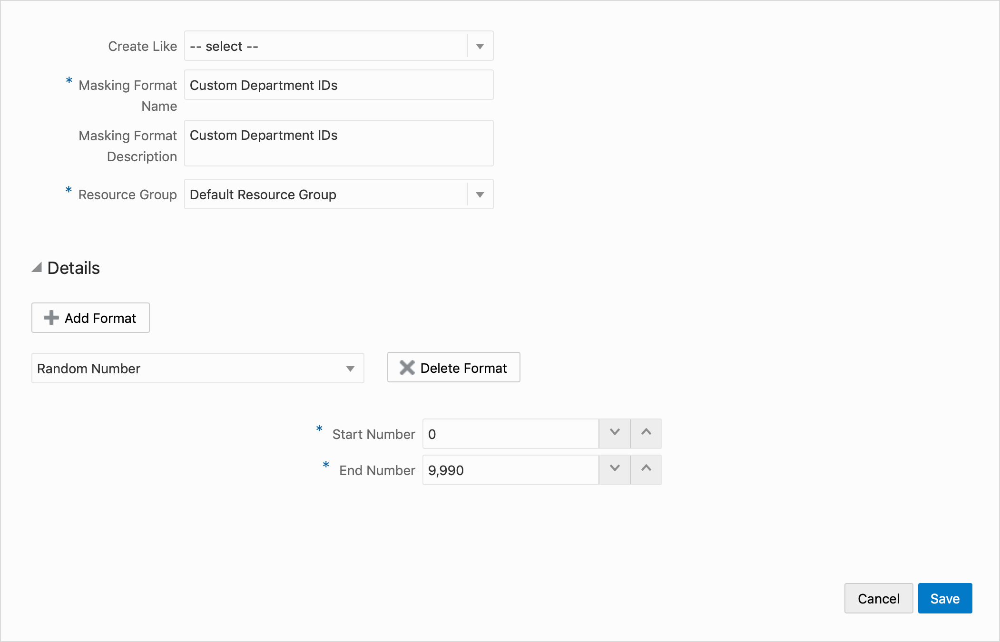
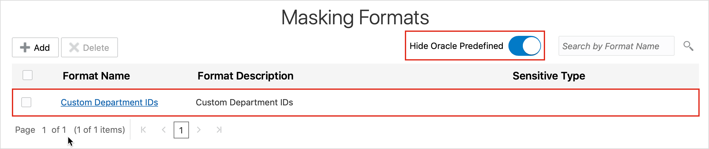

# Create a Masking Format in Oracle Data Safe

## Introduction
Using Data Safe, create a masking format and assign a default masking format to a user-defined sensitive type.

To **log issues**, click [here](https://github.com/oracle/learning-library/issues/new) to go to the github oracle repository issue submission form.

## Objectives

In this lab, you learn how to do the following:
- Create a masking format.
- Assign a default masking format to a user-defined sensitive type.

## Challenge

You have department IDs in your target database that you need to mask. You decide to create a masking format in Oracle Data Safe to mask the data.

Follow these general steps:
1. Sign in to your ExaCS database as the SYS user with SQL Developer.
2. In SQL Developer, research the `DEPARTMENT_ID` column in your target database to help you figure out how to create a masking format for it.
3. Sign in to the Oracle Data Safe Console for your region.
4. In the Oracle Data Safe Console, create a masking format to mask the `HCM1.DEPARTMENT_ID` column in your target database.
5. Select your masking format as the default masking format for the sensitive type that you created in [Discovery Lab 4 - Create a Sensitive Type and Sensitive Category with Oracle Data Safe](?lab=lab-7-7-create-sensitive-type-sensitive) (<username> **Custom Department ID Number)**.

## Steps

### Step 1: Connect to your ExaCS database as the SYS user with SQL Developer

Please visit [Lab 4: Configuring a development system for use with your EXACS database](?lab=lab-4-configure-development-system-for-use) for instructions to securely configure ExaCS to connect using Oracle SQL Developer, SQLXL and SQL*Plus.

### Step 2: In SQL Developer Web, research the `DEPARTMENT_ID` column in your target database to help you figure out how to create a masking format for it

- Run the following command:

```
<copy>ALTER SESSION SET CONTAINER=PDB1;</copy>
```

- Next run a select on the `DEPARTMENTS` table

```
<copy>SELECT * FROM HCM1.DEPARTMENTS;</copy>
```
- Notice that the department ID values are 10, 20, 30, up to 270.
- Click the **Data Modeler** tab.
- In the first drop-down list, select `HCM1`.
- In the second drop-down list, select **Tables**.
- Drag the `DEPARTMENTS` table to the worksheet.
- Notice that the `DEPARTMENT_ID` column has the data-type `NUMBER(4)`, which means it can take up to four digits (no decimals). It is also a primary key column.

### Step 3: Sign in to the Oracle Data Safe Console for your region

- From the navigation menu, click **Data Safe**


- You are taken to the **Registered Databases** Page.
- Click on **Service Console**


- You are taken to the Data Safe login page. Sign into Data Safe using your credentials.


### Step 4: In the Oracle Data Safe Console, create a masking format to mask department IDs

- In the Oracle Data Safe Console, click the **Library** tab.
- Click **Masking Formats**, and then click **Add**.



- The **Create Masking Format** dialog box is displayed.
- Leave the **Create Like** drop-down list as is.
- In the **Masking Format Name** field, enter **<username> Custom Department IDs**.
- In the **Masking Format Description** field, enter **Custom Department IDs**.
- Select your resource group.
- From the Format drop-down list, select **Random Number**.
- In the **Start Number** field, enter **10**.
- In the **End Number** field, enter **9990**.



- Click **Save**.<br>
A confirmation message states that you successfully created the masking format.
- Move the **Hide Oracle Predefined** slider to the right and verify that your masking format is listed.



### All Done!
