# Configure a Variety of Masking Formats with Oracle Data Safe

## Introduction
Using Data Safe, perform data discovery and data masking in one flow, configure a variety of masking formats, such as random number, fixed string, group shuffle, regular expression, and conditional and pre-defined custom mask.

To **log issues**, click [here](https://github.com/oracle/learning-library/issues/new) to go to the github oracle repository issue submission form.

## Objectives

In this lab, you learn how to do the following:
- Perform data discovery and data masking in one flow.
- Configure a variety of masking formats, such as random number, fixed string, group shuffle, regular expression, and random date.
- Use conditional masking for a masking format.
- Select a predefined and custom masking format for a sensitive type.

## Challenge
You want to discover and mask your sensitive data all within the same flow in Oracle Data Safe. You configure a variety of masking formats, including basic masking formats, predefined masking formats, and the user-defined masking format you created in [Masking Lab 3 - Create a Masking Format in Oracle Data Safe](?lab=lab-12-3-create-masking-format-oracle-data).

Follow these general steps:
1. Sign in to the Oracle Data Safe Console for your region.
2. Launch the Data Masking wizard and discover sensitive data in the `HCM1` schema. Select all of the predefined sensitive types and the sensitive type that you created in [Discovery Lab 4 - Create a Sensitive Type and Sensitive Category with Oracle Data Safe](?lab=lab-7-7-create-sensitive-type-sensitive). Save your sensitive data model as **<username> SDM3**. Clear all of the selected sensitive columns in the masking policy, and define masking formats only for those listed in steps 3 through 13 below. Save your masking format as **<username> Mask2_HCM1**.
3. Configure a masking format for `EMP_EXTENDED.TAXPAYERID` to generate random numbers between **100,000,000** and **899,999,999**.
4. Configure a masking format for `SUPPLEMENTAL_DATA.TAXPAYER_ID` to generate a fixed string `***-**-****`.
5. Configure a masking format for `EMPLOYEES.FIRST_NAME` to generate a fixed string **< username >_tiger**.
6. Configure a masking format for `LOCATIONS.POSTAL_CODE` to generate 5-digit random numbers between **10000** and **99999**.
7. Configure a masking format for `COUNTRIES.COUNTRY_NAME` to shuffle values within each `REGION_ID`.
8. Configure a masking format that masks columns with email addresses that contain `@ORACLE.COM` to end with `@EXAMPLE.COM`.
9. Configure a masking format for `JOB_HISTORY.DATE_OF_TERMINATION` that generates dates from two years ago to the present.
10. Configure a masking format for `EMPLOYEES.SALARY` that masks values greater than **10000** with the fixed number **10000**.
11. Configure a masking format for `SUPPLEMENTAL_DATA.BONUS_AMOUNT` that generates a random list of values, including **1000**, **1500**, **2000**, **2500**, and **3000**.
12. Configure a masking format for `EMP_EXTENDED.PAYMENTACCOUNTNO` that generates random Visa credit card numbers.
13. Configure a masking format for `DEPARTMENTS.DEPARTMENT_ID` that uses the masking format you created (**<username> Custom Department IDs**). If you did not create this masking format, see [Masking Lab 3 - Create a Masking Format in Oracle Data Safe](?lab=lab-12-3-create-masking-format-oracle-data). This masking format generates random numbers from **10** to **9990**.
14. Schedule the data masking job to run immediately and then view the masking report.
15. Sign in to your ExaCS database as the `SYS` user with SQL Developer.
16. In SQL Developer, verify that the data is masked according to your masking policy.

## Steps

### Step 1: Sign in to the Oracle Data Safe Console for your region

- From the navigation menu, click **Data Safe**


- You are taken to the **Registered Databases** Page.
- Click on **Service Console**


- You are taken to the Data Safe login page. Sign into Data Safe using your credentials.


### Step 2: Launch the Data Masking wizard and discover sensitive data

- In Oracle Data Safe, click the **Home** tab, and then click **Data Masking**. The **Data Masking** wizard is displayed.
- On the **Select Target for Data Masking** page, select your target database, and then click **Continue**.

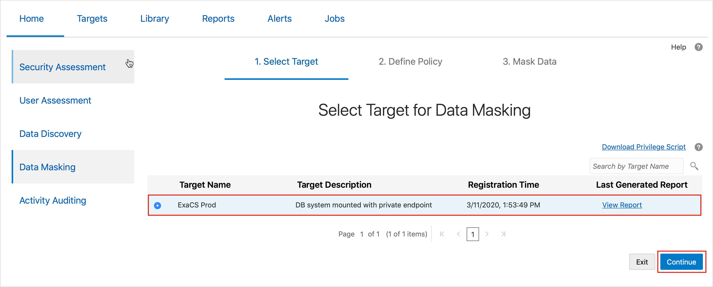

- The **Select Masking Policy** page is displayed.
- For **Masking Policy**, leave **Create** selected.
- For **Masking Policy Name**, enter **Mask2 HCM1**.
- For **Sensitive Data Model**, select **Create**.
- For **Sensitive Data Model Name**, enter **<username> SDM3**.
- Select to **Show and save sample data**.
- Select your resource group.
- Click **Continue**.

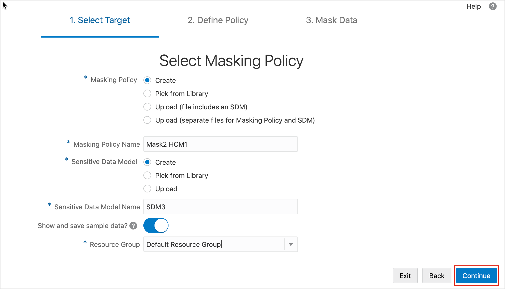

- The **Select Target for Sensitive Data Discovery** page is displayed.
- Select your target database, and then click **Continue**.

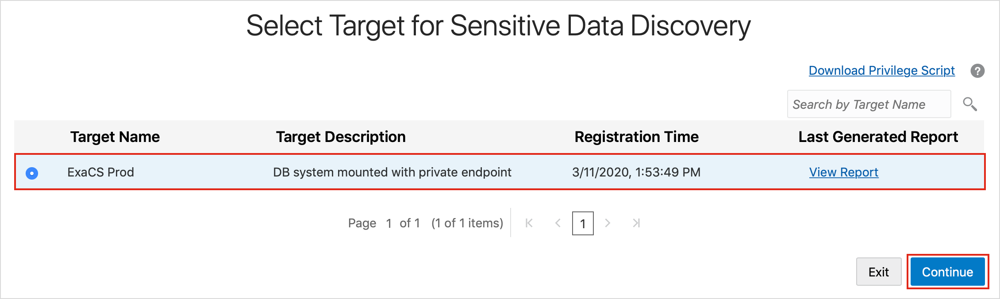

- The **Select Schemas for Sensitive Data Discovery** page is displayed.
- Select the `HCM1` schema, and then click **Continue**.

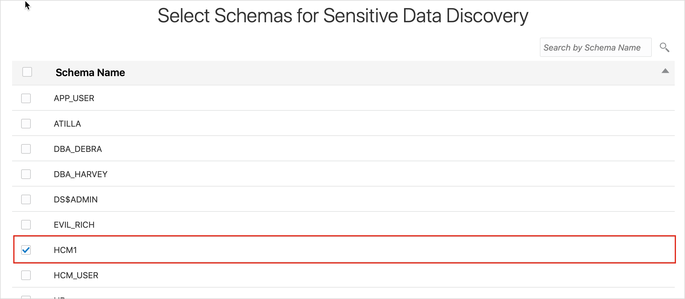

- The **Select Sensitive Types for Sensitive Data Discovery** page is displayed.
-  Select **Select All**.
- To start the data discovery job, click **Continue**.
- When the data discovery job is completed, click **Continue**.


- The **Sensitive Data Discovery Result** page is displayed.
- Click **Save and Continue**.<br>
The **Masking Policy** page is displayed.
- Clear the selected columns by deselecting **Select All**. In this example, you select specific sensitive columns to mask.
- Expand all of the nodes.

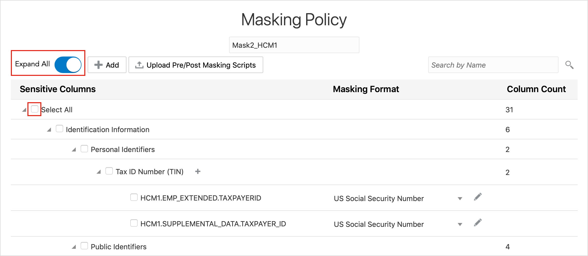

### Step 3: Configure a masking format for `EMP_EXTENDED.TAXPAYERID` to generate random numbers between 100,000,000 and 899,999,999

- Search for `EMP_EXTENDED.TAXPAYERID`, select it in the table to enable it for masking, and then click its **Edit** button (pencil icon). The **Edit Format** dialog box is displayed.

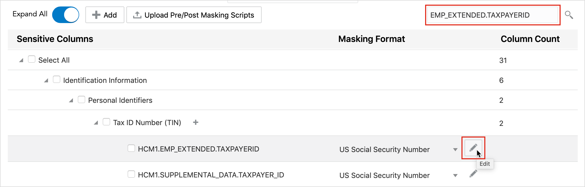

- Select **Random Number**.
- Set **Start Number** equal to **100,000,000**.
  - Leave out the commas in the numbers. Commas are automatically added.
- Set **End Number** equal to **899,999,999**.

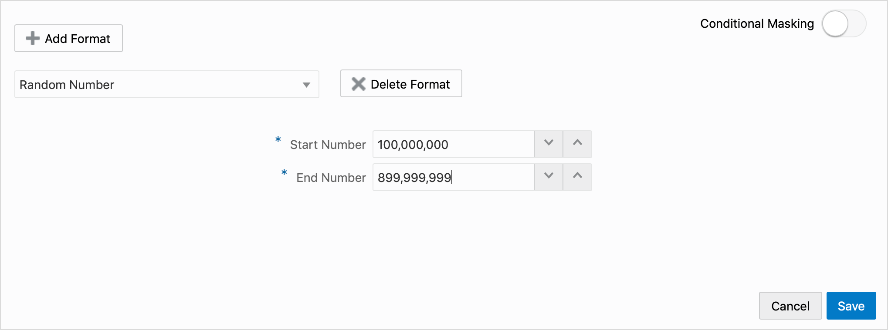

- Click **Save**.

### Step 4: Configure a masking format for `SUPPLEMENTAL_DATA.TAXPAYER_ID` to generate a fixed string `***-**-****`

- Search for `SUPPLEMENTAL_DATA.TAXPAYER_ID`, select it in the table to enable it for masking, and then click its **Edit** button (pencil icon). The **Edit Format** dialog box is displayed.
- Select **Fixed String**.
- Enter the string `***-**-****`.
- Click **Save**.


### Step 5: Configure a masking format for `LOCATIONS.POSTAL_CODE` to generate 5-digit random numbers between 10000 and 99999

- Search for `LOCATIONS.POSTAL_CODE`, select it in the table to enable it for masking, and then click its **Edit** button (pencil icon). The **Edit Format** dialog box is displayed.


- Select **Random Number**.
- Set **Start Number** equal to **10000**.
- Set **End Number** equal to **99999**.
  - You want 5-digit numbers only.
- Click **Save**.

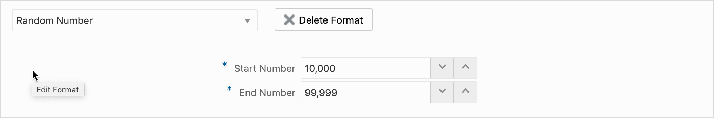

### Step 6: Configure a masking format for `COUNTRIES.COUNTRY_NAME` to shuffle values within each `REGION_ID`

- Search for `COUNTRIES.COUNTRY_NAME`, select it in the table to enable it for masking, and then click its **Edit** button (pencil icon). The **Edit Format** dialog box is displayed.
- Select **Group Shuffle**.
- Enter the grouping column `REGION_ID`, and press **Enter**.
- Click **Save**.


### Step 7: Configure a masking format that masks columns with email addresses that contain `@ORACLE.COM`

- Search for `EMAIL`. The search returns the `HCM1.EMPLOYEES.EMAIL` column.
- Select the `HCM1.EMPLOYEES.EMAIL` column in the table to enable it for masking, and then click its Edit button (pencil icon). The Edit Format dialog box is displayed.
- Select **Regular Expression**.
- Enter the regular expression `@ORACLE.COM`. The text is case-sensitive.
- Enter the replacement expression `@EXAMPLE.COM`.
- Click **Save**.


### Step 8: Configure a masking format for `JOB_HISTORY.DATE_OF_TERMINATION` that generates dates from two years ago to the present

- Search for `JOB_HISTORY.DATE_OF_TERMINATION`, select it in the table to enable it for masking, and then click its **Edit** button (pencil icon). The **Edit Format** dialog box is displayed.
- Select **Random Date**.
- For **Start Date**, configure the date from 2 years ago by using the calendar.
- For **End Date**, configure the current date by using the calendar.
- Click **Save**.

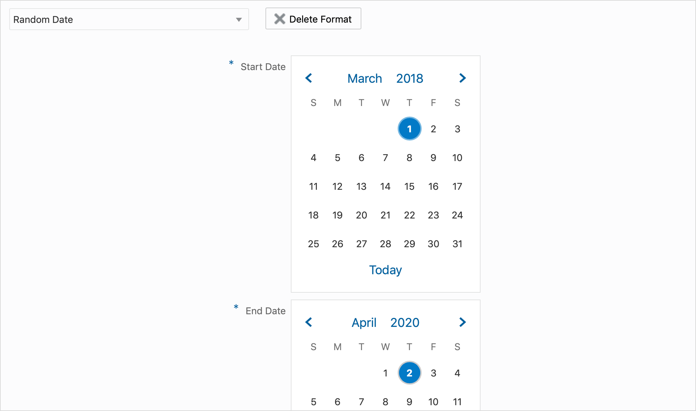

### Step 9: Configure a masking format for `EMPLOYEES.SALARY` that masks values greater than 10,000 with the fixed number 10,000

- Search for `EMPLOYEES.SALARY`, select it in the table to enable it for masking, and then click its **Edit** button (pencil icon). The **Edit Format** dialog box is displayed.
- Move the Conditional Masking slider to the right.
- In the first field, replace **1** with `HCM1.EMPLOYEES.SALARY`.
  - The column must be fully qualified.
- From the drop-down list, select **>**.
- In the second field, enter **10000**.
- Select the **Fixed Number** masking format.
- For **Fixed Number**, enter **10000**.
- Notice that rows that do not meet any of the conditions will be nullified.
- Click **Add Condition**.
- Scroll down to the second condition.
- In the first field, replace 1 with `HCM1.EMPLOYEES.SALARY`.
- From the drop-down list, select **<=**.
- In the second field, enter **10000**.
- Select the **Preserve Original Data** masking format.
- Click **Save**.

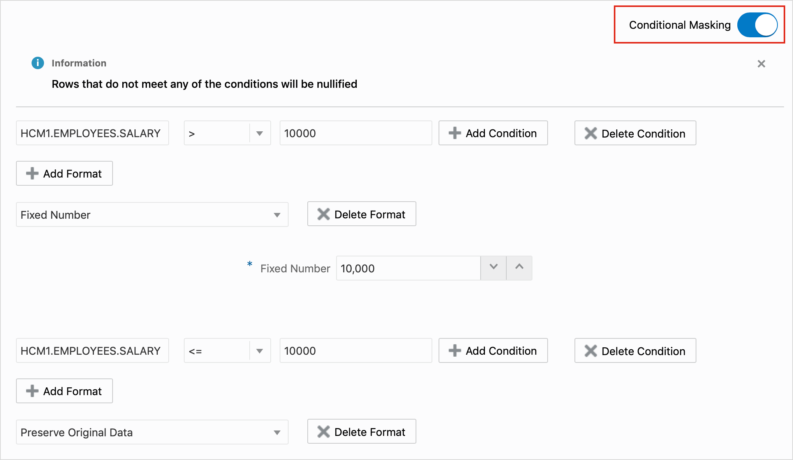

- Notice that the masking format is marked as **Complex Format**.


### Step 10: Configure a masking format for `SUPPLEMENTAL_DATA.BONUS_AMOUNT` that generates a random list of values, including 1000, 1500, 2000, 2500, and 3000

- Search for `SUPPLEMENTAL_DATA.BONUS_AMOUNT`, select it in the table to enable it for masking, and then click its **Edit** button (pencil icon). The **Edit Format** dialog box is displayed.
- If needed, move the **Conditional Masking** slider to the left so that it is disabled.
- Select the **Random List** masking format.
- For **List Of Values**, enter the following random numbers, pressing **Enter** after each one:
 - **1000**, **1500**, **2000**, **2500**, **3000**.
- Click **Save**.


### Step 11: Schedule the data masking job to run immediately and then view the masking report

- **Select all** the sensitive columns and click **Confirm Policy**.

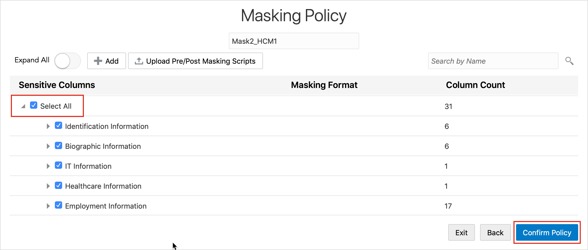

- Schedule the data masking job to run immediately and then view the masking report.


- Click **Review**<br />
Now you are ready to run the data masking job.

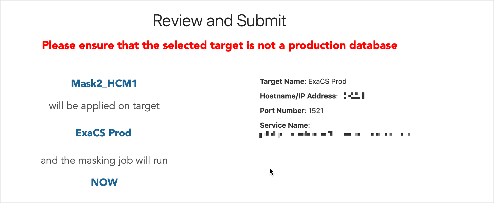

- Click **Submit**
  - How many values are masked?
  - How many tables are masked?

### Step 12: Connect to your ExaCS database as the `SYS` user with SQL Developer

Please visit [Lab 4: Configuring a development system for use with your EXACS database](?lab=lab-4-configure-development-system-for-use) for instructions to securely configure ExaCS to connect using Oracle SQL Developer, SQLXL and SQL*Plus.

### Step 13: In SQL Developer, verify that the data is masked according to your masking policy

Because many of the masking formats use random formulas, your results are probably different than those shown below.

- Select all the contents of the `DEPARTMENTS` table:

```
<copy>SELECT * FROM HCM1.COUNTRIES;</copy>
```

- View the masked data for the `COUNTRY_NAME` column. Clear the worksheet when you're done.
  - Sample data before masking: Argentina `(REGION_ID = 2, COUNTRY_ID = AR)`.
  - Sample data after masking: Argentina `(REGION_ID = 2, COUNTRY_ID = MX)`.
  - **Note:** Follow the same steps with the next tables.

- Select all the contents of the `EMPLOYEES` table:

```
<copy>SELECT * FROM HCM1.EMPLOYEES;</copy>
```

- `EMAIL`: Sample data before masking: `JLIVINGS@ORACLE.COM`. Sample data after masking: `JLIVINGS@EXAMPLE.COM`
- `SALARY`: Sample data before masking: 11000. Sample data after masking: 10000. There should be no salary numbers greater than 10000 and no null values.

- Select all the contents of the `EMPLOYEES` table:

```
<copy>SELECT * FROM HCM1.JOB_HISTORY;</copy>
```

- View the masked data for the `DATE_OF_TERMINATION` column. Clear the worksheet when you're done.
  - Sample data before masking: `03-JAN-84`. Sample data after masking: `29-DEC-18`.

- Select all the contents of the `LOCATIONS` table:

```
<copy>SELECT * FROM HCM1.LOCATIONS;</copy>
```

- View the masked data for the `POSTAL_CODE` column. Clear the worksheet when you're done.
  - Sample data before masking: `YSW 9T2`. Sample data after masking: `61020`. Notice that if a postal code did not exist before, the result is (null).

- Select all the contents of the `SUPPLEMENTAL_DATA` table:

```
<copy>SELECT * FROM SUPPLEMENTAL_DATA;</copy>
```

- View the masked data for the following columns.
  - `TAXPAYER_ID`: Sample data before masking: `406-12-9866`. Sample data after masking: `***-**-****`
  - `BONUS_AMOUNT`: Sample data before masking: `40396`. Sample data after masking: `2500`


#### All Done!
