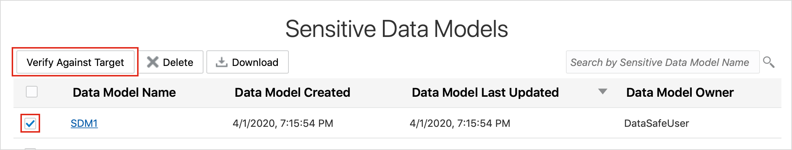
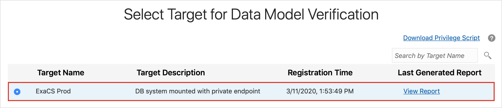
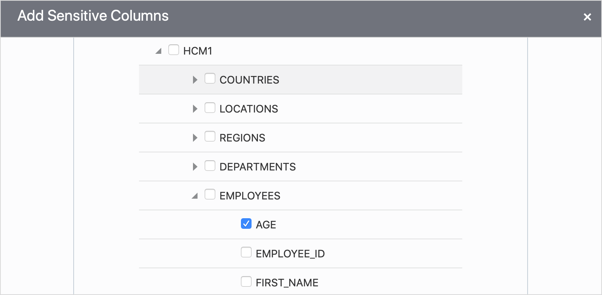
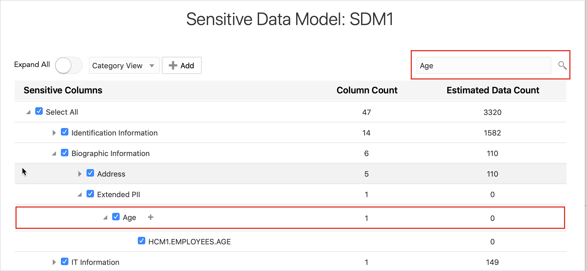
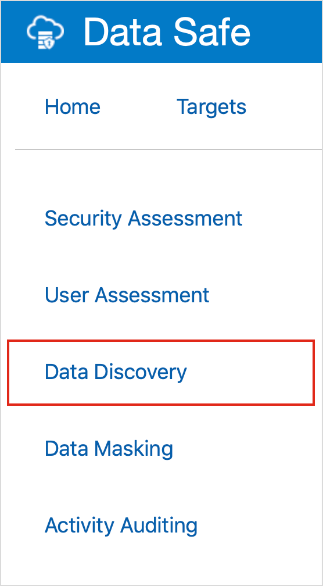
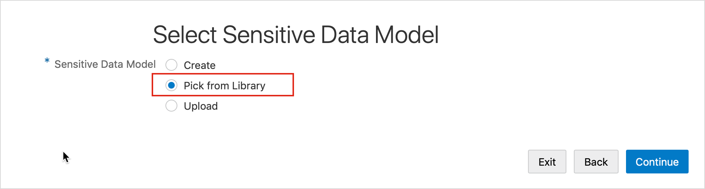
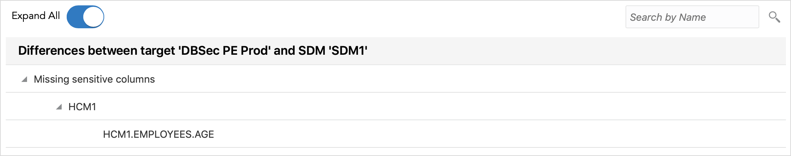

# Verify a Sensitive Data Model with Oracle Data Safe

## Introduction
Using Oracle Data Safe, verify a sensitive data model by using the verification option in the Library and by using the Data Discovery wizard.

### See an issue?
Please submit feedback using this [form](https://apexapps.oracle.com/pls/apex/f?p=133:1:::::P1_FEEDBACK:1). Please include the *workshop name*, *lab* and *step* in your request.  If you don't see the workshop name listed, please enter it manually. If you would like for us to follow up with you, enter your email in the *Feedback Comments* section.

Watch the video below for an overview on how to verify sensitive Data Model with Oracle Data Safe

<div style="max-width:768px"><div style="position:relative;padding-bottom:56.25%"><iframe id="kaltura_player" src="https://cdnapisec.kaltura.com/p/2171811/sp/217181100/embedIframeJs/uiconf_id/35965902/partner_id/2171811?iframeembed=true&playerId=kaltura_player&entry_id=1_i4slvplf&flashvars[streamerType]=auto&amp;flashvars[localizationCode]=en&amp;flashvars[leadWithHTML5]=true&amp;flashvars[sideBarContainer.plugin]=true&amp;flashvars[sideBarContainer.position]=left&amp;flashvars[sideBarContainer.clickToClose]=true&amp;flashvars[chapters.plugin]=true&amp;flashvars[chapters.layout]=vertical&amp;flashvars[chapters.thumbnailRotator]=false&amp;flashvars[streamSelector.plugin]=true&amp;flashvars[EmbedPlayer.SpinnerTarget]=videoHolder&amp;flashvars[dualScreen.plugin]=true&amp;flashvars[hotspots.plugin]=1&amp;flashvars[Kaltura.addCrossoriginToIframe]=true&amp;&wid=1_ye07oxoy" width="768" height="432" allowfullscreen webkitallowfullscreen mozAllowFullScreen allow="autoplay *; fullscreen *; encrypted-media *" sandbox="allow-forms allow-same-origin allow-scripts allow-top-navigation allow-pointer-lock allow-popups allow-modals allow-orientation-lock allow-popups-to-escape-sandbox allow-presentation allow-top-navigation-by-user-activation" frameborder="0" title="Kaltura Player" style="position:absolute;top:0;left:0;width:100%;height:100%"></iframe></div></div>

## Objectives
In this lab, you learn how to do the following:
- Verify a sensitive data model by using the verification option in the Library
- Verify a sensitive data model by using the Data Discovery wizard
- Manually update a sensitive data model stored in the Library

## Challenge

1. Connect to your ExaCS database as `SYS` user with SQL Developer.
2. In SQL Developer, add a column to one of the tables in your target database. For example, add an `AGE` column to the `HCM1.EMPLOYEES` table. Gather schema statistics on your database.
3. Sign in to the Oracle Data Safe Console in your region.
4. In Oracle Data Safe, verify your sensitive data model (**username SDM1**) against your target database by using the verification option on the **Sensitive Data Models** page in the Library. What does the verification test find?
5. If needed, manually add the column to your sensitive data model.
6. In SQL Developer, drop the column from the database.
7. In Oracle Data Safe, run the verification test again against your database, but this time use the Data Discovery wizard. Observe the verification findings. Do you need to do anything to your sensitive data model?
8. If needed, manually update your sensitive data model from the Library so that it accurately reflects your target database.

## Steps

### **Step 1:** Connect to ExaCS DB using SQL Developer

Please visit [Lab 4: Configuring a development system for use with your EXACS database](?lab=lab-4-configure-development-system-for-use) for instructions to securely configure ExaCS to connect using Oracle SQL Developer, SQLXL and SQL*Plus.

### **Step 2:** In SQL Developer, add a column to the `EMPLOYEES` table in your database
- In SQL Developer, run the following command to connect to PDB1 pluggable database:

```
<copy>ALTER SESSION SET CONTAINER=YOUR_PDB_NAME</copy>
```
- On the SQL Worksheet, run the following command to add an `AGE` column to the `EMPLOYEES` table.

```
<copy>ALTER TABLE HCM1.EMPLOYEES ADD AGE NUMBER;</copy>
```
- Click the **Refresh** button to view the newly added column.
- Run the following command to gather schema statistics.

```
<copy>EXEC DBMS_STATS.GATHER_SCHEMA_STATS('HCM1');</copy>
```
- Keep this tab open because you return to it in a later step.

### **Step 3:** Sign in to the Oracle Data Safe Console in your region

- From the navigation menu, click **Data Safe**


- You are taken to the **Registered Databases** Page.
- Click on **Service Console**


- You are taken to the Data Safe login page. Sign into Data Safe using your credentials.


### **Step 4:** Verify your sensitive data model against your database by using the verification option on the Sensitive Data Models page

- In the Oracle Data Safe Console, click the **Library** tab, and then click **Sensitive Data Models**.
- Select the check box for your sensitive data model that you created in Discovery Lab 1 - Discover Sensitive Data with Oracle Data Safe (**<username> SDM1**).
- Click **Verify Against Target**.




- On the **Select Target for Data Model Verification** page, select your target database, and click **Continue**.<br>
The verification job is started.



- When the job is finished, notice that the **Detail** column reads `Data model verification job finished successfully`.
- Click **Continue**.
- On the **Data Model Verification Result** page, notice that there are no differences to report. The verification job did not find the new sensitive column, AGE.
  - The verification feature checks whether the sensitive columns in the sensitive data model are present in the target database. If there are some present in the sensitive data model, but missing in the target database, it reports them. In addition, it reports new referential relationships for the columns already present in the sensitive data model. It does not, however, discover ALL the relationships.


- Click **Continue**.

### **Step 5:** Manually add the AGE column to your sensitive data model

- On the Sensitive Data Model: **<username> SDM1** page, click **Add**. The **Add Sensitive Columns** dialog box is displayed.


- Expand the **HCM1** schema, and then the **EMPLOYEES** table.
- Select the **AGE** column.


- At the top of the dialog box in the **Sensitive Type** field, enter **age**. `AGE` is automatically retrieved as a sensitive type and you can select it.


- Scroll to the bottom and click **Add to Result**.
Your sensitive data model is updated to include the `AGE` column.
- To verify, enter age in the search box.
`HCM1.EMPLOYEES.AGE` should be listed under **Biographic Information**.



- Click **Save and Continue**.
- Click **Exit**.

### **Step 6:** Drop the AGE column in your database

- Return to SQL Developer.
- On the SQL Worksheet, run the following commands to drop the `HCM1.EMPLOYEES.AGE` column.

```
<copy>ALTER TABLE HCM1.EMPLOYEES DROP COLUMN AGE;</copy>
```
- Run the following command to gather schema statistics.

```
<copy>EXEC DBMS_STATS.GATHER_SCHEMA_STATS('HCM1');</copy>
```
- To verify that the `EMPLOYEES` table no longer has an `AGE` column, run the following script:

```
<copy>SELECT AGE FROM HCM1.EMPLOYEES;</copy>
```

- Notice that the `AGE` column is gone and you receive an "Invalid Identifier" message when you run the command.
- If the AGE column is still there, click the **Refresh** button to refresh the table.


### **Step 7:** Verify your sensitive data model against the database again, but this time using the Data Discovery wizard

- Return to Oracle Data Safe.
- Click the **Home** tab, and then click **Data Discovery**.



- On the **Select Target for Sensitive Data Discovery** page, select your target database, and then click **Continue**.


- The **Select Sensitive Data Model** page is displayed.
- For **Sensitive Data Model**, select **Pick from Library**, and then click **Continue**. The **Select Sensitive Data Model** page is displayed.


- Select your sensitive data model, **<username> SDM1**.
- Scroll down to the bottom of the page and select **Verify if SDM is compatible with the
target**.


- To start the verification job, click **Continue**.
- If the job finishes successfully, click **Continue**.
The **Data Model Verification Result** page is displayed.
- Expand **Missing sensitive columns**, and then `HCM1`.
The Data Discovery wizard identifies the `AGE` column as missing from the database.




### **Step 8:** Manually update your sensitive data model from the Library

You can manually update your sensitive data model while continuing to work in the Data Discovery wizard. In which case, you simply deselect your sensitive column and save your sensitive data model. This part, however, shows you another way to do it from the Library.
- Click **Exit** to exit the Data Discovery wizard.
- Click the **Library** tab, and then click **Sensitive Data Models**.
- Click your sensitive data model to open it.
- Search for **AGE**.


- In the list of sensitive columns, deselect `HCM1.EMPLOYEES.AGE`.
- Your sensitive data model is now updated and accurate.
- Click **Save** then **Exit**.

### All Done!
