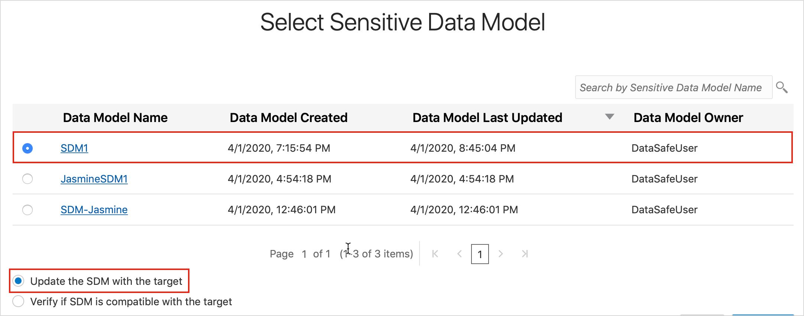

# Update a Sensitive Data Model with Oracle Data Safe

## Introduction
Using Oracle Data Safe, perform an incremental update to a sensitive data model by using the Data Discovery wizard.

### See an issue?
Please submit feedback using this [form](https://apexapps.oracle.com/pls/apex/f?p=133:1:::::P1_FEEDBACK:1). Please include the *workshop name*, *lab* and *step* in your request.  If you don't see the workshop name listed, please enter it manually. If you would like for us to follow up with you, enter your email in the *Feedback Comments* section.
Watch the video below for an overview on how to Update a Sensitive Data Model with Oracle Data Safe

<div style="max-width:768px"><div style="position:relative;padding-bottom:56.25%"><iframe id="kaltura_player" src="https://cdnapisec.kaltura.com/p/2171811/sp/217181100/embedIframeJs/uiconf_id/35965902/partner_id/2171811?iframeembed=true&playerId=kaltura_player&entry_id=1_mllie56g&flashvars[streamerType]=auto&amp;flashvars[localizationCode]=en&amp;flashvars[leadWithHTML5]=true&amp;flashvars[sideBarContainer.plugin]=true&amp;flashvars[sideBarContainer.position]=left&amp;flashvars[sideBarContainer.clickToClose]=true&amp;flashvars[chapters.plugin]=true&amp;flashvars[chapters.layout]=vertical&amp;flashvars[chapters.thumbnailRotator]=false&amp;flashvars[streamSelector.plugin]=true&amp;flashvars[EmbedPlayer.SpinnerTarget]=videoHolder&amp;flashvars[dualScreen.plugin]=true&amp;flashvars[hotspots.plugin]=1&amp;flashvars[Kaltura.addCrossoriginToIframe]=true&amp;&wid=1_9h33dhza" width="768" height="432" allowfullscreen webkitallowfullscreen mozAllowFullScreen allow="autoplay *; fullscreen *; encrypted-media *" sandbox="allow-forms allow-same-origin allow-scripts allow-top-navigation allow-pointer-lock allow-popups allow-modals allow-orientation-lock allow-popups-to-escape-sandbox allow-presentation allow-top-navigation-by-user-activation" frameborder="0" title="Kaltura Player" style="position:absolute;top:0;left:0;width:100%;height:100%"></iframe></div></div>


## Objectives
In this lab, you learn how to do the following:
- Perform an incremental update to a sensitive data model by using the Data Discovery wizard

## Challenge
Suppose your ExaCS database has a new column added to it and you want to update your sensitive data model to include that column.

Follow these general steps:
1. Connect to your ExaCS database as the SYS user with SQL Developer.
2. In SQL Developer, add an AGE column to the HCM1.EMPLOYEES table in your ExaCS database. Gather schema statistics on your database.
3. Sign in to the Oracle Data Safe Console in your region.
4. In the Oracle Data Safe Console, update your sensitive data model against your target database by using the update option in the Data Discovery wizard. What does the update test find?

## Steps

### **Step 1:** Connect to your ExaCS database as the SYS user with SQL Developer

Please visit [Lab 4: Configuring a development system for use with your EXACS database](?lab=lab-4-configure-development-system-for-use) for instructions to securely configure ExaCS to connect using Oracle SQL Developer, SQLXL and SQL*Plus.
### **Step 2:** In SQL Developer, add an `AGE` column to the `HCM1.EMPLOYEES` table in your ExaCS database

- In SQL Developer, run the following command to connect to PDB1 pluggable database:

```
<copy>ALTER SESSION SET CONTAINER=YOUR_PDB_NAME;</copy>
```
- On the SQL Worksheet, run the following commands to add an `AGE` column to the `EMPLOYEES` table.

```
<copy>ALTER TABLE HCM1.EMPLOYEES ADD AGE NUMBER;</copy>
```
- On the Navigator tab, click the Refresh button.<br>
`AGE` is added to the bottom of the list in the `EMPLOYEES` table.
- Run the following command to gather schema statistics.

```
<copy>EXEC DBMS_STATS.GATHER_SCHEMA_STATS('HCM1');</copy>
```
### **Step 3:** Sign in to the Oracle Data Safe Console in your region

- From the navigation menu, click **Data Safe**


- You are taken to the **Registered Databases** Page.
- Click on **Service Console**


- You are taken to the Data Safe login page. Sign into Data Safe using your credentials.


### **Step 4:** Update your sensitive data model against your database by using the update option in the Data Masking wizard

- In the Oracle Data Safe Console, click the **Home** tab, and then click Data Discovery. The Select Target for **Data Discovery** page is displayed.


- Select your target database, and then click **Continue**. The **Select Sensitive Data Model** page is displayed.


- For Sensitive Data Model, click **Pick from Library**.


- Click **Continue**.
The **Select Sensitive Data Model** page is displayed.
- Select your sensitive data model (**<username> SDM1**).



- Leave **Update the SDM with the target** selected.
- Click **Continue**.
The wizard launches a data discovery job.
- When the job is finished, notice that the **Detail** column reads **Data discovery job finished successfully**.
- Click **Continue**. The **Sensitive Data Model: <username> SDM1** page is displayed.
- Notice that you have the newly discovered sensitive column, `AGE`. Only newly discovered columns are displayed at the moment.
- **Expand all** of the nodes.
- To view all of the sensitive columns in the sensitive data model, click **View all sensitive columns**.
  - You can toggle the view back and forth between displaying all of the sensitive columns or just the newly discovered ones.
- Click **Exit**.

### All Done!
