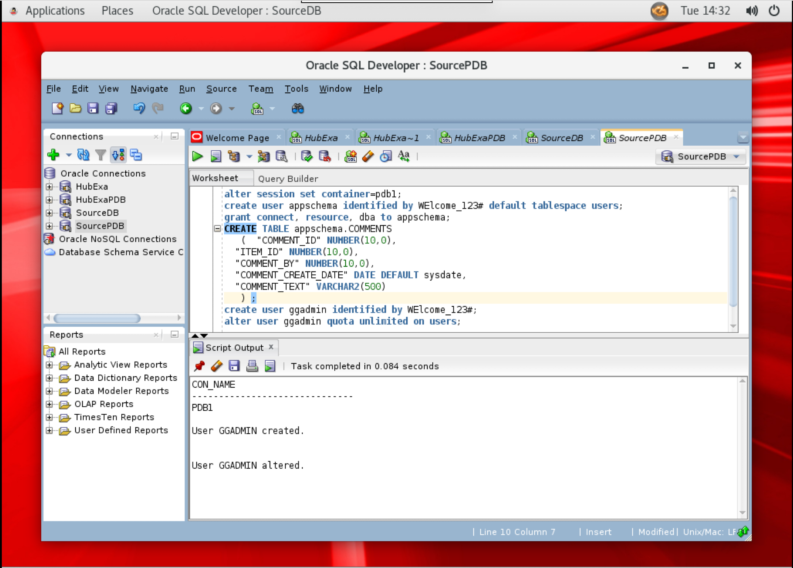
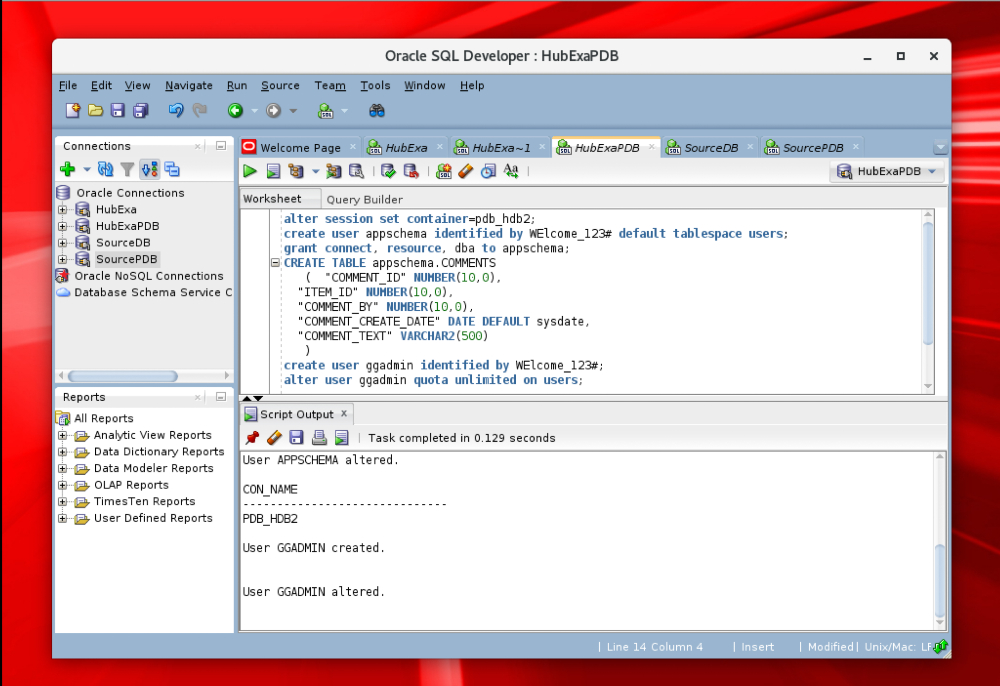

## Introduction

Data Replication is a essential part of your efforts and tasks when you are migrating your Oracle databases. While data migration can be acheived in many ways, there are fewer options when downtime tolerance is low and live, trickle feed replication may be the only way. Oracle Cloud Infrastructure Marketplace provides a goldengate microservice that can easily be setup for logical data replication between a variety of databases. In this hands-on lab we will setup goldengate to replicate data from a 12.2 Oracle database comparable to an 'on-prem' source database to an ExaCS  database in OCI. This approach is recommended while migrating most production or business critical application to ExaCS .

Why Golden Gate?

- Oracle Golden Gate is an enterprise grade tool which can provide near real time data replication from one database to another. 
- Oracle GoldenGate offers a real-time, log-based change data capture (CDC) and replication software platform to meet the needs of today’s transaction-driven applications. It provides capture, routing, transformation, and delivery of transactional data across heterogeneous environments in real time can be acheived using Golden Gate. 
- Oracle GoldenGate only captures and moves committed database transactions to insure that transactional integrity is maintained at all times. The application carefully ensures the integrity of data as it is moved from the source database or messaging system, and is applied to any number of target databases or messaging systems.

[Learn More](http://www.oracle.com/us/products/middleware/data-integration/oracle-goldengate-realtime-access-2031152.pdf)

### See an issue?
Please submit feedback using this [form](https://apexapps.oracle.com/pls/apex/f?p=133:1:::::P1_FEEDBACK:1). Please include the *workshop name*, *lab* and *step* in your request.  If you don't see the workshop name listed, please enter it manually. If you would like for us to follow up with you, enter your email in the *Feedback Comments* section.
Watch the video below for an overview on how to migrate databases real time using Oracle Golden Gate

<div style="max-width:768px"><div style="position:relative;padding-bottom:56.25%"><iframe id="kaltura_player" src="https://cdnapisec.kaltura.com/p/2171811/sp/217181100/embedIframeJs/uiconf_id/35965902/partner_id/2171811?iframeembed=true&playerId=kaltura_player&entry_id=1_jivr68k8&flashvars[streamerType]=auto&amp;flashvars[localizationCode]=en&amp;flashvars[leadWithHTML5]=true&amp;flashvars[sideBarContainer.plugin]=true&amp;flashvars[sideBarContainer.position]=left&amp;flashvars[sideBarContainer.clickToClose]=true&amp;flashvars[chapters.plugin]=true&amp;flashvars[chapters.layout]=vertical&amp;flashvars[chapters.thumbnailRotator]=false&amp;flashvars[streamSelector.plugin]=true&amp;flashvars[EmbedPlayer.SpinnerTarget]=videoHolder&amp;flashvars[dualScreen.plugin]=true&amp;flashvars[hotspots.plugin]=1&amp;flashvars[Kaltura.addCrossoriginToIframe]=true&amp;&wid=1_yu6bx03o" width="768" height="432" allowfullscreen webkitallowfullscreen mozAllowFullScreen allow="autoplay *; fullscreen *; encrypted-media *" sandbox="allow-forms allow-same-origin allow-scripts allow-top-navigation allow-pointer-lock allow-popups allow-modals allow-orientation-lock allow-popups-to-escape-sandbox allow-presentation allow-top-navigation-by-user-activation" frameborder="0" title="Kaltura Player" style="position:absolute;top:0;left:0;width:100%;height:100%"></iframe></div></div>

## Objectives

- Setup real time data replication from on-premise database to ExaCS database instance.

## Required Artifacts

- Access to an Oracle Cloud Infrastructure tenancy.
- Access to an Oracle 12c database configured as source database.
- An Exadata Cloud Service (ExaCS) as target database.
- Access to ExaCS network via jump server or VPN.
- VNC Viewer or other suitable VNC client on your laptop.

## Background and Architecture

- There are three components to this lab. The **source database** that you are planning to migrate to ExaCS, the **target ExaCS database** in OCI and an instance of **Oracle Goldengate** server with access to both source and target databases.

- The source database can be any Oracle database version 11.2.0.4 or higher with atleast one application schema that you wish to replicate to an ExaCS database in OCI. For the purpose of this lab, you may provision a 12.2.0.1 DBCS instance in your compartment in OCI and configure it as source. 


- The ExaCS  database instance you provisioned in [Lab 4](./ProvisionADB.md) can be used as a target database in this lab. If this database is in a private network with no direct access over the internet, you need to either VPN into this network or setup a developer client / bastion host via which you can connect to your target ExaCS instance using sql*plus or sql developer client. Refer [Lab 5](./ConfigureDevClient.md) or [Lab 6](./ConfigureVPN.md) to setup a jump server or setup VPN respectively. 

    **Note: You cannot complete this lab without setting up access to your ExaCS instance. Therefore [Lab 5](./ConfigureDevClient.md) or [Lab 6](./ConfigureVPN.md) are a pre-requisite to completing this lab as instructed.**

- The Golden Gate software is going to be deployed on a linux server in a public network which has access to both the source database and the target database via the Goldengate marketplace image in OCI.

- Let us understand the architecture of the setup we have here:
    - We have a source database on a VM on OCI(DBCS) which will act as an on-premise database.
    - We have a target database on an exadata cloud service VM on OCI.
    - We have a Goldengate instance with access to both the source database and target database.

    


## Steps


### **STEP 1: Provision a Goldengate Microservice from OCI Marketplace**

1. Connect to your OCI tenancy and select **Marketplace** from top left menu.

Browse for **Oracle Goldengate 19c for Oracle**. You may set a filter on Type on the left. Select **Stack** from the dropdown and the image should be easier to find. The image is a terraform orchestration that deploys Goldengate on a compute image along with required resources.

2. Click on image and choose your compartment to deploy the goldengate instance. For eg. as a workshop user with assigned compartment userX-Compartment, pick userX-Compartment from the drop down.

3. Launch Stack and provide details as described below

Name: Any descriptive name or you could leave default

Hit Next, rest of the items are filled in or optional

4. Enter the following network setting. This is essentially to select the network you wish to deploy your goldengate image.


5. Hit next. For instance details pick and AD with sufficient compute capacity. **Note this deployment needs a minimum 2 ocpu instance**
Make sure you check the 'public IP' checkbox. We will use this later to ssh into the instance and also connect to the Goldengate admin console.


6. Next, under **Create OGG deployments** choose your source and target deployment names and versions. Note that you may select one or two deployments (the second deployment is optional). This simply tell Goldengate admin server the location of relevant artifacts for source and target DB connections. 

In this lab we choose a single deployment called Databases. Therefore, under **Deployment 1 -Name**, type **Databases** and leave Deployment 2- Name blank. We keep this simple by using a single deployment folder for both source and target configurations.


Next, paste your public key and hit **Create**

Your Goldengate instance should be ready in a few mins and we will come back to configure it. 

### **STEP 2: Configure the source database**

It is assumed that you either have an Oracle 12c database configured as source or know how to provision a 12c DBCS instance in OCI

[This Medium blog provides step by step directions to deploying a DBCS instance in OCI](https://medium.com/@fathi.ria/oracle-database-on-oci-cloud-ee144b86648c)


The source database requires a Common (CDB) user that has DBA privileges over all PDBs in that database. 

Lets also assume that the schema we wish to replicate with Goldengate is the 'appschema' in PDB1. So for a freshly provisioned DBCS instance as source, we create the common user and application schema as follows

- Connect as sys to your source DB and execute the following SQL commands

```
<copy>
create user C##user01 identified by WElcome_123#;
grant connect, resource, dba to c##user01;
alter database add supplemental log data;
exec dbms_goldengate_auth.grant_admin_privilege('C##user01', container=>'all');
alter system set ENABLE_GOLDENGATE_REPLICATION=true scope=both;
</copy>
```

Check if Goldengate replication is enabled,

```
<copy>
show parameter ENABLE_GOLDENGATE_REPLICATION;
</copy>
```

This should return **True**


- Next, lets create a schema user to replicated called **appschema** in PDB1 and add a table to it. A sample 'Comments' table is provided here. You may add one or more table of your choice to the appschema.

- Next, we need to create a golden gate user and grant the necessary previliges.

**Note : Please make sure you replace pdb_name with your database's pdb name in the below code.**

```
<copy>
alter session set container=pdb_name;
create user appschema identified by WElcome_123# default tablespace users;
grant connect, resource, dba to appschema;
CREATE TABLE appschema.COMMENTS
   (  "COMMENT_ID" NUMBER(10,0), 
  "ITEM_ID" NUMBER(10,0), 
  "COMMENT_BY" NUMBER(10,0), 
  "COMMENT_CREATE_DATE" DATE DEFAULT sysdate, 
  "COMMENT_TEXT" VARCHAR2(500)
   ) ;
alter user appschema quota unlimited on users;
</copy>
```



The source database is all set. Next, lets setup the target ExaCS instance.

### **STEP 3: Configure the target ExaCS  database**

- Connect to the ExaCS database instance you created earlier as user **sys** as sysdba

**Note: You will need to be VPN'd into the network or VNC to a jump server. Refer to Lab 5 and Lab 6**

- First, lets create the a common user in ExaCS and grant the necessary previliges.

```
<copy>
create user C##user01 identified by WElcome_123#;
grant connect, resource, dba to c##user01;
alter database add supplemental log data;
exec dbms_goldengate_auth.grant_admin_privilege('C##user01', container=>'all');
alter system set ENABLE_GOLDENGATE_REPLICATION=true scope=both;
show parameter ENABLE_GOLDENGATE_REPLICATION;
</copy>
```


- Next we create an 'appschema' user similar to source and create the same set of tables as source. Also, we will create a goldengate admin user and grant necessary previliges to that user.

**Note : Please make sure you replace pdb_name with your database's pdb name in the below code.**

```
<copy>
alter session set container = pdb_name
create user appschema identified by WElcome_123# default tablespace users;
grant connect, resource to appschema;
alter user appschema quota unlimited on users;
CREATE TABLE appschema.COMMENTS
   (  "COMMENT_ID" NUMBER(10,0), 
  "ITEM_ID" NUMBER(10,0), 
  "COMMENT_BY" NUMBER(10,0), 
  "COMMENT_CREATE_DATE" DATE DEFAULT sysdate, 
  "COMMENT_TEXT" VARCHAR2(500)
   ) ;
</copy>
```




That is it! Your target DB is now ready.

### **STEP 4: Configure Goldengate service**

By now, your Goldengate service instance must be deployed. On your OCI console navigate to **Compute** from top left menu and **choose your compartment**

Click on your Goldengate compute instance to get to the details page that looks as follows.


Note down the public IP address of your instance. We will use this IP to ssh into the virtual machine.

Before we launch the Goldengate admin console and start configuring the service, we need to provide connection information for both source and target databases.

Therefore, **gather your source and target database connection TNS entries for both the common user and the appschema user. Remember, the CDB and PDB run different services, therefore the TNS entries differ.**

A tns entry is typically found in your database's tnsnames.ora file and looks like this.

mySourceDB=(DESCRIPTION=(CONNECT_TIMEOUT=120)(RETRY_COUNT=20)(RETRY_DELAY=3)(TRANSPORT_CONNECT_TIMEOUT=3)(ADDRESS_LIST=(LOAD_BALANCE=on)(ADDRESS=(PROTOCOL=TCP)(HOST=129.30.xxx.xxx)(PORT=1521)))(CONNECT_DATA=(SERVICE_NAME=pdb1.ExaCS.oraclecloud.com)))

**This file needs to go into the folder /u02/deployments/\<Deployment Name\>/etc**

Remember the deployment name 'Databases' provided while provisioning the goldengate image? That is what it does. By providing just one deployment, we can configure both source and target DB entries in one place for simplicity.

Edit the sqlnet.ora file and update the WALLET_LOCATION parameter to point to the wallet folder

```
<copy>
WALLET_LOCATION = (SOURCE=(METHOD=FILE)(METHOD_DATA=(DIRECTORY="/u02/deployments/Databases/etc")))
</copy>
```

Next we edit the tnsnames.ora file and add entries for the source common user, source appschema user, target common user and the target appschema user. This single tnsnames.ora will serve to connect to both source and target.

-Open tnsnames.ora in vi and add TNS connection entries as shown in the example screen shot below. Note the TNS entries for the source and target DB.


Also, rarely you might have to replace the hostname of the source db with the IP address to circumvent the dns resolution issue. 

**Note: All IP addresses in the lab guide are scrubbed for security purposes. None of the instances in the screenshots are accessible using the information provided**

- We are now ready to access the goldengate admin console and configure our extract and replicat processes. 

- The credentials to access the admin console are provided in a file called ogg-credentials.json in the home folder /home/opc

Open the file and save the credentials on a notepad.

```
<copy>
$ cd
$ cat ogg-credentials.json
{"username": "oggadmin", "credential": "E-kqQH8.MPA0u0.g"}
</copy>
```

- Next we logon to the Goldengate admin console using credentials above.

**Open a browser and navigate to https://\<ip_address_of_goldengate_image\>**

If you have browser issues or get Unicode warning, try using Firefox browser. Fixing browser issues is beyond scope for this lab guide.


Once logged on, click on the port # for Admin server to get into configurtion mode as shown below


If prompted, login with the same credentials one more time.

From the top left hamberger menu, select 'Configuration' as shown below -


**Here we configure connectivity to our source and target databases. We will setup 4 connections - The Source DB common user, Source DB appschema user, Target DB common user and Target DB appschema user.**

Use the screenshots below as a guide - 


Add the first credential for appschema you created earlier in the lab in the source DB.


**Note the userid format is userid@connectString. The connect string is how it knows which database to connect to. It looks for this connect string in /u02/deployments/Databases/etc/tnsnames.ora**


Submit credentials and test connectivity as shown in screenshot below


Similarly, add credentials for source DB c##user01, target ExaCS c##user01 schema and target ExaCS appschema schema as shown below.


Make sure you test connectivity for each credential.

**Next, we create checkpoint tables in source and target databases.** Checkpoint tables keep track of changes in the database. We need one in the appschema in each database i.e source and target.

Lets start with appschema in source. Connect to the pdb on the source database and click + sign beside the Checkpoint section heading to add a checkpoint table as shown below


We also specify the schema we want to replicate here. In the Transaction Information section below checkpoint, add the schema first by clicking the + sign and hit Submit.


Now when you enter the schema name and search for it, it shows up as shown below with 3 tables. 2 checkpoint tables and one 'comments' table we created earlier.


**Next, we add a checkpoint table to the target instance and also set the heartbeat**

Connect to the target DB from the goldengate admin console just like you did for the source DB. Lets also add a checkpoint table here


Scroll down and set the hearbeat for target. Use default configuration for the purpose of this lab


**As a final step, we now create an 'extract' and a 'replicat' process to conduct the replication from source to target.**

- Navigate back to the Goldengate Admin server dashboard so you can see both the extract and replicat setup as shown below


Choose **Integrated Extract** on the next screen and hit next.


Entries on the following screen may be entered as follows,


Process Name: Provide any name of choice

Credential Domain: Pick OracleGoldenGate from drop down

Credential Alias:  Pick the common user alias for source DB. In this lab we created cdb_source alias

Trail Name: Any 2 character name

Scroll down and click in the text box Register to PDBs. PDB1 should popup as shown


**If you do not see Register to PDBs text box, make sure you have picked the 'Common User' alias and provided all mandatory entries**

Click next. As a final step, add this entry at the end of your parameter file as shown below.

```
<copy>
extract source
useridalias cdb_source domain OracleGoldenGate
exttrail et
table pdb1.appschema.*;
</copy>
```


This tells Goldengate to capture changes on all tables in pdb1.appschema

Hit 'Create and Run'. If all goes well you should now see the extract running on source.

Next, we configure a replicat on the target. On the same screen hit the **+** sign on the **Replicats** side to start configuring one.


Pick **Integrated Replicat**


Fill out the mandatory items in **Basic Information** on the next screen as follows. You may leave the rest at default values.

**Process Name:**  Target

**Credential Domain:**  Oracle Goldengate from drop down

**Credential Alias:** pdb1_target (or the alias name you provided for appschema user on your ExaCS instance)

**Trail Name:** et (or any 2 character name)

**Checkpoint Table:** The checkpoint table you configured for appschema user should show up in the drop down

Hit **Next**


On the last and final screen (phew!) edit the parameter file to REPLACE the line mapping the source and target schemas as show below. 
**Note: Pls remove the original line MAP *.*, TARGET *.*;**

```
<copy>
replicat target
useridalias pdb1_target domain OracleGoldenGate
MAP <pdb_name>.appschema.*, TARGET <pdb_name>.appschema.*;
</copy>
```


Hit **Create and Run**. If all goes well, you should now see both extract and replicat processes running on the dashboard.


Hurray! You have completed the replication setup. To test, simply connect to your source database, insert and commit some rows. Then check your corresponding target table and in a few secs you should see the data appear.

A sample Insert script for the Comments table is provided below.

```
<copy>
Insert into appschema.COMMENTS (COMMENT_ID,ITEM_ID,COMMENT_BY,COMMENT_CREATE_DATE,COMMENT_TEXT) values (7,4,4,to_date('06-JUL-15','DD-MON-RR'),'Im putting an offer. Can you meet me at the apple store this evening?');
commit;
</copy>
```


<table>
<tr><td class="td-logo">[](#)</td>
<td class="td-banner">
## Great Work - All Done!
</td>
</tr>
<table>