## Introduction

Oracle Key Vault is the only key management solution for your TDE-enabled database estate that provides continuous encryption key availability and extreme scalability through clustering of up to 16 OKV nodes into one key management cluster, distributed across Oracle Cloud regions and on-premises data centers. It is optimized to support all deployment models of the Oracle Database, incl. Real Application Clusters (RAC), Oracle Data Guard, GoldenGate as well as engineered systems, on-prem and in the Oracle Cloud.

To log issues and view the Lab Guide source, go to the [github oracle](https://github.com/oracle/learning-library/issues/new) repository.

## Objectives

As a database security admin,

- Start with Add_Endpoint
- Perform Wallet_Upload to backup the Oracle Wallet into Oracle Key Vault
- Migrate to Online Master Key. This will re-configure the database to communicate directory with Oracle Key Vault
- After migration, you can perform a rekey operation
- Optionally, perform Wallet_Download to return master keys to an Oracle Wallet. This does not disable the Online Master Key mode
- Additionally, you can Create_External_Store so the password to the OKV Endpoint is not known by the DBAs
- At any point, you can view the contents of the OKV Virtual Wallet
- As an advanced lab, you can create a 2-node Oracle Key Vault Multi-Master Cluster


## Required Artifacts

- An Oracle Cloud Infrastructure account
- Oracle Key Vault Server
- SQL Developer connection to ExaCS database


### Install Key Vault from Marketplace

- Log into Oracle Cloud Infrastructure (OCI)
- From the hamburger menu go Compute > Instances

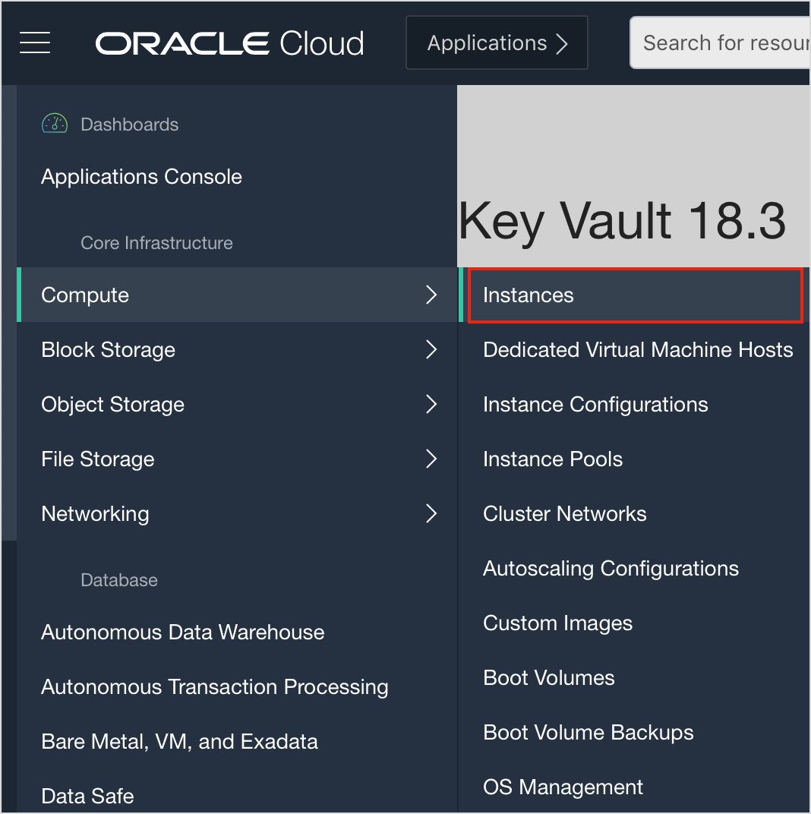

- Select the ExaCS Compartment under List Scope. A compartment is a logical container, to organize and control access to the Oracle Cloud Infrastructure.
- In the ExaCS Compartment click the **Create Instance** button

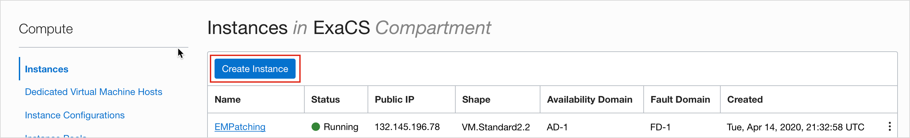

- You are taken to the **Create Compute Instance** page.
  - Under Name enter **OKV-ExaCS**
  - Under **Image or operating system** click **Change Image**

 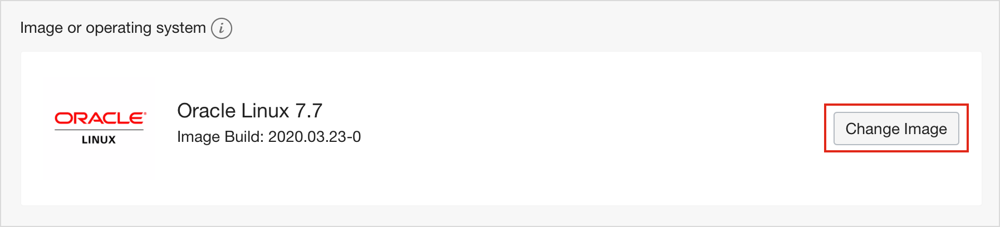
  - Select the **Oracle Images** tab then scroll down until you find  **Oracle Key Vault 18.3** in the list of images.

  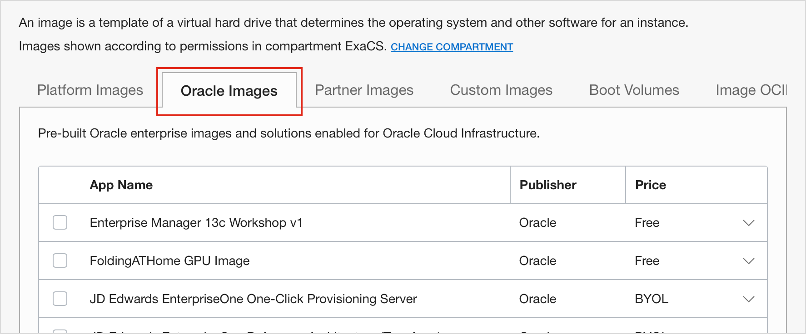
  - Select the checkbox next to **Oracle Key Vault 18.3**

  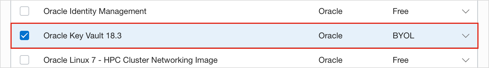
  - Scroll to the bottom of the page to accept the **Oracle Standard Terms and Restrictions** and then click **Select Image**.
- Leave **AD 1** selected under **Availability Domain**
- Click **Change Shape** under **Shapes**.
- You are taken to **Browse All Shapes**.
  - Leave **Virtual Machine** and **Standard** selected under **Instance type** and **Shape** type respectively.
  - **VM.Standard2.2** is the recommended shape for the lab. Select **VM.Standard2.2**.
  - Click **Select Shape**
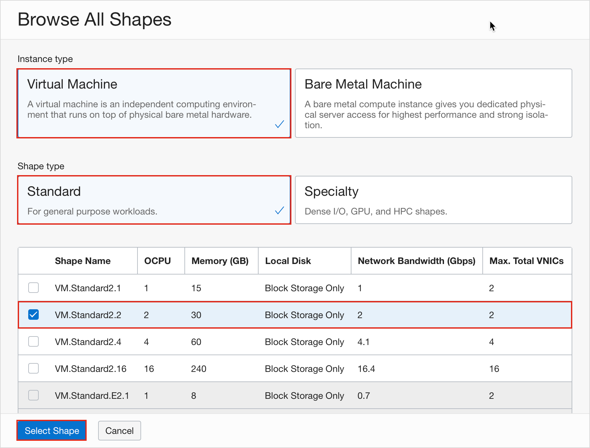

- Configure networking
  - Enter your networking information.
  - Click the **ASSIGN PUBLIC IP ADDRESS** radio button

  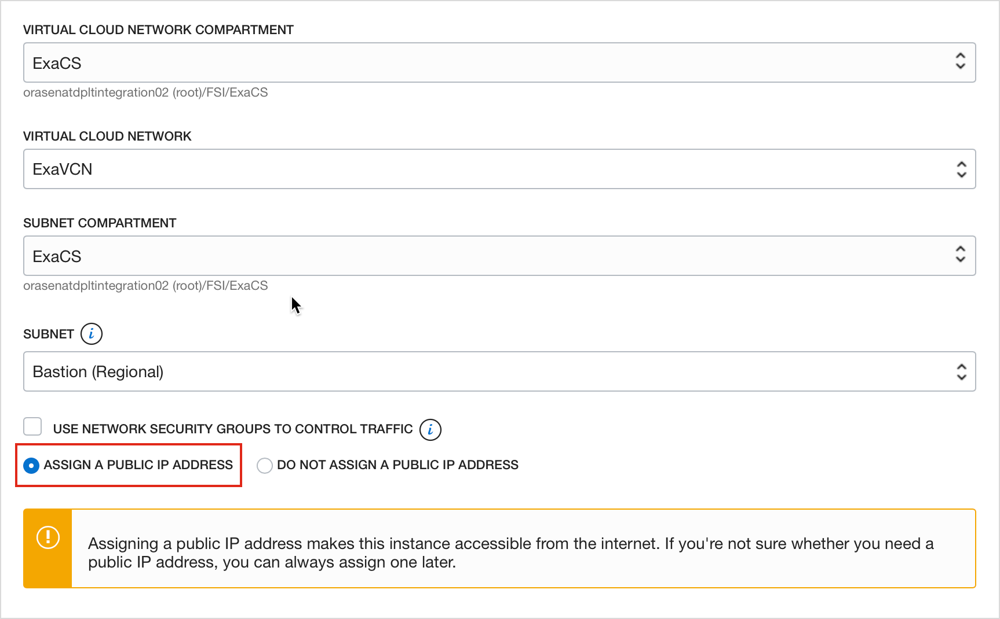

- Select or paste your public ssh keys

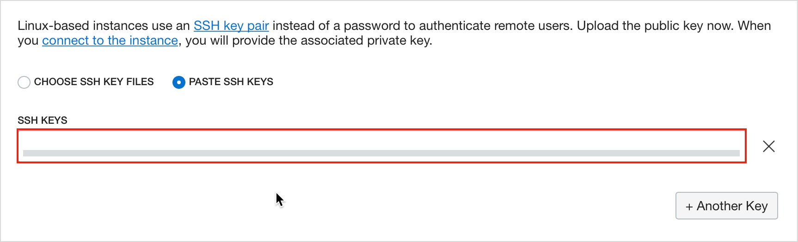

- Click **Create**
- You are taken to the **Instance Details** page. Your Oracle Key Vault instance will start provisioning.

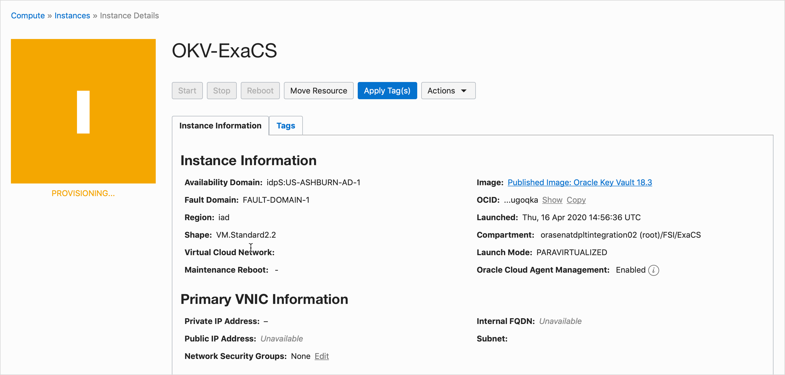

- Wait for a few minutes. Your instance is now running.

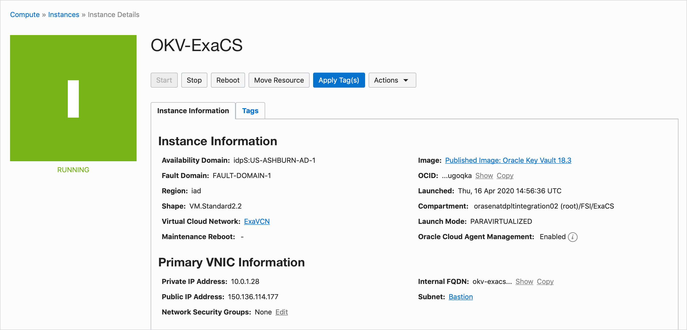

- Notice that under Primary VNIC Information you have an assigned **Private IP Address** and **Public IP Address**

### Setup Key Vault

Open terminal and establish connection to Key Vault Server using Public IP
```
<copy>ssh -i <private-ssh-key> opc@<public_ip_address></copy>
```

You are temporarily logged into the Oracle Key Vault server using the `OPC` user. The `OPC` user is used to set the installation passphrase. To set the installation passphrase run the following command.

```
<copy>set_installation_passphrase</copy>
```

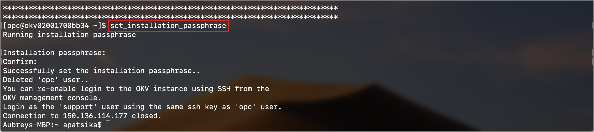

In any web browser of your choice, navigate to Oracle Key Vault server using your public assigned public IP address.

```
<copy>https://<public_ip_address></copy>
```

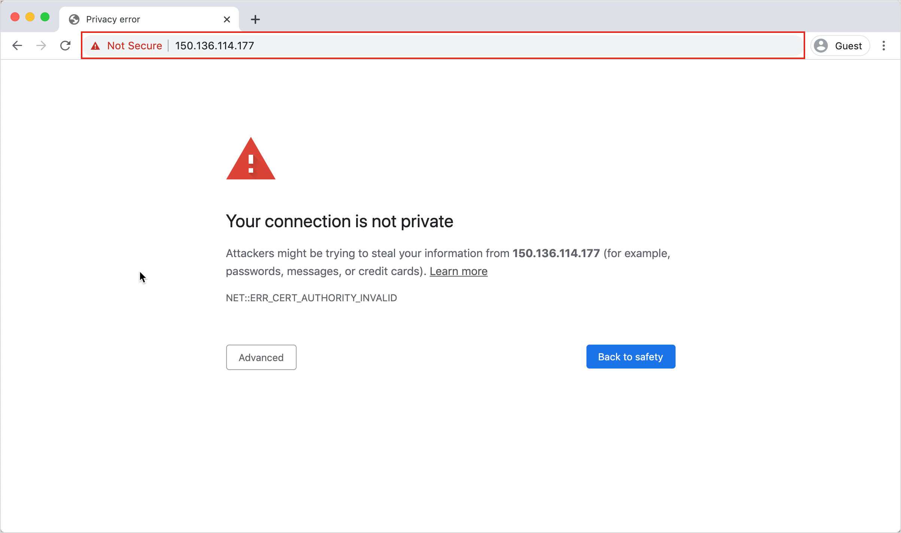

- You will get a message `Your connection is not private`
- Click **Advanced** and proceed to unsafe page.

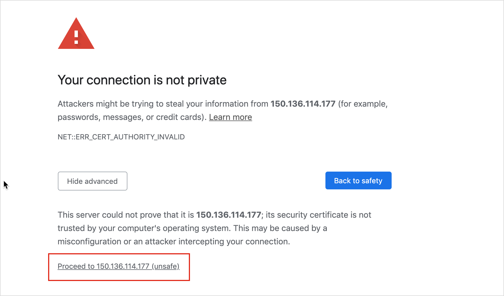

You are taken to the Oracle Key Vault page. Enter the installation passphrase you created earlier.

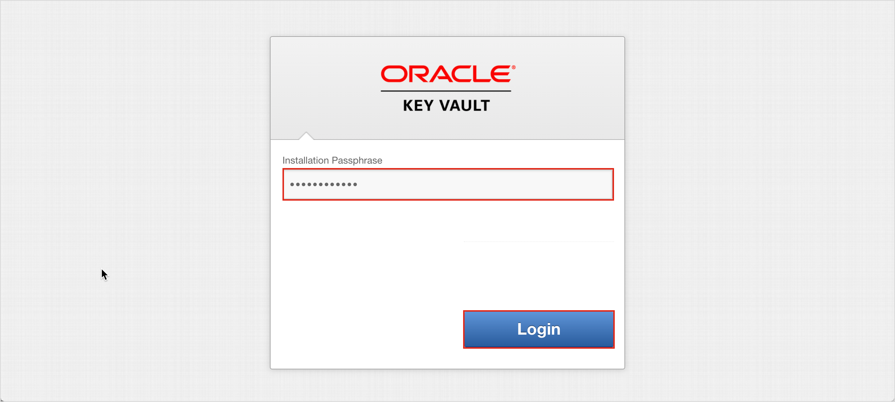

- Click **Login**
- You are taken to the **Post-Install Configuration** page.
- Under **User Setup** enter the following details.
 - For **Key Administrator** enter `KVADMIN` and enter a password
 - For **System Administator** select **Same as Key Administator**
 - For **Audit Manager** enter `KVAUDITOR` and enter a password

 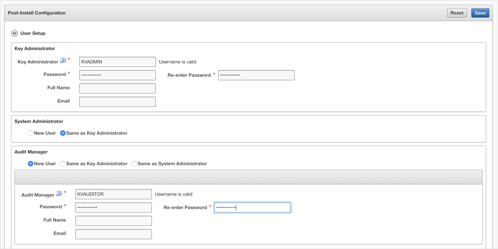

- Fill out password for **Recovery Passphrase**, **Root** and **Support** Users

 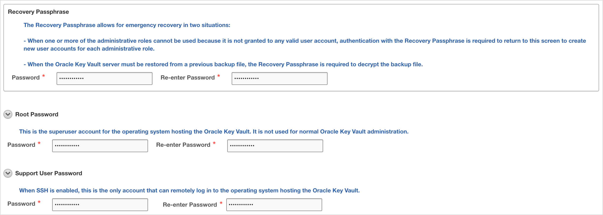

- Expand **Time Setup** and select **Use Network Time Protocol**
  - Enter `169.254.169.254` for Server 1 Address
  - Click **Test Server** (it must be successfully)

  

 - Click **Save**
- Login as `KVADMIN` with the new password

 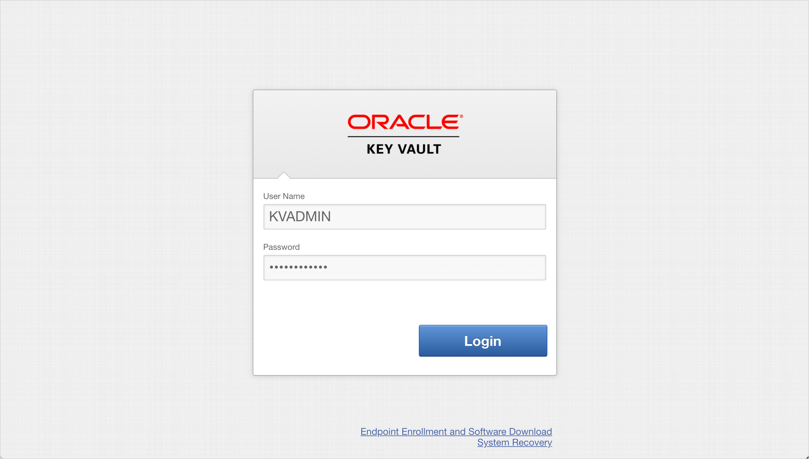

- Reset the password (please use a strong one as a permanent password)

 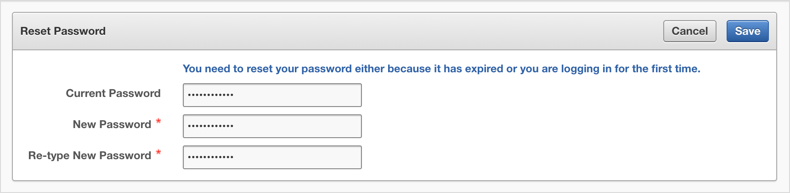

 - Click **Save**
 - You are taken to the **Manage Users** Page

 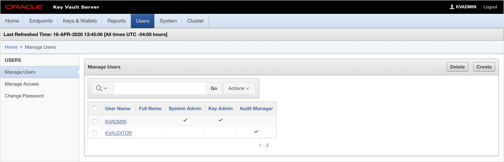

- Open **System** menu and select **System Settings** in section at left

 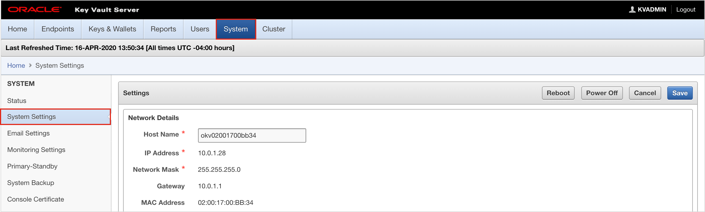

- In **RESTful Services** section, check **Enable**

 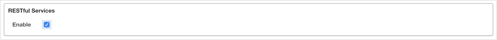

- Click **Save**


## Steps

### STEP 1: Add Oracle Key Vault Endpoint

Use your browser to navigate to the Key Vault server `http://PUBLIC_IP`

- Login as `KVADMIN`
- Click `Endpoints`

You will see that there are no endpoints available. You will use the utility we have created, `OKVdeploy.tar`, to automate this process. Let's use `OKVdeploy.tar`.
