## Introduction

In this lab we will install ORDS (Oracle REST Data Services) and Oracle APEX (Application Express) on Oracle Database Cloud Service using Terraform.

Oracle REST Data Services(ORDS) is a tool offered by Oracle through which we can develop and host Applications and REST Services. Oracle Application Express is a low-code application development tool to build applications and REST Services right on top of an Oracle Database. In this lab, we will deploy ORDS to host an application developed using APEX.

In production environments, we deploy ORDS on a server in a public network and configure it to interact with APEX which is installed on the database server deployed in a private network. However, in Dev/test environments, we can choose to deploy both ORDS and APEX on the same database server.

To automate the deployment process for ORDS and APEX, we can use tools like Terraform, Ansible, etc. In this exercise, we will see how we can automate it using Terraform. The Terraform script provided in this lab will install ORDS and APEX for you. You just have to configure a few parameters mentioned below. The Terraform script will provide you with two options to deploy ORDS and APEX as mentioned below:

1. Deploy ORDS on a separate compute and APEX on the Database Server.
2. Deploy ORDS and APEX on the Database Server.

#### ORDS Architecture Options
```

#### ARCHITECTURE - 1           |-------------Terraform Script Automation-----------------|
####      +-+-+-+-+-+-+-+       |        +-+-+-+-+-+-+-+               +-+-+-+-+-+-+-+    |
####      +             +       |        +             +               +             +    |
####      + APPLICATION +       |        +             +               +    APEX     +    |
####      + GENERATING  +-------|--------+    ORDS     +---------------+      +      +    |
####      + JSON CONTENT+       |        +   SERVER    +               +   ORACLE    +    |
####      +             +       |        +             +               +  DATABASE   +    |
####      +-+-+-+-+-+-+-+       |        +-+-+-+-+-+-+-+               +-+-+-+-+-+-+-+    |
####                            |---------------------------------------------------------|


#### ARCHITECTURE - 2           |-------------Terraform Script Automation-----------------|
####      +-+-+-+-+-+-+-+       |                       +-+-+-+-+-+-+-+                   |
####      +             +       |                       +             +                   |
####      + APPLICATION +       |                       +ORDS and APEX+                   |
####      + GENERATING  +-------|-----------------------+      +      +                   |
####      + JSON CONTENT+       |                       +   ORACLE    +                   |
####      +             +       |                       +  DATABASE   +                   |
####      +-+-+-+-+-+-+-+       |                       +-+-+-+-+-+-+-+                   |
####                            |---------------------------------------------------------|
```


To **log issues**, click [here](https://github.com/oracle/learning-library/issues/new) to go to the github oracle repository issue submission form.

## Objectives

- Learn how to set up ORDS and APEX on Oracle Database Cloud Service using Terraform.

## Required Artifacts

- Access to your Oracle cloud account.
- A pre-provisioned DB instance on Exadata. Refer to [Lab 3](?lab=lab-3-provision-databases-on-exadata-cloud) on how to provision a DB instance on Exadata.
- Access to a Dev Client on OCI for the database instance. Refer to [Lab 4](?lab=lab-4-configure-development-system-for-use) to know how to setup a Dev Client.
- Have appropriate IAM policies assigned to run Terraform on OCI. Please request your tenancy administrator to assign you policies to allow access.
- SSH Key pair (OpenSSH) and API Sign-in Key.
    - Note :
        1.  (Optional) if you need to create a new ssh key pair visit this <a href=https://www.oracle.com/webfolder/technetwork/tutorials/obe/cloud/compute-iaas/generating_ssh_key/generate_ssh_key.html>link</a>

        2.  (Optional) if you need to setup a new oci api key for your Oracle Cloud Account, visit this <a href=https://docs.cloud.oracle.com/en-us/iaas/Content/Functions/Tasks/functionssetupapikey.htm>link</a>


## Steps

### STEP 1: Install Terraform

- Since our Exadata Cloud Service is sitting in a private network we need to deploy a Developer client in a public network so that we can access our Exadata Cloud Service database. Please refer **lab 4** in this workshop for more information.

- Then, we install Terraform and execute the terraform script from that Developer Client/bastion Host which has access to the Exadata Cloud Service database so that Terraform can access it.

- Once the developer client is provisioned, log in to the Developer Client using ssh.

```
<copy> ssh -i private_ssh_key opc@public_ip</copy>

```

- Please follow the steps on <a href="https://learn.hashicorp.com/terraform/getting-started/install.html">this</a> page to download Terraform on the developer client system.

- For linux based systems. You can use the below command to download Terraform

```
<copy>wget https://releases.hashicorp.com/terraform/0.12.28/terraform_0.12.28_linux_amd64.zip</copy>
```

- unzip the downloaded zip file as shown below.

```
<copy>unzip terraform_0.12.28_linux_amd64.zip</copy>
```

- Move the Terraform binaries to the below path.

```
<copy>mv <Absolute Path of your Terraform directory>terraform /usr/local/bin/</copy>
```

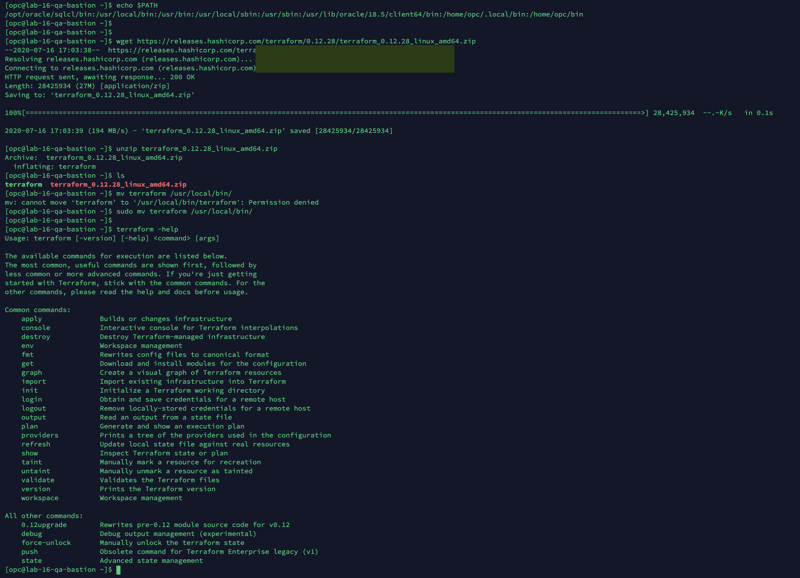


- Click on Linux 64 bit option to download it and install Terraform into one of the locations present in $PATH variable. To check the directories in $PATH variable, execute the below command. 

```
<copy>echo $PATH</copy>
```

- Verify the terraform installation using the below command.

```
<copy>terraform -help</copy>
```

- Once you have installed Terraform, you can upgrade the provider using the below command.

```
<copy>sudo yum -y upgrade terraform-provider-oci</copy>
```

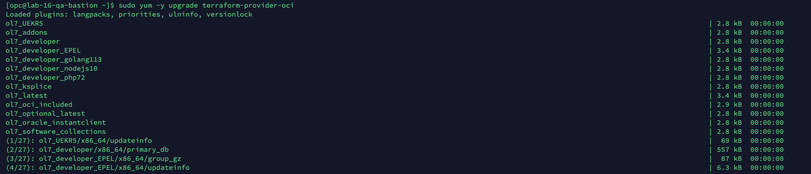
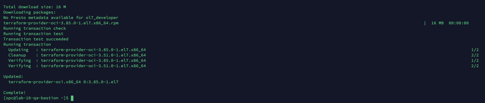


### STEP 2: Download the Terraform Script

- Download the Terraform script using the below command.

```
<copy>wget https://objectstorage.us-ashburn-1.oraclecloud.com/p/8tSwgAMJClHVWVbWhHlmzTpS5CVTyxm3lWuDzDN9Jf8/n/orasenatdpltintegration02/b/ExaCSScripts/o/ORDS-APEX_ExaCS.zip</copy>
```
**NOTE: Make sure you have wget installed before running the above command, otherwise run 'brew install wget' beforehand**

- Unzip the file 

```
<copy>unzip ORDS-APEX_ExaCS.zip -d directory_path</copy>
```

- Change directory to ORDS-APEX_ExaCS

```
<copy>cd ORDS-APEX_ExaCS</copy>
```

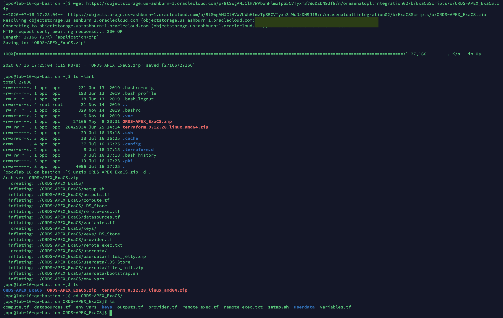

### STEP 3: Run the Terraform script

- Create an ssh key pair or copy your existing key pair along with OCI API private key to the "keys" folder present in the same directory. Please refer the links mentioned below on how to create keys.

```
<copy>ls keys/</copy>
```

You should see the following:
```
$ ls keys/
public_key.pub private_key oci_api_key.pem
```

- Note :
    1.  (Optional) if you need to create a new ssh key pair visit this <a href=https://www.oracle.com/webfolder/technetwork/tutorials/obe/cloud/compute-iaas/generating_ssh_key/generate_ssh_key.html>link</a>

    2.  (Optional) if you need to setup a new oci api key for your Oracle Cloud Account, visit this <a href=https://docs.cloud.oracle.com/en-us/iaas/Content/Functions/Tasks/functionssetupapikey.htm>link</a>

- Open the env-vars.sh script and fill in the values for the parameters. You can find the database details from the instance we created in Lab 3 or any existing exadata database instance on which you want to install ORDS and APEX.

```
<copy>vi env-vars</copy>
```

```
# Replace the correct file name for all the 3 keys mentioned below

TF_VAR_PathToYourSshPublicKey: "keys/ssh_key_file_name.pub"

TF_VAR_PathToYourSshPrivateKey: "keys/ssh key private file name"

TF_VAR_PathToYourApiPrivateKey: "keys/OCI API key private file name.pem"

# Obtain the tenancy OCID from the Tenancy details page on OCI console
TF_VAR_tenancy_ocid: "Tenancy OCID obtained from OCI account"

# Obtain the User OCID from the User details page on OCI console
TF_VAR_user_ocid: "User OCID obtained from OCI account"

# Obtain the fingerprint you see after uploading the OCI API key on OCI User Console page.
TF_VAR_fingerprint: "Fingerprint of the API Key uploaded on the user account on OCI"

# Obtain the OCID compartment from the compartment details page on OCI console
TF_VAR_compartment_ocid: "OCID of the compartment in which the Compute needs to be created."

# Obtain the sys user password for the database on ExaCS.
TF_VAR_target_db_admin_pw: "DB Admin Password"

# Obtain the Database IP from the DB System details page on OCI console under the Resources > Nodes option.
TF_VAR_target_db_ip: "Private IP of the DB server"

# Obtain the Database IP from the DB System details page on OCI console under the Resources > Nodes option.
# If there is no public IP available, use the private IP here.
TF_VAR_target_db_ip_public: "Public IP of the DB Server"

# Obtain the Database Service Name from the DB TNS names file. 
# This file is generally located at $ORACLE_HOME/network/admin/<DB Name>/tnsnames.ora in the ExaCS server.
TF_VAR_target_db_srv_name: "Service Name of the DB Server"

ORDS Installation Configuration

TF_VAR_ords_compute: 1

    # set to 1, if ORDS needs to be installed on a separate Compute.

    # OR 

    # set to 0, if ORDS needs to be installed on the DB server Itself.

TF_VAR_region: "Region name where you want to install the compute instance. You have the options mentioned below"

    # Note : OCI Region List: us-phoenix-1 | us-ashburn-1 | eu-frankfurt-1 | uk-london-1 | ca-toronto-1

TF_VAR_AD: "Availability Domain to provision Compute Instance" 
    # You can choose 1 or 2 or 3

TF_VAR_InstanceOSVersion: "7.7" # OR any Oracle Linux 7.x version which is available in OCI

# The Object Storage URL is already given for you
TF_VAR_URL_ORDS_file: "Object Storage URL for ords.war"

TF_VAR_web_srv: "0" 
    # 0 => Jetty and 1 for Tomcat , please note that Tomcat is available in this release of the script.

TF_VAR_com_port: "Port for ORDS"

# Required only if you set the TF_VAR_ords_compute variable to 1. Make sure your name does not conflict with any other
# instance in your compartment.
TF_VAR_ComputeDisplayName: "ORDS Compute Instance Display Name"

# Required only if you set the TF_VAR_ords_compute variable to 1.
TF_VAR_InstanceName: "ORDS Compute Instance Name"
 
 # Required only if you set the TF_VAR_ords_compute variable to 1.
TF_VAR_InstanceShape: "ORDS Compute Instance Shape"

# The Object Storage URL is already given for you
TF_VAR_URL_APEX_file: "Object Storage URL for apex.zip"

TF_VAR_APEX_install_mode: "0" 
    # => Full Environment mode, 1 => Runtime Environment mode

#If you have selected to deploy the ORDS server on a separate compute, then we will need a public subnet to deploy the compute instance. Please enter a public subnet OCID for the parameter below.
TF_VAR_subnet_ocid: "Subnet OCID obtained from OCI"
```

- The env-vars.sh file should look like this after you have entered all the information.

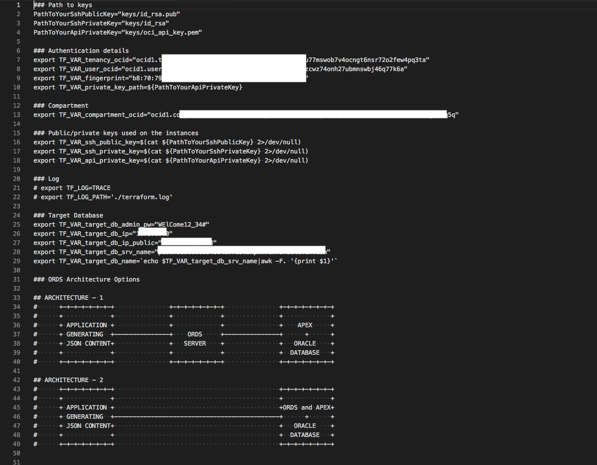

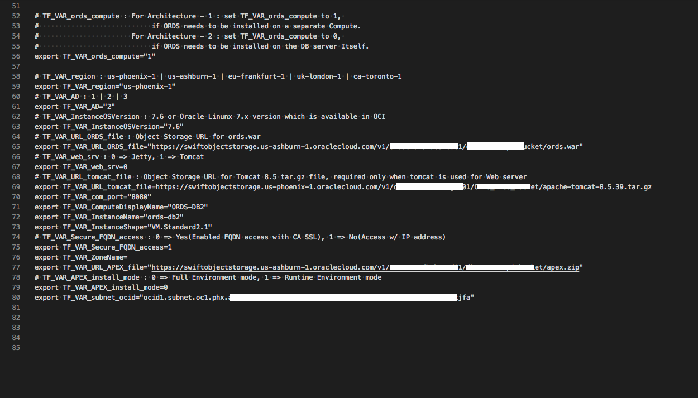

- To run the script, navigate to the directory which contains the terraform scripts and there are 4 simple commands which you need to execute:

- Source the env-vars.sh file and Initialize terraform

```
<copy>source env-vars</copy>
```

```
<copy>terraform init</copy>
```

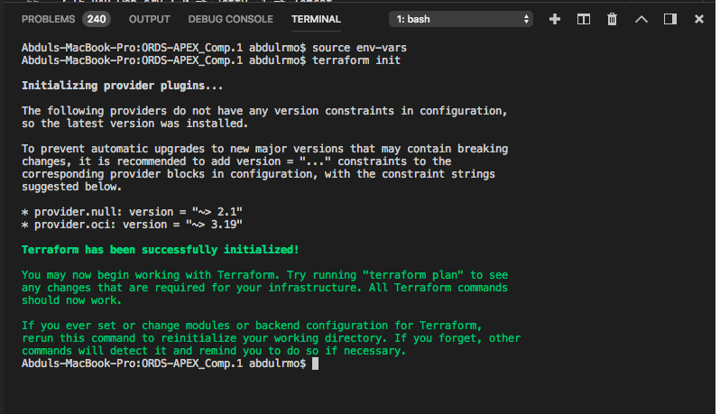

- Create the terraform state file by executing the terraform plan command.

```
<copy>terraform plan</copy>
```

- If you chose to deploy ORDS on a separate compute instance, then you will see that the terraform plan shows that it is going to create the compute instance.

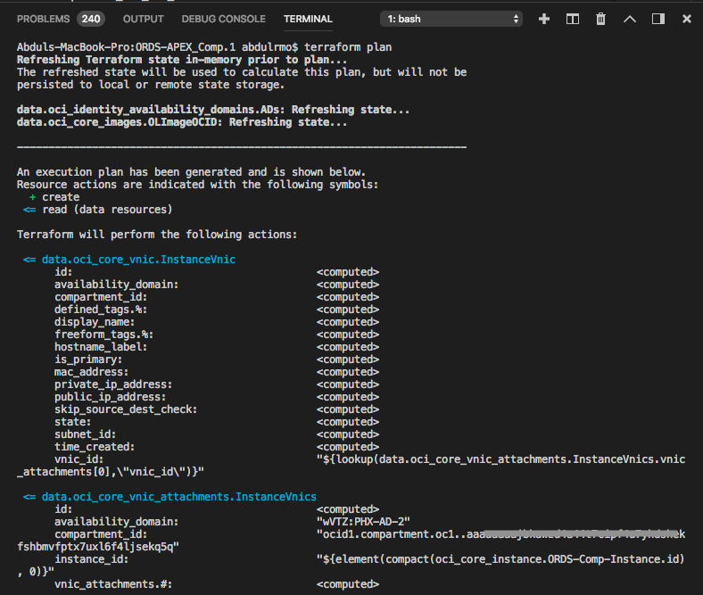
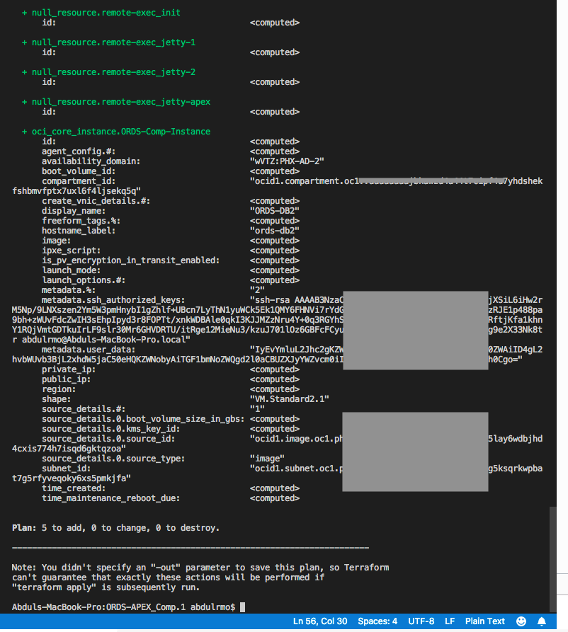

    if you chose to deploy ORDS on the DB Server itself, then your terraform plan will look like below.

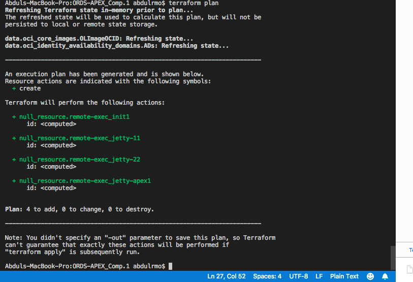

- Execute the plan using the apply command

```
<copy>terraform apply</copy>
```

    when you execute the terraform apply command, terraform asks you to confirm. Enter yes and hit enter

    For ORDS on a separate compute : 

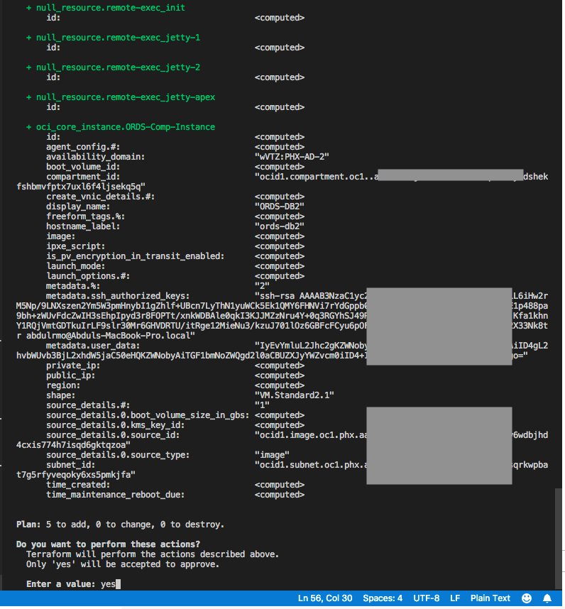
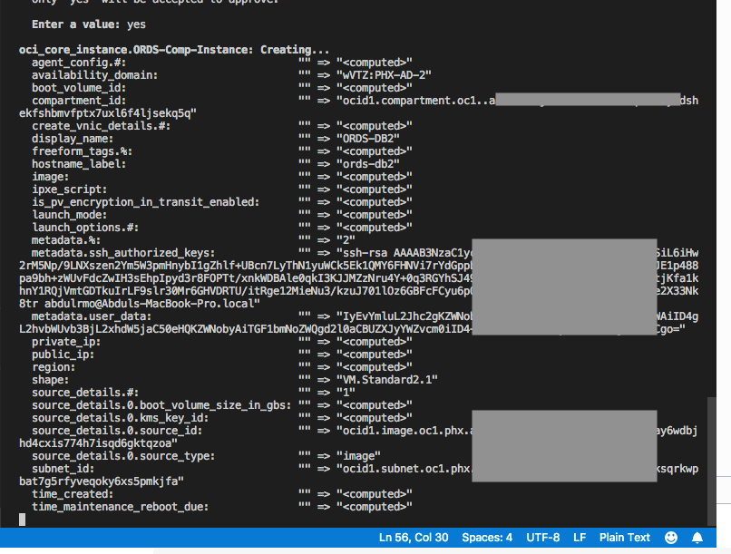

    For ORDS on the DB Server itself : 

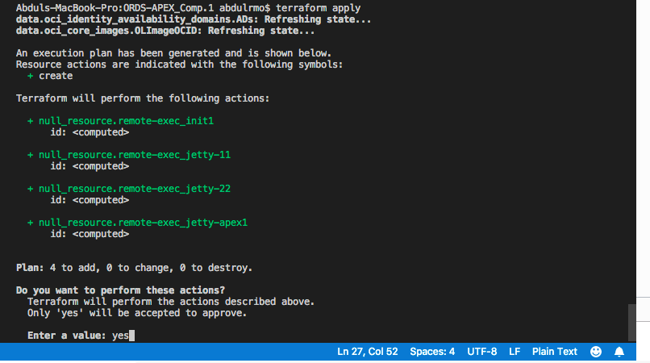

    Then, you will see the execution running where terraform installs all the dependencies before installing ORDS and APEX.


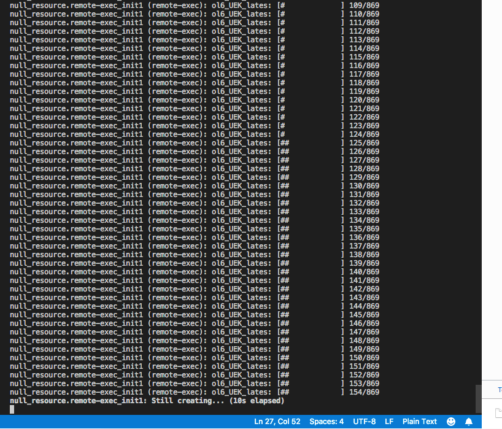

- If ORDS was installed on a separate VM. You will see the IP of the compute instance displayed on the screen, when  the script finishes execution.

    - Then, copy the IP address displayed, as you will need it to login to the APEX server through ORDS server.

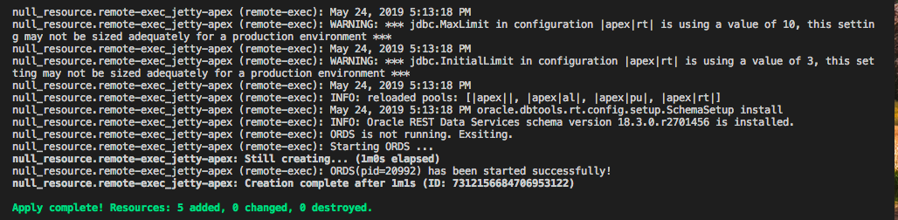
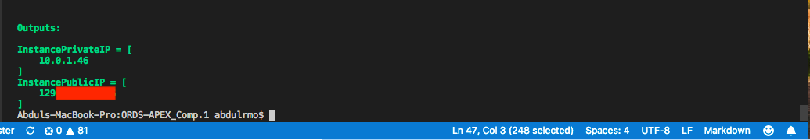

- If ORDS was installed on the DB Server itself, then you will need the IP address of the DB Server to connect to login to APEX through ORDS server.

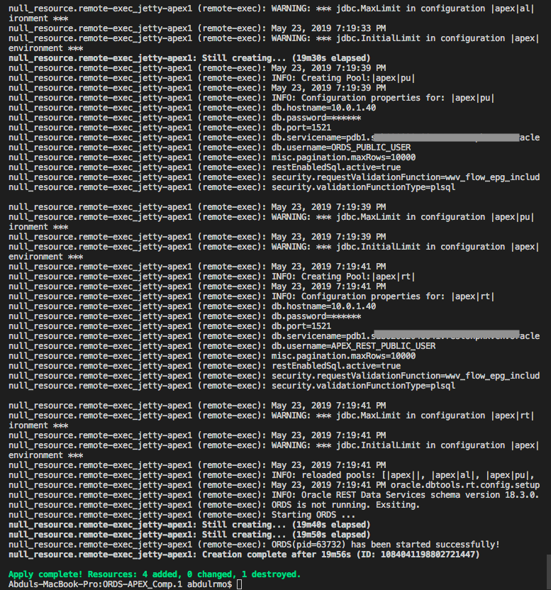

- The URL is as follows:

```
http://<IP address of ORDS server>:<ORDS Port>/ords
```

- Enter the above URL in the browser and you will see APEX Login Page

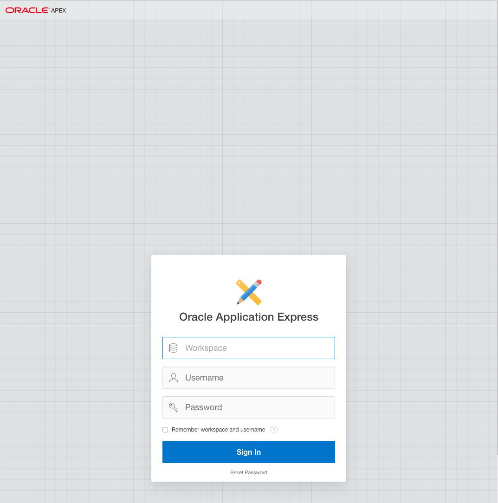

    **Note : If the URL is unreachable then you might have to add a rule in the firewall of the server where ORDS is installed to allow incoming connections on the ORDS port.**

### STEP 4: Creating the Schema on the DB instance

#### STEP 4-1: Connect to Database instance

- Connect to your database using the SQL Client or SQL Developer. Please Refer **Lab 4** to know how to setup the connectivity.

    Using SQL Client

    ```
    sqlplus sys/password@pdbname as sysdba
    ```

#### STEP 4-2: Creating Users and Tables for the users in database

Now, since we have provisioned the database instance and connected to it. We will now create a user and create a table to load data into it.

- Execute the below SQL commands to create user (let's say APPSCHEMA). Please make sure you substitute the correct pdb name for your database.

    ```
    alter session set container = <pdb_name>;
    ```

    For example

    ```
    alter session set container = AO_PDB;
    ```

    In our exercise we are going to use APPSCHEMA as the username/schema.

    ```
    <copy>create user APPSCHEMA identified by WElCome12_34#;<copy>
    ```

    ```
    <copy>alter user appschema quota unlimited on users;</copy>
    ```

    ```
    <copy>alter user appschema quota unlimited on system;</copy>
    ```

    ```
    <copy>grant CREATE CLUSTER, CREATE DIMENSION, CREATE INDEXTYPE, CREATE JOB, CREATE MATERIALIZED VIEW, CREATE OPERATOR, CREATE PROCEDURE, CREATE SEQUENCE, CREATE SESSION, CREATE SYNONYM, CREATE TABLE, CREATE TRIGGER, CREATE TYPE, CREATE VIEW, resource to APPSCHEMA;</copy>
    ```

- Now let's create 2 tables in the schema we just created. In this exercise we will create the user with the name "APPSCHEMA" and a tables with the name "TWEETSDATA" and "JSONTWEETS" to store tweet data.

    ```
    <copy>CREATE TABLE APPSCHEMA.TWEETSDATA (tweet_id NUMBER GENERATED ALWAYS as IDENTITY(START with 1 INCREMENT by 1) PRIMARY KEY, ts TIMESTAMP, username VARCHAR2(100), tweet VARCHAR2(4000), tweet_time TIMESTAMP, retweeted VARCHAR2(20), source VARCHAR2(1000), retweet_count NUMBER(38), place VARCHAR2(500), tweet_weekday VARCHAR2(15), location VARCHAR2(1000));</copy>
    ```

    ```
    <copy>CREATE TABLE appschema.jsontweets (ts TIMESTAMP,TWEETJSON clob not null CONSTRAINT check_json CHECK (TWEETJSON IS JSON));</copy>
    ```

- Now, you have setup the schema and the tables.

- You are now ready to move to the next part of this lab.
- **Click on Lab 16-2 from the menu on the right.**
