## Introduction
In this lab we will install and configure a workload generation tool called Swingbench, and demonstrate the high performance features of the service while simulating a planned maintenance operation.
Swingbench is a free load generator (and benchmarks) designed to stress test an Oracle database. SwingBench consists of a load generator, a coordinator and a cluster overview. The software enables a load to be generated and the transactions/response times to be charted.

Swingbench can be used to demonstrate and test technologies such as Real Application Clusters, Online table rebuilds, Standby databases, Online backup and recovery etc.


## Objectives

As a database user, a DBA, or an application developer,
- Install and configure Swingbench to simulate a transaction processing workload
- Configure Exadata Cloud Service Database with Swingbench


## Required Artifacts

- An Oracle Cloud Infrastructure account with IAM privileges to provision compute instances
- A pre-provisioned ExaCS database instance. Refer to [Lab 3](?lab=lab-3-provision-databases-on-exadata-cloud) on how to provision an EXACS database.
- Pre-configured Cloud Developer Image. Refer to [Lab 4](?lab=lab-4-configure-development-system-for-use) 
- VNC Viewer or other suitable VNC client on your local laptop

## Steps

### **Step 1:** Connect to developer cloud client desktop over VNC


First, we shh into the dev client and invoke the VNC server that comes pre-installed.


- SSH into your dev client compute instance

```
<copy>ssh -i <private-key> opc@PublicIP</copy>
```

- Change the password on the VNC server
   
```
<copy>vncpasswd</copy>
```
- Once you update the password, start your VNC server with the following command

 ```
 <copy>vncserver -geometry 1280x1024</copy>
 ```

- Your development system may now be ready for accepting VNC connections

**Mac Users**
On your local laptop

- Open a terminal window and create an ssh tunnel using the following command

```
<copy>ssh -N -L 5901:127.0.0.1:5901 -i \<priv-key-file\> opc@<publicIP-of-your-devClient></copy>
```

**Windows Users**
- Windows 10 users can use powershell to connect using the command above

- Alternatively, you may create an ssh tunnel using putty. Detailed instructions on using putty for ssh tunnels are provided in the [Appendix](?lab=appendix)


You now have a secure ssh tunnel from your local laptop to your development system in OCI on VNC port 5901.

**Note: As mentioned earlier, you need a VNC client installed on your laptop. This lab uses VNC Viewer.**


Start VNC Viewer on your laptop and configure a client connection using the settings as shown


Note how the connect string for VNC Server is simply localhost:1 . That is because the default port 5901 on your local machine is forwarded to 5901 on your OCI dev client over an ssh tunnel.

Connect to your VNC desktop and provide the password you changed on the host earlier.

You should now see a linux desktop in your VNC window.


### **Step 2:** Download and install Swingbench

We will start with downloading and installing Swingbench in a developer client virtual machine provisioned in [Lab 4](?lab=lab-4-configure-development-system-for-use).

Connect to your developer client machine via VNC.

**The remainder of this lab assumes you are connected to the image through VNC Viewer and are operating from the image itself and not your local machine (except if noted)**


Once connected, open a terminal window and download the latest version of swingbench using the curl command below:

````
wget http://www.dominicgiles.com/swingbench/swingbenchlatest.zip
````

- Unzip swingbenchlatest.zip. It unzips contents in the swingbench folder

```
unzip /home/opc/swingbenchlatest.zip
```

If you are already running an older version of swingbench, you would need to update the jdbc drivers in swingbench/lib to 18c jdbc drivers for TAC to work. Oracle 18c jdbc drivers may be downloaded from,

https://www.oracle.com/database/technologies/appdev/jdbc-ucp-183-downloads.html

**Note: 19c drivers have not been tested with swingbench and may produce unpredictable results**

Use instructions below to update drivers if needed, else move on to transfer DB wallet

        1. Download ojdbc8-full.tar.gz to the downloads folder in your dev. client instance

        2. untar the archive

            ```
            tar -xvf ojdbc10-full.tar.gz
            ```

        3. Copy the contents of ojdbc10-full to /home/opc/swingbench/lib, replacing the existing files. 

        Note: Do not modify the launcher directory or the existing swingbench.jar. 

### **Step 3:** Build and setup sample swingbench schema

Now that you have installed swingbench, the next step is to build the sample Order Entry schema in the database. 

- First, ssh into your dev client machine and change directory to '/home/opc/swingbench/bin'

```
cd /home/opc/swingbench/bin
```

- Run the Order Entry wizard

```
./oewizard
```


- Oracle entry install wizard will pop up on the screen and click NEXT

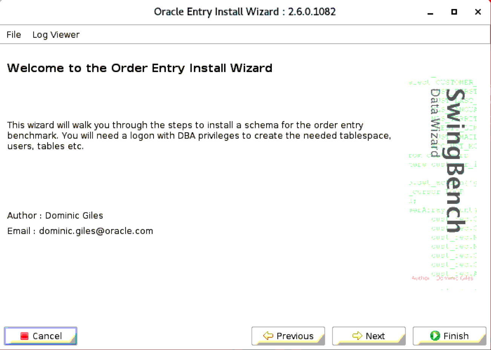

- Select Version 2.0 and click NEXT

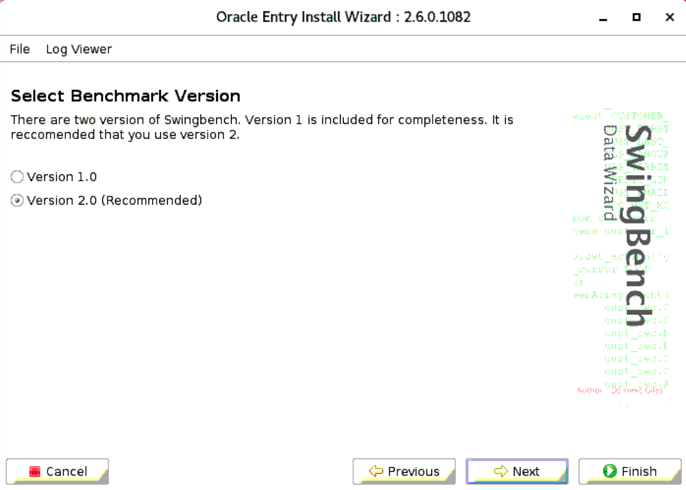

- Select **Create the Order Entry Schema** and click NEXT

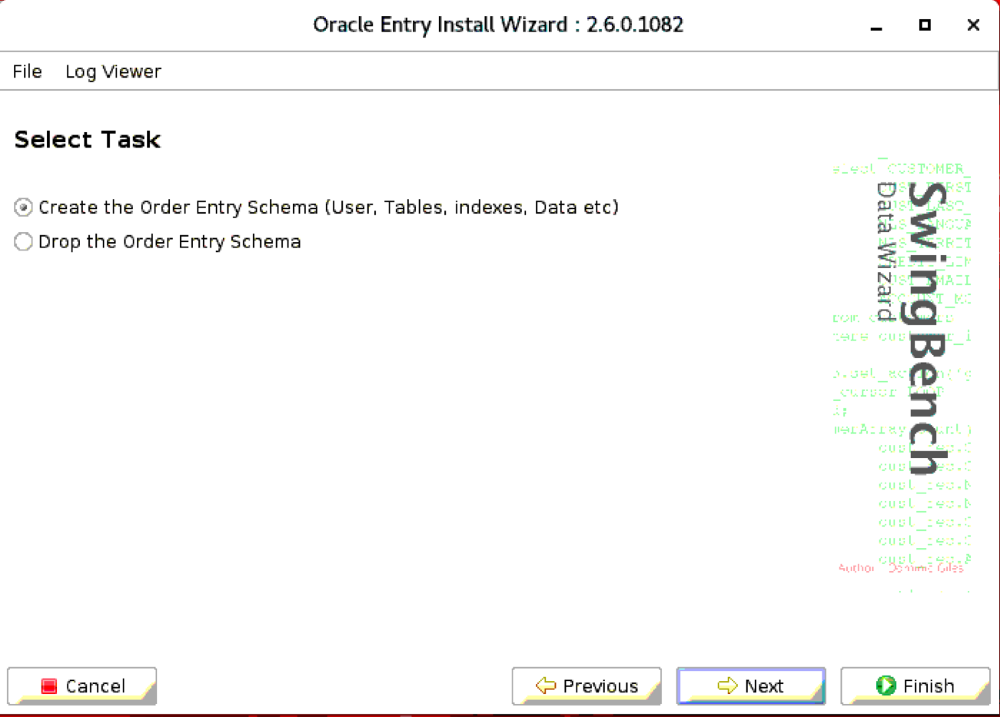

- Enter Connect String, Administrator Username and Password and click next

```
Connect String: //Hostname:port/ServiceName
Administrator Username: sys as sysdba
Administrator Password: Your admin password
```

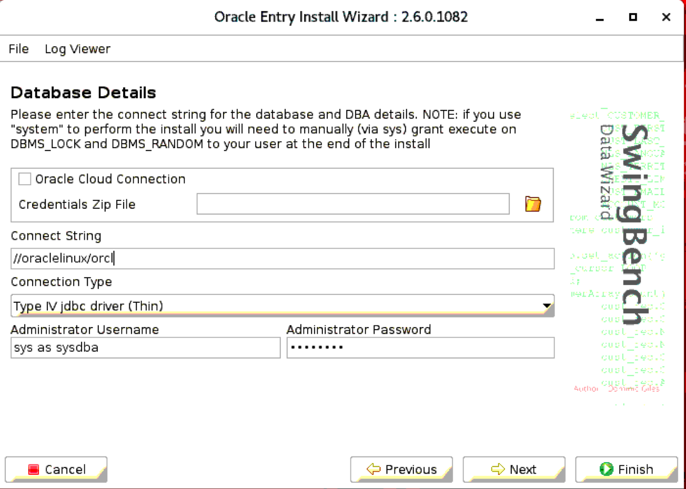


- Leave the default informtation in the Schema Details screen and click NEXT

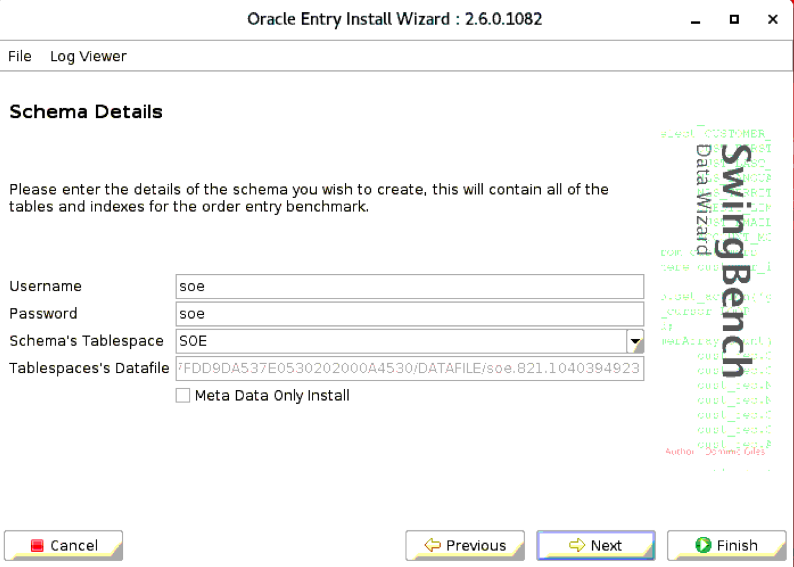

- Leave the default information in Database Options page and click NEXT

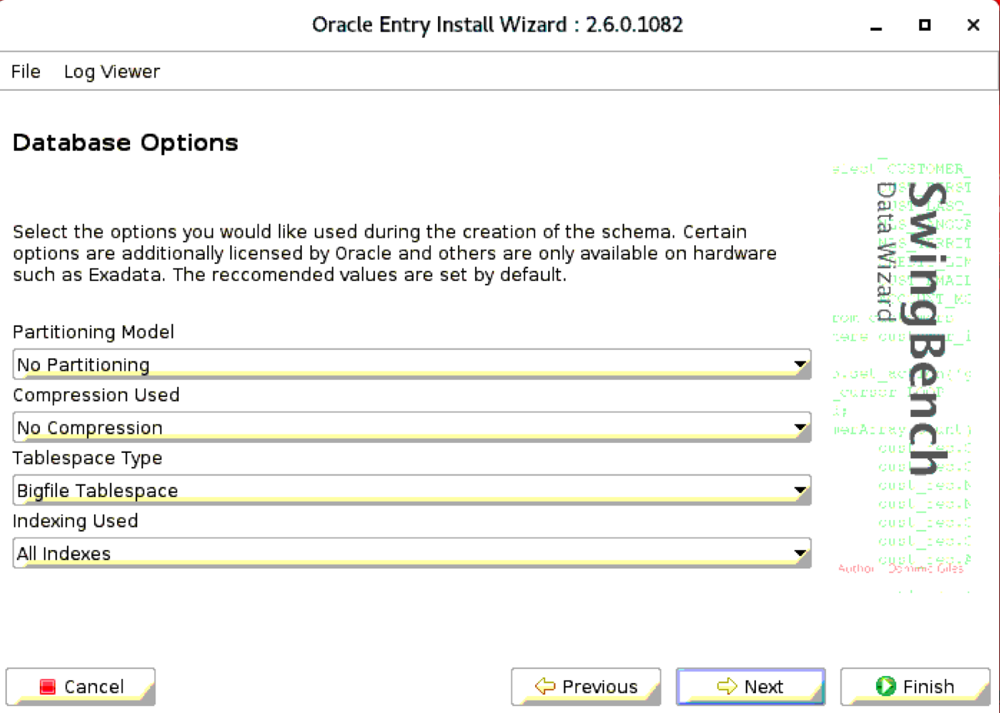

- Enter Sizing Details anf click NEXT


- Enter Level of Parallelism and click FINISH

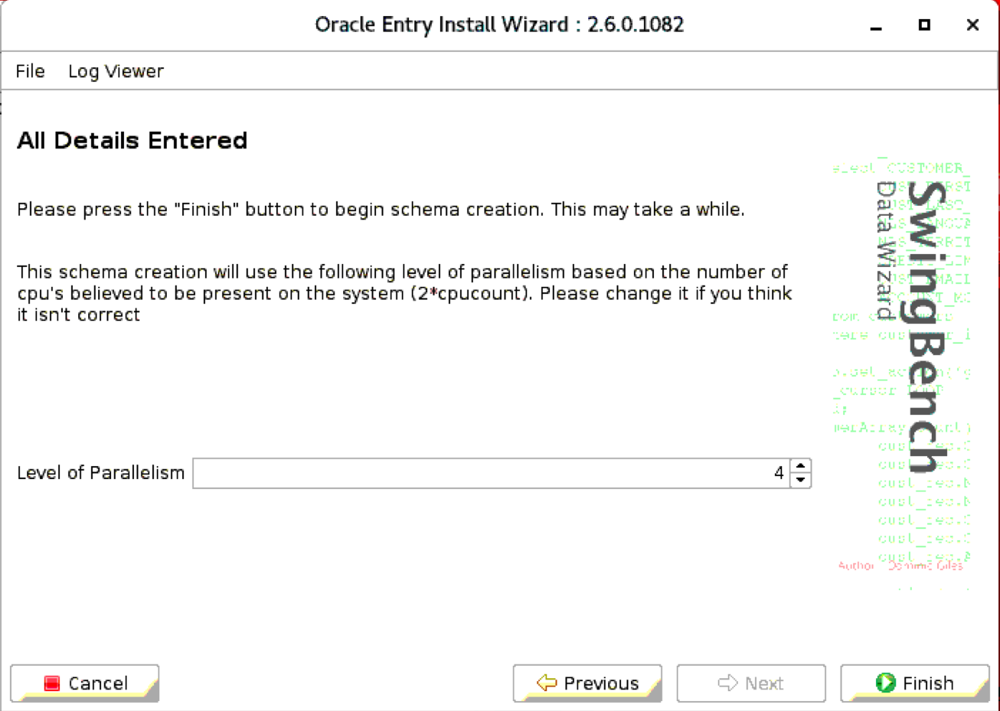

- Once the Schema is loaded you can click OK and exit the screen

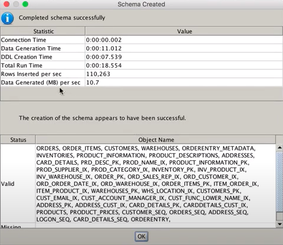


### **Step 4:** Start Load generator on Exadata Cloud Service database

- Start the swinbench load generator on your Developer cloud image

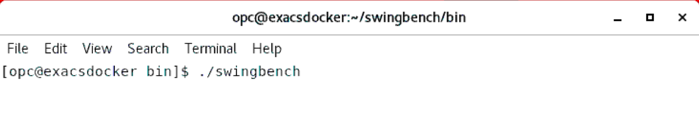

- This will pop up swingbench load generator screen. Select **SOE_SERVER_SIDE_V2** and click OK

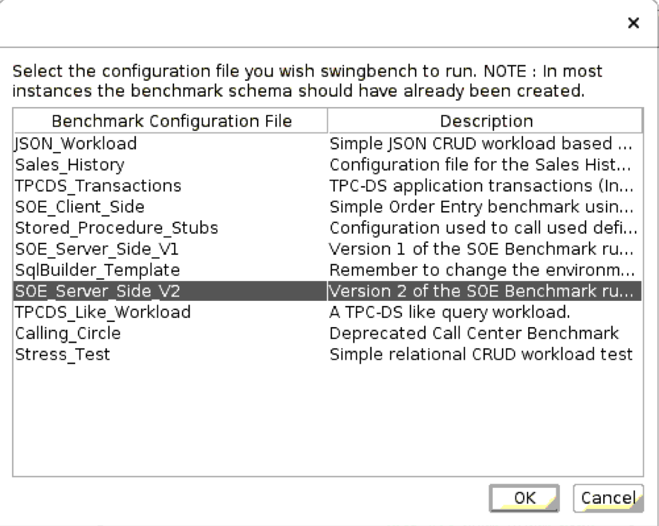

- Under Configuration enter Username, Password, Connect String and Drive Type

```
Username: soe
Password: soe
Conenct String: //hostname:port/serviceName
Drive Type: Oracle jdbc Driver
```

- Check the checkbox in **Collect Database Statistics** and enter Admin Username and Admin Password

```
Admin Username: System
Admin Password: Your admin Password
```
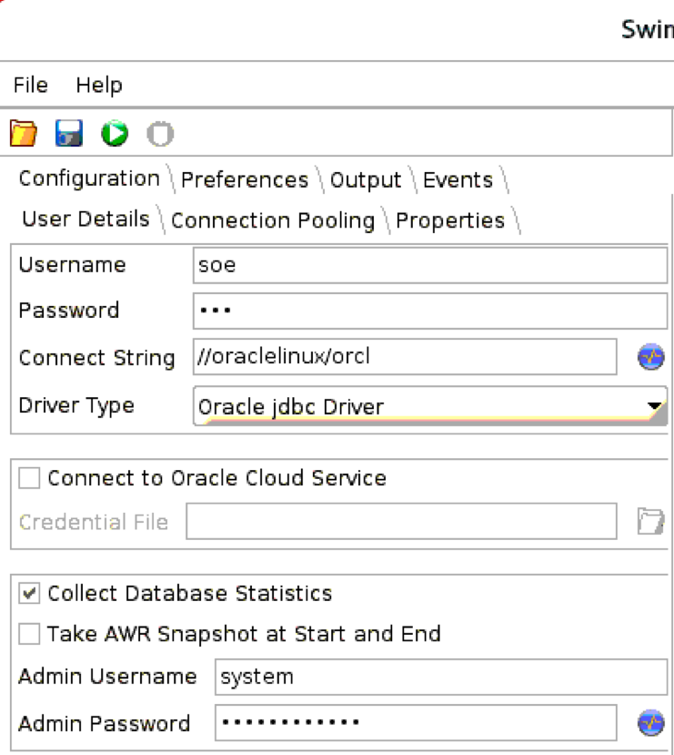

- Once the database has been connected, click on the green **Start** button to start the load on the database


- You can now observe Transactions per minute increasing in the Chart section

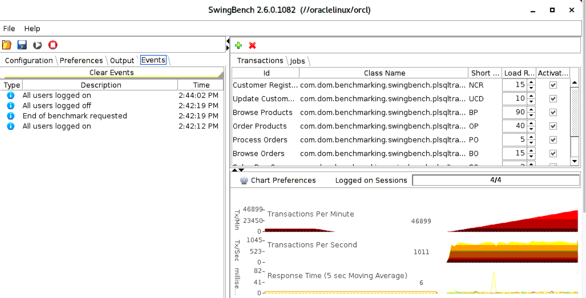

- You can further change the configuration settings, increasing Logged on Sessions, shutting down one of the nodes in the Exadata Cloud Service, and increasing the initial data size with Swingbench. 

You can find more information on Swingbench [Here](http://www.dominicgiles.com/swingbench.html).

Great Work! You have successfully configured Swingbench and ran a load on Exadata Cloud Service Database.
