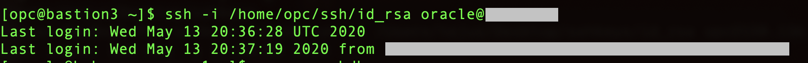
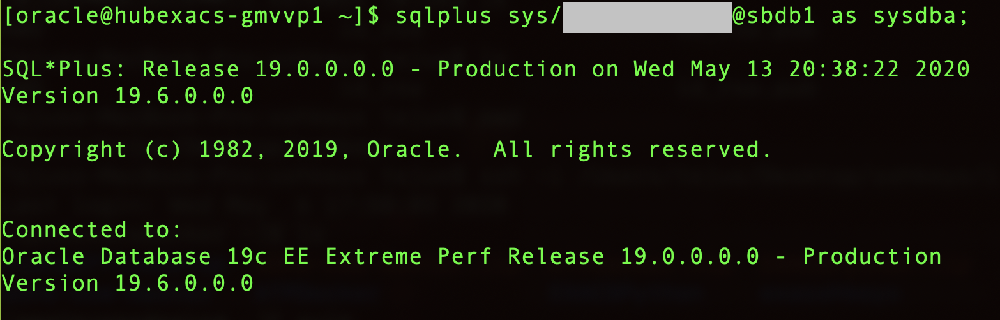
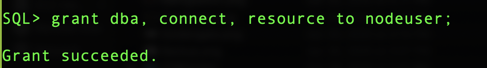
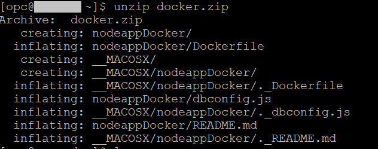
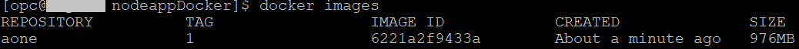
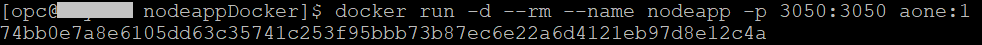
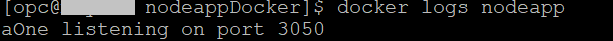
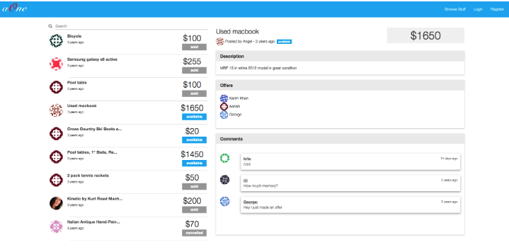

## Introduction

Containers allow us to package apps along with all their dependencies and provide a light-weight run time environment that provides isolation similar to a virtual machine, but without the added overhead of a full-fledged operating system.

The topic of containers and microservices is a subject on its own but suffice to say that breaking up large, complex software into more manageable pieces that run isolated from each other has many advantages. It's easier to deploy, diagnose and provides better availability since failure of any microservice limits downtime to a portion of the application.

This lab walks you through the steps to connect a containerized node.js application to Oracle Exadata Cloud Service and deploy it in OCI Compute instance.


### See an issue?
Please submit feedback using this [form](https://apexapps.oracle.com/pls/apex/f?p=133:1:::::P1_FEEDBACK:1). Please include the *workshop name*, *lab* and *step* in your request.  If you don't see the workshop name listed, please enter it manually. If you would like us to follow up with you, enter your email in the *Feedback Comments* section.
## Objectives

- To build a docker container running node.js microservice
- Connect it to an Exadata Cloud Service running in the Oracle cloud
- Deploy the docker container on Oracle Compute Instance

## Required Artifacts

-   An Oracle Cloud Infrastructure account with IAM privileges to provision compute instances with the image as Oracle Cloud Developer Image which contains docker pre-installed.
- A pre-provisioned ExaCS database instance. Refer to [Lab 3](?lab=lab-3-provision-databases-on-exadata-cloud) on how to provision an EXACS database.
- Download the create_schema.sql file from  [here](https://objectstorage.us-ashburn-1.oraclecloud.com/p/ujyJptO8HTA9iz1owwsPB0Q9wC21mJsB2dd6VCoOW_E/n/orasenatdpltintegration02/b/ExaCSScripts/o/create_schema.sql), which we will be using in the lab to create user schema for the application.
#### Note: If you're using any other Images/Operating system, Follow these to install Docker. [Mac User link](https://docs.docker.com/docker-for-mac/install/), [Windows User link](https://docs.docker.com/docker-for-windows/install/) and [Linux User link](https://docs.docker.com/engine/install/)

## Steps

### **STEP 1: Connect to your database and create nodeuser and run create_schema.sql**


- SSH into your Exadata Cloud Service Database VM

```
<copy>ssh -i <private-key> oracle@PublicIP</copy>
```

 

- Change source database from default to your database by executing the following command

```
<copy>source dbname.env</copy>
```

- Connect to your Exadata Cloud Service Database

```
<copy>sqlplus sys/dbpassword@pdbname as sysdba</copy>
```

 

- Create a database schema called **NODEUSER**

```
<copy>create user nodeuser identified by dbpassword;</copy>
```

- Grant dba, connect and resource to NODEUSER

```
<copy>grant dba, connect, resource to nodeuser;</copy>
```



- Connect to NODEUSER schema as shown

```
<copy>conn nodeuser/dbpassword@sbdb1;</copy>
```
 
 

**Now that nodeuser is created and logged in, copy the contents of create_schema.sql that we downloaded earlier and run it here.**

### **STEP 2: Configure dbconfig.js and Build docker image**

- Now ssh into the Oracle compute instance and run the below command to get the zip file containing the docker application

```
<copy>wget -O docker.zip https://objectstorage.us-ashburn-1.oraclecloud.com/p/xs3Y4D_IHVCVIyPpAjq1Fr2woO-MMso-xNbmnbh3NGk/n/orasenatdpltintegration02/b/ExaCSScripts/o/nodeappDocker.zip</copy>
```

Note: Application aOne is a sample marketplace application and requires schema and seed data to be deployed in the backend


- Unzip the docker.zip

```
<copy>unzip docker.zip</copy>
```

 

- Edit dbconfig.js file in nodeappDocker folder with your Exadata Cloud Service Database credentials

```
<copy>
cd nodeappDocker/

vi dbconfig.js
</copy>
```


 

- Now we'll deploy docker image.

**NOTE: To check if the docker is installed, run the below command.**

```
<copy>docker -v</copy>
```

- Run the below commands and restart the session

```
<copy>
sudo usermod -aG docker $USER
sudo usermod -aG root $USER
</copy>
```

With the dbconfig.js file edited with the appropriate ExaCS credentials, let us proceed with creating the image

- Build docker image 
```
<copy>docker build -t aone:1 .</copy>
```
**NOTE: When running the docker build command, make sure you are in the same directory as dockerfile. In this case, that would be nodeappDocker.**

Once the docker image build is done, you can find the image by running the below command
```
<copy>docker images</copy>
```
 
 

### **STEP 3: Run your docker image as container**

- Run the aone image with the name nodeapp to deploy the node application as a container

```
<copy>docker run -d --rm --name nodeapp -p 3050:3050 aone:1</copy>
```

 

**NOTE: When running the docker run command, make sure port 3050 is open for the compute instance.**

- Run the below command to check the logs. 

```
<copy>docker logs nodeapp</copy>
```
 


- You have now bridged port 3050, on the container, to your compute instance

- To check the app, open your browser on your local machine and go to http://public_ip_of_your_compute_instance:3050



You just built and provisioned an entire application stack consisting of a microservice and an enterprise grade database. You can push your docker image to a public/private docker repository and it can be pushed to any container orchestration service either on-prem or with any cloud provider

Congratulations! You have successfully completed deploying containerized app on OCI and connected it to the Exadata Cloud Service Database
