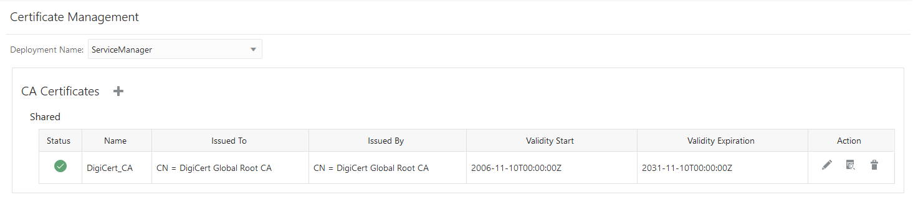
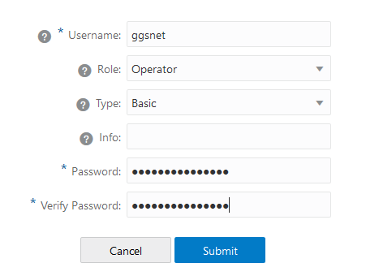

# Create a Trusted Connection Between Oracle GoldenGate and OCI GoldenGate

## Introduction

This lab walks you through the steps to download the root certificate from Oracle Cloud Infrastructure and add it to the Oracle GoldenGate wallet.

Estimated Lab Time: 5 minutes

### Before You Begin

To successfully complete this lab, you must have:

* An on premise or Marketplace Oracle GoldenGate instance running
* The URL and log in credentials for the Oracle GoldenGate Service Manager
* The log in credentials for the OCI GoldenGate Deployment Console

### Objectives

In this lab, you will:
* Download the root certificate for Oracle Cloud Infrastructure from your web browser to your local machine
* Add the certificate to your Oracle GoldenGate wallet
* Create a credential on Oracle GoldenGate to connect to OCI GoldenGate

## **STEP 1A**: Using Chrome to Download the Root Certificate

The following instructions show you how to download the Root Certificate using a Chrome web browser.

1.  Log in to the **Oracle Cloud Infrastructure Console** with your username and password. See [Signing in to the Console](https://docs.cloud.oracle.com/en-us/iaas/Content/GSG/Tasks/signingin.htm) in the *Oracle Cloud Infrastructure* documentation.

2.  In your Chrome browser address bar, click the padlock icon, and then click **Certificate (Valid)**.

    

3.  In the Certificate window, click **Certification Path**, select **DigiCert**, and then click **View Certificate**.

    Another Certificate window opens, displaying the details for the root DigiCert certificate.

    

4.  Click **Details**, and then click **Copy to File**.

    

5.  In the Certificate Export Wizard, click **Next**.

6.  Select **Base-64 encoded X.509 (.CER)**, and then click **Next**.

    

7.  Click **Browse** to select a location on your local machine to save the root certificate, and then enter a file name, such as **DigiCert-Root.cer**, and click **Save**.

8.  Click **Next**, and then click **Finish**.

A Certificate Export Wizard dialog displays **The export was successful**. You can close the Certificate windows.

## **STEP 1B:** Using FireFox to Download the Root Certificate

The following instructions show you how to download the Root Certificate using a FireFox web browser.

1.  Log in to the **Oracle Cloud Infrastructure Console** with your username and password. See [Signing in to the Console](https://docs.cloud.oracle.com/en-us/iaas/Content/GSG/Tasks/signingin.htm) in the *Oracle Cloud Infrastructure* documentation.

2.  In your FireFox browser address bar, click the padlock icon, and then next to Connection Secure, click **Show connection details** (right arrow icon).

    

3.  In the **Connection Security** dialog, click **More information**.

    

4.  In the **Page info** window, click **View Certificate**.

    

5.  On the **Certificate** page, click **DigiCert Global Root CA**.

    

6.  Under the **Miscellaneous** section, for Download, click **PEM (cert)**, and save the PEM file to your local drive.

    

## **STEP 2:** Upload the certificate to the on premise or Marketplace Oracle GoldenGate Service Manager

1.  Open the on premise or Marketplace Oracle GoldenGate Service Manager in a browser window.

2.  In the navigation menu (hamburger icon), click **Certificate Management**.

    

3.  On the Certificate Management page, click **Add CA Certificates** (plus icon).

    

4.  In the Add CA Certificate dialog, enter a **Unique Name**.

    

5.  For **Certificate PEM**, if you downloaded the root certificate from Chrome, open it in a text editor, and then copy and paste the key into the **Enter** text area.

    

6.  If you downloaded the root certificate from FireFox, click **Upload**, and then click **Browse**. Locate and select the PEM file on your local machine, and then click **Upload**.

    

7.  Click **Add**.  The certificate now appears in the Shared list.

    

## **STEP 3:** Add a Credential for Oracle GoldenGate to Connect to OCI GoldenGate

1.  Launch the OCI GoldenGate Deployment Console, sign in, and then use the Navigation menu (hamburger icon) to open the Administration Server's **Administrator** page.

    

2.  Click **Add User** and create a user account that Oracle GoldenGate will use to connect to OCI GoldenGate. For example, name the user **ggsnet** and assign the user the Operator role.

    

    

3.  Sign in to the on premise or Marketplace Oracle GoldenGate Administration Server, and then use the Navigation menu to open the **Configuration** screen.

4.  Under the Database tab, click **Add Credential**, and then complete the following fields:

    * For **Credential Domain**, enter a name to distinguish this connection, such as **GGSNetwork**.
    * For **Credential Alias**,  enter a name
    * For **User ID**, enter the user name of the user you created in step 2 (ggsnet).
    * For **Password**, enter the password associated to the user entered for User ID.
    * For **Verify Password**, re-enter the password for verification purposes.

    

5.  Click **Submit**.

In this lab, you created a trusted connection between Oracle GoldenGate and OCI GoldenGate using a self-signed certificate. You can now proceed to the next [lab](#next).

## Acknowledgements
* **Author** - Jenny Chan, Consulting User Assistance Developer, Database User Assistance
* **Contributors** -  Werner He and Julien Testut, Database Product Management
* **Last Updated By/Date** - May 2021
