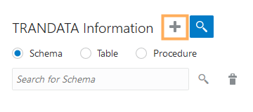

# Connect Oracle GoldenGate to Autonomous Data Warehouse

## Introduction

For the purposes of this workshop, Oracle Autonomous Data Warehouse (ADW) serves as the source database for your Oracle GoldenGate Marketplace deployment. This lab walks you through the steps to connect your Oracle GoldenGate Marketplace deployment to ADW.

Estimated lab time: 10 minutes

### Objectives

In this lab, you will:
* Download the ADW credentials
* Upload the ADW credentials to the Oracle GoldenGate Marketplace compute instance
* Add the ADW credentials in the Oracle GoldenGate Administration Server

### Prerequisites

Follow the instructions for [Connecting to a Linux Instance ](https://docs.oracle.com/en-us/iaas/Content/Compute/Tasks/accessinginstance.htm#linux) to enter your private key for the Oracle GoldenGate Marketplace Compute instance.

## **STEP 1:** Download the Target ADW Client Credentials

1.  Navigate back to the Target ADW Autonomous Database Details page, and then click **DB Connection**.

    

2.  In the DB Connection panel, click **Download Wallet**.

    

3.  In the Download Client Credentials (Wallet) dialog, enter the Target ADW Admin password twice, and then click **Download**.

## **STEP 2:** Upload the Target ADW Credentials to Oracle GoldenGate

1.  In the OCI Console, open the navigation menu (hamburger icon), click **Compute**, and then click **Instances**.

    

2.  Under **List Scope**, ensure that the correct **Compartment** is selected for your workshop. You can find your compartment information in the Workshop Details of this LiveLab.

3.  Select **Oracle GoldenGate 21.1.0.0.1 Microservices Edition for Oracle**.

4.  On the Instance Details page, under **Instance Access**, copy the **Public IP Address**.

    

5.  Using a secure FTP client of your choosing, open a connection to the Oracle GoldenGate Marketplace instance using its Public IP Address.

6.  Upload the wallet\_ADW.zip and then extract its contents to a new directory, such as **wallet\_ADW**.

    ```
    <copy>mkdir wallet_ADW
unzip wallet_ATP.zip -d wallet_ADW</copy>
    ```

## **STEP 3:** Add the Target ADW credential in the Oracle GoldenGate Administration Server

1.  Launch the OCI GoldenGate Deployment Console.

2.  Open the navigation menu (hamburger icon) and then click **Configuration**.

    

3.  Copy the SourceATP connection string in the User ID column, and then paste it into a text editor.

    

4.  Edit the TargetADW connection string, replacing the value for **MY\_WALLET\_DIRECTORY** with the location where you unzipped the wallet_ADW.zip. For example, **/home/opc/wallet\_ADW**.

    

5.  In a new browser tab or window, use the Public IP and port 443 (**https://&lt;public-ip&gt;:443**) to open the Service Manager.

6.  Log in to the Service Manager using **oggadmin** credentials found in **/home/opc/ogg-credentials.json**.

7.  In the Service Manager, under **Services**, click the port number associated with the Administration Server. The Administration Server opens in a new browser tab. If you're prompted to log in again, use the same oggadmin credentials.

    

8.  In the Administration Server, open the navigation menu (hamburger icon), and then select **Configuration**.

    

9.  Click **Add Credential**.

10. Enter the following information, and then click **Submit**:

    * For **Credential Domain**, enter **OracleGoldenGate**.
    * For **Credential Alias**, enter the ADW database name (low) from /home/opc/wallet\_ADW/tnsnames.ora. For example, **atp46130\_low**.
    * For **User ID**, paste the ADW connection string from step 4.
    * For **Password**, enter the ggadmin password created when you registered the Target Database.

    

11. Click **Connect to Database**.

    

12. Next to TRANDATA Information, click Add **TRANDATA**.

    

13. For **Schema Name**, enter **SRC\_OCIGGLL**, and then click **Submit**. *You only need to click Submit once. Click Search, and then enter SRC_OCIGGLL to verify.*

In this lab, you created a connection from the Oracle GoldenGate Marketplace instance to the target ADW database. You can now proceed to the [next lab](#next).

## Acknowledgements

* **Author** - Jenny Chan, Consulting User Assistance Developer, Database User Assistance
* **Contributors** -  Julien Testut, Database Product Management
* **Last Updated By/Date** - Jenny Chan, July 2021
