# Setup of GoldenGate Microservices for Replication

## Introduction

This hands-on lab is designed to demonstrate how Oracle GoldenGate 19c Microservices can be used to setup a replication environment by a mix of web page, shell scripts and Rest API interfaces.  All labs will use shell scripts to facilitate the building of the environment, at the same time provide insight into how to use the web pages and AdminClient.

The labs will walk the end-user through how to add all components of Oracle GoldenGate replication.  To do the instantiation of the target database, the end-user will be performing a data pump export and import.  All replication process will be started as they are built.

*Estimated Lab Time*: - 60 mins

### About Oracle GoldentGate Microservices
Oracle GoldenGate offers high-performance, fault-tolerant, easy-to-use, and flexible real- time data streaming platform for big data environments. It easily extends customers’ real-time data integration architectures to big data systems without impacting the performance of the source systems and enables timely business insight for better decision making. This workshop focuses on **GoldenGate Real Time Data Capture** demonstrating four scenarios that you can use (both on-premise and in the cloud) to capture real time data changes from your sources.

### Lab Architecture


### Objectives

The objectives of the lab is to familiarize you with the process to create data repication objects that will allow you to replicate data realtime using GoldenGate Microservices while levergaring RestfulAPIs.

### Prerequisites
This lab assumes you have:
- A Free Tier, Paid or LiveLabs Oracle Cloud account
- SSH Private Key to access the host via SSH
- You have completed:
    - Lab: Generate SSH Keys
    - Lab: Prepare Setup
    - Lab: Environment Setup
    - Lab: Configure GoldenGate

In this lab we will setup GoldenGate Microservices


## **STEP 1:** Start the Oracle Database 19c (19.1) and Listener

1. Open a terminal session


````
    <copy>sudo su - oracle</copy>
````
2.	Login into the oracle user sudo su - oracle  
3.	Start the database 
    cd ~/Desktop/Scripts/HOL/Lab1  
```
   <copy>sh ./startup.sh</copy>
```
    

## **STEP 2:** Creating Deployments – Atlanta and Boston 

1. Open a terminal session 


````
    <copy>sudo su - oracle</copy>
````

Deployments are a new concept in Oracle GoldenGate Microservices. 
Deployments provide a siloed approach to splitting replication environments between applications, customers, or environments. This allows for greater control over the use of Oracle GoldenGate in larger environments. 

2.	Log in to ServiceManager’s HTML5 webpage. This is done by opening Firefox on your linux host machine. 

3.	From the browser, connect to port 16000 to access the ServiceManager login page:   https://YOUR IP ADDRESS:16000 


4.	Log in to the Service Manager using the following credentials:

  User Name: **oggadmin**
  Password: **Welcome1**

5.	You should see “ServiceManager” under Deployments at the bottom of the page and the status should be set to “Running”. 

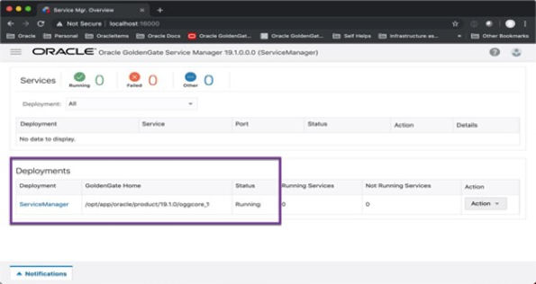

6.	Now switch back to the Remote Desktop Viewer and from the Terminal window, navigate to the Lab2 directory under ~/Desktop/Scripts/HOL

```
<copy>cd ~/Desktop/Scripts/HOL/Lab2</copy>
```
7.	At this point, by doing an “ls” in the directory; you will notice two files in the lab directory. The rsp file is a template file that will be copied and used by the sh file. In order to create two Deployments, the sh script file needs to be run twice. 

  First, find out your current VM’s local IP Address by issuing the following command 
```
<copy>hostname -I</copy>
```
8.	Write down the IP Address shown. For example, 10.145.34.23. 
(** The IP address it shows might be different than the IP address you obtained when using VNC Viewer to connect. That is fine) 

9.	Open oggca_deployment.rsp with an editor, such as vi. Find the following line, replace the IP address with the value you got from above ‘hostname -I’ command 

  Example: HOST_SERVICEMANAGER=10.0.2.15 

10.	For example, using the above IP address, change it to 

```
<copy>HOST_SERVICEMANAGER= <your_public_ip></copy>
```
11.	To run the create_deployment.sh script, you will need to provide eight (8) command line parameters. Here is the template of the command: 

sh ./create_deployment.sh (deployment_name) (admin password) (SMPort) (ASPort) 
(DSPort) (RSPort) (PMSPort) (PMSPortUDP) 

  Each of the parameters will be used to replace items in the response file and build the Deployment and associated services. Each of the command line parameters corresponds to the following: 
 = Name of the deployment to be created  = Password used by the Security Role user for the 
  ServiceManager  = Port number of the ServiceManager (16000)  = Port number of the Administration Service (16001)  = Port number of the Distribution Service (16002)  = Port number of the Receiver Service (16003)  = Port number of the Performance Metric Service (16004)  = UDP port number for Performance Metric Service NoSQL Database connection (16005) 

12.	Run the script using the following parameter values, to create the Atlanta Deployment: 

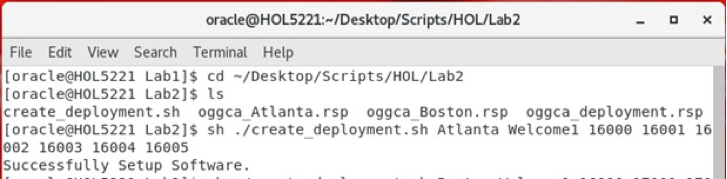

***Atlanta deployment creation***  
```
<copy>sh ./create_deployment.sh Atlanta Welcome1 16000 16001 16002 16003 16004 16005</copy>
```
13.	Return to Firefox and refresh the ServiceManager page. You should have one (1) new Deployment called Atlanta, with four (4) services listed. 

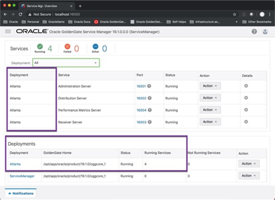

14.	Return to the Terminal Window where you ran the create_deployment.sh script and rerun the script again to create a 2nd Deployment (Boston), this time changing the Deployment name and all port numbers other than the ServiceManager (16000) port number. 

***Boston deployment creation***

15. Run the script using the following parameter values, to create the Boston Deployment: 

```
<copy>sh ./create_deployment.sh Boston Welcome1 16000 17001 17002 17003 17004 17005 </copy>
```

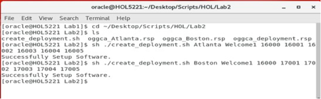

16.	Return to Firefox and refresh the ServiceManager page again. You should now have two 
(2) Deployments with a total of eight (8) services running. 


## **STEP 3:** Configure Reverse Proxy

In this Task, you will configure the NGINX Reverse Proxy.  

Note:  Prior to configuring the reverse proxy, you have to have a self-signed certificate.  These certificates have already been created for you and are stored in ~/wallet.  These are the same certificates that were used to setup the security for the ServiceManager and Deployments you created in an Task 3.

To complete this task, you will need to run the following script:

configureNginx.sh

After the completion of this task, accessing the Oracle GoldenGate Microservices HTML5 pages will be simpler.  

1.	From the Terminal window in the VNC Console, navigate to the Lab4 directory under ~/Desktop/Scripts/HOL/Lab3
```
<copy>cd ~/Desktop/Scripts/HOL/Lab3</copy>
```
2.	Execute the script.  This script will configure all items related to the Nginx Reverse Proxy

  *Note*: The configureNginx.sh script is making a call to the ReverseProxySettings utility that can be found under $OGG_HOME/lib/util/reverseproxy.  We provide this script to make it easier for you to configure the Nginx Reverse Proxy in your environment.

```
<copy>sh ./configureNginx.sh oggadmin Welcome1  16000</copy>
```
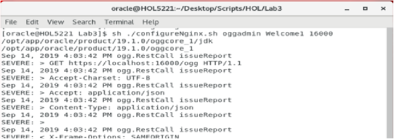

```
<copy>https://<your IP address></copy>
```
  If this is the first time you access this address, you will need to click through some security exceptions page as it is using a self-signed certificate. Once you get to the page, you will see below website. 


3.	Upon completion, return to your web browser. You should be able to access the ServiceManager page by only using the URL without a port number.

```
<copy>https://<your IP address></copy>
```
  If this is the first time you access this address, you will need to click through some security exceptions page as it is using a self-signed certificate.  Once you get to the page, you will see below website.

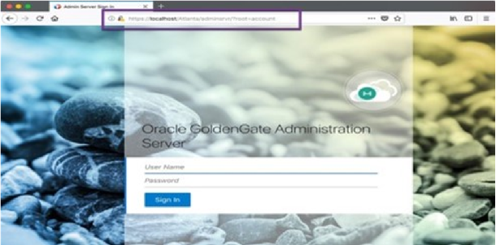


  Once you are able to access the ServiceManager by using the simpler URL, you have completed this task.

**Extra Information:**

Simplified URLs:

The benefit of using the Reverse Proxy is that it makes the URLs simpler to use.  If you are so inclined, provide your browser a URL that models this:

https://<your IP address>/(deployment)/adminsrvr

(deployment) = the name of a deployment you build in Task 3.

In the example, if using the Atlanta deployment, the URL would look like this:

**https://<your IP address>/Atlanta/adminsrvr**

```
<copy>https://<your IP address>/Atlanta/adminsrvr</copy>
```


## **STEP 4:** Create Credentials

1. In this Task, you will configure the database user credentials and tnsnames entries needed for replication.  This requires running the following scripts:

`Edit_tnsnames.sh`
`Create_credential_GGAlias.sh`
`Add_SchemaTrandata.sh`

2. After running these scripts, you will be able to establish connections for replication between the source and target pluggable database.

  Note: The script create_credential_protocol.sh will not be used in this lab and can be ignored. Before you work through this task, understand that there are multiple ways of doing this lab. The scripts provided are meant to speed up the lab process. If you are interested in creating credentials and adding schematrandata from the web pages or AdminClient the beginning steps are provided below for you. 

  For web page access, access the Administration Service (adminsrvr) using the simplified URL

  Before you work through this task, understand that there are multiple ways of doing this lab.  The scripts provided are meant to speed up the lab process.  If you are interested in creating credentials and adding schematrandata from the web pages or AdminClient the begining steps are provided below for you.

  **https://localhost/Atlanta/adminsrvr**

  **replace localhost with your local ip address**

3. Login and go to Context Menu -> Configuration -> Credentials -> click on the plus ( + ) sign.


## **STEP 5:** Create Oracle Objects

To begin this step, follow the below steps:

1.	From the Terminal window in the Remote Desktop Viewer, navigate to the Lab4 directory under ~/Desktop/Scripts/HOL.
```
<copy>cd ~/Desktop/Scripts/HOL/Lab4</copy>
```


2.	Edit the tnsnames.ora file using the edit_tnsnames.sh script.  This script will need to be run twice to add entries for both pluggable databases (oggoow19 & oggoow191)

```
<copy>sh ./edit_tnsnames.sh oggoow19</copy>
```
```
<copy>sh ./edit_tnsnames.sh oggoow191</copy>
```


3.	Verify that the tnsnames.ora file has been updated.

```
<copy>cat $ORACLE_HOME/network/admin/tnsnames.ora</copy>
```
4.	With the tnsnames.ora file updated, you can now create the Oracle GoldenGate Credentials (create_credential_GGAlias.sh) needed to connect the capture process (Extract) to the Oracle Database.

  In order to create the required credentials, run the following:

```
<copy>sh ./create_credential_GGAlias.sh Welcome1 16001 c##ggate@orcl ggate</copy>
```


  After running this script, can go to your browser and that the credential was created

5. Open a new browser tab and connect to
```
<copy>https://<your ip address>/(deployment)/adminsrvr</copy>
```
6. Login with the following oggadmin/Welcome1

7. Click the Context Menu in the upper left, then select Configuration from the left pane

    

8.	Next, we will enable schematrandata on the schema that we want to replicate.  In order to do this, you will need to run the add_SchemaTrandata.sh script.  

To run this script, execute the following

```
<copy>sh ./add_SchemaTrandata.sh Welcome1 16001</copy>
```


9. You can also check that SCHEMATRANDATA has been added from the Administration Service -> Configuration page as well.  Simply log in to the SGGATE alias.

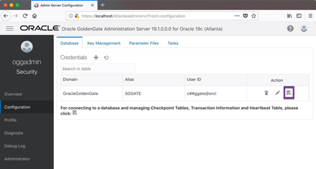

10.  Then, under “Trandata”, make sure that the magnifying glass and radio button for “Schema” are selected.  Enter “oggoow19.soe” into the search box and then select the magnifying glass to the right of the search box to perform the search.

     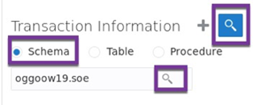

11.  After the search is performed, you will see a column that provides the number of tables enabled for supplemental logging within the “SOE” schema.

   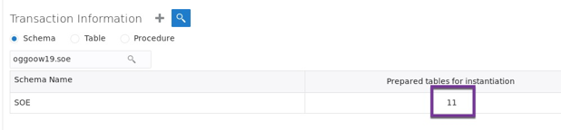

You have now completed configuring schema level supplemental logging needed for use in the replication process

## **STEP 6:** Create Oracle Replication Objects

1.	Add Extract for Atlanta Deployment
```
     <copy>cd ~/Desktop/Scripts/HOL/Lab5</copy>
```  
```
<copy>sh ./add_Extract.sh Welcome1 16001 EXTSOE </copy>
```
 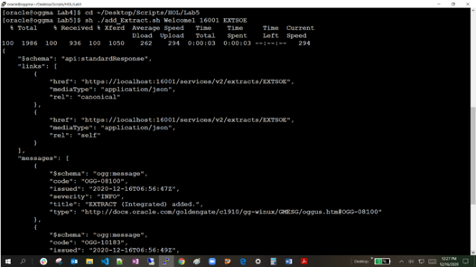

2.	From a URL – Access Atlanta adminserver 
https://<your ip address>/Atlanta/adminsrvr 

 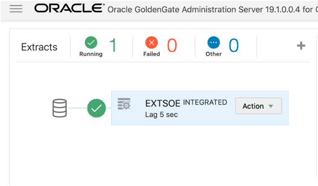

4. 	Create Distribution Path in Atlanta Deployment 

```
<copy>sh ./add_DistroPath.sh Welcome1 16002 SOE2SOE aa 17003 ab  </copy>
```
 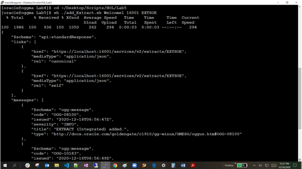

 ```
 <copy>https://<your ip address>/Atlanta/distsrvr</copy>
 ```
  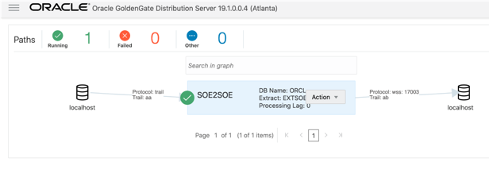

5. GoldenGate Replicat Creation Process 
   
```
<copy>cd ~/Desktop/Scripts/HOL/Lab7 </copy>
```
Create an alias for the target database User 

6. 	Create Credential 
   
```
<copy>sh ./create_credential_GGAlias.sh Welcome1 17001 ggate@oggoow191 ggate </copy>
```
  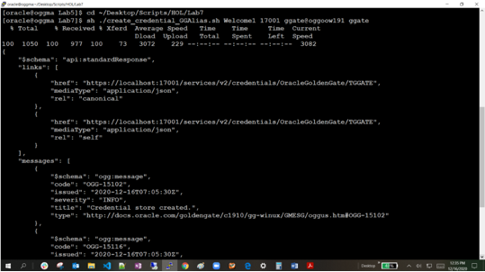
  
```
<copy>https://<your ip address>/Boston/adminsrvr/</copy>
```
  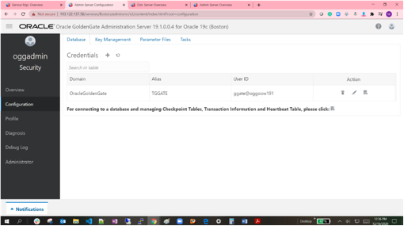

7. 	Create Checkpoint Table 

```
<copy>
sh ./add_CheckpointTable.sh Welcome1 17001  
</copy>
```
  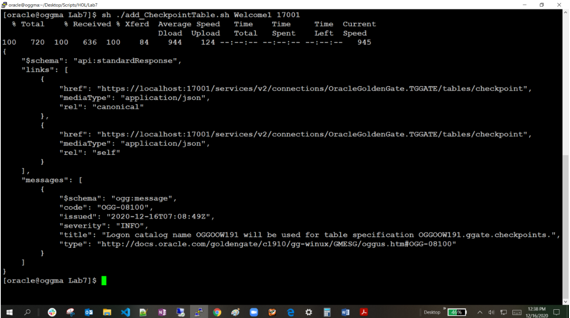

  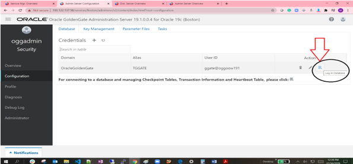


8. 	Create Replicat on Boston 
```
<copy>sh ./add_Replicat.sh Welcome1 17001 IREP  </copy>
```
  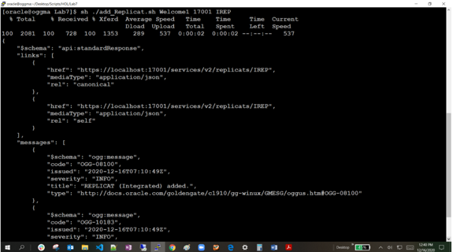

  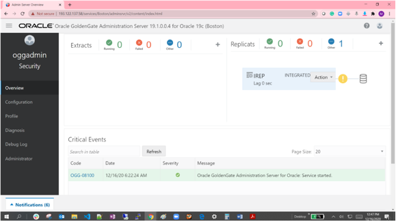

9. Start Extract, Distribution and Replicat

```
<copy> cd /home/oracle/Desktop/Scripts/HOL/Lab8</copy>
```
```
<copy>./start_replication.sh Welcome1 16001 EXTSOE 16002 SOE2SOE 17001 IREP</copy>
```
  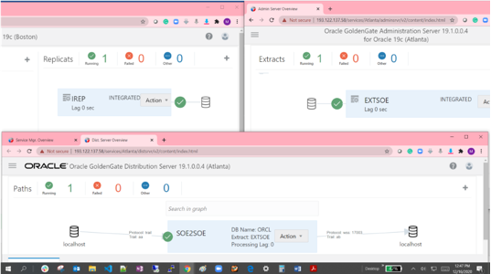
  
## Summary

The objectives of the lab was to familiarize you with the process to create data repication objects that will allow you to replicate data realtime using GoldenGate Microservices.

Oracle GoldenGate offers high-performance, fault-tolerant, easy-to-use, and flexible real- time data streaming platform. It easily extends customers’ real-time data
integration architectures without impacting the performance of the source systems and enables timely business insight for better decision making.

You may now *proceed to the next lab*.

## Learn More

* [GoldenGate Microservices](https://docs.oracle.com/en/middleware/goldengate/core/19.1/understanding/getting-started-oracle-goldengate.html#GUID-F317FD3B-5078-47BA-A4EC-8A138C36BD59)

## Acknowledgements
* **Author** - Brian Elliott, Data Integration, November 2020
* **Contributors** - Zia Khan
* **Last Updated By/Date** - Brian Elliott, December 2020

## Need Help?
Please submit feedback or ask for help using our [LiveLabs Support Forum](https://community.oracle.com/tech/developers/categories/livelabsdiscussions). Please click the **Log In** button and login using your Oracle Account. Click the **Ask A Question** button to the left to start a *New Discussion* or *Ask a Question*.  Please include your workshop name and lab name.  You can also include screenshots and attach files.  Engage directly with the author of the workshop.

If you do not have an Oracle Account, click [here](https://profile.oracle.com/myprofile/account/create-account.jspx) to create one.