# GoldenGate Microservices Active-Active 

## Introduction
This lab will introduce you to Oracle GoldenGate for Microservices Workshop Architecture and High Availability / Disaster Recovery using Active-Active Technology.
Since we have already done multiple labs, this one will take what we used so far to script this using DB container reset scripts, SQL scripts to setup AutoCDR in the database, OGGCA silent deployment scripts and GG REST API scripts to do a rapid deployment.

*Estimated Lab Time*:  60 minutes

### Lab Architecture
  

### Objectives

- Rapid Deployment using:
  - OGGCA silent deployment scripts (remove and recreate deployments).
  - REST API to setup bi-directional GoldenGate replication between two databases.
  - SQL Scripts to setup up auto conflict detection and resolution in the database.

### Prerequisites
This lab assumes you have:
- A Free Tier, Paid or LiveLabs Oracle Cloud account
- SSH Private Key to access the host via SSH
- You have completed:
    - Lab: Generate SSH Keys
    - Lab: Prepare Setup
    - Lab: Environment Setup
    - Lab: Configure GoldenGate

### Required Artifacts

- Browser to check the deployment.
- Swingbench to apply transactions.

## **STEP 1**: Swingbench to generate transactions

```
<copy>cd /home/oracle/Desktop/Scripts/HOL/Lab8 </copy>
```
```
<copy>./start_swingbench.sh</copy>
```


```
<copy>https://<your ip address>/Boston/pmsrvr</copy>
```
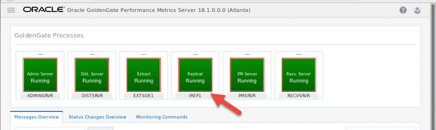


**Active – Active**

## **STEP 2**: Creation of Alias for Boston GG User 

```
<copy>cd /home/oracle/Desktop/Scripts/HOL/Lab9/Build</copy>
```
```
<copy>./create_credential_GGAlias.sh Welcome1 17001 c##ggate@orcl ggate SGGATE2</copy>
```
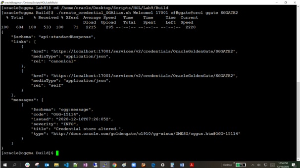

```
<copy>https://<your ip address>/Atlanta/adminsrvr</copy>
```
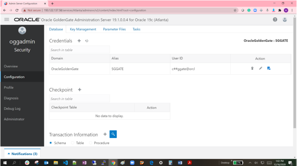

```
<copy>cd /home/oracle/Desktop/Scripts/HOL/Lab9/Build</copy>
```
```
<copy>./create_credential_Protcol.sh Welcome1 17001 oggadmin Welcome1 WSTARGET2</copy>
```
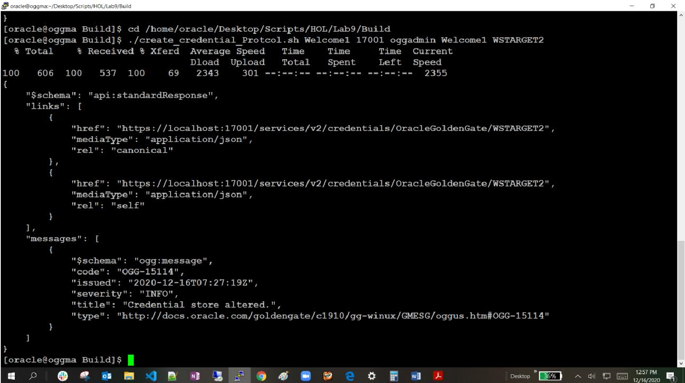

```
<copy>https://<your ip address>/Boston/adminsrvr</copy>
```
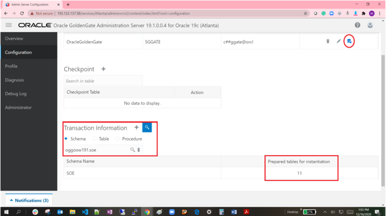


## **STEP 3**: Trandata for Boston schema SOE 

```
<copy> 
cd /home/oracle/Desktop/Scripts/HOL/Lab9/Build</copy>
```
```
<copy>./add_SchemaTrandata_182.sh Welcome1 17001</copy>
```
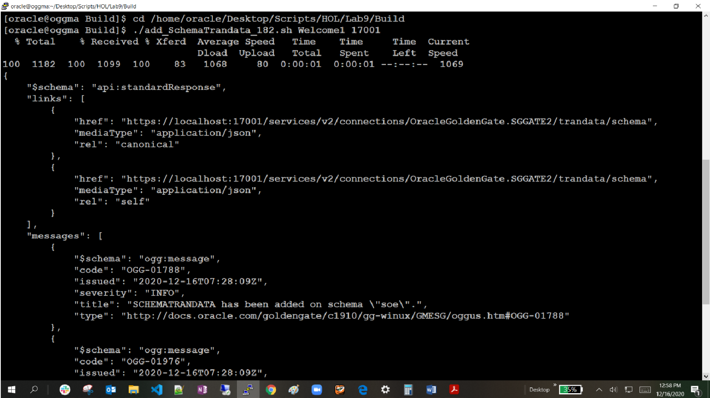

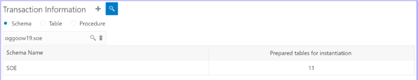

## **STEP 4**: Add Extract to Boston Deployment 

```
<copy>./add_Extract2.sh Welcome1 17001 EXTSOE1  </copy>
```
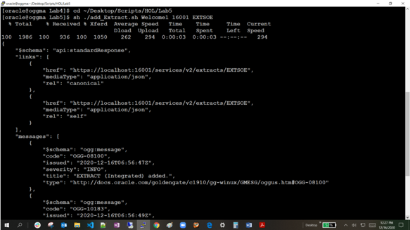

```
<copy>https://<your ip address>/Boston/adminsrvr</copy>
```

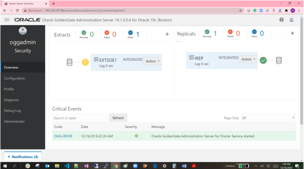

## **STEP 5**: Distribution Path Creation 

```
<copy>./add_DistroPath2.sh Welcome1 17002 SOE2SOE1 bb 16003 ba</copy>
```


```
<copy>https://<your ip address>/Boston/distsrvr</copy>
```


## **STEP 6**: Distribution path from Boston to connect to Atlanta 

```
<copy>./add_DistroPath2.sh Welcome1 17002 SOE2SOE1 bb 16003 ba</copy>
```


```
<copy>https://<your ip address>/Boston/distsrvr</copy>
```
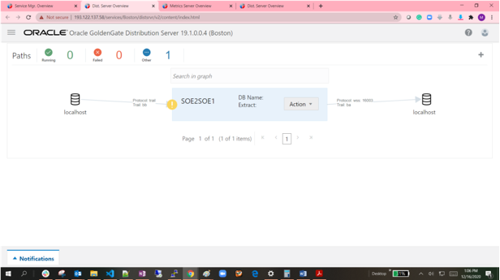

## **STEP 7**: Alias Creation 
```
<copy>./create_credential_GGAlias.sh Welcome1 16001 ggate@oggoow19 ggate TGGATE1</copy>
```


```
<copy>https://<your ip address>/Atlanta/adminsrvr</copy>
```


## **STEP 8**: Checkpoint Creation 

```
<copy>./add_CheckpointTable.sh Welcome1 16001 OracleGoldenGate.TGGATE1</copy>
```


```
<copy>https://<your ip address>/Atlanta/adminsrvr</copy>
```
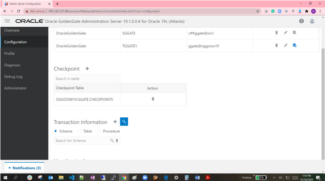

## **STEP 9**: Replicat Creation on Atlanta

```
<copy>./add_Replicat1.sh Welcome1 16001 IREP1</copy>
```


```
<copy>https://<your ip address>/Atlanta/adminsrvr</copy>
```


## **STEP 10**: Auto CDR setup 

```
<copy>cd /home/oracle/Desktop/Scripts/HOL/Lab9</copy>
```
```
<copy>./setup_autocdr.sh</copy>
```
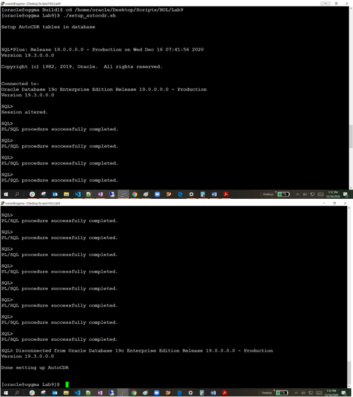


## **STEP 11**: Start GoldenGate Process 

```
<copy>./start_replication.sh Welcome1 17001 EXTSOE1 17002 SOE2SOE1 16001 IREP1</copy>
```

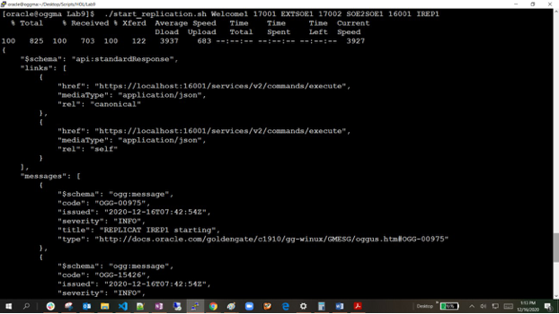


## **STEP 12**: Generate Load through Swingbench 

In this step we will use a script to invoke Swingbench to apply data to both the databases at the same time and then check them using the Performance Metric Service.


```
<copy> 
cd /home/oracle/Desktop/Scripts/HOL/Lab8</copy>
```

```
<copy>start_swingbench.sh</copy>
```


**Atlanta:**
 
```
<copy>https://<your ip address>/Atlanta/pmsrvr</copy>
```
 
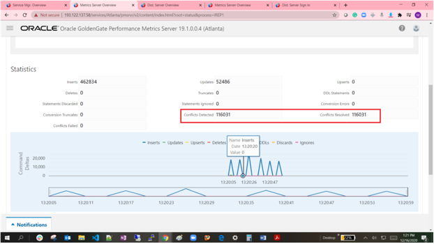

**Boston:**
 
```
<copy>https://<your ip address>/Boston/pmsrvr </copy> 
```


You may now *proceed to the next lab*

## Learn More

* [GoldenGate Microservices](https://docs.oracle.com/en/middleware/goldengate/core/19.1/understanding/getting-started-oracle-goldengate.html#GUID-F317FD3B-5078-47BA-A4EC-8A138C36BD59)

## Acknowledgements
* **Author** - Madhu Kumar S., Data Integration, December 2020
* **Contributors** - Brian Elliott
* **Last Updated By/Date** - Brian Elliott, December 2020

## Need Help?
Please submit feedback or ask for help using our [LiveLabs Support Forum](https://community.oracle.com/tech/developers/categories/livelabsdiscussions). Please click the **Log In** button and login using your Oracle Account. Click the **Ask A Question** button to the left to start a *New Discussion* or *Ask a Question*.  Please include your workshop name and lab name.  You can also include screenshots and attach files.  Engage directly with the author of the workshop.

If you do not have an Oracle Account, click [here](https://profile.oracle.com/myprofile/account/create-account.jspx) to create one.
