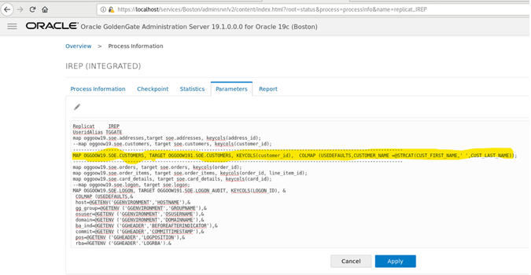

# GoldenGate Microservices Transformations 

## Introduction

This lab is intended to give you familiarity with how to configure GG for database to database replication transformations. GoldenGate is Non-invasive, real-time transactional data streaming
secured, reliable and fault-tolerant in data delivery. It is easy to install, configure and maintain real-time changed data.
It is easily extensible and flexible to stream transformed data to other relational targets

*Estimated Lab Time*:  60 minutes

### Lab Architecture


Lab  – Create GoldenGate Microservices Replication

Lab  – Active - Active Replication

Lab  – High Availability / Disaster Recovery

Lab  - Transformations using GoldenGate Microservices

### Objectives

To use GoldegGate to perform transformations on the data during the replication process. Even though GoldenGate is primarily a real time data replication tool, it does have the ability to create data transformations. In this lab we will create sample transformations to showcase this feature of GoldenGate.


### Prerequisites
This lab assumes you have:
- A Free Tier, Paid or LiveLabs Oracle Cloud account
- SSH Private Key to access the host via SSH
- You have completed:
    - Lab: Generate SSH Keys
    - Lab: Prepare Setup
    - Lab: Environment Setup
    - Lab: Configure GoldenGate

In this lab we will setup GoldenGate Microservices Transformations

## **STEP 1:** Configuration for Microservices Lab

1. Open a terminal session


````
<copy>sudo su - oracle</copy>
````


UPDATE Data: 

```
<copy>sqlplus ggate/ggate@oggoow19</copy>
```
2.	Alter Customer Table: 

```
<copy>ALTER TABLE SOE.CUSTOMERS  ADD (CUSTOMER_NAME VARCHAR2(40) );</copy>
```
3.	Create Table 

```
<copy>CREATE TABLE "SOE"."LOGON_AUDIT" 
       (    "LOGON_ID" NUMBER , 
            "CUSTOMER_ID" NUMBER, 
            "LOGON_DATE" DATE, 
         "HOST" VARCHAR2(40), 
         "GG_GROUP" VARCHAR2(40), 
         "OSUSER" VARCHAR2(40), 
             "DOMAIN" VARCHAR2(40), 
             "BA_IND" VARCHAR2(40), 
             "COMMIT" VARCHAR2(40), 
          "POS" VARCHAR2(40), 
          "RBA" VARCHAR2(40), 
          "TABLENAME" VARCHAR2(40), 
          "OPTYPE" VARCHAR2(40) 
       ) ;</copy>
```
## **STEP 2:** Masking the Source Crucial email-id’s into a dummy email in the target


1.	Go to Admin Server console for deployment Boston (http://<your ip address>:17001) and edit the parameter of the REPLICAT REP1 with the attributes to pass customer email to SQLEXEC() for execution of stored procedure and mapping it back to the target table. Add the following, after commenting the already existing map statement for CUSTOMERS table with ”–“. 

```
<copy>MAP oggoow19.SOE.CUSTOMERS, TARGET oggoow191.SOE.CUSTOMERS, keycols(customer_id), & 
SQLEXEC (SPNAME P_MAIL, PARAMS (code_param = CUST_EMAIL)), & 
COLMAP (USEDEFAULTS, CUST_EMAIL = P_MAIL.desc_param,CUSTOMER_NAME 
=@STRCAT(CUST_FIRST_NAME,CUST_LAST_NAME));</copy>
```


2.	Open Terminal and SQLPLUS into Target Database (OGGOOW191).Create a required stored procedure under GGATE users. This will be used in the SQLEXEC call in the mapping statement. 

```
<copy>sqlplus ggate/ggate@oggoow191</copy>
```

3.	Run the following:

```
<copy>CREATE  OR REPLACE FUNCTION F_MAIL(CODE_PARAM IN VARCHAR2)  
   	RETURN VARCHAR2  
   	IS DESC_PARAM VARCHAR2(100); 
   	BEGIN  
   	RETURN 'XXXXXXXXX@dummy.com';  
	  	 END; 
  /</copy>
  ```

  ```
  <copy>CREATE OR REPLACE PROCEDURE  P_MAIL (CODE_PARAM IN VARCHAR2,DESC_PARAM  OUT VARCHAR2) 
   IS  
   begin 
   select F_MAIL('CODE_PARAM') 
      into DESC_PARAM 
      from dual;    end; 
	  	 /</copy>
```

4.	Stop and start the replicat at target deployment (Boston).

5.	Open Terminal and SQLPLUS into Source Database (OGGOOW19) and do the transaction on the table CUSTOMER . 

```
<copy>sqlplus ggate/ggate@oggoow19</copy>
```

```
<copy>update soe.customers  set CUST_EMAIL='alberto.may@hotmail.com' where CUSTOMER_ID=562; 
update soe.customers  set CUST_EMAIL='andrew.king@virgin.com' where CUSTOMER_ID=563; 
update soe.customers  set CUST_EMAIL='francisco.simpson@msn.com' where CUSTOMER_ID=564; 
update soe.customers  set CUST_EMAIL='kenneth.martin@aol.com' where CUSTOMER_ID=565; 
update soe.customers  set CUST_EMAIL='steven.jackson@virgin.com' where CUSTOMER_ID=566; update soe.customers  set CUST_EMAIL='terry.nguyen@googlemail.com' where CUSTOMER_ID=567; 
update soe.customers  set CUST_EMAIL='dewey.duran@ntlworld.com' where CUSTOMER_ID=568; 
update soe.customers  set CUST_EMAIL='leroy.snyder@msn.com' where CUSTOMER_ID=569; 
update soe.customers  set CUST_EMAIL='tracy.guerrero@yahoo.com' where 
CUSTOMER_ID=570; 
 
commit;</copy>
```

6.	Check the Target tables is stored procedure was executed for static masking of the emails. Open the Terminal and SQLPLUS into Target Database (OGGOOW191). Execute “select CUSTEMAIL from soe.customers where customerID between 562 and 570;” in SQLPLUS. 
 OR 
6. Check the static masking of the emails on Target tables soe.customers. Open Terminal and SQLPLUS Target Database (OGGOOW191).

```
<copy>sqlplus ggate/ggate@oggoow191</copy>
```

```
<copy>select CUST_EMAIL from soe.customers where customer_ID between 562 and 570;</copy>
```
## **STEP 3:** Using Environment Variables/Tokens 

1.	Go to Admin Server console for deployment **Boston** (http://localhost:17001) and edit the parameter of the **REPLICAT IREP** with the attributes to map the Environment Variables to the audit table. Add the following after *useridalias command : 

**Use your ip address instead of localhost**

```
<copy>MAP oggoow19.SOE.LOGON, TARGET oggoow191.SOE.LOGON_AUDIT, KEYCOLS(LOGON_ID), & 
 COLMAP (USEDEFAULTS,&  host=@GETENV('GGENVIRONMENT','HOSTNAME'),&  gg_group=@GETENV ('GGENVIRONMENT','GROUPNAME'),&  osuser=@GETENV ('GGENVIRONMENT','OSUSERNAME'),&  domain=@GETENV ('GGENVIRONMENT','DOMAINNAME'),&  ba_ind=@GETENV ('GGHEADER','BEFOREAFTERINDICATOR'),&  commit=@GETENV ('GGHEADER','COMMITTIMESTAMP'),&  pos=@GETENV ('GGHEADER','LOGPOSITION'),&  rba=@GETENV ('GGHEADER','LOGRBA'),&  tablename=@GETENV ('GGHEADER','TABLENAME'),&  optype=@GETENV ('GGHEADER','OPTYPE'));</copy>
 ```

 2.	Stop and start the IREP 
 3.	Open the terminal and log into SQLPLUS to do transaction on source DB 
(OGGOOW191) in table LOGON 

```
<copy>sqlplus ggate/ggate@oggoow19</copy>
```
```
<copy>insert into soe.logon values ('48092713',130159,sysdate); insert into soe.logon values ('48092714',130160,sysdate); insert into soe.logon values ('48092715',130161,sysdate); commit;</copy>
```

### Summary

Oracle GoldenGate offers high-performance, fault-tolerant, easy-to-use, and flexible real- time data streaming platform. It easily extends customers’ real-time data
integration architectures without impacting the performance of the source systems and enables timely business insight for better decision making.

You may now *proceed to the next lab*.

## Learn More

* [GoldenGate Microservices](https://docs.oracle.com/en/middleware/goldengate/core/19.1/understanding/getting-started-oracle-goldengate.html#GUID-F317FD3B-5078-47BA-A4EC-8A138C36BD59)

## Acknowledgements
* **Author** - Madhu Kumar S. Data Integration, December 2020
* **Contributors** - Brian Elliott
* **Last Updated By/Date** - Brian Elliott,December 2020

## Need Help?
Please submit feedback or ask for help using our [LiveLabs Support Forum](https://community.oracle.com/tech/developers/categories/goldengate-on-premises). Please click the **Log In** button and login using your Oracle Account. Click the **Ask A Question** button to the left to start a *New Discussion* or *Ask a Question*.  Please include your workshop name and lab name.  You can also include screenshots and attach files.  Engage directly with the author of the workshop.

If you do not have an Oracle Account, click [here](https://profile.oracle.com/myprofile/account/create-account.jspx) to create one.