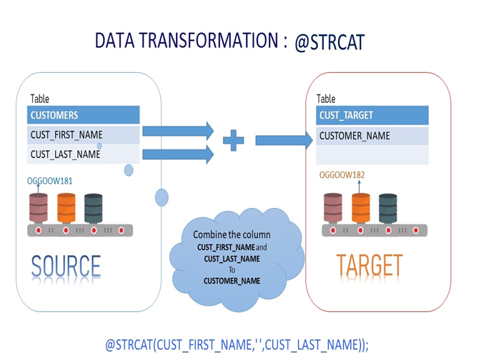

# Lab - GoldenGate Microservices Transformations 


## Want to learn more:

[GoldenGate Microservices](https://docs.oracle.com/goldengate/c1230/gg-winux/GGCON/getting-started-oracle-goldengate.htm#GGCON-GUID-5DB7A5A1-EF00-4709-A14E-FF0ADC18E842")

## Introduction

This lab is intended to give you familiarity with how to configure GG for database to database replication transformations. GoldenGate is Non-invasive, real-time transactional data streaming
Secured, reliable and fault-tolerant data delivery. It is easy to install, configure and maintain real-time changed data 
Easily extensible and flexible to stream transformed data to other relational targets

Oracle GoldenGate for Microservices Workshop Architecture 


Lab  – Create GoldenGate Microservices Replication

Lab  – Active - Active Replication
  
Lab  – High Availability / Disaster Recovery

Lab  - Transformations using GoldenGate Microservices

### Objectives

KEY FEATURES

Non-invasive, real-time transactional data streaming while applying target transformations


KEY BENEFITS

Improve IT productivity in integrating with data management systems. 
Use real-time data in big data analytics for more timely and reliable insight 
Improve operations and customer experience with enhanced business insight 

• Minimize overhead on source systems to maintain high performance

Oracle GoldenGate Microservices provides optimized and high performance delivery.Designed to demonstrate how Oracle GoldenGate 19c Microservices can be used to setup a replication environment by a mix of web page, shell scripts and Rest API interfaces.  All labs will use shell scripts to facilitate the building of the environment, at the same time provide insight into how to use the web pages and AdminClient.  

Oracle GoldenGate Microservices real-time data streaming platform also allows customers to keep their data reservoirs up to date with their production systems.


### Summary

Oracle GoldenGate offers high-performance, fault-tolerant, easy-to-use, and flexible real- time data streaming platform. It easily extends customers’ real-time data
integration architectures without impacting the performance of the source systems and enables timely business insight for better decision making.

### Prerequisites
This lab assumes you have:
- A Free Tier, Paid or LiveLabs Oracle Cloud account
- SSH Private Key to access the host via SSH
- You have completed:
    - Lab: Generate SSH Keys
    - Lab: Prepare Setup
    - Lab: Environment Setup
    - Lab: Configure GoldenGate

In this lab we will setup GoldenGate Microservices Transformations

*Estimated Lab Time*:  60 minutes

#### Lab Architecture


### Disclaimer

This workshop is only for learning and testing purposes. None of the files from the labs should be used in a production environment. 

In this lab we will setup GoldenGate Microservices Transformations


## **Step 1:** Configuration for Microservices Lab

Open a terminal session


````
<copy>sudo su - oracle</copy>
````

## **Step 2:**  Concatenating the source ‘m‘ columns into target single ‘n’ columns



1. Edit the parameter of the REPLICAT IREP with the attributes to concatenate the string from columns “CUST_FIRST_NAME” & “CUST_LAST_NAME” into “CUSTOMER_NAME”.Add the following, after commenting the already existing map statement with ”–“.


2. Open the Administration Server of the Target deployment i.e. Boston at http://localhost:17001. When the page is completely open, you should be at a page where you can see Replicat IREP. Please stop and start the IREP process.


3. Open a terminal window and execute “insert_customer.sql” script in SQLPLUS to insert data into customer table

```
<copy>cd OGG181_WHKSHP/Lab8</copy>
```
```
<copy>sqlplus ggate/ggate@oggoow19</copy>
```


 **1 row copied**

 4. Query inside the script for insert
```
<copy>INSERT INTO SOE.CUSTOMERS VALUES (12345678,’LARRY’,’ELLISON’,’NY’,’NEW YORK’,’5000’,’LARRY@ORACLE.COM’,’365’,’15-OCT- 11’,’BUSINESS’,’MUSIC’,’4-JAN-61’,’Y’,’N’,’2767122’,’126219999’); 

Commit;</copy>

```
5. After the insert transaction on the source table, query target **CUSTOMER** table as below in the terminal

```
<copy>cd OGG181_WHKSHP/Lab8</copy>
```
```
<copy>sqlplus ggate/ggate@oggoow191</copy>
```

```
<copy>select CUST_FIRST_NAME,CUST_LAST_NAME,CUSTOMER_NAME from SOE.CUSTOMERS where customer_id=12345678;</copy>
```


```
<copy>exit</copy>
```

## **Step 3:** Masking the Source Crucial email-id’s into a dummy email in the target


1. Go to Admin Server console for deployment Baston (http://localhost:17001) and edit the parameter of the REPLICAT IREP with the attributes to pass customer email to SQLEXEC() for execution of stored procedure and mapping it back to the target table.Add the following, after commenting the already existing map statement for CUSTOMERS table with ”–“.

**Replicat Definition**

MAP OGGOOW19.SOE.CUSTOMERS, TARGET OGGOOW191.SOE.CUSTOMERS, keycols(customer_id), 

SQLEXEC (SPNAME P_MAIL, PARAMS (code_param = CUST_EMAIL)), 

COLMAP (USEDEFAULTS, CUST_EMAIL=P_MAIL.desc_param,CUSTOMER_NAME=@STRCAT(CUST_FIRST_NAME,CUST_LAST_NAME));


2. Open Terminal and SQLPLUS into Target Database (OGGOOW191).Create a required stored procedure under GGATE users. This will be used in the SQLEXEC call in the mapping statement

```
<copy>sqlplus ggate/ggate@oggoow191</copy>
```
SQL> 
```
<copy>CREATE  OR REPLACE FUNCTION F_MAIL(CODE_PARAM IN VARCHAR2) 
  RETURN VARCHAR2 
  IS DESC_PARAM VARCHAR2(100);
  BEGIN 
  RETURN 'XXXXXXXXX@dummy.com'; 
  END;
  /</copy>
  ```
**Function created**


3. Select F_MAIL and verify results

```
<copy>select F_MAIL('MADHU') from dual;</copy>
```


4. Create or replace procedure
CREATE OR REPLACE PROCEDURE  P_MAIL (CODE_PARAM IN VARCHAR2,DESC_PARAM  OUT VARCHAR2)
  IS 
  ```
  <copy>begin
  select F_MAIL('CODE_PARAM')
      into DESC_PARAM
      from dual;
  end;
  /</copy>
  ```


```
<copy>exit</copy>
```
5. Open the Administration Server of the Target deployment i.e. Boston at http://localhost:17001. When the page is completely open, you should be at a page where you can see Replicat 6. •	Open Terminal and SQLPLUS into Source Database (OGGOOW19) and do the transcation on the table CUSTOMER by executing @update_email.sql scriptIREP. Please stop and start the IREP process.


6. Open Terminal and SQLPLUS into Source Database (OGGOOW19) and do the transcation on the table CUSTOMER by executing @update_email.sql script

```
<copy>sqlplus ggate/ggate@oggoow19</copy>
```
7. run @update_email.sql

```
<copy>@update_email.sql</copy>
```

**1 row updated**

8. Query inside the script for update 

```
<copy>update soe.customers  set CUST_EMAIL='madhu.kumar.s@yahoo.com' where CUSTOMER_ID=12345678;
commit;</copy>
```
9. Check the Target tables is stored procedure was executed for static masking of the emails. Open Terminal and SQLPLUS into Target Database (OGGOOW191). Excute “select CUST_EMAIL from soe.customers where customer_ID between 562 and 570;” in SQLPLUS

```
<copy>sqlplus ggate/ggate@oggoow191</copy>
```
```
<copy>select CUST_EMAIL from soe.customers where customer_ID between 562 and 570;</copy>
```


## **Step 4:** Using Environment Variables/Tokens


1. Go to Admin Server console for deployment Baston (http://localhost:17001) and edit the parameter of the REPLICAT IREP with the attributes to map the Environment Variables to the audit table. Add the following after *useridalias command 

Relicat Settings
```
<copy>MAP OGGOOW19.SOE.LOGON, TARGET OGGOOW191.SOE.LOGON_AUDIT, KEYCOLS(LOGON_ID), &
 COLMAP (USEDEFAULTS,&
 host=@GETENV('GGENVIRONMENT','HOSTNAME'),&
 gg_group=@GETENV ('GGENVIRONMENT','GROUPNAME'),&
 osuser=@GETENV ('GGENVIRONMENT','OSUSERNAME'),&
 domain=@GETENV ('GGENVIRONMENT','DOMAINNAME'),&
 ba_ind=@GETENV ('GGHEADER','BEFOREAFTERINDICATOR'),&
 commit=@GETENV ('GGHEADER','COMMITTIMESTAMP'),&
 pos=@GETENV ('GGHEADER','LOGPOSITION'),&
 rba=@GETENV ('GGHEADER','LOGRBA'),&
 tablename=@GETENV ('GGHEADER','TABLENAME'),&
 optype=@GETENV ('GGHEADER','OPTYPE'));</copy>
 ```
 

 2. REPLICAT IREP param file will look like 


3. Open the Administration Server of the Target deployment i.e. Baston at http://localhost:17001. When the page is completely open, you should be at a page where you can see Replicat IREP. Please stop and start the IREP process


4. Open the terminal and log into SQLPLUS to do transaction on source DB (OGGOOW19) in table LOGON

```
<copy>sqlplus ggate/ggate@oggoow19</copy>
```
5. Run @insert_logon.sql script

```
<copy>@insert_logon.sql</copy>
```


6. Open the terminal and log into SQLPLUS to do look at the transactions replicated on target DB (OGGOOW191) in table *LOGON_AUDIT

```
 <copy>sqlplus ggate/ggate@oggoow191</copy>
 ```
 ```
 <copy>select * from SOE.LOGON_AUDIT;</copy>
 ```
 


**You have completed the GoldenGate Microservices Workshop !!**

## Learn More

* [GoldenGate Microservices](https://docs.oracle.com/goldengate/c1230/gg-winux/GGCON/getting-started-oracle-goldengate.htm#GGCON-GUID-5DB7A5A1-EF00-4709-A14E-FF0ADC18E842")

## Acknowledgements
* **Author** - Brian Elliott, Data Integration, November 2020
* **Contributors** - Zia Khan
* **Last Updated By/Date** - Brian Elliott November 2020

## See an issue?
Please submit feedback using this [form](https://apexapps.oracle.com/pls/apex/f?p=133:1:::::P1_FEEDBACK:1). Please include the *workshop name*, *lab* and *step* in your request.  If you don't see the workshop name listed, please enter it manually. If you would like us to follow up with you, enter your email in the *Feedback Comments* section.

