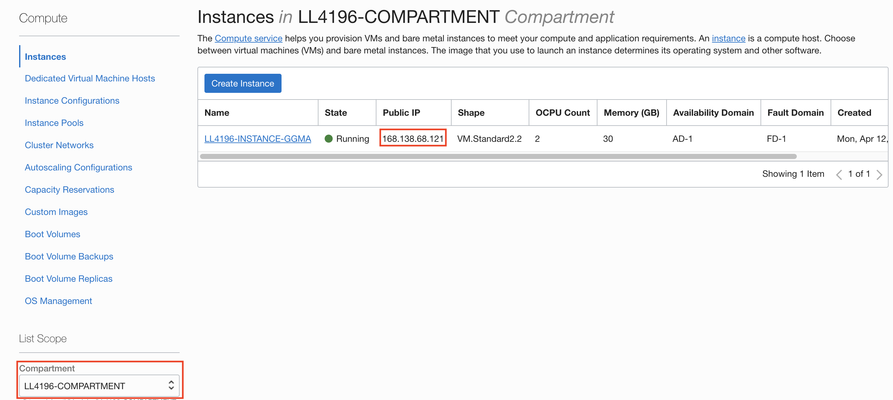
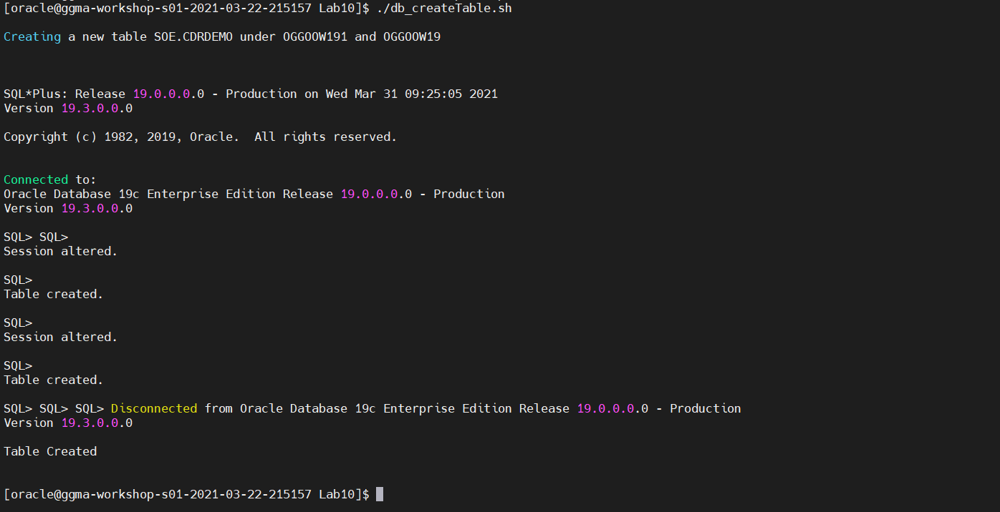

# Configure Database and GoldenGate Users

## Introduction
In this lab we will setup the required database and GoldenGate replication users.

*Estimated Lab Time*:  10 minutes

### Lab Architecture


### Objectives
Understanding how to prepare and setup an Oracle Database for replication and define users for replication. Users are created using scripts that populate the multitenant environment with required Oracle Users while applying aliases to be used by GoldenGate. The Databases used in this lab are identified using the SOE schema in source and targets.

### Prerequisites
This lab assumes you have:
- A Free Tier, Paid or LiveLabs Oracle Cloud account
- SSH Private Key to access the host via SSH
- You have completed:
    - Lab: Generate SSH Keys (*Free-tier* and *Paid Tenants* only)
    - Lab: Prepare Setup (*Free-tier* and *Paid Tenants* only)
    - Lab: Environment Setup

## **STEP 0**: Running your Lab
### Login to Host using SSH Key based authentication

1. Select the hamburger menu and select **Compute** > **Instances**
    

2. Select your compartment. You should see your Compute Instance Public IP address. 
    

1. If needed, refer to *Lab Environment Setup* for detailed instructions relevant to your SSH client type (e.g. Putty on Windows or Native such as terminal on Mac OS):
    - Authentication OS User - “*opc*”
    - Authentication method - *SSH RSA Key*
    - OS User – “*oracle*”.

2. First login as “*opc*” using your SSH Private Key

    ````
    ssh -i ~/.ssh/<sshkeyname> opc@<Your Compute Instance Public IP Address>
    ````

3. Then sudo to “*oracle*”.

    ```
    <copy>sudo su - oracle</copy>
    ```

## **STEP 1:** Start the Oracle Database 19c (19.1) and Listener
1.	Start the container database, all PDB's and the listener

    ```
    <copy>
    cd ~/Desktop/Scripts/HOL/Lab1  
    sh ./startup.sh
    </copy>
    ```

    

    In the interest of time and for ease of execution, all prerequisite tasks to prepare the database for GoldenGate replication have already been performed on your VM instance. This includes:
      - Enabling Archive Log Mode
      - Enabling Supplemental Logging
      - Setting DB parameter `enable_goldengate_replication` to  true
      - Creating GoldenGate users in the database


2. Create some additional tables that we will be using later in our labs for CDR purposes.

    ```
    <copy>
    cd ~/Desktop/Scripts/HOL/Lab10
    ./db_createTable.sh
    </copy>
    ```
    

You may now [proceed to the next lab](#next).

## Learn More

* [GoldenGate Microservices](https://docs.oracle.com/en/middleware/goldengate/core/19.1/understanding/getting-started-oracle-goldengate.html#GUID-F317FD3B-5078-47BA-A4EC-8A138C36BD59)

## Acknowledgements
* **Author** - Brian Elliott, Data Integration, November 2020
* **Contributors** - Zia Khan, Rene Fontcha
- **Last Updated By/Date** - Rene Fontcha, LiveLabs Platform Lead, NA Technology, January 2021
