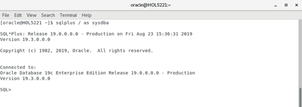
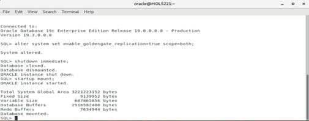
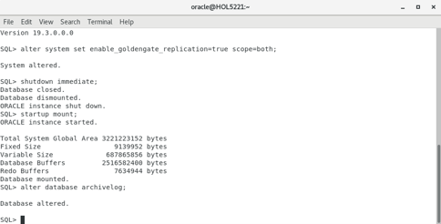

# Configure Database and GoldenGate Users 

## Introduction

In this lab we will setup the required database and GoldeGate replication users.

*Estimated Lab Time*:  60 minutes

**Workshop Architecture**


### Objectives

KEY FEATURES

Non-invasive, real-time transactional data streaming

- Secured, reliable and fault-tolerant data delivery 
- Easy to install, configure and maintain 
- Streams real-time changed data 
- Easily extensible and flexible to stream changed data to other relational targets

KEY BENEFITS

- Improve IT productivity in integrating with data management systems 
- Use real-time data in big data analytics for more timely and reliable insight 
- Improve operations and customer experience with enhanced business insight 
- Minimize overhead on - source systems to maintain high performance

Oracle GoldenGate Classic provides optimized and high performance delivery.

Oracle GoldenGate Classic real-time data streaming platform also allows customers to keep their data reservoirs up to date with their production systems.

### Prerequisites
This lab assumes you have:
- A Free Tier, Paid or LiveLabs Oracle Cloud account
- SSH Private Key to access the host via SSH
- You have completed:
    - Lab: Generate SSH Keys
    - Lab: Prepare Setup
    - Lab: Environment Setup
    - Lab: Configure GoldenGate

In this lab we will setup GoldenGate Microservices

## **STEP 1:** Configure Database 

1. Open a terminal session.


````
<copy>sudo su - oracle</copy>
````

2. In the open Terminal Window, start SQL*Plus.

```
<copy>lsnrctl start</copy>
```

```
<copy>sqlplus /as sysdba</copy>
```

```
<copy>startup</copy>
```




3. Enable the database for GoldenGate replication.

```
<copy>alter system set enable_goldengate_replication=true scope=both;</copy>
```


4.	Enable Archive Log on the database.This will require you to shut down the database and restart it.

5. Shutdown the database.

```
<copy>shutdown immediate;</copy>
```


6. Start the database up in mount mode.

```
<copy>startup mount;</copy>
```



7. Change database into Archive Log mode.

```
<copy>alter database archivelog;</copy>
```


8. Open the database.

```
<copy>alter database open;</copy>
```


9.	Open the Pluggable Database
```
<copy>alter pluggable database all open read write;</copy>
```
10. Enable Minimal Supplemental Logging for the database.  Additionally, enable Force Logging then switch the log file.

```
<copy>alter database add supplemental log data;
alter database force logging;
alter system switch logfile;</copy>
```

## **STEP 2:** Create the GoldenGate users needed at the Container Database and Pluggable Database Layers

1. From SQL*Plus run the following SQL statements to create thcreate e Common User within the Container Database (CDB).

```
<copy> create user c##ggate identified by ggate quota unlimited on USERS account unlock;
grant connect, dba, resource to c##ggate;</copy>
```
```
<copy>begin
SYS.DBMS_GOLDENGATE_AUTH.GRANT_ADMIN_PRIVILEGE('C##GGATE', container=>'ALL');
end;
/</copy>
```

2. From SQL*Plus, run the following SQL statements to create the GoldenGate users for the Pluggable database (PDB)
```
<copy>alter session set container = oggoow19;
grant connect, dba to c##ggate;
create user GGATE identified by ggate quota unlimited on USERS account unlock;
grant connect, dba to ggate;
alter session set container = oggoow191;
grant connect, dba to c##ggate;
create user GGATE identified by ggate quota unlimited on USERS account unlock;
grant connect, dba to ggate;
exit</copy>
```
## Summary

Oracle GoldenGate offers high-performance, fault-tolerant, easy-to-use, and flexible real- time data streaming platform for big data environments. It easily extends customers’ real-time data
integration architectures to big data systems without impacting the performance of the source systems and enables timely business insight for better decision making.

You may now *proceed to the next lab*.

## Learn More

* [GoldenGate Microservices](https://docs.oracle.com/goldengate/c1230/gg-winux/GGCON/getting-started-oracle-goldengate.htm#GGCON-GUID-5DB7A5A1-EF00-4709-A14E-FF0ADC18E842")

## Acknowledgements
* **Author** - Brian Elliott, Data Integration, November 2020
* **Contributors** - Zia Khan
* **Last Updated By/Date** - Brian Elliott, November 2020

## Need Help?
Please submit feedback or ask for help using our [LiveLabs Support Forum](https://community.oracle.com/tech/developers/categories/livelabsdiscussions). Please click the **Log In** button and login using your Oracle Account. Click the **Ask A Question** button to the left to start a *New Discussion* or *Ask a Question*.  Please include your workshop name and lab name.  You can also include screenshots and attach files.  Engage directly with the author of the workshop.

If you do not have an Oracle Account, click [here](https://profile.oracle.com/myprofile/account/create-account.jspx) to create one.