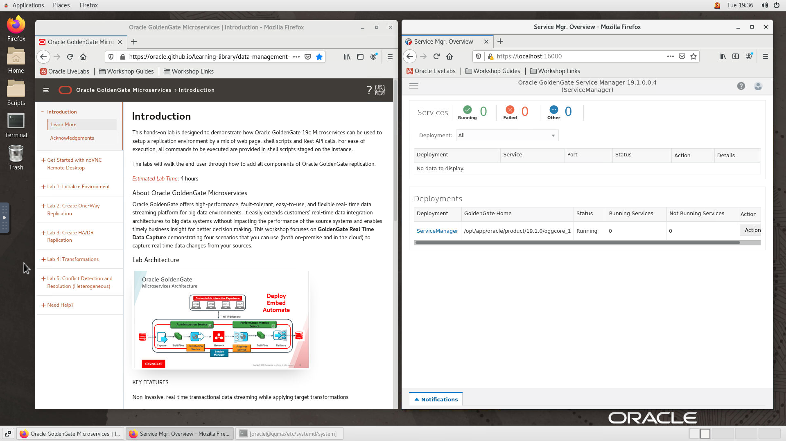

# Configure Database and GoldenGate Users

## Introduction
In this lab we will setup the required database and GoldenGate replication users.

*Estimated Lab Time*:  10 minutes

### Lab Architecture


### Objectives
Understanding how to prepare and setup an Oracle Database for replication and define users for replication. Users are created using scripts that populate the multitenant environment with required Oracle Users while applying aliases to be used by GoldenGate. The Databases used in this lab are identified using the SOE schema in source and targets.

### Prerequisites
This lab assumes you have:
- A Free Tier, Paid or LiveLabs Oracle Cloud account
- SSH Private Key to access the host via SSH
- You have completed:
    - Lab: Generate SSH Keys (*Free-tier* and *Paid Tenants* only)
    - Lab: Prepare Setup (*Free-tier* and *Paid Tenants* only)
    - Lab: Environment Setup

## **STEP 1:** Validate That Required Processes are Up and Running.
1. Now with access to your remote desktop session, proceed as indicated below to validate your environment before you start executing the subsequent labs. The following Processes should be up and running:

    - Database Listener
        - LISTENER
    - Database Server instance
        - ORCL
    - Oracle GoldenGate ServiceManager

    Run the following for a clean start.

    ```
    <copy>
    sudo systemctl restart oracle-database OracleGoldenGate
    sudo systemctl status oracle-database OracleGoldenGate
    </copy>
    ```

2. On the *Firefox* window on the right preloaded with *Oracle GoldenGate ServiceManager*, click on the *Username* field and select the saved credentials to login. These credentials have been saved within *Firefox* and are provided below for reference

    - Username

        ```
        <copy>oggadmin</copy>
        ```

    - Password

        ```
        <copy>Welcome1</copy>
        ```
        

3. Confirm successful login. Please note that it takes about 5 minutes after instance provisioning for all processes to fully start.

    
    If successful, the page above is displayed and as a result your environment is now ready.  

    In the interest of time and for ease of execution, all prerequisite tasks to prepare the database for GoldenGate replication have already been performed on your VM instance. This includes:
      - Enabling Archive Log Mode
      - Enabling Supplemental Logging
      - Setting DB parameter `enable_goldengate_replication` to  true
      - Creating GoldenGate users in the database


4. Click on *Terminal* icon on the desktop to start a terminal and Create some additional tables that we will be using later in our labs for CDR purposes.

    ```
    <copy>
    cd ~/Desktop/Scripts/HOL/Lab10
    ./db_createTable.sh
    </copy>
    ```
    

You may now [proceed to the next lab](#next).

5. If you are still unable to login or the login page is not functioning after reloading from the *Workshop Links* bookmark folder, open a terminal session and proceed as indicated below to validate the services.

    - Database and Listener
        ```
        <copy>
        sudo systemctl status oracle-database
        </copy>
        ```
        
        

    - Oracle GoldenGate ServiceManager

        ```
        <copy>
        sudo systemctl status OracleGoldenGate
        </copy>
        ```
        

6. If you see questionable output(s), failure or down component(s), restart the corresponding service(s) accordingly

    - Database and Listener

        ```
        <copy>
        sudo sudo systemctl restart oracle-database
        </copy>
        ```
    - Oracle GoldenGate ServiceManager

        ```
        <copy>
        sudo sudo systemctl restart OracleGoldenGate
        </copy>
        ```
    You may now [proceed to the next lab](#next).

## Appendix 1: Managing Startup Services

1. Database Service (Database and Listener).

    - Start

    ```
    <copy>sudo systemctl start oracle-database</copy>
    ```

    - Stop

    ```
    <copy>sudo systemctl stop oracle-database</copy>
    ```

    - Status

    ```
    <copy>sudo systemctl status oracle-database</copy>
    ```

    - Restart

    ```
    <copy>sudo systemctl restart oracle-database</copy>
    ```

2. Oracle GoldenGate ServiceManager

    - Start

    ```
    <copy>sudo systemctl start OracleGoldenGate</copy>
    ```

    - Stop

    ```
    <copy>sudo systemctl stop OracleGoldenGate</copy>
    ```

    - Status

    ```
    <copy>sudo systemctl status OracleGoldenGate</copy>
    ```

    - Restart

    ```
    <copy>sudo systemctl restart OracleGoldenGate</copy>
    ```
## Appendix 2: External Terminal Access (using SSH Key Based Authentication)

While you will only need the browser to perform all tasks included in this workshop, you can optionally use your preferred SSH client to connect to the instance should you prefer to run SSH Terminal tasks from a local client (e.g. Putty, MobaXterm, MacOS Terminal, etc.) or need to perform any troubleshooting task such as restarting processes, rebooting the instance, or just look around.

1. Refer to *Lab Environment Setup* for detailed instructions relevant to your SSH client type (e.g. Putty on Windows or Native such as terminal on Mac OS):

    - From the web session where you completed your provisioning request, do:
        - For **Reserve Workshop on LiveLabs** - Navigate to "*My Reservations* >> *Launch Workshop* >> *Workshop Instructions* >> *Lab: Environment Setup*"
        - For **Launch Free Trial Workshop** and **Run on Your Tenancy** - Click on the corresponding provisioning option and open *Lab: Environment Setup*
    - Authentication OS User - “*opc*”
    - Authentication method - *SSH RSA Key*
    - OS User – “*oracle*”.

2. First login as “*opc*” using your SSH Private Key

3. Then sudo to “*oracle*”. E.g.

    ```
    <copy>sudo su - oracle</copy>
    ```

<!-- ## **STEP 0**: Running your Lab
### Login to Host using SSH Key based authentication

1. Select the hamburger menu and select **Compute** > **Instances**
    

2. Select your compartment. You should see your Compute Instance Public IP address.
    

1. If needed, refer to *Lab Environment Setup* for detailed instructions relevant to your SSH client type (e.g. Putty on Windows or Native such as terminal on Mac OS):
    - Authentication OS User - “*opc*”
    - Authentication method - *SSH RSA Key*
    - OS User – “*oracle*”.

2. First login as “*opc*” using your SSH Private Key

    ````
    ssh -i ~/.ssh/<sshkeyname> opc@<Your Compute Instance Public IP Address>
    ````

3. Then sudo to “*oracle*”.

    ```
    <copy>sudo su - oracle</copy>
    ```

## **STEP 1:** Start the Oracle Database 19c (19.1) and Listener
1.	Start the container database, all PDB's and the listener

    ```
    <copy>
    cd ~/Desktop/Scripts/HOL/Lab1  
    sh ./startup.sh
    </copy>
    ```

    

    In the interest of time and for ease of execution, all prerequisite tasks to prepare the database for GoldenGate replication have already been performed on your VM instance. This includes:
      - Enabling Archive Log Mode
      - Enabling Supplemental Logging
      - Setting DB parameter `enable_goldengate_replication` to  true
      - Creating GoldenGate users in the database


2. Create some additional tables that we will be using later in our labs for CDR purposes.

    ```
    <copy>
    cd ~/Desktop/Scripts/HOL/Lab10
    ./db_createTable.sh
    </copy>
    ```
     -->

You may now [proceed to the next lab](#next).

## Learn More

* [GoldenGate Microservices](https://docs.oracle.com/en/middleware/goldengate/core/19.1/understanding/getting-started-oracle-goldengate.html#GUID-F317FD3B-5078-47BA-A4EC-8A138C36BD59)

## Acknowledgements
* **Author** - Brian Elliott, Data Integration, November 2020
* **Contributors** - Zia Khan, Rene Fontcha
- **Last Updated By/Date** - Rene Fontcha, LiveLabs Platform Lead, NA Technology, January 2021
