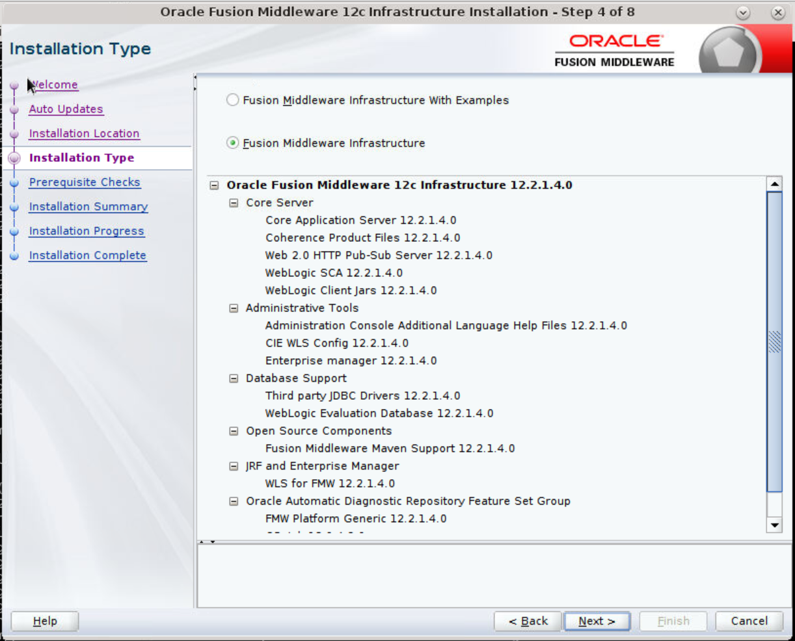
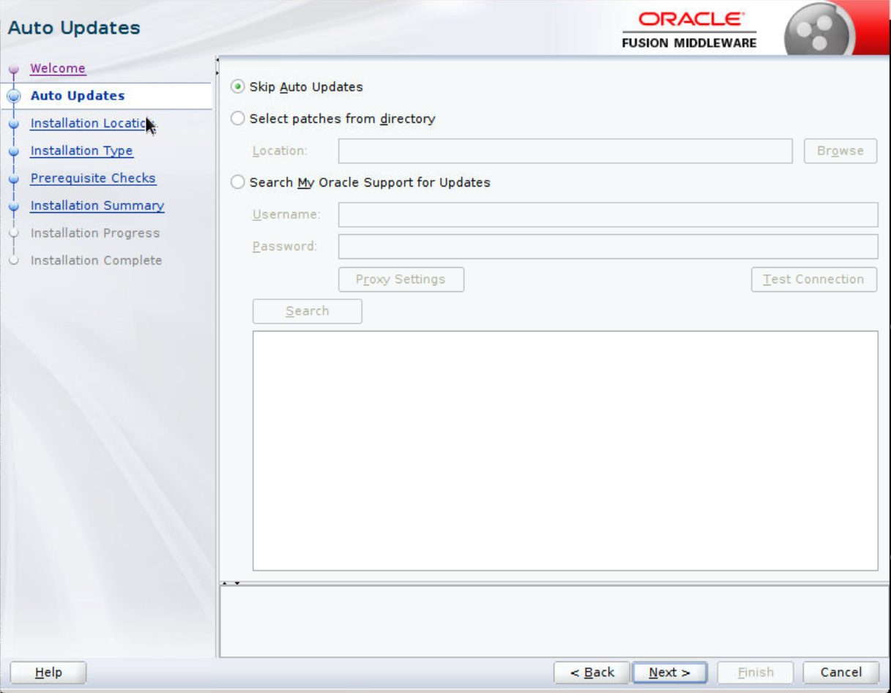
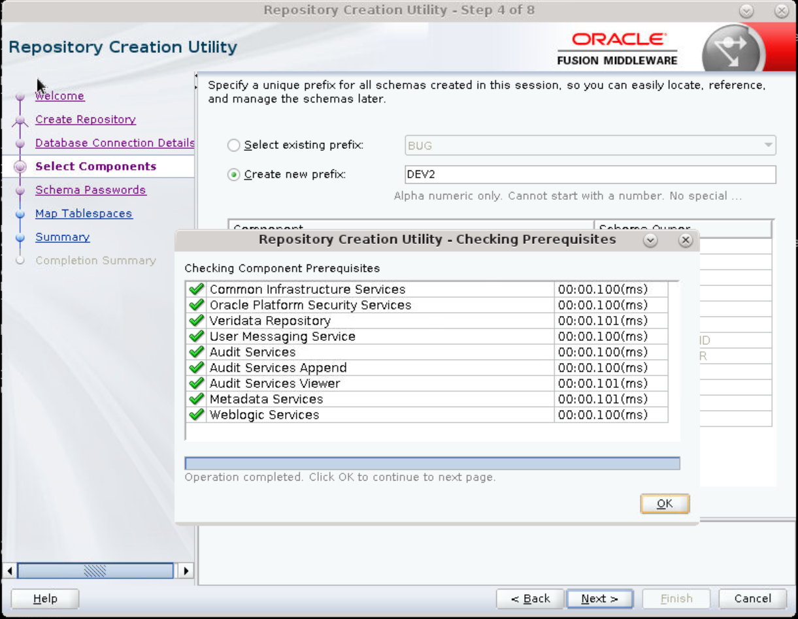
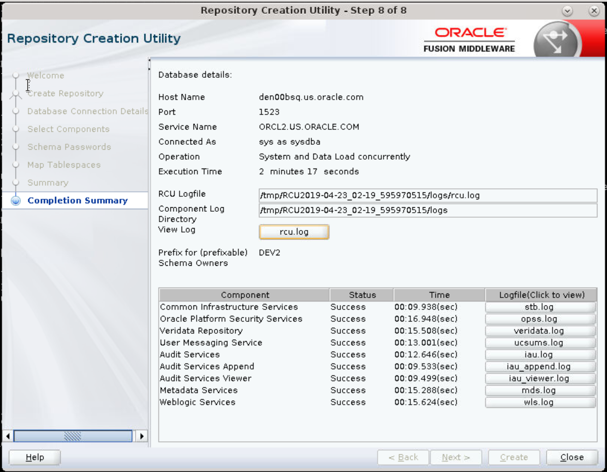
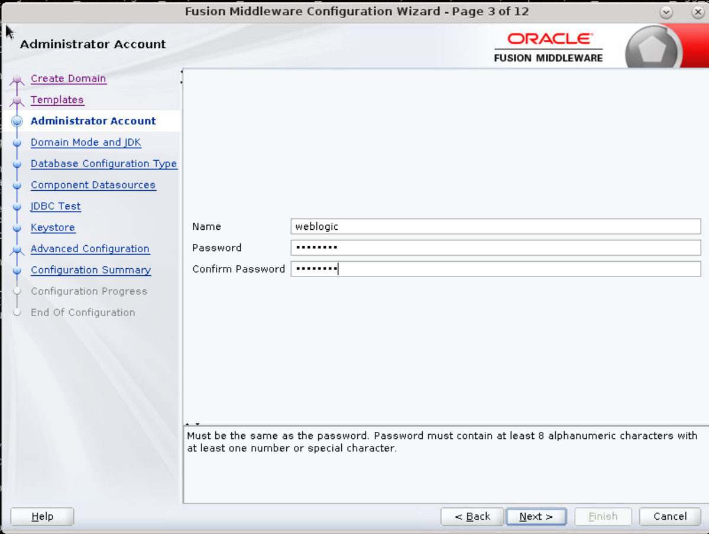
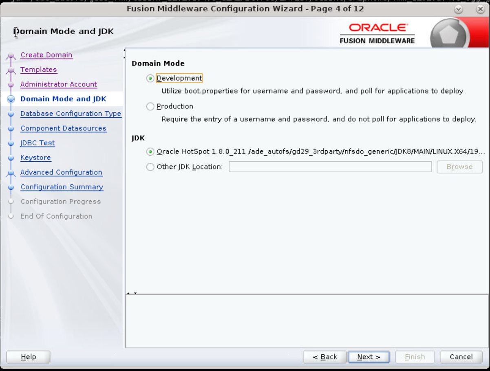

# Install and Configure Oracle GoldenGate Veridata                                   

This lab describes how to install and configure the Oracle GoldenGate Veridata.
For proof-of-concept, you can install the following on one host: Oracle WebLogic Server, Fusion Middleware Infrastructure, and Oracle GoldenGate Veridata.
**Note**:  After you have completed lab 1: Install and Configure Oracle GoldenGate Veridata, the rest of the **labs are independent of each other**. You can complete labs 2 to 5 in any sequence you want to.
## What do you Need?
+ **Linux**
+ **Oracle Database 19c (19.3.0.0) (for the repository)**
+ **Java 1.8 or higher**
+ **[Oracle GoldenGate Software](https://www.oracle.com/middleware/technologies/goldengate-downloads.html)**

## **Step 1:** Install and Configuring the Back End Servers and Infrastructure
In a nutshell, the installation process includes the following four major tasks. After completing these steps, you can configure the Oracle GoldenGate Veridata Agents.
1. WebLogic Server and Infrastructure file needed for Oracle GoldenGate Veridata. Install the WebLogic Server infrastructure (formerly known as JRF) files on top of an existing 12.2.1.4.0 WebLogic Server install. Invoke this by using the command: `java -jar fmw_12.2.1.4.0_infrastructure_generic.jar`.
2. Oracle GoldenGate Veridata Server + Oracle GoldenGate Veridata Agent. It is a jar file, and works on all supported platforms except NonStop. Select a required combination. For this lab, the choice was **complete** to get everything installed in one pass. Invoke this by using the command: `java -jar fmw_12.2.1.4.0_ogg.jar`.
3. Run the Repository Creation Utility (RCU). It gets installed as a part of the WLS+JRF install in Step 1. You can run it once for all the products (WebLogic Server and Oracle GoldenGate Veridata.) The RCU location in this demo (and the sample VM) is: `/u01/app/oracle/product/wls/oracle_common/bin/rcu`.
4. Configure the Oracle WebLogic Server and Oracle GoldenGate Veridata domains. You can run this once for all products. To configure the WebLogic Server, use the command: `/u01/app/oracle/product/wls/oracle_common/common/bin/config.sh`.

## **Step 2:** Install the Fusion Middleware Infrastructure
1. Open a terminal session. Run the following command: `java -jar fmw_12.2.1.4.0_infrastructure_generic.jar`
    
2. Click **Next** to continue to the **Auto Updates** section. Leave the default option **Skip Auto Updates** selected and click **Next**.
    
3. Enter a location for Oracle Home to store the binary files.
    
4. Click **Next** to continue.
5. Select either installation type (Fusion Middleware infrastructure With Examples or Fusion Middleware Infrastructure). Towards the end of this step, the Oracle WebLogic Server gets installed.
    
6. Wait for the progress bar to reach 100%. The Java version required is 1.7 or higher. Click **Next** to continue to the **Prerequisistes Checks** screen.
    
7. Click **Next** to continue to the **Installation Summary** screen.
    
8. On the **Installation Summary** screen, click **Next** to display the **Installation Progress** panel.
    
9. Click **Install** to continue and wait for the progress bar to reach 100%. You can optionally view the logs.
10. Click **Next** to display the **Installation Complete** section.
    
11. Click **Finish**.

## **Step 3**: Install Oracle GoldenGate Veridata
To install and configure Oracle GoldenGate Veridata:
1. Open the terminal session and run the installer with the following command: `java -jar fmw_12.2.1.4.0_ogg.jar` to display the splash screen.
    
    The splash screen disappears when the progress bar reaches 100% to display the **Welcome** screen.
2. After you have read the instructions on the **Welcome** screen, click **Next** to continue to the **Auto Updates** screen.
    
3. Click **Next** to continue to the **Auto Updates** section. Leave the default option **Skip Auto Updates** selected and click **Next**.
    
4. Enter the same Oracle Home directory that you entered in **Step 1 > 3**.
    
5. Click **Next** to continue and display the **Installation Type** screen.
    
6. Select the Oracle GoldenGate Veridata options that you want to install, or select **Complete Install** to get them all.
7. Click **Next** to continue to the **Prerequisites Check** screen.
    

8. After the progress bar has reached 100%, click **Next** to display the **Installation Summary** screen.
    
9. Click **Install** to continue and display the **Installation Progress** screen and wait for the progress bar to reach 100%. You can also view the logs.
    
10. Click **Next** to continue to the **Installation Complete** screen. Note that the **Next Steps** that are required to run the Repository Creation Utility (RCU) and then run the Configuration Wizard, are mentioned in the **Installation Complete** screen.
    

## **Step 4**: Configure RCU
The Repository Creation Utility (RCU) presumes that you have already installed a compatible database to house the repository. This example assumes that it is an Oracle 12c Database.
To configure the RCU:
1. Open a terminal session. Start the RCU with this command: `/u01/app/oracle/product/wls/oracle_common/bin/rcu`.
2. Click **Next** in the **Welcome** screen to display the **Create Repository** screen.
3. In the **Create Repository** screen, the default is **Create Repository** with **System Load** and **Product Load**. Click **Next** to continue.
    
4. Enter the appropriate information to log in to your database with full privileges in the **Database Connection Details** screen.
    
5. Click **OK** to dismiss **Checking Prerequisites**. Click **Next** to continue.
6. If this is the first time you have run RCU, then the only option is to create a new prefix. If you have run RCU in the past, then it will increment the previous prefix by one, to form a new prefix. For example, DEV2 or DEV3. You can override the suggestion. Select **Oracle GoldenGate, Veridata Repository**.
    
7. Click **OK** to close **Checking Prerequisites**.
8. Click **Next** to continue.
9. Enter the same password twice. Many of the sample VM databases use `oracle` as the default password for all schemas.
    
10. Click **Next** to continue to the **Map Tablespaces** screen.
    
11. Accept the default tablespace allocations.
12. Click **OK** in the **Repository Creation Utility - Confirmation** dialog box.
13. Click **Next** to display **Summary** screen.
      
14. Click **Create** to display the **Completion Summary** screen.
      
15. Click **Close** to continue.

## **Step 5**: Create the Domain
The Configuration Wizard can either create a new domain or extend an existing domain. This example shows how to create a new domain.
1. Open a terminal session. Invoke the Configuration wizard by entering `/u01/app/oracle/product/wls/oracle_common/common/bin/config.sh`.

    **Note**: The Create a new domain option is selected by default.
    
2. Click **Browse** to select the **Domain Location**.
3. Click **Next** to display the **Templates** screen.
    
4. Select **Veridata Standard Server Domain**. This causes the **Oracle JRF** to be selected automatically. If the Oracle JRF is not selected, then you have not installed the Infrastructure correctly.
5. Click **Next** to continue.
6. Enter the same password twice. Complexity rules require a number or special character in the password. The sample VM uses `weblogic1`. Note the difference between the lowercase L in the middle and the numeral one at the end.
    
7. Click **Next** to continue.
8. If you plan to use localhost/127.0.0.1 as the host name/address, then you must select **Development**. In Production, use the real host name and address instead of using localhost.
    
9. Click **Next** to continue.
10. Enter the Host Name, Port, Schema Owner, and Schema Password in the **Database Configuration Type** screen.
      
11. Click **Get RCU Configuration** to continue.
12. Verify the **Connection Result Log** and then click **OK**.
13. Click **Next** to continue to the **JDBC Component Schema Test** screen.
      
14. Click **Next** to continue to the **JDBC Test** screen.
      The Test Select Connection happens automatically. Look at the **Connection Result Log**.
      
15. Ensure that all the Status check boxes are selected, indicating a successful result log.
16. Click **Next** to display the **Keystore** screen.
      
17. Enter a **Password** for the **Alias**.
18. Click **Next** to display the **Advanced Configuration** screen, but do not select any of the **Advanced Options**.
      
      **Note**: Here you can choose to configure clusters of servers, if you need high availability using multiple hosts.
19. Click **Next** to display the **Configuration Summary** screen. In this screen, you can identify where the Oracle GoldenGate Veridata server application is deployed. If you have used clusters, then you need to deploy the application to the cluster, not to any one server.
      
20. Click **Create** to display the **Configuration Progress** screen. When the progress bar reaches 100%, it should say "Domain Created Successfully!"
21. Click **Finish** to continue.
      Note the URLs to use from a web browser to reach the WebLogic Administration Console: an http URL which is insecure, and an https URL which uses SSL for increased security.
      

## **Step 6**: Deploy Agents
**Assumptions**:
* You have already installed and configured the database.
* The software distribution files have been downloaded and unzipped.

To deploy agents:
1. This is the script used to Install the Fusion Middleware software:
    <pre>########################################################### ###########################################################
    Install WebLogic Server + Infrastructure files needed for OGG:
    java -jar fmw_12.2.1.4.0_infrastructure_generic.jar
    ## OGG Veridata + agent.
    java -jar fmw_12.2.1.4.0_ogg.jar
    Repository Creation Utility; can run once for all products.
    /u01/app/oracle/product/wls/oracle_common/bin/rcu</pre>
2. This is the script used to configure the Fusion Middleware software:
    <pre>###########################################################
    Configure WLS and Veridata; can run once for all products.
    /u01/app/oracle/product/wls/oracle_common/common/bin/config.sh
    ###########
    Veridata agents. Can run from anywhere, give destination as argument.
    /u01/app/oracle/product/wls/veridata/agent/agent_config.sh /u01/ogg/agents/veridata/agent1
    ## Should return, "Successfully deployed the agent. </pre>
3. These are the changes made to the `agent.properties` file: `cd /u01/ogg/agents/veridata/agent1`
    **Note**: The database-specific files are under the `sample_properties` directory and you need to select the respective file and copy that as `agent.properties`.
    Example for Oracle DB:

    <pre>cp sample_properties/agent.properties.oracle agent.properties
    gedit agent.properties
    server.port=7850
    database.url=jdbc:oracle:thin:@//localhost:1521:orcl
    server.driversLocation=/u01/app/oracle/product/12.1.0/dbhome_1/jdbc/lib
    server.jdbcDriver=odbc7.jar</pre>
4. All scripts are created in the Desktop/ directory purely for convenience:
    <pre>## Start WLS /u01/app/oracle/product/wls/ogg_domain/startWebLogic.sh
    ## Start Veridata Server + Agent
    ## Server only`
    /u01/app/oracle/product/wls/ogg_domain/veridata/bin/veridataServer.sh start
    ## Agent only
    /u01/ogg/agents/veridata/agent1/agent.sh start</pre>

## Want to Learn More About Oracle GoldenGate Veridata?

* [Oracle GoldenGate Veridata (12.2.1.4.0) Documentation](https://docs.oracle.com/en/middleware/goldengate/veridata/12.2.1.4/index.html)
* [Oracle Fusion Middleware Supported System Configurations](https://www.oracle.com/middleware/technologies/fusion-certification.html)
* [Oracle GoldenGate Veridata Blogs](https://blogs.oracle.com/dataintegration/entry/oracle_goldengate_veridata_repair_is)

## Acknowledgements

* **Authors:**
    + Anuradha Chepuri, Principal UA Developer, Oracle GoldenGate Documentation
* **Reviewed by:**
      + Nisharahmed Soneji, Senior Principal Product Manager, GoldenGate Development
      + Apeksha Polnaya, Senior Manager, Software Development, GoldenGate Development
      + Sukin Varghese, Senior Member of Technical staff, Database Testing
* **Last Updated By/Date:** Anuradha Chepuri, November 2020

## Need Help?
Please submit feedback or ask for help using our [LiveLabs Support Forum](https://community.oracle.com/tech/developers/categories/livelabsdiscussions). Please click the **Log In** button and login using your Oracle Account. Click the **Ask A Question** button to the left to start a *New Discussion* or *Ask a Question*.  Please include your workshop name and lab name.  You can also include screenshots and attach files.  Engage directly with the author of the workshop.

If you do not have an Oracle Account, click [here](https://profile.oracle.com/myprofile/account/create-account.jspx) to create one.
