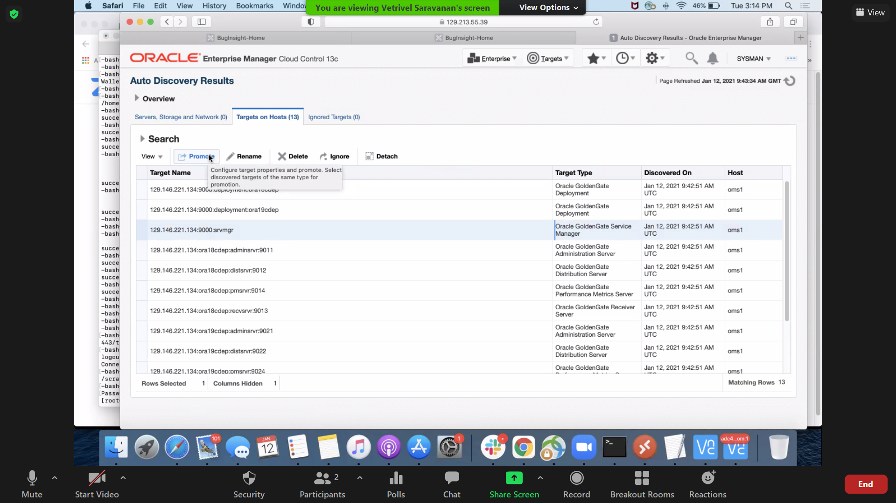
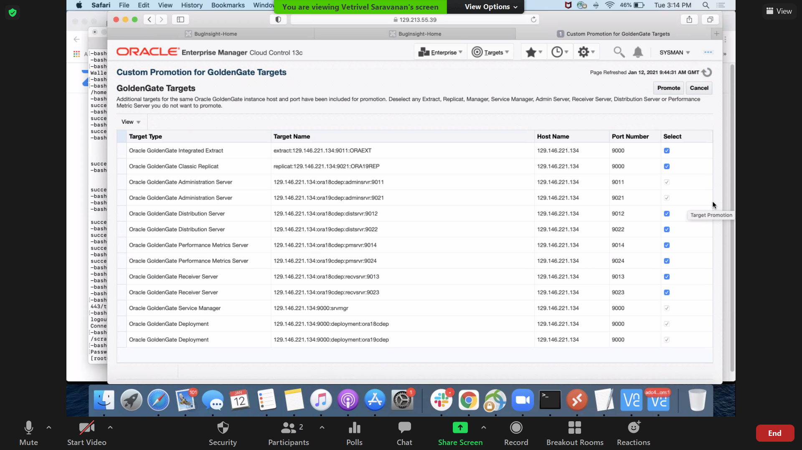
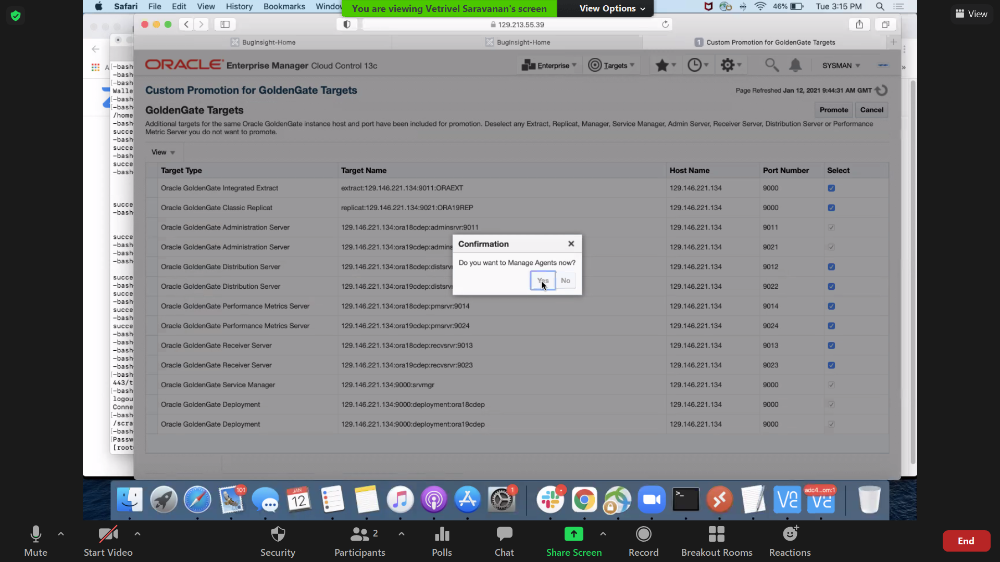
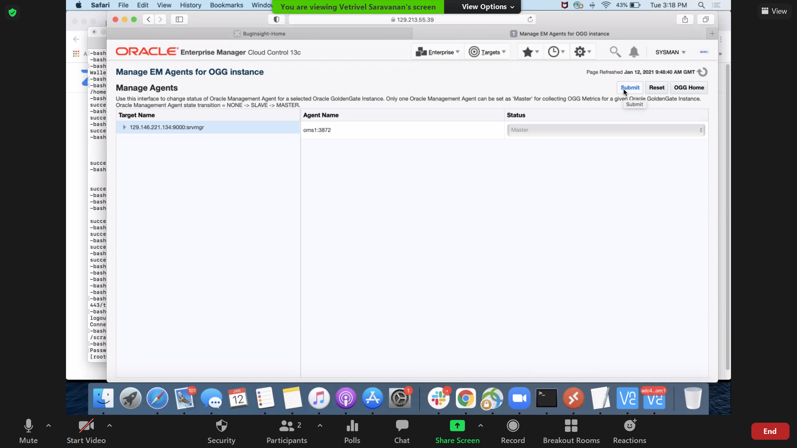
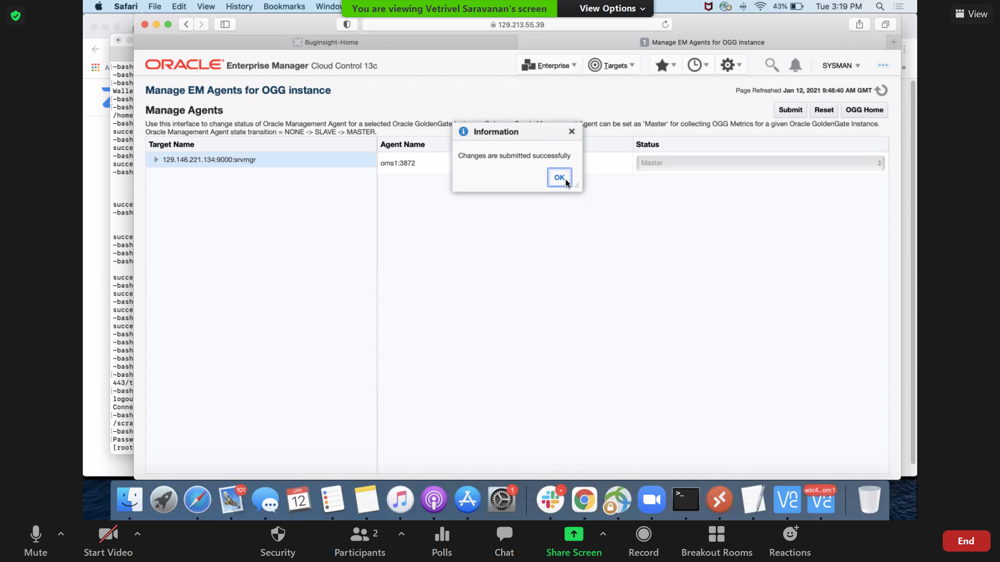

# Monitor the Oracle GoldenGate Marketplace Instance on Oracle Enterprise Manager

## Introduction
This lab describes how to open the Oracle GoldenGate Services ports from the Oracle Cloud Infrastructure (OCI) console, open the proxy ports on Oracle GoldenGate Microservices Marketplace instance, and discover and monitor the Oracle GoldenGate instances on Oracle Enterprise Manager on Marketplace.

### What Do You Need?

+ **You have gone through the Introduction Lab and Prerequisites**

**STEP 1:** Open the Oracle GoldenGate Services Ports from the OCI Console and the Proxy ports on Oracle GoldenGate Microservices Marketplace Instance

Before you begin to discover the Oracle GoldenGate instances, you need to open all the Oracle GoldenGate Services port from the Oracle Cloud Infrastructure (OCI) console. If the Service Manager, Administration Server, Distribution Server, Receiver Server, Performance Metrics server ports are not opened, then the Oracle Enterprise Manager Plug-in cannot discover the instances.

To open the ports:
1. Start an instance of Oracle GoldenGate (Microservices) Marketplace.
2. In this instance, run the following command to expose the Service Manager, Administration Server, Receiver Server,  Distribution Server, and Performace Metrics Server ports:
    <pre>sudo firewall-cmd --list-ports
    sudo firewall-cmd --add-port=*<OGG Process port number>*/tcp</pre>

**STEP 2:** Discover Oracle GoldenGate Microservices Instances in Oracle Enterprise Manager on Marketplace
After you have created an Enterprise Manager instance on Marketplace, you can discover the Oracle GoldenGate Instances on the OCI UI:
  To discover Oracle GoldenGate Microservices instances:
  1. Click **Setup**, select **Add Target**, and click **Configure Auto Discovery**.
      
  2. On the **Targets on Host** tab, select the Enterprise Manager instance, and click **Discovery Modules** to display the **Discovery Modules** page.
      
  3. Click Oracle GoldenGate Microservices and then click **Edit Parameters** to display the **Edit Parameters** dialog box.
      
  4. Enter the following details and click **OK**:

      * **Service Manager Hostname**
      * **Service Manager Username**
      * **Service Manager Password**
      * **Service Manager Port**
        
  5. Click **OK** again to display the **Setup Discovery** page and click **Discover Now**.
        

      The targets are discovered and the control is now back on the **Targets on Host** page. Notice  the change in the number of targets discovered under the **Discovered Targets** column.
        

  6. Click the number under **Discovered Targets**  to display the **Auto Discovery Results** page,
        
  7. Click **Promote** to display the **Custom Promotion for GoldenGate Targets**.
        

  8.  Click **Yes** in the **Confirmation** dialog box to manage agents.
          

  9. Click **Submit** in the **Manage EM Agents for OGG instance** page
          
  10. Click **OK** in the **Information** dialog box.
          

  11. Click **Submit** in the **Manage Agents** page.
          
          

    The Oracle GoldenGate Microservices instance is now discovered and is ready to be monitored on the Enterprise Manager Marketplace instance.

  12. Click **OGG Home** to view the discovered targets.
      

  Watch this video if you want to know more about Discovering Oracle GoldenGate targets (both MA and Classic) in Enterprise Manager.
      

**STEP 3:** Set Credentials to Oracle GoldenGate MA Marketplace Instances in Enterprise Manager Plug-in
If you are an Enterprise Manager administrator, then you also have the option of storing credentials in a secure manner — as preferences or operation credentials. You can then use these credentials to perform different system management activities like real-time monitoring, patching, provisioning, and other target administrative operations.

You need to set the Monitoring Credentials for an MA instance.

To set the Monitoring credentials:
  1. Click **Setup**, select **Security**, and click **Monitoring Credentials** to display the **Monitoring Credentials** page.
      

  2. Select **Oracle GoldenGate Service Manager** and click **Manage Monitoring Credentials**.
      

  3. In the **Oracle GoldenGate Service Manager Monitoring Credentials** page, select the target and click **Set Credentials** to display the **Edit monitoring credentials** dialog box.
      

  4. Enter the monitoring credentials details and click **OK**.
      

      The credentials are set successfully and this Information is indicated on the screen.
  5. Click **Targets** and select **GoldenGate**.
      

  6. Notice the status has changed for the targets.
      

  7. Select a target and notice that the **Start** and **Stop** buttons are activated for the target.
      

The monitoring credentials are successfully set and you can monitor the instance, view the logs, configuration files, and GGSER files, and also start or stop the instance.                                         

Watch this video if you want to know more about Setting Credentials for Oracle GoldenGate targets (both MA and Classic) in Enterprise Manager.
      

## Want to Learn More?
* [Oracle GoldenGate Enterprise Manager Plug-in Documentation](https://docs.oracle.com/en/middleware/goldengate/emplugin/13.4.2/index.html)
* [Discovering Oracle GoldenGate Targets](https://docs.oracle.com/en/middleware/goldengate/core/19.1/oggmp/oracle-goldengate-classic-oracle.html#GUID-8D2728DA-9A05-439F-B2D4-4CFF8D70236D)
* [A Simple Guide to Oracle GoldenGate Enterprise Manager Plug-in -Blog](https://blogs.oracle.com/dataintegration/a-simple-guide-to-oracle-goldengate-enterprise-manager-plug-in)
* [New Route to Discovery in Oracle GoldenGate Enterprise Manager Plug-in 13.4.2](https://blogs.oracle.com/dataintegration/new-route-to-discovery-in-oracle-goldengate-enterprise-manager-plug-in)
## Acknowledgements

* **Author:**
    + Anuradha Chepuri, Principal User Assistance Developer, Oracle GoldenGate User Assistance
* **Reviewed by:**
    + Nisharahmed Soneji, Senior Principal Product Manager, GoldenGate Development
    + Vetrivel Saravanan, Senior Member of Technical staff, Database Test Dev/Tools/Platform Testing

* **Last Updated By/Date:** Anuradha Chepuri, March 2021

## Need Help?
Please submit feedback or ask for help using our [LiveLabs Support Forum](https://community.oracle.com/tech/developers/categories/livelabsdiscussions). Please click the **Log In** button and login using your Oracle Account. Click the **Ask A Question** button to the left to start a *New Discussion* or *Ask a Question*. Please include your workshop name and lab name.  You can also include screenshots and attach files. Engage directly with the author of the workshop.

If you do not have an Oracle Account, click [here](https://profile.oracle.com/myprofile/account/create-account.jspx) to create one.
