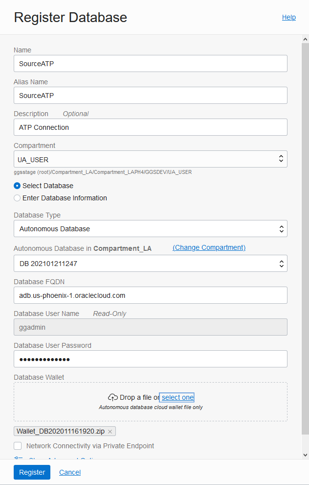
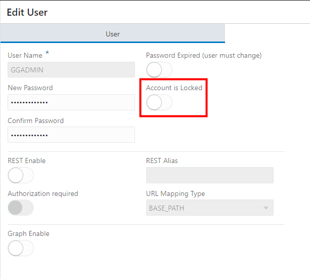

# Create a Database Registration

## Introduction

This lab walks you through the steps to create a database registration.

Estimated Lab Time: 2 minutes

### About Database Registrations
Database Registrations capture source and target credential information. A database registration also enables networking between the OCI GoldenGate service tenancy virtual cloud network (VCN) and your tenancy VCN using a private endpoint.

### Objectives
In this lab, you will register source and target Oracle Autonomous databases for Oracle GoldenGate deployments to use for the duration of this lab.

### Prerequisites
This lab assumes that you completed all preceding labs.

## **STEP 1**: Register the Source Database

First, follow the steps below to register the source Oracle Autonomous Transaction Processing \(ATP\) Database.

1.  Click **Registered Databases**.

    

2.  Click **Register Database**.

    

3.  In the Register Database panel, for Name and Alias, enter **SourceATP**.

4.  From the Compartment dropdown, select a compartment.

5.  Click **Select Database**.

6.  From the Database Type dropdown, select **Autonomous Database**.

7.  For **Autonomous Database in** *compartment*, click **Change Compartment**, select the compartment you created your ATP instance, and then select **ATPSource** from the dropdown. Some fields are autopopulated based on your selection.

8.  Enter the database's password in the Password field, and then click **Register**.

    

    The database becomes Active after a few minutes.

## **STEP 2:** Enable the ggadmin user for the Source Database

Although the ggadmin user is created during the database registration process, it is disabled by default. The following steps guide you through how to enable the ggadmin user.

1.  Click the **Navigation Menu** in the upper left, navigate to **Oracle Database**, and select **Autonomous Transaction Processing**.

	

2.  From the list of databases, select **ATPSource**.

3.  On the ATPSource Database Details page, click **Tools**, and then click **Open Database Actions**.

4.  Sign in to Database Actions using the ADMIN user details from Lab 1: Set Up the Environment. If you're running this lab as a workshop, copy the ADMIN password provided with your lab environment details.

5.  Under **Administration**, click **Database Users**.

6.  From the list of users, locate **GGADMIN**, and then click the ellipsis (three dots) icon and select **Edit**.

    

7.  In the Edit User panel, deselect **Account is Locked**, enter the password you gave the ggadmin user in the database registration steps above, and then click **Apply Changes**.

    

    Note that the user icon changes from a blue padlock to a green checkmark.

8.  Log out of Database Actions.

## **STEP 3:** Register the Target Database and enable the ggadmin user

Now, follow the steps below to register the target Autonomous Data Warehouse \(ADW\) instance.

1.  On the Registered Databases page, click **Register Database**.

2.  In the Register Database panel, enter **TargetADW** for Name and Alias.

3.  From the **Compartment** dropdown, select a compartment.

4.  Click **Select Database**.

5.  For **Autonomous Database in** *compartment*, click **Change Compartment**, select the compartment you created your ADW instance, and then select **ADWTarget** from the dropdown. Some fields are autopopulated based on your selection.

6.  Enter the database's password in the Password field, and then click **Register**.

    

    The source and target databases appear in the list of Registered Databases. The database becomes Active after a few minutes.

7.  Repeat the instructions under STEP 2 to enable the ggadmin user on the TargetADW database.

You may now [proceed to the next lab](#next).

## Learn More

* [Managing Database Registrations](https://docs.oracle.com/en/cloud/paas/goldengate-service/using/database-registrations.html)

## Acknowledgements
* **Author** - Jenny Chan, Consulting User Assistance Developer, Database User Assistance
* **Contributors** -  Denis Gray, Database Product Management
* **Last Updated By/Date** - May 2021
