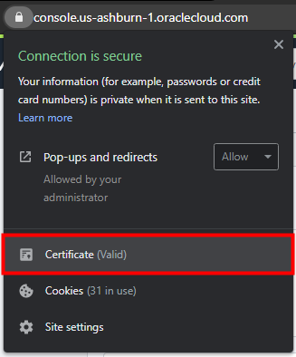

# Create a Trusted Connection Between Oracle GoldenGate and OCI GoldenGate

## Introduction

This lab walks you through the steps to download the root certificate from Oracle Cloud Infrastructure and add it to the Oracle GoldenGate wallet.

Estimated Lab Time: 5 minutes


### Before You Begin

In order to complete the steps in this lab successfully, you must have the following Environment Variables set up:
* OGG_HOME set to your Oracle GoldenGate install directory
* PATH set to $PATH:$OGG_HOME/bin
* JAVA_HOME set to the location of your JRE

You must also know the Oracle GoldenGate wallet password.

### Objectives

In this lab, you will:
* Download the root certificate for Oracle Cloud Infrastructure from your web browser to your local machine
* Add the certificate to your Oracle GoldenGate wallet
* Restart the Distribution and Receiver Servers
* Create a credential on Oracle GoldenGate to connect to OCI GoldenGate

## **STEP 1**: Using Chrome to Download the Root Certificate

The following instructions show you how to download the Root Certificate using a Chrome web browser.

1.  Log in to the **Oracle Cloud Infrastructure Console** with your username and password. See [Signing in to the Console](https://docs.cloud.oracle.com/en-us/iaas/Content/GSG/Tasks/signingin.htm) in the *Oracle Cloud Infrastructure* documentation.

2.  After you log in to the Console, click the **Navigation Menu** in the upper left, navigate to **Oracle Database**, and select **GoldenGate**.

	

    You're brought to the **Deployments** page.

    

3.  In your Chrome browser address bar, click the padlock icon, and then click **Certificate (Verified)**.

    

4.  In the Certificate window, click **Certification Path**, select **DigiCert**, and then click **View Certificate**.

    Another Certificate window opens, displaying the details for the root DigiCert certificate.

    

5.  Click **Details**, and then click **Copy to File**.

    

6.  In the Certificate Export Wizard, click **Next**.

7.  Select **Base-64 encoded X.509 (.CER)**, and then click **Next**.

    

8.  Click **Browse** to select a location on your local machine to save the root certificate, and then enter a file name, such as **DigiCert-Root.cer**, and click **Save**.

9.  Click **Next**, and then click **Finish**.

A Certificate Export Wizard dialog displays **The export was successful**. You can close the Certificate windows.

## **STEP 2:** Upload the certificate to the Oracle GoldenGate Wallet

1. Open a terminal window. Using the command line, navigate to the Oracle GoldenGate install directory.

2. Change directories to the ssl directory.

3. Under the ssl directory, change directories to your deployment directory.

4. Run orapki to add the certificate to the wallet.

   ```
   <copy>orapki wallet add -wallet ./ -trusted_cert -cert ./DigiCertRoot.cer</copy>
   ```

5. When prompted, enter the wallet password.

6. Run the following command to verify the certificate was added:

   ```
   <copy>orapki wallet display -wallet</copy>
   ```

## **STEP 3:** Restart the Oracle GoldenGate Distribution and Receiver Servers

Stop and start the Distribution and Receiver Servers to pick up the changes made to the wallet.

1. Open the Oracle GoldenGate Service Manager in your web browser.

2. In the list of Services, locate the Distribution Server and then select **Stop** from its **Action** menu.

3. Repeat step 2 for the Receiver Server.

4. When the Status is **Stopped** for both the Distribution and Receiver Servers, you can restart them by selecting **Start** in their respective **Action** menus.

## **STEP 4:** Add a Credential for Oracle GoldenGate to Connect to OCI GoldenGate

1. Launch the OCI GoldenGate Deployment Console, sign in, and then use the navigation menu to access the Administration Server's Administrator page.

2. Click **Add User** and create a user account that Oracle GoldenGate will use to connect to OCI GoldenGate. For example, name the user **ggsnet** and assign the user the Operator role.

3. Using the Oracle GoldenGate WebUI, navigate to the Administration Server Configuration screen.

4. Under the Database tab, click **Add Credential**, and then complete the following fields:

   * For **Credential Domain**, enter a name to distinguish this connection, such as **GGSNetwork**.
   * For **Credential Alias**,  enter a name
   * For **User ID**, enter the user name of the user you created in step 2. For example, **ggsnet**.
   * For **Password**, enter the password associated to the user entered for User ID.
   * For **Verify Password**, re-enter the password for verification purposes.

5. Click **Submit**.

In this lab, you created a trusted connection between Oracle GoldenGate and OCI GoldenGate using a self-signed certificate. You can now proceed to the next [lab](#next).


## Acknowledgements
* **Author** - Jenny Chan, Consulting User Assistance Developer, Database User Assistance
* **Contributors** -  Werner He, Database Product Management
* **Last Updated By/Date** - April 2021


