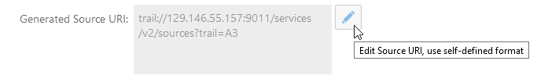
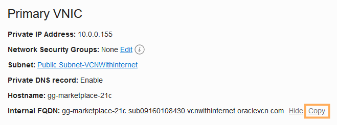
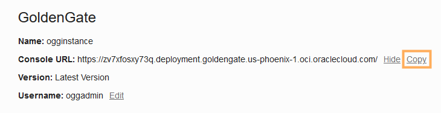
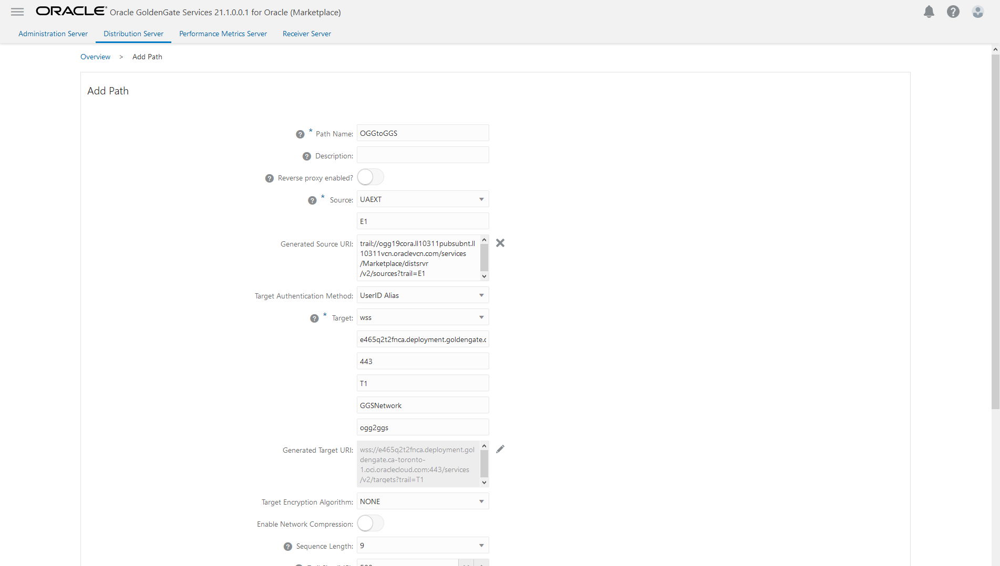

# Send the Oracle GoldenGate Trail file to OCI GoldenGate

## Introduction

This lab walks you through the steps to capture and send data to OCI GoldenGate using an on premise or Marketplace Oracle GoldenGate instance. You'll create an Extract to capture data from the source database, a Distribution Path to initiate sending the data to the target, and a Replicat to consume the data received.

Estimated Lab Time: 5 minutes

### About Extracts, Paths, and Replicats
An Extract is a process that extracts, or captures, data from a source database. A Distribution Path is a source-to-destination configuration that uses the Distribution Server. A Replicat is a process that delivers data to the target.

### Objectives

In this lab, you will:
* Add and run an Extract process to capture data to send to OCI GoldenGate
* Add and run a Distribution Server Path to send the trail file to OCI GoldenGate
* Add and run a Replicate process to consume the trail file sent from Oracle GoldenGate

### Prerequisites

This lab assumes that you completed all preceding labs. For the purposes of this lab, the source database used in this lab is Oracle Cloud Database System and the target database is Oracle Autonomous Data Warehouse.

## **STEP 1**: Add and Run an Extract in Oracle GoldenGate

This Extract process captures data from the source database to send to OCI GoldenGate.

1.  Sign in to the on premise or Marketplace Oracle GoldenGate Administration Server console.

2.  On the Administration Server Overview page, click **Add Extract** (plus icon).

    

2.  On the Add Extract page, select **Integrated Extract**, and then click **Next**.

3.  For **Process Name**, enter a name for this Extract process, such as UAEXT.

4.  For **Trail Name**, enter a two-character name for the Trail file, such as E1.

    

5.  Under **Source Database Credential**, select the source **Credential Domain** and **Credential Alias**. For the purposes of this lab, select **OracleGoldenGate** and **SourceDBaaS**, respectively.

    

6.  Under **Registration Information**, for **Register to PDBs**, select **PDB1**.

    

7.  Click **Next**.

8.  In the Extract Parameters screen, add the following to the text area:

    ```
    <code>TABLE PDB1.SRC_OCIGGL.*;</code>
    ```

    

9.  Click **Create**. You're returned to the Administration Server Overview page.

8.  In the UAEXT **Actions** menu, select **Start**. In the Confirm Action dialog, click **OK**.

    

    The yellow exclamation point icon changes to a green checkmark.

    

## **STEP 2**: Add and Run a Distribution Server Path

The Distribution Path initiates the process to send the Oracle GoldenGate trail file to OCI GoldenGate.

1.  In the Oracle GoldenGate Administration Server console, click **Distribution Server**.

    

2.  Click **Add Path**.

    

3.  On the Add Path page, for **Path Name**, enter a name for this Path. For example, **OGGtoGGS**.

4.  For **Description**, describe the purpose of this Path.

5.  For **Source**, select the Extract created in STEP 1 above. For example, select **UAEXT**.

6.  For **Trail Name**, select the trail file created in STEP 1 above, to send to OCI GoldenGate. For example, select **E1**.

7.  For **Generated Source URI**, click **Edit Source URI**, and then replace localhost (or the IP address) with the Internal FQDN of the on premise or Marketplace Oracle GoldenGate instance.

    

    *You can copy the Internal FQDN from the Oracle GoldenGate Marketplace Compute instance in the OCI Console.*

    

8.  For **Target Host**, enter the OCI GoldenGate hostname in the following format: **&lt;domain&gt;.deployment.goldengate.us-&lt;region&gt;-1.oci.oraclecloud.com:443**.

    *You can copy the host from the browser address bar of your OCI GoldenGate Deployment Console window, or copy the Console URL from the Deployment Details page.*

    

9.  For **Target Trail Name**, enter a two-character name for the Trail file when it is received by OCI GoldenGate.

10. For **Target Deployment Name**, enter the your OCI GoldenGate Deployment name.

11. For **Target Domain**, enter the domain name you created in Oracle GoldenGate. For example, **GGSNetwork**.

12. For **Target Alias**, enter the alias name you created in Oracle GoldenGate. For example, **dpuser**.

    

13. Click **Create**.

14. Return to the Distribution Server Overview page, and then select **Start** from the Path's **Action** menu.

In this lab, you created and ran a Path on your on premise Oracle GoldenGate Distribution Server and sent a trail file from Oracle GoldenGate to OCI GoldenGate.

## **STEP 3**: Add and Run a Replicat

This Replicat process consumes the trail file sent from Oracle GoldenGate.

1.  Launch the OCI GoldenGate Deployment Console and log in.

2.  Click **Add Replicat** (plus icon).

    

3.  On the Add Replicat page, select **Nonintegrated Replicat**, and then click **Next**.

4.  On the Replicate Options page, for **Process Name**, enter **Rep**.

5.  For **Credential Domain**, select **OracleGoldenGate**.

6.  For **Credential Alias**, select **TargetADW**.

7.  For **Trail Name**, enter R1.

8.  Under **Managed Options**, enable **Critical to deployment health**.

9.  Click **Next**.

10.  In the **Parameter File** text area, replace **MAP \*.\*, TARGET \*.\*;** with **MAP PDB1.SRC\_OCIGGLL.\*, TARGET SRCMIRROR\_OCIGGLL.\*;**

11. Click **Create**.

12. In the Rep Replicat **Action** menu, select **Start**.

    

    The yellow exclamation point icon changes to a green checkmark.  

## Learn More

* [Quickstart - Sending Data from Oracle GoldenGate to OCI GoldenGate](https://docs.oracle.com/en/cloud/paas/goldengate-service/using/qs-ogg-premise-cloud.html)
* [Creating an Extract](https://docs.oracle.com/en/cloud/paas/goldengate-service/using/goldengate-deployment-console.html#GUID-3B004DB0-2F41-4FC2-BDD4-4DE809F52448)
* [Create a Distribution Path](https://docs.oracle.com/en/cloud/paas/goldengate-service/using/goldengate-deployment-console.html#GUID-19B3B506-ADF1-465E-87B5-91121FE44503)

## Acknowledgements
* **Author** - Jenny Chan, Consulting User Assistance Developer, Database User Assistance
* **Contributors** -  Werner He and Julien Testut, Database Product Management
* **Last Updated By/Date** - Jenny Chan, May 2021
