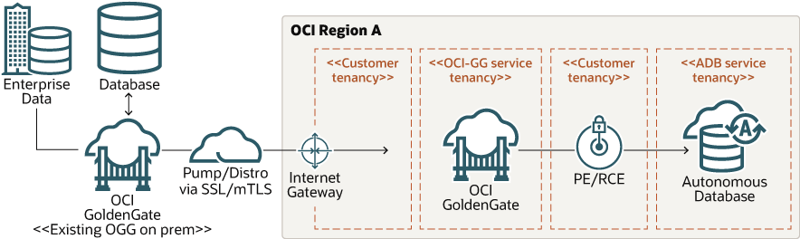

# Introduction

## About this Workshop

Oracle GoldenGate, the industry-leading data replication and integration software, is now available as a fully-managed, cloud native service on Oracle Cloud Infrastructure. If you're an existing Oracle GoldenGate customer with an on premises installation or Marketplace image, then use this set of labs to help you move data from Oracle GoldenGate to OCI GoldenGate.

You will be moving between Oracle GoldenGate Marketplace Web UIs and the OCI GoldenGate Deployment Console throughout this workshop.

Estimated Lab Time: 120 minutes

### About Oracle Cloud Infrastructure GoldenGate

Oracle Cloud Infrastructure GoldenGate is a fully-managed cloud service that uses Oracle GoldenGate Microservices to replicate data in real time, at scale, in the cloud. It processes data as it moves from one or more data management systems to target databases in Oracle Cloud Infrastructure.

### Objectives

In this workshop, you will:
* Create OCI GoldenGate resources
* Create a trusted connection between Oracle GoldenGate and OCI GoldenGate
* Create and run a distribution path on Oracle GoldenGate

## Learn More

* [Overview of Oracle Cloud Infrastructure GoldenGate](https://docs.oracle.com/cloud/paas/goldengate-service/using/overview-goldengate.html)
* [Oracle Cloud Infrastructure GoldenGate Service Overview video](https://apexapps.oracle.com/pls/apex/f?p=44785:112:0::::P112_CONTENT_ID:29278)
* [Take an interactive tour of OCI GoldenGate](https://apexapps.oracle.com/pls/apex/f?p=44785:112:0::::P112_CONTENT_ID:29986)

## Acknowledgements
* **Author** - Jenny Chan, Consulting User Assistance Developer, Database User Assistance
* **Contributors** -  Werner He and Julien Testut, Database Product Management
* **Last Updated By/Date** - Jenny Chan, September 2021
