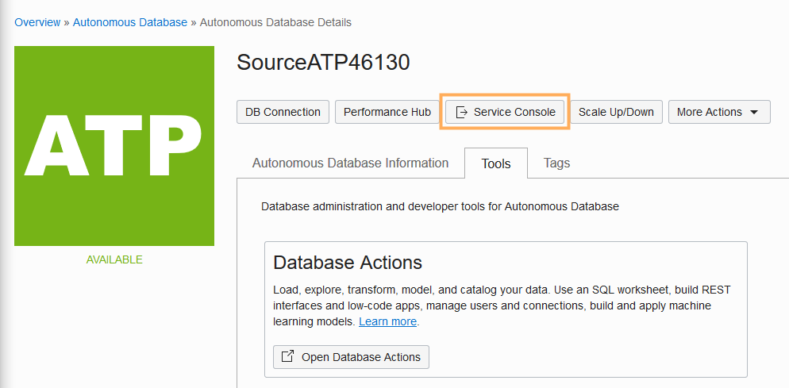
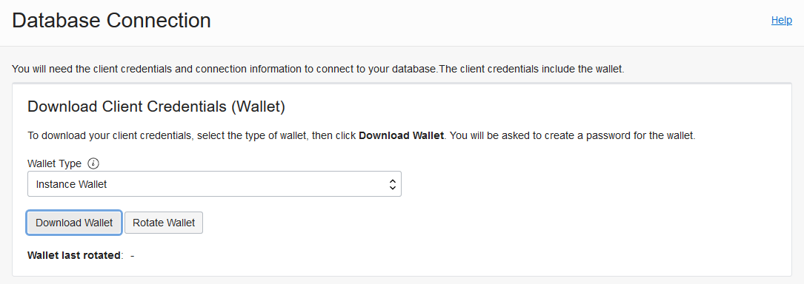
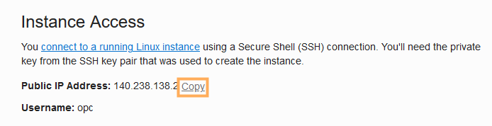
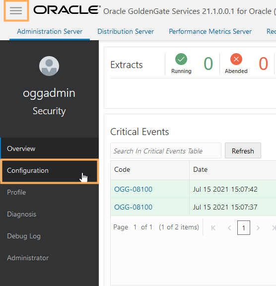
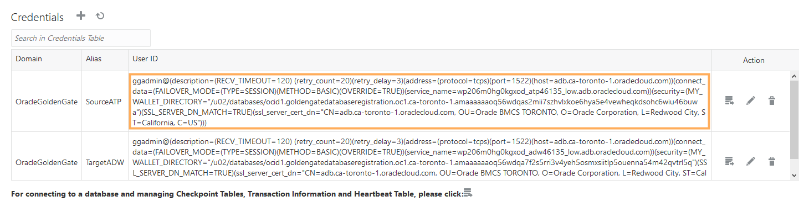
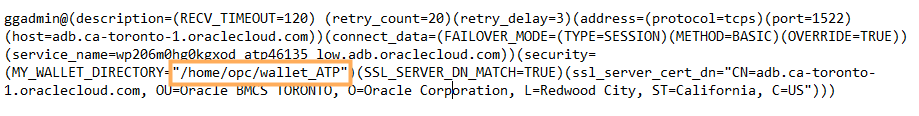
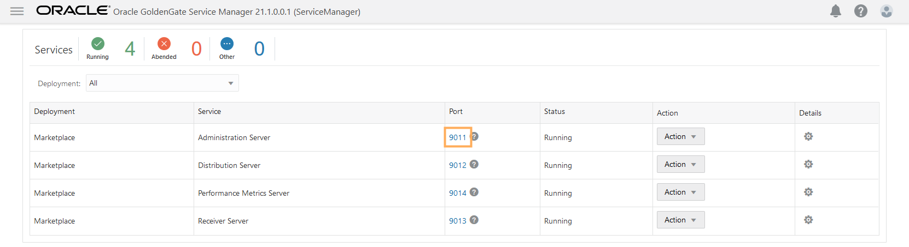
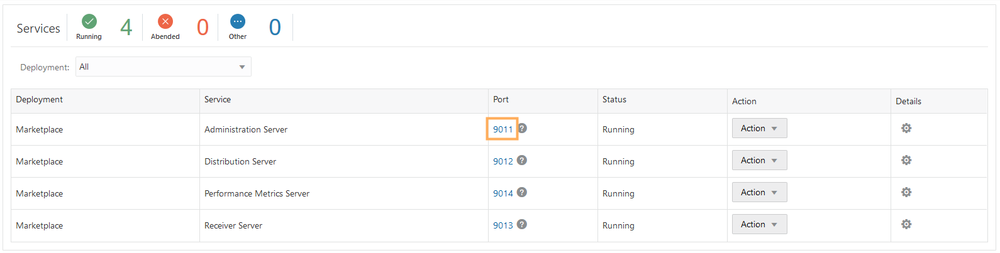
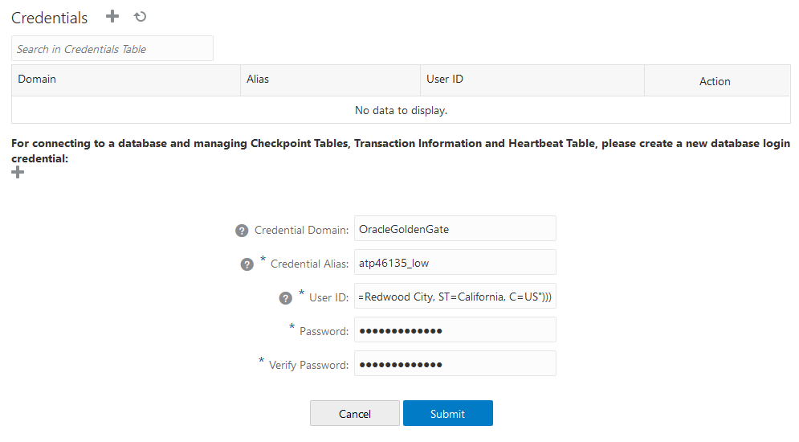

# Connect Oracle GoldenGate to Autonomous Transaction Processing

## Introduction

For the purposes of this workshop, Oracle Autonomous Transaction Processing (ATP) serves as the source database for your Oracle GoldenGate Marketplace deployment. This lab walks you through the steps to connect your Oracle GoldenGate Marketplace deployment to ATP.

Estimated lab time: 10 minutes

### Objectives

In this lab, you will:
* Download the ATP credentials
* Upload the ATP credentials to the Oracle GoldenGate Marketplace compute instance
* Add the ATP credentials in the Oracle GoldenGate Administration Server

### Prerequisites

Follow the instructions for [Connecting to a Linux Instance ](https://docs.oracle.com/en-us/iaas/Content/Compute/Tasks/accessinginstance.htm#linux) to enter your private key for the Oracle GoldenGate Marketplace Compute instance.

## Task 1: Download the Source ATP Client Credentials

1.  Navigate back to the Source ATP Autonomous Database Details page, and then click **DB Connection**.

    

2.  In the DB Connection panel, click **Download Wallet**.

    

3.  In the Download Client Credentials (Wallet) dialog, enter the Source ATP Admin password twice, and then click **Download**.

    

## Task 2: Upload the Source ATP Credentials to Oracle GoldenGate

1.  In the OCI Console, open the navigation menu (hamburger icon), click **Compute**, and then click **Instances**.

    

2.  Under **List Scope**, ensure that the correct **Compartment** is selected for your workshop. You can find your compartment information in the Workshop Details of this LiveLab.

3.  Select **Oracle GoldenGate 21.1.0.0.1 Microservices Edition for Oracle**.

4.  On the Instance Details page, under **Instance Access**, copy the **Public IP Address**.

    

5.  Using a secure FTP client of your choosing, open a connection to the Oracle GoldenGate Marketplace instance using its Public IP Address.

    ```
    <copy>sftp -i <private-SSH-key> opc@<ip-address></copy>
    ```

6.  Upload the wallet\_ATP.zip to /home/opc.

    ```
    <copy>put <local-path>/wallet_ATP.zip</copy>
    ```

7.  SSH to the compute instance.

    ```
    <copy>ssh -i <private-SSH-key> opc@<ip-address></copy>
    ```

8.  Extract the contents to a new directory, such as **wallet\_ATP**.

    ```
<copy>mkdir wallet_ATP
unzip wallet_ATP.zip -d wallet_ATP</copy>
    ```

## Task 3: Add the Source ATP credential in the Oracle GoldenGate Administration Server

1.  In the OCI GoldenGate Deployment Console, open the navigation menu (hamburger icon) and then click **Configuration**.

    

2.  Copy the SourceATP connection string in the User ID column, and then paste it into a text editor.

    

3.  Edit the SourceATP connection string, replacing the value for **MY\_WALLET\_DIRECTORY** with the location where you unzipped the wallet_ATP.zip. For example, **/home/opc/wallet\_ATP**.

    

4.  In a new browser tab or window, use the Public IP and port 443 (**https://&lt;public-ip&gt;:443**) to open the Service Manager.

5.  Log in to the Service Manager using **oggadmin** credentials found in **/home/opc/ogg-credentials.json**.

6.  In the Service Manager, under **Services**, click the port number associated with the Administration Server. The Administration Server opens in a new browser tab. If you're prompted to log in again, use the same oggadmin credentials.

    

7.  In the Administration Server, open the navigation menu (hamburger icon), and then select **Configuration**.

    

8.  Click **Add Credential**.

    

9.  Enter the following information, and then click **Submit**:

    * For **Credential Domain**, enter **OracleGoldenGate**.
    * For **Credential Alias**, enter the ATP database name (low) from /home/opc/wallet\_ATP/tnsnames.ora. For example, **atp&lt;user&gt;_low**.
    * For **User ID**, paste the modified ATP connection string from step 4.
    * For **Password**, enter the Source Database password from the Workshop details.

    

10. Click **Connect to Database**.

    

11. Next to TRANDATA Information, click Add **TRANDATA**.

    

12. For **Schema Name**, enter **SRC\_OCIGGLL**, and then click **Submit**. *You only need to click Submit once. Click Search, and then enter SRC_OCIGGLL to verify.*

    

In this lab, you created a connection from the Oracle GoldenGate Marketplace instance to the source ATP database. You may now **proceed to the next lab**.

## Acknowledgements

* **Author** - Jenny Chan, Consulting User Assistance Developer, Database User Assistance
* **Contributors** -  Denis Gray, Database Product Management
* **Last Updated By/Date** - Jenny Chan, September 2021
