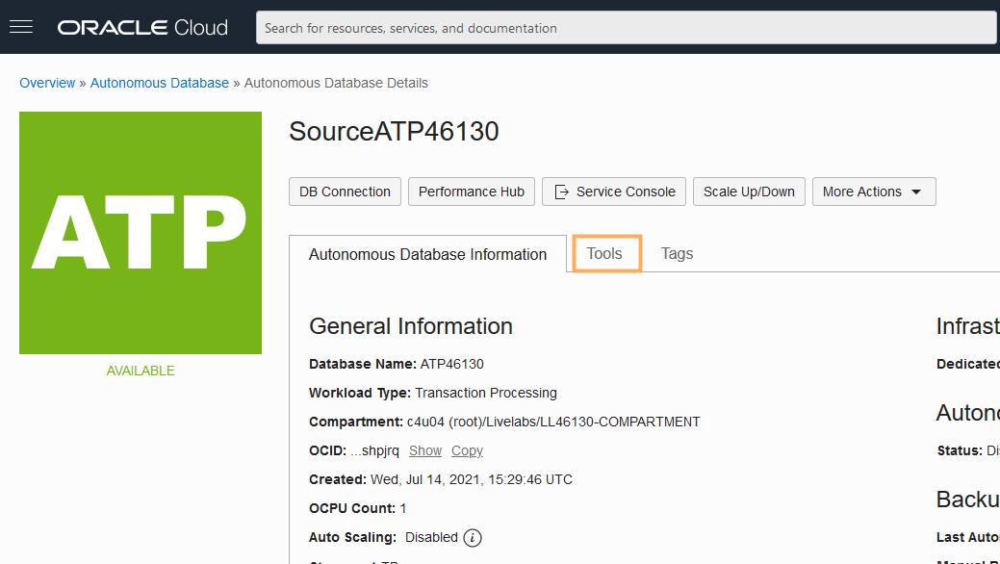

# Connect Oracle GoldenGate to Autonomous Transaction Processing

## introduction

For the purposes of this workshop, Oracle Autonomous Transaction Processing (ATP) serves as the source database for your Oracle GoldenGate Marketplace deployment. This lab walks you through the steps to connect your Oracle GoldenGate Marketplace deployment to ATP.

Estimated lab time: 10 minutes

### About Oracle Autonomous Transaction Processing

### Objectives

In this lab, you will:
* Unlock the ggadmin user
* Enable supplemental logging
* Download the ATP credentials
* Upload the ATP credentials to the Oracle GoldenGate Marketplace compute instance
* Add the ATP credentials in the Oracle GoldenGate Administration Server

## Prerequisites

Follow the instructions for [Connecting to a Linux Instance ](https://docs.oracle.com/en-us/iaas/Content/Compute/Tasks/accessinginstance.htm#linux) to enter your private key for the Oracle GoldenGate Marketplace Compute instance.

## **STEP 1:** Enable the ggadmin user and supplemental logging

1.  Log in to Oracle Cloud Infrastructure (OCI).

2.  Open the navigation menu (hamburger icon), click **Oracle Database**, and then select **Autonomous Transaction Processing**.

    

3.  Click **SourceATP**, and then on the Autonomous Database Details page, click **Tools**.

    

4.  In the Database Tools tab, click **Open Database Actions**.

5.  Log in as the admin user. Refer to the Workshop Details for the Source ATP Admin password.

6.  In the Database Actions console, under **Administration**, click **Database Users**.

7.  Locate the GGADMIN user, then select **Edit** from its ellipsis (three dots) menu.

8.  In the Edit User panel, disable **Account is Locked**, enter the ggadmin password in the **New Password** and **Confirm Password** fields, and then click **Apply Changes**.

    *You can enter the Source ATP Admin password for ggadmin, or enter a new password.*

    

9.  Open the Database Actions navigation menu (hamburger icon) and then click **SQL**.

    

10. Enter the following into the worksheet, and then click **Run Script**.

    ```
    <code>ALTER PLUGGABLE DATABASE ADD SUPPLEMENTAL LOG DATA;</code>
    ```

11. Log out of Database Actions and close the browser tab.

## **STEP 2:** Download the Source ATP Client Credentials

1.  Back on the Source ATP Autonomous Database Details page, click **Service Console**.

    

2.  In the Service Console, click **Administration**, and then click **Download Client Credentials (Wallet)**.

    

3.  In the Download Client Credentials (Wallet) dialog, enter the Source ATP Admin password twice, and then click **Download**.

## **STEP 3:** Upload the Source ATP Credentials to Oracle GoldenGate

1.  In the OCI Console, open the navigation menu (hamburger icon), click **Compute**, and then click **Instances**.

2.  Under **List Scope**, select your **Compartment** from the dropdown. You can find your compartment information in the Workshop Details of this LiveLab.

3.  Select **Oracle GoldenGate 21.1.0.0.1 Microservices Edition for Oracle**.

4.  On the Instance Details page, under **Instance Access**, copy the **Public IP Address**.

5.  Using a secure FTP client of your choosing, open a connection to the Oracle GoldenGate instance using its Public IP Address.

6.  Upload the wallet\_ATP.zip and extract its contents to a new directory, such as **wallet\_ATP**.

## **STEP 4:** Add the Source ATP credential in the Oracle GoldenGate Administration Server

1.  In a new browser tab or window, enter **https://&lt;public-ip&gt;:443** to open the Service Manager.

2.  Log in to the Service Manager using **oggadmin** credentials found in **/home/opc/ogg-credentials.json**.

3.  In the Service Manager, under Services, click the port number associated with the Administration Server. The Administration Server opens in a new browser tab. If you're prompted to log in again, use the same oggadmin credentials.

    

4.  In the Administration Server, open the navigation menu (hamburger icon), and then select **Configuration**.

5.  Click **Add Credential**.

6.  Register the Source ATP db, copy the connection string, replace MY_WALLET_DIRECTORY with /home/opc/wallet_ATP. Test connection, add tran data.
