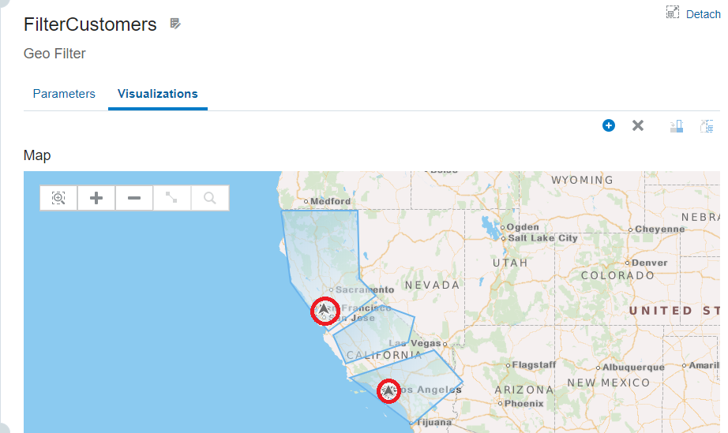
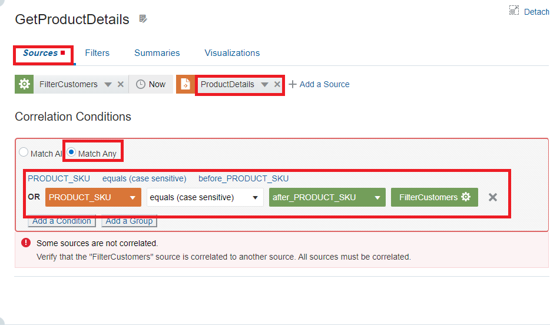
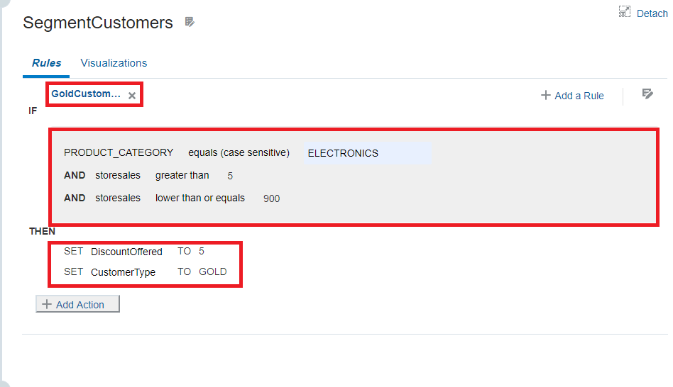
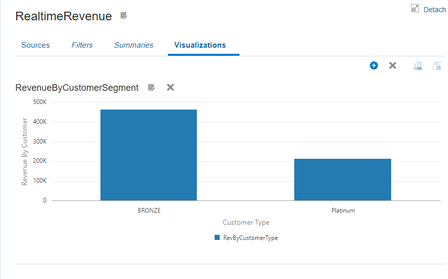
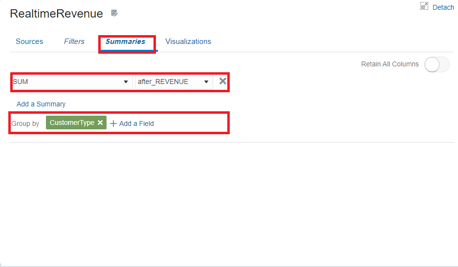

# Appendix

## Introduction
This appendix is a supplementary aid to the labs for GGSA Workshop primarily for Lab 3 creating the **RetailPromotions** pipeline.  You can refer to this section of the workshop when performing the labs.  Not every screen shot has been captured in this appendix but you can look at the following image and verify the structure of your pipeline.  In that regard each stage that does have a screen shot has been labeled accordingly.

### About Product/Technology
Golden Gate Stream Analytics (GGSA) is a tool designed to consume a stream of data from any source such as a database, GoldenGate, kafka, JMS, REST or even a file system.  Once the data is in GGSA you can run analytics on live data in real-time using transformation and action functionality of Spark and send the data downstream to any target of your choice.

### Objectives
- Provide screen shots for the labs
- Aid the user to reference screen shots while performing the labs

### Prerequisites

* An Oracle Free Tier, Always Free, Paid or LiveLabs Cloud Account

### Instructions
At each stage of the Lab 3 you can refer back to this appendix to compare your pipeline and screens with the screen shots provided here.  Each stage is marked with the name of the stage so that you can reference it while performing the task for that stage.

## GetCustomerDetails Stage
**New Query**

**Name Query**

**Add a Source**

**New Stage added**

**Correlation**

**Query added**

## GetLatLongFromZipCode Stage

**New Lat-Long from Zip stage**

## FilterCustomers Stage

**Add new filter customer stage**

**Select a Pattern**

**Geo Filter Visualization**

## GetProductDetails Stage

**Add new Product Details Stage**

**Product Details Stage Added**

## SegmentCustomers Stage

**Use Formula to add Column**

**Rename Column**

**Define Rules**

## RealtimeRevenue Stage

**Real Time Revenue Visualization**

**Add Summary**

**Rename Column**

## GetCustomer Stage

## LikelyBuyersByTypeAndZip Stage

**Likely Buyers Stage added**

**Likely Buyers Visualization**

## Learn More

* [GoldenGate Stream Analytics](https://www.oracle.com/middleware/technologies)

## Acknowledgements

* **Author** - Hadi Javaherian, Solution Engineer
* **Contributors** - Shrinidhi Kulkarni, Solution Engineer
* **Last Updated By/Date** - Hadi Javaherian, September 2020

## Need Help?
Please submit feedback or ask for help using our [LiveLabs Support Forum](https://community.oracle.com/tech/developers/categories/livelabsdiscussions). Please click the **Log In** button and login using your Oracle Account. Click the **Ask A Question** button to the left to start a *New Discussion* or *Ask a Question*.  Please include your workshop name and lab name.  You can also include screenshots and attach files.  Engage directly with the author of the workshop.

If you do not have an Oracle Account, click [here](https://profile.oracle.com/myprofile/account/create-account.jspx) to create one.
